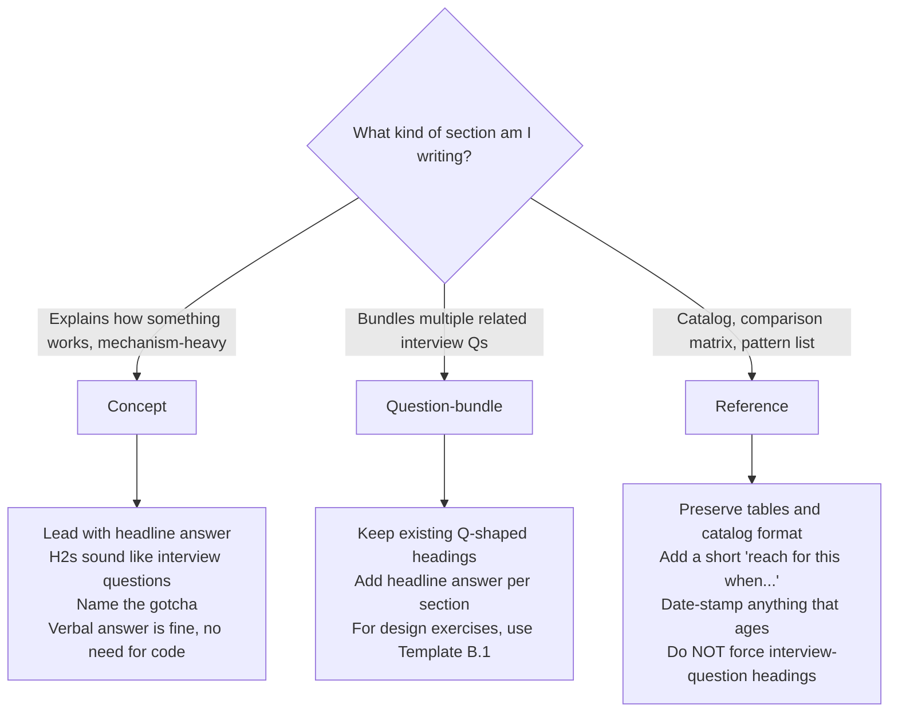
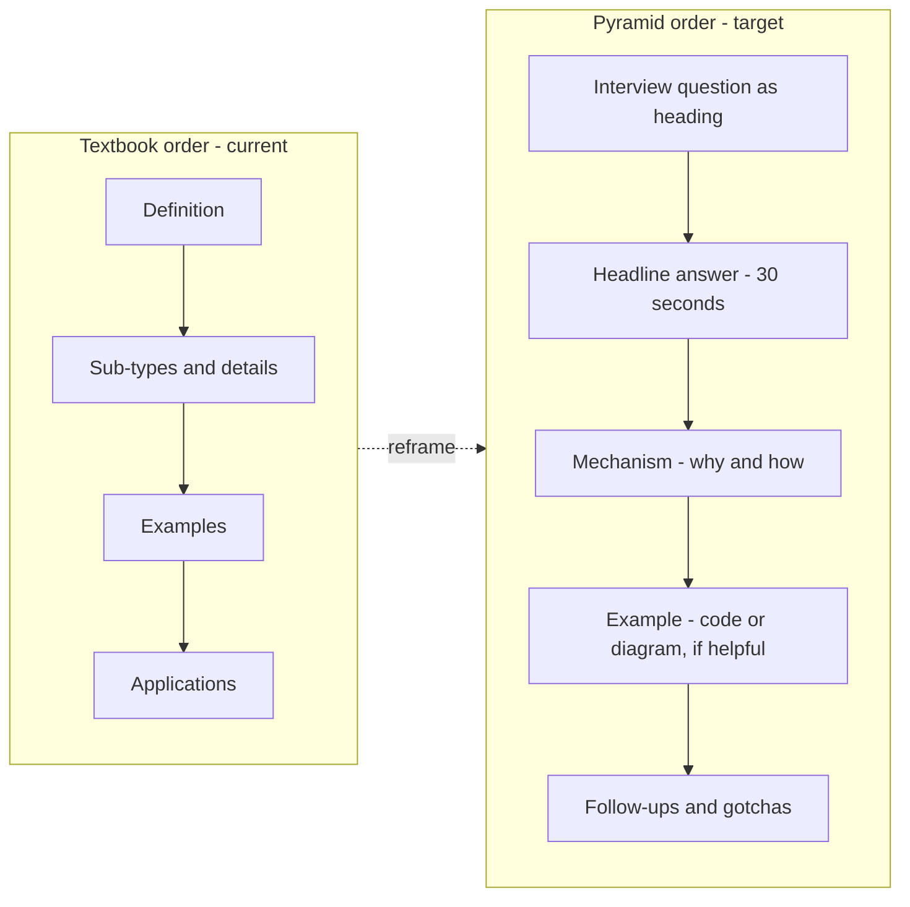

# Writing Guide — AI Engineering Notes

## TL;DR

> Every note should help a reader answer **interview questions**, not just understand topics. Three shapes of notes, each treated differently:
>
> - **Concept** (mechanism-heavy, e.g. [`1.1 How LLMs Work`](../1.1%20How%20LLMs%20Work.md), [`4.1 RAG Architecture`](../4.1%20RAG%20Architecture%20and%20Implementation.md)) — lead with the answer, make H2s into interview questions, name the gotcha.
> - **Question-bundle** (multiple related interview Qs, e.g. [`10.1 AI System Design Interview Questions`](../10.1%20AI%20System%20Design%20Interview%20Questions.md)) — add a headline answer per section, add gotchas where natural. Use the design-exercise sub-template for "Design X" sections.
> - **Reference** (catalogs, comparison matrices, e.g. [`1.2 Model Selection`](../1.2%20Model%20Selection%20and%20Ecosystem.md), [`5.2 Orchestration Patterns`](../5.2%20Orchestration%20Patterns.md)) — preserve the tables. Add a short "reach for this when…" framing. Date-stamp anything that ages.
>
> One rule that applies to all three: **the first thing a reader sees in any section should be the answer**, not the setup.
>
> AI engineering interviews add three patterns that the [Frontend writing guide](../../Frontend_Notes/_product/writing-guide.md) doesn't emphasize: **tradeoff questions** (RAG vs. fine-tune, dense vs. hybrid), **design exercises** (end-to-end system-design Qs), and **model-roster freshness**. Section 6 handles these.

If you remember only three things: (1) classify the note type before you write, (2) lead with the answer, (3) for tradeoff questions, open with the decision rule — not the tradeoffs.

---

## 1. The problem we're solving

Readers tell us our notes have useful definitions but leave them stranded: *"I understand how next-token prediction works, but I still don't know what I'd actually say when someone asks me 'why are modern LLMs autoregressive?' in an interview."*

That's a real gap, and it's structural. Skim [`1.1 How LLMs Work.md`](../1.1%20How%20LLMs%20Work.md) and notice how it opens:

> "Predict the next token given all previous tokens. Trained with a causal (left-to-right) objective: at each position, the model predicts the token that comes next."

Accurate. Thorough. But if a reader has 30 seconds and an interviewer in front of them, they can't extract from this note:

- Which interview questions it actually unlocks ("Why are modern LLMs autoregressive, not masked like BERT?", "What's the difference between temperature, top-k, and top-p?", "Walk me through how a transformer generates one token")
- The one-sentence answer they'd literally say
- What the interviewer is probing for
- The follow-up they'll get next
- The gotcha most candidates trip on

The root cause is a **shape mismatch**. Our notes use *textbook order*: definition → sub-types → examples → applications. Interview prep needs *pyramid order*: question → headline answer → mechanism → example → follow-ups → gotcha.

But — and this is the part that's easy to miss — the shape mismatch only hurts *some* kinds of notes. Mechanism-heavy concept notes need pyramid order. A pattern catalog like [`5.2 Orchestration Patterns.md`](../5.2%20Orchestration%20Patterns.md) is already perfectly shaped; forcing interview-question headings over its pattern tables would *destroy* their value. This guide adapts by note type.

---

## 2. Who we write for

A sharp reader persona drives every decision below. Our reader:

- **Already has LLM-application experience.** They've shipped a RAG prototype, called OpenAI or Anthropic APIs, probably tried an agent loop — they don't need "what is an LLM" 101. They need recall and articulation under pressure.
- **Scans first, reads second.** They read the H2s on the commute, then deep-read the night before a phone screen.
- **Thinks in questions, not topics.** They don't search "agent loop"; they search "how do I explain workflows vs. agents in an interview".
- **Needs to sound thoughtful out loud.** A note that lets them paraphrase a crisp tradeoff ("default to RAG; fine-tune only when X") is 10× more valuable than a note that's technically deeper but doesn't give them a sentence to say.
- **Reviews under anxiety.** They're nervous. Long prose paragraphs and tables they have to re-read twice are cognitive overhead they don't have to spare.

Every principle below serves this reader.

---

## 3. Which note type am I writing?

Before writing or rewriting, classify. Different shapes of content deserve different treatment.

### The three types (and the hybrid case)

- **Concept note** — explains how something works; mechanism-heavy. Examples in the repo: [`1.1 How LLMs Work`](../1.1%20How%20LLMs%20Work.md), [`2.2 Advanced Prompting Techniques`](../2.2%20Advanced%20Prompting%20Techniques.md), [`3.1 Context Engineering Principles`](../3.1%20Context%20Engineering%20Principles.md), [`4.1 RAG Architecture`](../4.1%20RAG%20Architecture%20and%20Implementation.md), [`5.1 Agent Fundamentals`](../5.1%20Agent%20Fundamentals.md), [`6.1 LLM Evaluation Methods`](../6.1%20LLM%20Evaluation%20Methods.md), [`8.1 AI Safety in Production`](../8.1%20AI%20Safety%20in%20Production.md). These benefit most from the pyramid principle.
- **Question-bundle note** — already structured around multiple related interview questions. Example: [`10.1 AI System Design Interview Questions`](../10.1%20AI%20System%20Design%20Interview%20Questions.md). Needs polish (headline answers, gotchas, design-exercise skeleton) — not structural overhaul.
- **Reference note** — catalog, cheatsheet, comparison matrix. Examples: [`1.2 Model Selection`](../1.2%20Model%20Selection%20and%20Ecosystem.md), [`5.2 Orchestration Patterns`](../5.2%20Orchestration%20Patterns.md). Optimize for scan-ability; do NOT force interview-question framing.
- **Hybrid** — one file, more than one shape. Examples: [`2.1 Prompt Engineering Fundamentals`](../2.1%20Prompt%20Engineering%20Fundamentals.md) (Concept + framework — see [Section 6.3](#63-framework--meta-process-notes--lead-with-the-slot-structure)), [`5.3 Tool Design and Function Calling`](../5.3%20Tool%20Design%20and%20Function%20Calling.md) (Concept + Reference), [`7.1 Fine-tuning Strategies`](../7.1%20Fine-tuning%20Strategies.md) (Concept + tradeoff-heavy — see [Section 6.1](#61-tradeoff-questions--lead-with-the-decision-rule)), [`9.1 AI Application Architecture`](../9.1%20AI%20Application%20Architecture.md) (Concept + Reference). Don't split the file — classify each section, apply that type's rules locally.

### Decision tree



### Recognition rules

Ask yourself:

- Could I phrase the title of this section as a single interview question? → **Concept**.
- Is the note already a list of related interview questions? → **Question-bundle**.
- Is the note mostly tables, pattern lists, or model/API comparison matrices? → **Reference**.
- Am I describing a memorizable slot structure (5-step framework, 7-layer prompt architecture, escalation ladder)? → That's a **framework sub-shape** inside a Concept. See [Section 6.3](#63-framework--meta-process-notes--lead-with-the-slot-structure).

If you're split between Concept and Question-bundle, default to Question-bundle — it's lighter-touch and easier to evolve.

---

## 4. The core shift — Pyramid Principle

Barbara Minto's Pyramid Principle (from *The Pyramid Principle*, McKinsey, 1967) says: **lead with the conclusion; put supporting arguments beneath it; put evidence beneath those.** The reader should know your point before you justify it.

Textbook writing inverts this — it builds from the foundations up. That's fine for a textbook (the reader has time and motivation to follow the buildup). It's wrong for interview prep (the reader is scanning for an answer-shaped piece of knowledge).

### The inversion (applies strongest to Concept notes)



A reader who only scans H2 headings in a pyramid-ordered Concept note should already know **what interview questions this note prepares them to answer**. That's the test.

The pyramid matters most for Concept notes. For Question-bundle notes, the headings are already questions — you just need to lead the body with the answer. For Reference notes, the pyramid principle shrinks to one rule: each entry leads with what the thing does, not history or rationale.

---

## 5. Writing principles

Each principle is **tagged by applicable type**: **[all]** / **[concept]** / **[concept + Q]**.

### P1. Lead with the answer, not the setup — [all]

Open every section with one or two sentences the reader could say out loud. Save "what is" and "it's important because" for after the answer — or cut them entirely.

**Before** (from [`1.1 How LLMs Work.md`](../1.1%20How%20LLMs%20Work.md)):

> "Predict the next token given all previous tokens. Trained with a causal (left-to-right) objective: at each position, the model predicts the token that comes next."

**After**:

> Modern LLMs are **autoregressive** — they predict the next token from left-to-right context under a causal mask (each position can't attend to future tokens). Masked models like BERT see bidirectional context and are great for embeddings and classification, but they can't generate text — there's no "future" context at inference time.

For Reference notes, the "answer" is shorter — a one-line lead before the table. Same principle, shrunken:

> **Reach for this when** picking the model for a new task. Rule of thumb: start with a frontier reasoning model, measure, then route smaller models into the cases where quality holds.

### P2. Headings are insights, not labels — [concept]

A heading like `### Autoregressive Models` is a topic label — it tells the reader what section this is, not what they'll learn. For Concept notes, rewrite as **the question the reader is there to answer**, or as **the one-line insight** itself.

**Before**: `### Autoregressive Models`

**After (as a question)**: `### Why are modern LLMs autoregressive, not masked like BERT?`

**After (as an insight)**: `### Modern LLMs are autoregressive because generation is inherently sequential and masked models can't see future tokens at inference`

Reference note headings stay as named things (`## Orchestrator-Workers`, not `## When would you use an orchestrator-workers pattern?`). A reader skimming a pattern catalog *wants* the named thing.

### P3. One concept per block, each tied to a question — [concept + Q]

Topic-ordered notes dump everything related to a subject in one section. Interview-ordered notes split by question. If a section answers more than one question, split it.

**Before**: [`1.1` Section 5](../1.1%20How%20LLMs%20Work.md) bundles seven sampling parameters (temperature, top_p, top_k, max_tokens, stop, frequency_penalty, presence_penalty) into one table. But interviewers probe a specific distinction: *"what's the difference between temperature and top-p?"* The table doesn't answer that without the reader mentally diffing two rows.

**After**: split by **the question being asked**.

- `### How does temperature actually work, and how is it different from top-k and top-p?` — headline + mechanism + gotcha.
- Keep a compact parameter-reference table at the end for the "what does `frequency_penalty` do again?" lookup.

Rule of thumb: **if you can't name the interview question a block answers, the block shouldn't be there.** Reference notes are exempt — the block answers "how do I look up X?"

### P4. Code examples prove a point, not decorate the page — [all]

Every code block should be the answer to a probe-style follow-up: "Can you show me what the retrieval step looks like?" If a block doesn't answer a specific question, it's padding.

**Before**: [`4.1 RAG Architecture`](../4.1%20RAG%20Architecture%20and%20Implementation.md) has a minimal RAG function, a LangChain chunking snippet, a reranking snippet. Each is fine, but not all of them tie back to a likely interview probe.

**After**: keep only the snippets that answer a probe. **Many AI interview answers are verbal** — architecture diagrams, tradeoff framings, process steps. It's fine (and often better) to have no code at all. **Don't manufacture snippets** just because the template has a code slot. Reference notes get a pass for compact one-liner examples inside tables — those *are* the entry.

### P5. Name the gotcha — [concept + Q]

Interviewers probe exactly where candidates get things slightly wrong. If you know a common wrong answer, **call it out by name** — don't leave it as subtext.

Use an explicit `**Gotcha:**` or `**Common wrong answer:**` line:

> **Gotcha:** Many candidates say RAG "prevents" hallucination. It reduces **factual** hallucination by grounding answers in retrieved content. But **faithfulness** hallucinations (claims not actually in the retrieved context) still happen — that's why production RAG pairs retrieval with citation enforcement or a faithfulness eval, not just retrieval alone.

A reader who sees the trap named is immune to it.

**Never manufacture a gotcha for Reference content.** If no genuine trap exists, don't invent one. Manufactured gotchas are exactly the "confusing layer" we're trying to avoid.

### P6. Cross-link, don't duplicate — [all]

If chunking is already defined in [`4.1 RAG Architecture`](../4.1%20RAG%20Architecture%20and%20Implementation.md), the production-architecture note shouldn't redefine it — it should link. Duplication drifts out of sync and dilutes the single-source authority of each note.

**Before**: [`4.1`](../4.1%20RAG%20Architecture%20and%20Implementation.md) defines chunking strategies; [`9.1 AI Application Architecture`](../9.1%20AI%20Application%20Architecture.md) redefines chunking in its own words in a sub-section.

**After**: the canonical definition lives in `4.1`. Every other note links with a short contextual pointer:

> Chunking strategy affects retrieval precision more than any other RAG knob — see [4.1 RAG Architecture → How do you chunk documents for retrieval?](../4.1%20RAG%20Architecture%20and%20Implementation.md#how-do-you-chunk-documents-for-retrieval).

---

## 6. AI-specific sub-shapes to watch for

The three-type taxonomy handles most of AI engineering, but four patterns show up often enough that they deserve named guidance.

### 6.1 Tradeoff questions — lead with the decision rule

AI interviews lean heavily on "should you X or Y?" questions:

- "RAG vs. fine-tuning?"
- "Open-source vs. closed-source LLM?"
- "Dense vs. hybrid retrieval?"
- "Self-hosted vs. API?"
- "Temperature 0 vs. low non-zero?"
- "Agent vs. workflow?"

The wrong shape is a neutral comparison table with no recommendation. That lets the reader recite matrix rows at the interviewer but doesn't answer the inevitable "what would *you* do?" follow-up.

The right shape, in order:

1. **Decision rule first.** "Default to RAG. Fine-tune only when (a) you need a specific output format prompting can't reliably enforce, (b) you're running a small model at high volume where latency/cost dominates, or (c) you need proprietary behavior that can't be captured in a prompt."
2. **Then the tradeoffs**, as a table if helpful.
3. **Then the tiebreaker question** to ask the interviewer. "I'd ask about data sensitivity, latency budget, and whether outputs need custom formatting — those usually pick the winner."

[`7.1 Fine-tuning Strategies`](../7.1%20Fine-tuning%20Strategies.md) already does this well at the file level with its escalation ladder (prompting → few-shot → RAG → fine-tune). Individual sections in other notes still need the headline-decision treatment.

### 6.2 Design-exercise shape — a sub-shape of Question-bundle

AI system design interviews ([`10.1`](../10.1%20AI%20System%20Design%20Interview%20Questions.md)) have their own rhythm: *"Design a RAG Q&A system for 10k employees and 100k docs."* The H1 IS an interview question (so structurally it's a Question-bundle), but the body follows a fixed skeleton that doesn't apply to other Q-bundle sections.

Skeleton (see Template B.1 in [Section 7](#template-b1--design-exercise-sub-template-of-b)):

> Headline (30s) → Requirements → High-Level Architecture → Component Deep-Dive (2–3 most critical) → Tradeoffs & Alternatives → Scaling & Monitoring → Common interviewer probes.

This tracks the 5-step framework at the top of [`10.1`](../10.1%20AI%20System%20Design%20Interview%20Questions.md). A reader who memorizes the skeleton can answer a design question they've never seen before — which is the whole point.

### 6.3 Framework / meta-process notes — lead with the slot structure

Some sections describe memorizable processes:

- The 5-step AI system design interview framework ([`10.1`](../10.1%20AI%20System%20Design%20Interview%20Questions.md) opening)
- The 4 prompting principles "that prevent 80% of agent failures" ([`2.1`](../2.1%20Prompt%20Engineering%20Fundamentals.md))
- The 7-layer system prompt architecture ([`2.1`](../2.1%20Prompt%20Engineering%20Fundamentals.md))
- The escalation ladder for fine-tuning ([`7.1`](../7.1%20Fine-tuning%20Strategies.md))
- The agent loop ([`5.1`](../5.1%20Agent%20Fundamentals.md))

These aren't quite Concept (there's no internal mechanism to explain) and not Reference (there's no catalog to scan). They're **frameworks** — slot structures the reader should commit to memory.

Shape rule: **lead with the framework name and the slot list in one block**. Each slot gets one memorable line. Don't bury the steps inside a prose explanation.

**Before**:

> Before drafting a system prompt, think carefully about layering. First you need an identity layer, which sets role and context. Then you'll want a behavioral layer, which defines tone and style. Next comes the task definition, which…

**After**:

> **The 7-layer system prompt architecture** (general → specific; each layer narrows behavior further):
>
> 1. Identity & context — role, environment, primary objective
> 2. Behavioral guidelines — tone, professional standards
> 3. Task definition — what to do
> 4. Tool usage rules — when to call what
> 5. Edge case handling — what to do when inputs are weird
> 6. Output format — shape of the response
> 7. Examples — concrete I/O pairs
>
> Deeper layers only matter if higher layers are set first.

A reader who memorizes seven one-line slots can reconstruct a system prompt under pressure. A reader who reads three paragraphs cannot.

### 6.4 Model-roster freshness — date-stamp or describe by capability

Content like [`1.2 Model Selection`](../1.2%20Model%20Selection%20and%20Ecosystem.md) lists specific model names (Claude Opus, GPT-4.1, Gemini Pro) that go stale in weeks as providers ship new versions. A reader opening a note in 2027 that says "GPT-4 is the frontier model" gets misled.

Two rules:

1. **Prefer capability descriptors over version names where possible.** "A frontier reasoning model" beats "GPT-4" for durability. Give version names as in-parentheses examples, not the primary label.
2. **When you must use version names, stamp a date at the top.** "Last updated: YYYY-MM. Provider rosters change quickly — verify current model names before quoting these in an interview."

This doesn't apply to Concept notes — transformer math, RAG mechanics, and agent loops are stable. It applies to roster, pricing, and provider-feature tables.

---

## 7. Note templates

Pick the template that matches your type. Each is copy-paste-ready; delete fields that don't genuinely apply.

### Template A — Concept note

For mechanism-heavy topics like [`1.1 How LLMs Work`](../1.1%20How%20LLMs%20Work.md), [`4.1 RAG Architecture`](../4.1%20RAG%20Architecture%20and%20Implementation.md), [`5.1 Agent Fundamentals`](../5.1%20Agent%20Fundamentals.md), [`8.1 AI Safety`](../8.1%20AI%20Safety%20in%20Production.md).

````markdown
## [Interview question, phrased the way an interviewer would ask it]

**Headline (30s):** One or two sentences you could literally say out loud.

**Why it's asked:** What the interviewer is actually testing.

**How it works:**

- Mechanism in 2–4 bullets. Not narrative, not history — the actual model.
- A small diagram is fine when it's clearer than prose.

**Example:** (optional — delete this section entirely if the answer is verbal)

```python
# The minimum code that proves the headline.
```

**Common follow-ups:**

- "What happens if…" → short pointer or link
- "How does this compare to…" → short pointer or link

**Gotchas:**

- The wrong answer most candidates give, stated plainly.
- The edge case the interviewer is probably hunting for.

**See also:** [Related note](../X.Y%20Title.md)
````

Not every field must be present. But **Headline** and at least one of **Follow-ups / Gotchas** should almost always be there — that's where textbook writing usually falls short.

### Template B — Question-bundle note

For notes that already bundle multiple related interview questions. Right now the only clean example in this repo is [`10.1`](../10.1%20AI%20System%20Design%20Interview%20Questions.md), which uses Template B.1 below. This plain-B template is for future Q-bundle notes (e.g., a future "Agent interview questions" compendium).

````markdown
# [Interview question as H1]

**Headline (30s):** One-to-two-sentence answer the reader could say out loud.

[Existing body content — mechanism, examples, comparisons — largely kept as-is.]

**Gotcha:** (optional, only if one exists) The trap in this question.

**See also:** [Related note](../X.Y%20Title.md)

# [Next interview question as H1]

...
````

### Template B.1 — Design-exercise (sub-template of B)

For end-to-end system-design Qs like those in [`10.1`](../10.1%20AI%20System%20Design%20Interview%20Questions.md). Structurally a Question-bundle, but the body has a specific skeleton that tracks the 5-step framework.

````markdown
# [Design question — e.g., "Design a RAG Q&A system for 10k employees and 100k docs"]

**Headline (30s):** One-sentence architecture summary you'd open with. Example: "I'd build document ingestion + chunking + embedding on the write side, and query → hybrid retrieval (dense + BM25) → access-control filter → cross-encoder rerank → LLM with citations on the read side. Key choices: document-aware chunking to preserve hierarchy, hybrid retrieval for recall on rare terms, cross-encoder rerank because top-k from pure dense is noisy at 100k docs."

**Requirements:**

- Functional: inputs, outputs, user flows
- Non-functional: latency, throughput, availability, consistency
- Scale: users, docs, QPS, data volume
- Constraints: budget, compliance (PII, HIPAA), existing infrastructure

**High-level architecture:**

```
[ASCII diagram or component list with data flow]
```

**Component deep-dive (2–3 most critical):**

- **Component X:** design choice → why it beats alternatives → edge cases.
- **Component Y:** …

**Tradeoffs & alternatives:**

- Chose A over B because [specific reason].
- Chose C over D because [specific reason].

**Scaling & monitoring:**

- Horizontal vs. vertical
- Caching (where KV-cache helps; where semantic cache helps)
- Metrics and alerts (latency, retrieval hit rate, faithfulness, user-reported issues)

**Common interviewer probes:**

- "How do you handle [adversarial case — e.g., prompt injection in retrieved docs]?" → short pointer
- "What if scale grew to 10×?" → short pointer
- "How do you evaluate [quality dimension]?" → short pointer

**See also:** [Related note](../X.Y%20Title.md)
````

The structural discipline here matters more than content completeness. A reader who memorizes the skeleton can answer a design question they've never seen before.

### Template C — Reference note

For catalogs and comparison matrices like [`1.2 Model Selection`](../1.2%20Model%20Selection%20and%20Ecosystem.md) and [`5.2 Orchestration Patterns`](../5.2%20Orchestration%20Patterns.md).

````markdown
# [Topic — e.g., Model Selection]

Reach for this when [one-line use case, e.g., "picking the model for a new feature"].

*Last updated: YYYY-MM. Provider rosters change quickly — verify current model names before quoting.* (Only include this line if the content ages — rosters, pricing, provider features.)

| Item | What It Does | When To Use | Tradeoff / Cost |
|---|---|---|---|
| Frontier reasoning model (e.g., Opus, GPT-4) | Hardest tasks; highest quality | Complex reasoning, coding, analysis | Highest cost and latency |
| Mid-tier (e.g., Sonnet, GPT-4o-mini) | Balanced quality/cost | General chat, moderate reasoning | ~5–10× cheaper than frontier |
| Fast tier (e.g., Haiku, Mistral 7B) | Simple classification, extraction | High volume, low stakes | ~50× cheaper than frontier |

## [Deeper entries that don't fit a table row]

One-line description.

```python
# minimal usage
```

## How interviewers typically probe this (optional)

Include only if the Reference content is interview-relevant (e.g., model selection, orchestration patterns). Skip for purely infrastructural catalogs.

For model selection, interviewers probe: "how do you pick a model?" (answer: start at frontier, route smaller models in where quality holds) and "what would you change as the app scales?" (answer: task-level routing; monitor quality per tier).

**See also:** [Related note](../X.Y%20Title.md)
````

No headlines-as-questions. No manufactured gotchas. The value is scan-ability.

---

## 8. Self-review checklist

Run the universal items for every note. Then run the type-specific sub-checklists.

### Universal (all types)

- [ ] Does the note open with a clear sentence about what the reader will be able to do / say after reading it?
- [ ] Are there paragraphs that narrate *what* the section is about without advancing understanding? (If yes, cut them.)
- [ ] Are cross-links to related notes in place, instead of duplicated definitions?
- [ ] If I trimmed the note by a third, would it still accomplish its job? (If yes — trim it.)
- [ ] If the note names specific model versions, provider features, or prices, is there a "last updated" line?

### Concept notes — extra checks

- [ ] Can a reader read **only the H2 headings** and know what interview questions this note prepares them to answer?
- [ ] Does each section open with a **Headline (30s)** the reader could literally say out loud?
- [ ] Is every code block the answer to **a specific probe-style follow-up** — or should the answer be verbal architecture instead?
- [ ] Have I named at least one **Gotcha** or **Common wrong answer**?
- [ ] Have I removed any section whose interview question I can't name?
- [ ] For tradeoff sections: did I lead with the **decision rule**, not a neutral comparison table? (See [Section 6.1](#61-tradeoff-questions--lead-with-the-decision-rule).)

### Question-bundle / design-exercise notes — extra checks

- [ ] Does each Q section open with a short **Headline (30s)** above the existing body?
- [ ] For design-exercise sections: does the body follow the requirements → architecture → deep-dive → tradeoffs → scaling skeleton (Template B.1)?
- [ ] Where a genuine trap exists, have I added a named **Gotcha** or **Common interviewer probe**?
- [ ] Are cross-links in place for concepts already defined in sibling notes?

### Reference notes — extra checks

- [ ] Is there a one-line "reach for this when…" framing near the top?
- [ ] Does the table / catalog stay scannable — nothing pushed below the fold that a reader would want at a glance?
- [ ] Have I used capability descriptors (or at least date-stamped version names) per [Section 6.4](#64-model-roster-freshness--date-stamp-or-describe-by-capability)?
- [ ] Have I **not** added manufactured gotchas or forced interview-question headings?

### Framework / meta-process sections — extra checks

- [ ] Does the section lead with the **framework name and full slot list**, not a prose build-up?
- [ ] Does each slot get one memorable line — short enough that the reader can commit the whole framework to memory?

---

## 9. What this guide does not dictate

We're prescribing **shape**, not voice. To stay usable without being precious, this guide deliberately leaves open:

- **Exact tone or voice** — stay yourself. Drier or warmer both work.
- **Diagram vs. prose vs. code** — pick whichever communicates the mechanism faster. Many AI interview answers are verbal and legitimately have no code.
- **Note length** — some topics are three minutes of reading, some are thirty. Don't pad, don't truncate.
- **Topic selection** — which notes to write next, and which to rewrite first, is a separate concern.
- **Framework / provider preferences** — we don't prescribe LangChain vs. LlamaIndex, OpenAI vs. Anthropic, or Pinecone vs. pgvector. We only prescribe the shape of the answer.
- **Language / translation** — English for now.

If a rule here gets in the way of a note being clearer, the rule loses. **Clarity for the reader-under-pressure is the only real principle**; everything above is a tool for getting there.
