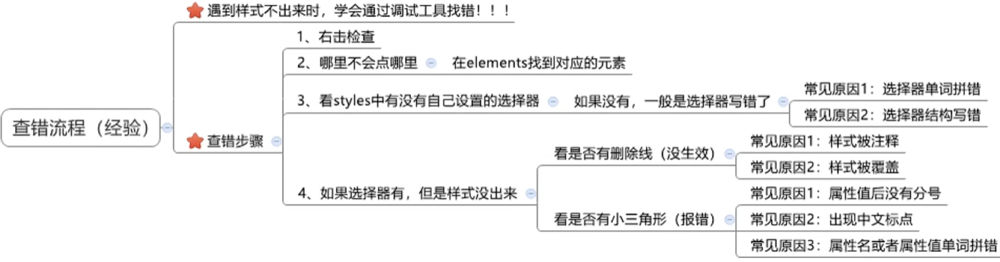

# Google debug tool



Press F12 or the right mouse button in Google Chrome -> Check

If the right CSS has a yellow triangle, there is an error

Select the number in CSS such as width and then press the keyboard up and down to adjust the size

You can also directly write CSS by pressing the tab in the CSS area

Tick: click to cancel the use of a line of CSS

# Less syntax

Less syntax target: `less` is essentially a CSS preprocessor, which can quickly compile and generate CSS code. Use the Less operation to complete the conversion from `px` to `rem` units.

## How it works?

Vscode downloads the plugin `easyless`, then creates `less1.less` and writes it in the file.

```less
.father {
  color: pink;
  width: (68 / 37.5rem);
  .son {
    background-color: skyblue;
  }
}
```

Press Save, and the `less1.css` file will be automatically generated as follows:

```css
.father {
  color: pink;
  width: 1.81333333rem;
}
.father .son {
  background-color: skyblue;
}
```

Comment in LESS

Less comment single line `//` commented out or `command + /`. Less multi-line comments: `/* comment block content */` or `shift + alt(option) + A`. Single-line comments won't render into auto-generated CSS when saving, but multi-line comments will.

LESS provides computability

Addition, subtraction, and multiplication do not require parentheses, and division requires `()` or `.`.

e.g.

```less
width: 100 + 50px;
width: 10 * 50px;
width: (100 / 4px);
width: 100 ./ 4px;
```

Usage of `&` symbol

`&` represents the current selector, which is similar to the 'this' keyword in Java.

```less
.father {
  color: pink;
  .son {
    background-color: skyblue;
    &:hover {
      background-color: green;
    }
  }
}
```

```css
.father {
  color: pink;
}
.father .son {
  background-color: skyblue;
}
.father .son:hover {
  background-color: green;
}
```

You can also use `&::after`, `&::before`, `&.class` name, etc. to store the color in a container in advance and set the property value to this container name.

Define variable: `@variable name: value;`

Use variables: CSS property name: `@variable name;`

Function: easy maintenance

Import part of CSS from other `.less` files

`@import '.less file path';`

Note that there is a space after `import`, single quotes for the path, and a semicolon at the end.

Replacing the Less file export address with `easyless`

Find `easyless` in the extension, click edit settings, and add the `"less.compile"{}` braces in the JSON that comes out.

```json
"out": "Export path, e.g. ../css/"
```

The `/` after the folder name cannot be lost to indicate that this is a folder.

Replace the Less file export address by commenting

Add `// out: ../css/` to the first line of the file.

You can also use `../css/` as the export target path, which can be another.

Add `// out: ../css/halo.css` to the beginning of the file.

You can confirm which folder to save to and name the file.

Disable export `.css` file

For less files that are not exported, add `//out: false` to the first line of the file.

Transfer `px` unit to `rem` unit

When writing the Less file in the project, you can first define the variable `@rootSize: one-tenth of the viewport width rem;`

Then, after all units with pixels, such as width, height, left and top of position, margin, font-size

, line-height are all written as `(the length in the design drawing has no unit/@rootSize);`

The unit of the automatically generated CSS will be `rem`.

Transfer `px` unit to `vw/vh`

e.g. The viewport width is 375px, to convert a box with a width of 68px and a height of 29px

```less
@vw: 3.75vw;
.box {
  width: (68 / @vw);
  height: (29 / @vw);
}
```

e.g. The viewport height is 667px, and a box with a width of 68px and a height of 29px needs to be converted

```less
@vh: 6.67vh;
.box {
  width: (68 / @vh);
  height: (29 / @vh);
}
```

# PxCook

## Design Mode Import Image

- Point ruler can measure the length of how many pixels
- Click the straw to get the RGB value

# VSCode

After creating a new one in vscode, type an English `!` to get the skeleton.

## Quick comment

Use `command + /` to quickly comment or uncomment a line of code.

## Auto wrap

Press `option + z` to enable or disable automatic word wrapping in the editor.

## Copy and paste current line

Use `alt + shift + down arrow` to copy and paste the current line.

## Modify multiple lines simultaneously

Hold `alt` and click on multiple lines to make changes to all of them at the same time.

## Emmet syntax

Emmet allows you to write code quickly using shorthand notations.

Syntax: `+`

| Example                 | Effect                                 |
| ----------------------- | -------------------------------------- |
| `div`                   | `<div></div>`                          |
| `.red`                  | `<div class="red"></div>`              |
| `#one`                  | `<div id="one"></div>`                 |
| `p.red#one`             | `<div class="red" id="one"></div>`     |
| `ul>li`                 | `<ul><li></li></ul>`                   |
| `ul>li{i’m li content}` | `<ul><li>i’m li content</li></ul>`     |
| `ul>li*3`               | `<ul><li></li><li></li><li></li></ul>` |

## Background shortcuts

- `bgc`: `background-color`
- `bgi`: `background-image`
- `bgr`: `background-repeat`
- `bgp`: `background-position`
- `bg`: `background`

## Text alignment

Use `tac` for `text-align: center`.

## Positioning

Use `por` for `position: relative;`.

## Border shortcut

Type `bd` and press `tab` to quickly generate a border.

## Width and height shortcuts

Use `w100+h100` for `width: 100; height: 100;`.

## Favicon

To specify a favicon for your webpage, use the following HTML tag:

```
<link rel="shortcut icon" href="favicon.ico" type="image/x-icon">
```

When working on a web app, you can use VSCode split-screen with HTML on the left and CSS on the right.
