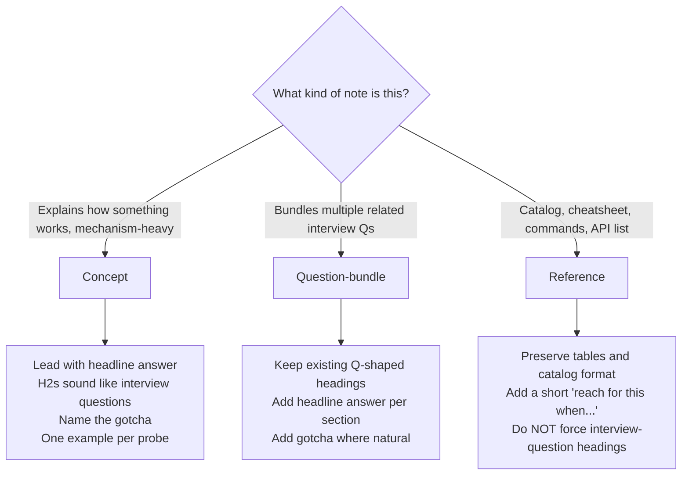
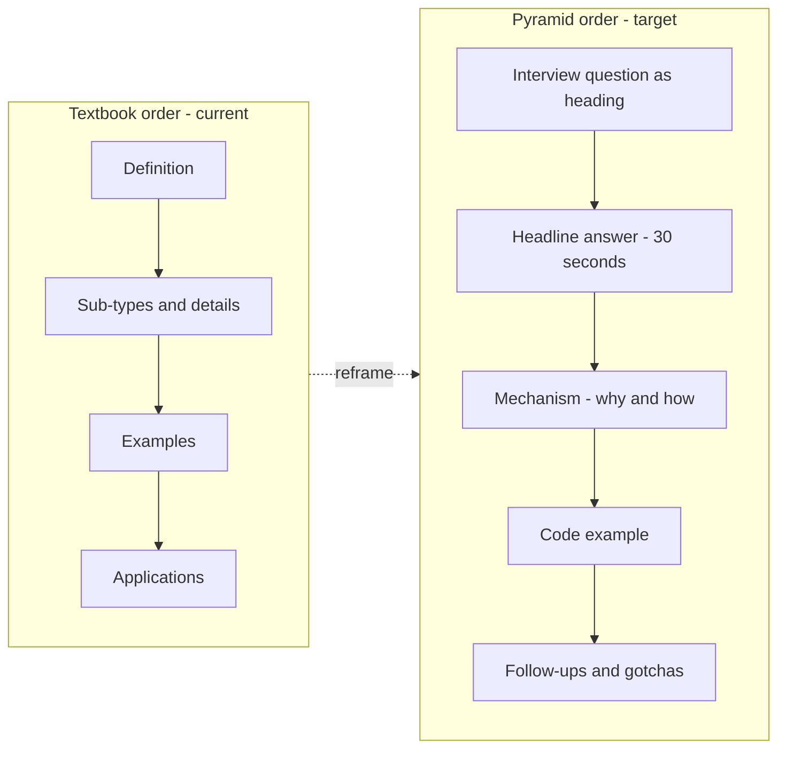

# Writing Guide — Frontend Notes

## TL;DR

> Every note should help a reader answer **interview questions**, not just understand topics. Three shapes of notes, each treated differently:
>
> - **Concept** (mechanism-heavy, e.g. `4.2 Scope & Closure`) — lead with the answer, make H2s into interview questions, name the gotcha.
> - **Question-bundle** (multiple related interview Qs, e.g. `2.6 CSS Interview Questions`) — add a headline answer per section, add gotchas where natural.
> - **Reference** (catalogs, cheatsheets, e.g. `16.1 Git Essentials`) — preserve the tables. Add a short "reach for this when…" framing.
>
> One rule that applies to all three: **the first thing a reader sees in any section should be the answer**, not the setup.

If you remember only two things: (1) classify the note type before you write, (2) lead with the answer.

---

## 1. The problem we're solving

Readers tell us our notes have useful definitions but leave them stranded: *"I understand what a closure is, but I still don't know what I'd say when someone asks me in an interview."*

That's a real gap, and it's structural. Skim [`4.2 Scope & Closure.md`](../4.2%20Scope%20%26%20Closure.md) and notice how it opens:

> "Scope in JavaScript is a fundamental concept that determines the accessibility of variables, functions, and objects at various levels throughout your code."

Accurate. Thorough. But if a reader has 30 seconds and an interviewer in front of them, they can't extract from this note:

- Which interview questions it actually unlocks ("What is a closure?", "Why does `for (var i…)` misbehave?", "How do you create private state in JS?")
- The one-sentence answer they'd literally say
- What the interviewer is probing for
- The follow-up they'll get next
- The gotcha most candidates trip on

The root cause is a **shape mismatch**. Our notes use *textbook order*: definition → sub-types → examples → applications. Interview prep needs *pyramid order*: question → headline answer → mechanism → example → follow-ups → gotcha.

But — and this is the part that's easy to miss — the shape mismatch only hurts *some* kinds of notes. Mechanism-heavy concept notes need pyramid order. A command reference like [`16.1 Git Essentials.md`](../16.1%20Git%20Essentials.md) is already perfectly shaped; forcing interview-question headings over its command tables would *destroy* their value. This guide adapts by note type.

---

## 2. Who we write for

A sharp reader persona drives every decision below. Our reader:

- **Already knows the basics.** They've written React for two years, they've used closures — they don't need JS 101. They need recall and articulation under pressure.
- **Scans first, reads second.** They read the H2s on the commute, then deep-read the night before a phone screen.
- **Thinks in questions, not topics.** They don't search "scope chain"; they search "how do I explain closure in an interview".
- **Needs to sound thoughtful out loud.** A note that lets them paraphrase a crisp answer is 10x more valuable than a note that's technically deeper.
- **Reviews under anxiety.** They're nervous. Long prose paragraphs are cognitive overhead they don't have to spare.

Every principle below serves this reader.

---

## 3. Which note type am I writing?

Before writing or rewriting, classify. Different shapes of content deserve different treatment.

### The three types

- **Concept note** — explains how something works; mechanism-heavy. Examples in the repo: [`4.2 Scope & Closure`](../4.2%20Scope%20%26%20Closure.md), [`7.1 Event Loop`](../7.1%20Event%20Loop.md), [`2.2 Box Model and BFC`](../2.2%20Box%20Model%20and%20BFC.md), [`11.2 Rendering and Computation Optimization`](../11.2%20Rendering%20and%20Computation%20Optimization.md). These benefit most from the pyramid principle.
- **Question-bundle note** — already structured around multiple related interview questions. Examples: [`2.6 CSS Interview Questions`](../2.6%20CSS%20Interview%20Questions.md), [`2.7 CSS Position, Display, and Animations`](../2.7%20CSS%20Position,%20Display,%20and%20Animations.md), [`4.1 Object, Function, and Prototype`](../4.1%20Object,%20Function,%20and%20Prototype.md). These need polish (headline answers, gotchas), not structural overhaul.
- **Reference note** — catalog, cheatsheet, command table, API list. Examples: [`3.6 ES6 New Methods`](../3.6%20ES6%20New%20Methods.md), [`13.1 Lodash`](../13.1%20Lodash.md), [`16.1 Git Essentials`](../16.1%20Git%20Essentials.md). Optimize for scan-ability; do NOT force interview-question framing.

### Decision tree



### Recognition rules

Ask yourself:

- Could I phrase the title of this note as a single interview question? → **Concept**.
- Is the note already a list of related interview questions? → **Question-bundle**.
- Is the note mostly tables, command lists, or method catalogs? → **Reference**.

If you're split between Concept and Question-bundle, default to Question-bundle — it's lighter-touch and easier to evolve.

---

## 4. The core shift — Pyramid Principle

Barbara Minto's Pyramid Principle (from *The Pyramid Principle*, McKinsey, 1967) says: **lead with the conclusion; put supporting arguments beneath it; put evidence beneath those.** The reader should know your point before you justify it.

Textbook writing inverts this — it builds from the foundations up. That's fine for a textbook (the reader has time and motivation to follow the buildup). It's wrong for interview prep (the reader is scanning for an answer-shaped piece of knowledge).

### The inversion (applies strongest to Concept notes)



A reader who only scans H2 headings in a pyramid-ordered Concept note should already know **what interview questions this note prepares them to answer**. That's the test.

The pyramid matters most for Concept notes. For Question-bundle notes, the headings are already questions — you just need to lead the body with the answer. For Reference notes, the pyramid principle shrinks to one rule: each entry leads with what the thing does, not history or rationale.

---

## 5. Writing principles

Each principle is **tagged by applicable type**: **[all]** / **[concept]** / **[concept + Q]**.

### P1. Lead with the answer, not the setup — [all]

Open every section with one or two sentences the reader could say out loud. Save "what is" and "it's important because" for after the answer — or cut them entirely.

**Before** (from [`4.2 Scope & Closure.md`](../4.2%20Scope%20%26%20Closure.md)):

> "Scope in JavaScript is a fundamental concept that determines the accessibility of variables, functions, and objects at various levels throughout your code."

**After**:

> Scope decides **where a variable is reachable**. JS has four scopes: global, function, block (from `let`/`const`), and module. When the engine doesn't find a variable, it walks outward through the scope chain, stopping at the first match.

For Reference notes, the "answer" is shorter — a one-line lead before the table. Same principle, shrunken.

### P2. Headings are insights, not labels — [concept]

A heading like `### Scope Linking in JavaScript` is a topic label — it tells the reader what section this is, not what they'll learn. For Concept notes, rewrite as **the question the reader is there to answer**, or as **the one-line insight** itself.

**Before**: `### Scope Linking in JavaScript`

**After (as a question)**: `### How does JS resolve a variable it can't find in the current scope?`

**After (as an insight)**: `### Variable lookup walks the scope chain outward, stopping at the first match`

Reference note headings stay as named things (`## Object.assign`, not `## How do I copy properties from one object to another in ES6?`). A reader skimming a reference *wants* the named thing.

### P3. One concept per block, each tied to a question — [concept + Q]

Topic-ordered notes dump everything related to a subject in one section. Interview-ordered notes split by question. If a section answers more than one question, split it.

**Before**: The `window` object section in `4.2` lists **nine** features (DOM, URL, console, alert/confirm, storage, timers, fetch, event handling, window management). Interviews probe maybe two of these (global leakage, timer/storage side effects).

**After**: Keep only what an interviewer would ask. Either trim the list, or break it into question-scoped sub-sections and link to a browser-API note for the rest.

Rule of thumb: **if you can't name the interview question a block answers, the block shouldn't be there.** (Reference notes are exempt — the block answers "how do I look up X?")

### P4. Code examples prove a point, not decorate the page — [all]

Every code block should be the answer to a probe-style follow-up: "Can you show me an example of…?" If a block doesn't answer a specific question, it's padding.

**Before**: Three near-identical examples of "here's scope at work" — global scope, local scope, lexical scope — each demonstrating the same idea from a slightly different angle.

**After**: One example per probe. Reference notes get a pass for compact one-liner examples inside tables — those *are* the entry.

### P5. Name the gotcha — [concept + Q]

Interviewers probe exactly where candidates get things slightly wrong. If you know a common wrong answer, **call it out by name** — don't leave it as subtext.

Use an explicit `**Gotcha:**` or `**Common wrong answer:**` line:

> **Gotcha:** Many candidates say closures "capture values". They don't — they capture **variable bindings**. That's why the `for (var i…) setTimeout` loop logs `N, N, N` instead of `0, 1, 2`: every callback reads the same `i`.

A reader who sees the trap named is immune to it.

**Never manufacture a gotcha for Reference or process/soft-skills content.** If no genuine trap exists, don't invent one. Manufactured gotchas are exactly the "confusing layer" we're trying to avoid.

### P6. Cross-link, don't duplicate — [all]

If closure is already defined in [`4.2`](../4.2%20Scope%20%26%20Closure.md), the React section shouldn't redefine it — it should link. Duplication drifts out of sync and dilutes the single-source authority of each note.

**Before**: Two notes each define "lexical scope" from scratch with slightly different words.

**After**: The canonical definition lives in one note. Every other note links there with a short contextual pointer:

> React's stale-closure bug is a consequence of how JS captures variable bindings — see [`4.2 Scope & Closure`](../4.2%20Scope%20%26%20Closure.md#what-is-closure).

---

## 6. Three note templates

Pick the template that matches your type. Each is copy-paste-ready; delete fields that don't genuinely apply.

### Template A — Concept note

For mechanism-heavy topics like [`4.2 Scope & Closure`](../4.2%20Scope%20%26%20Closure.md) and [`7.1 Event Loop`](../7.1%20Event%20Loop.md).

````markdown
## [Interview question, phrased the way an interviewer would ask it]

**Headline (30s):** One or two sentences you could literally say out loud.

**Why it's asked:** What the interviewer is actually testing.

**How it works:**

- Mechanism in 2–4 bullets. Not narrative, not history — the actual model.
- A small diagram is fine when it's clearer than prose.

**Example:**

```javascript
// The minimum code that proves the headline.
```

**Common follow-ups:**

- "What happens if…" → short pointer or link
- "How does this differ from…" → short pointer or link

**Gotchas:**

- The wrong answer most candidates give, stated plainly.
- The edge case the interviewer is probably hunting for.

**See also:** [Related note](../X.Y%20Title.md)
````

Not every field must be present. But **Headline** and at least one of **Follow-ups / Gotchas** should almost always be there — that's where textbook writing usually falls short.

### Template B — Question-bundle note

For notes that already bundle multiple related interview questions, like [`2.6 CSS Interview Questions`](../2.6%20CSS%20Interview%20Questions.md).

````markdown
# [Interview question as H1]

**Headline (30s):** One-to-two-sentence answer the reader could say out loud.

[Existing body content — mechanism, examples, comparisons — largely kept as-is.]

**Gotcha:** (optional, only if one exists) The trap in this question.

**See also:** [Related note](../X.Y%20Title.md)

# [Next interview question as H1]

...
````

The structural bones of a Question-bundle note already work. The job is to add a headline answer above each section's existing body, and add gotchas where natural.

### Template C — Reference note

For catalogs, cheatsheets, and command lists like [`13.1 Lodash`](../13.1%20Lodash.md) and [`16.1 Git Essentials`](../16.1%20Git%20Essentials.md).

````markdown
# [Topic — e.g., Array Utilities]

Reach for this when [one-line use case, e.g., "processing collections with complex transformations"].

| Function / Command | What it does | Example |
|---|---|---|
| `_.chunk(arr, size)` | Split into chunks | `_.chunk([1,2,3,4], 2)` → `[[1,2],[3,4]]` |

## [Deeper entries that don't fit a table row]

One-line description.

```javascript
// minimal usage
```

## When to reach for this (vs. native alternatives)

A short paragraph on when this library / tool is worth the dependency cost vs. using platform primitives. (Only relevant for library reference notes.)

**See also:** [Related note](../X.Y%20Title.md)
````

No headlines-as-questions. No manufactured gotchas. The value is scan-ability.

---

## 7. Self-review checklist

Run the universal items for every note. Then run the type-specific sub-checklist.

### Universal (all types)

- [ ] Does the note open with a clear sentence about what the reader will be able to do / say after reading it?
- [ ] Are there paragraphs that narrate *what* the section is about without advancing understanding? (If yes, cut them.)
- [ ] Are cross-links to related notes in place, instead of duplicated definitions?
- [ ] If I trimmed the note by a third, would it still accomplish its job? (If yes — trim it.)

### Concept notes — extra checks

- [ ] Can a reader read **only the H2 headings** and know what interview questions this note prepares them to answer?
- [ ] Does each section open with a **Headline (30s)** the reader could literally say out loud?
- [ ] Is every code block the answer to **a specific probe-style follow-up** an interviewer would ask?
- [ ] Have I named at least one **Gotcha** or **Common wrong answer**?
- [ ] Have I removed any section whose interview question I can't name?

### Question-bundle notes — extra checks

- [ ] Does each Q section open with a short **Headline (30s)** above the existing body?
- [ ] Where a genuine trap exists, have I added a named **Gotcha**?
- [ ] Are cross-links in place for concepts already defined in sibling notes?

### Reference notes — extra checks

- [ ] Is there a one-line "reach for this when…" framing near the top?
- [ ] Does the table / catalog stay scannable? (Nothing pushed below the fold that a reader would want at a glance.)
- [ ] For library notes, is there a closing "when to prefer native vs. this library" paragraph?
- [ ] Have I **not** added manufactured gotchas or forced interview-question headings?

---

## 8. What this guide does not dictate

We're prescribing **shape**, not voice. To stay usable without being precious, this guide deliberately leaves open:

- **Exact tone or voice** — stay yourself. Drier or warmer both work.
- **Diagram vs. prose** — pick whichever communicates the mechanism faster.
- **Note length** — some topics are three minutes of reading, some are thirty. Don't pad, don't truncate.
- **Topic selection** — which notes to write next, and which to rewrite first, is a separate concern.
- **Language / translation** — English for now.

If a rule here gets in the way of a note being clearer, the rule loses. **Clarity for the reader-under-pressure is the only real principle**; everything above is a tool for getting there.
