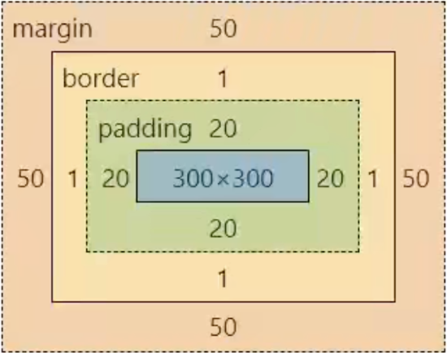
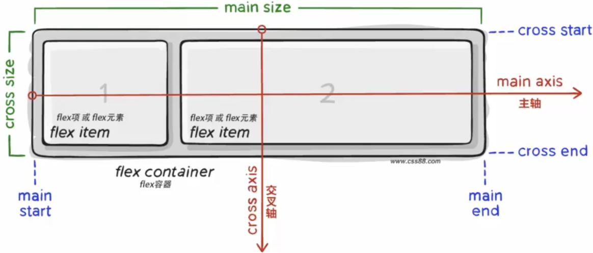
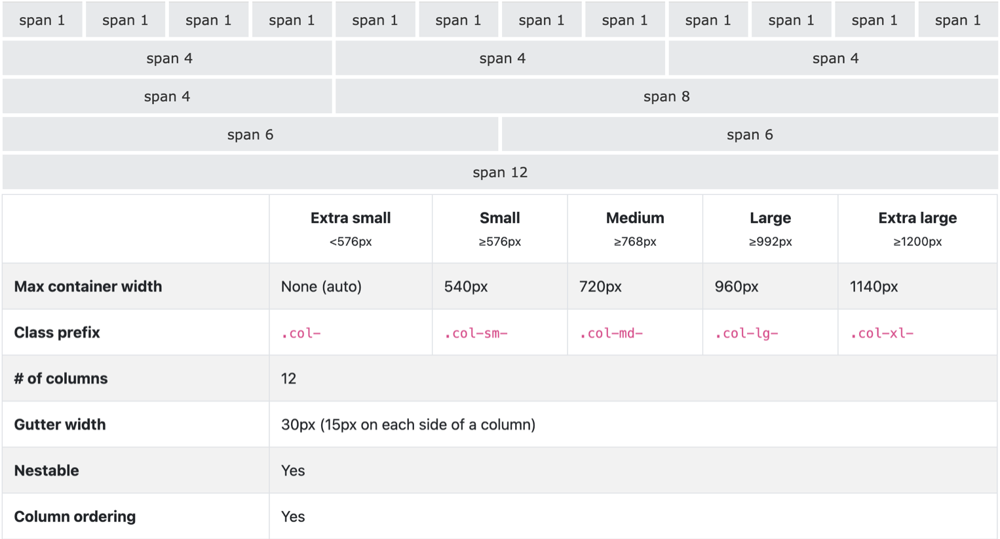

# CSS Basis

Comment in CSS:
```css
/* comment context*/
```

How to write?
```css
selector {
  /* styles */
}
```

## Overwriting

If a property is used twice, the later use will overwrite the previously used Font composite property.

## Inheritance and cascading

Inherit: The child element has the characteristics of inheriting the style of the parent element by default.

Typical properties that can be inherited (text control properties can be inherited): color, font-style, font-size, font-family, text-align, text-indent, line-height...

You can use debugging tools (Inspect in Google browser) to determine whether inheritance is possible.

The inheritance of color by the 'a' tag will fail because the 'a' label itself has a color attribute.

Inheriting the font size of the title class will fail because the title has a font-size attribute.

### Cascading

Set different styles for the same label -> the styles will be stacked at this time -> work together on the label.

Set the same style for the same label -> At this time, the styles will be stacked and covered -> The final style written at the end will take effect.

Note: When styles conflict, the result can only be judged by cascading if the selectors have the same priority.

### Priority

Feature: Different selectors have different priorities, the style of the selector with high priority will override the style of the selector with low priority.

Priority formula: inherit < wildcard selector < tag selector < class selector < id selector < inline style <!important

Be careful: `!important` is written after the attribute value and before the semicolon.

`!important` cannot increase the priority of inheritance, as long as the inheritance has the lowest priority!

It is not recommended to use `!important` in actual development.

## Weight Superposition Calculation

Scenario: When using a composite selector, you need to determine which selector will take effect in the end.

Weighted Addition Formula:

1. First, compare the first number. If the comparison comes out, you don't need to look at it.
2. Then compare the following number, and so on.
3. If there is `!important` and it is not inherited, the weight is the highest in the world.

## Pseudo-element

Pseudo-elements can be used for non-body elements in general content.

Element: tag set by HTML.

Pseudo element: CSS simulates the effect of the label.

## Consecutive Writing

To write `.box:hover.box::before` directly, you can write `.box:hover::before` directly.

## HTML height 100%

Note when working on projects: sometimes you need to set `html { height: 100%; }`.

Because the height of html is not as big as the browser by default.

So sometimes the height of the body is 0 even if it is set to 100%.

## LESS/CSS Typical Files

- `base.less/css`: initialization
- `normalize.less/css`: Compatibility
- `index.less/css`: CSS for the home page

# Where to write CSS?

## Internal Style Sheet

To write an internal style sheet, follow these steps:

1. Add a `<style>` tag below the `<title>` tag in the `<head>` section of your HTML document.
2. Define the selectors and their corresponding CSS properties within the `<style>` tag.

Example:

```html
<!DOCTYPE html>
<html lang="en">
<head>
     <meta charset="UTF-8">
     <meta http-equiv="X-UA-Compatible" content="IE=edge">
     <meta name="viewport" content="width=device-width, initial-scale=1.0">
     <title>Document</title>
     <style>
         p {
             color: red;
         }
     </style>
</head>
<body>
     <p>a red sentence</p>
</body>
</html>
```

In the example above, the selector `p` is used to target all `<p>` tags within the `<body>` section. The CSS property `color: red;` sets the color of the text inside the `<p>` tags to red.

## External Style Sheet

To use an external style sheet, follow these steps:

1. Create a separate CSS file with a `.css` extension (e.g., `mycss.css`).
2. Define the selectors and their corresponding CSS properties in the external CSS file.
3. Link the external CSS file to your HTML document using the `<link>` tag.

Example CSS file (`mycss.css`):

```css
p {
     color: aqua;
}
```

To reference the external CSS file, add the following code below the `<title>` element in the `<head>` section of your HTML document:

```html
<link rel="stylesheet" href="mycss.css">
```

In the example above, the `link` tag with the `rel="stylesheet"` attribute specifies that the referenced file is a CSS file. The `href` attribute specifies the path to the external CSS file (`mycss.css` in this case).

## Inline Style

To apply inline styles directly to an HTML element, follow these steps:

1. Add the `style` attribute to the opening tag of the element.
2. Inside the `style` attribute, define the CSS properties and their corresponding values.

Example:

```html
<p style="color: aqua;">happy</p>
```

In the example above, the `style` attribute is added to the `<p>` tag, and the CSS property `color: aqua;` sets the color of the text inside the `<p>` tag to aqua.

# Selectors

## Class selector:
Structure: `.classname {css_property_name: property_value;}`
E.g. `.one { color: red; }`
Find all pages with this class name tag to set the style by class name. Class names can be repeated, and a class selector can select multiple tags at the same time.

## ID selector:
(usually not used to write CSS, but will be selected with js)
Structure: `#id_property_value {css_property_name: property_value;}`
Find all tags with this id attribute value on the page to set the style. An id selector can only select one tag. E.g. `#one { color: blue; }`

## Wildcard selector (*):
Structure: `*{css_property_name: property_value;}`
Modify all styles of the page, rarely used. It can be used to clear the margin and padding of the label. E.g. `*{ margin: 0; padding: 0; box-sizing: border-box;}`

## Descendant combinator (" " a single space character):
According to the nesting relationship of HTML tags, select the elements that satisfy the conditions in the descendants of the parent element.
Syntax: `selector1 selector2 { /* property declarations */}`
Among the descendants of the tag found by selector1, find a tag setting style that satisfies selector2. Note: descendants include children, grandchildren, and grand-grandchildren…
Separate selectors with spaces. E.g. `div p {color: red }`

## The child combinator (>):
It matches only those elements matched by the second selector that are the direct children of elements matched by the first. Only children are matched (i.e. not grandchildren).
Syntax: `selector1 > selector2 { style properties }`
E.g. `div > a { color: rebeccapurple; }`

## Selector list (,):
The CSS selector list (,) selects all the matching nodes. Function: select multiple labels at the same time, set the style.
Syntax: `selector1, selector2 { /* property declarations */ }`
Find the tags selected by selector 1 and selector 2 to set the style. Each set of selectors in a union selector is separated by ','. Each set of selectors can be a base selector or a combined selector. Selector list is usually written one per line to improve readability. E.g. `h1, p, span { color: red; }`

## Intersection combinator (next to each other):
Select the tags on the page that meet multiple conditions at the same time.
Syntax: `selector1selector2{ /* property declarations */ }`
Set CSS styles for tags selected by selector1 and selector2 at the same time. Selectors are next to each other, with nothing in the middle. If there is a tag selector, the tag selector must be written first. E.g. `p.red { color:red; }`

## Hover pseudo-class selector:
Select the state that is hovered over the element, set the label.
Syntax: `selector:hover {/* property declarations */ }`
Note: The element selected by the pseudo-class selector is in a certain state. E.g. `a:hover{ color: red; }`

## Structural pseudo-class selector:
Function: Find elements based on their structural relationship in HTML. Advantages: Reduce dependencies on classes, which is conducive to clean code. The selector E is the tag name = element name, similar to java generics, and the object tag name should be filled in when using.
- `E:first-child{}`: matches the first child element in the parent element and is the E element.
- `E:last-child{}`: matches the last child element in the parent element and is the E element.
- `E:nth

-child(n){}`: matches the nth word element in the parent element and is an E element.
- `E:nth-last-child{}`: matches the nth last element in the parent element and is the E element.

Note on n: n is 0, 1, 2, 3, 4, 5... (similar to python range). n can be a common formula:
- even, 2n
- Odd odd, 2n+1, 2n-1
- find the first five -n+5
- Find n+5 from the fifth

Example:
```html
<style>
    li:nth-child(4n){
        background-color: blue;
    }
</style>
<body>
    <!-- ul>li{this is $th li}*8 -->
    <ul>
        <li>this is 1th li</li>
        <li>this is 2th li</li>
        <li>this is 3th li</li>
        <li>this is 4th li</li>
        <li>this is 5th li</li>
        <li>this is 6th li</li>
        <li>this is 7th li</li>
        <li>this is 8th li</li>
    </ul>
</body>
```

# Font Properties

## font-size
Property: `font-size`
Value: `<number>px`
Example: `font-size: 30px;` (If `p` is not set, the default is `16px`)

## font-weight
Property: `font-weight`
Value: (recommended number)
Keywords: `normal` (normal) / `bold` (bold)
Pure numbers: between `100` and `900`, normal `400`, bold `700`

## font-style
Property: `font-style`
Value: `normal` (normal) / `italic` (oblique)

## font family
Property: `font-family`
Common values: specific font 1, specific font 2, specific font 3;
If the specific font one is installed on the user's computer, the specific font one is used. If not, the specific font two is used, and so on.
Example:
```css
div{
    font-family: Arial, Helvetica, sans-serif;
}
```

## `font`
Composite property: `font`
Value: `font: style weight size family;`
Example:
```css
p{
    font: italic 700 66px Arial;
}
```
Omission requirement: only the first two can be omitted, i.e. use the default value
Example:
```css
p{
    font: 66px Arial;
}
```
If you want to set both single and continuous writing at the same time:
Either write it alone under the continuation
Either write it alone in the concatenation
Example:
```css
p{
    font: italic 700 66px Arial;
    font-style: normal;
}
```

## `text-indent`
Property: `text-indent`
Value: `<number>px` / `<number>em`
Using `em` is recommended; `1em` is the size of a current character.
Example: `p{ text-indent: 1em;}`

## `text-align`
Horizontal text alignment
Property: `text-align`
Value: `<keyword>`
Keyword options: `left`, `right`, `center`
You need to set the parent to align correctly. For example, use the selector to select the `body` tag in the middle of the web page.
`text-align: center` can center text, `span` tags, `a` tags, `input` tags, and `img` tags.

## `text-decoration`
Property: `text-decoration`
Value: `<keyword>`
Keyword options: `underline`, `line-through`, `overline`, `none`
`line-through` adds a line through the text, `overline` adds a line above the text, and `none` removes any decoration.
The underline of the 'a' element can be removed with `text-decoration: none`.

## `line-height`
Line height: top spacing + text size + bottom spacing.
Property: `line-height`
Value: `<number>px` or `<multiple>`
Example: `line-height: 50px;` or `line-height: 2;`
To center a single line of text vertically, set `line-height` to the height of the text's parent element.
For precise layout, set `line-height: 1` to cancel the upper and lower spacing.
It can be written in `font`, `size`, and `line-height` separated by slashes, i.e. 
`font: style weight size/line-height family;`
Example: `font: italic 700 66px/2 Arial`

## `color` and `background-color`
Color is the font color.
Background color is the color behind the text.
Value: `<color name>`, `<rbg(x, y, z)>`, `<rbga(x, y, z, o)>`, Sixteen-digit notation
`x`, `y`, `z` values: integers ranging from `0` to `255`
`o`: decimal number ranging from `0` to `1`, representing the transparency value
Example: `color: red;`, `color: rgb(0,0,0);`, `color: rgba(255,255,255,0.5);`, `color:#00ff00`

# Background Properties

## `background-image`
Property value: `url('<path to the image>')`
Quotes('') can be omitted in `url()`.
The picture is tiled horizontally and vertically by default. That is, if the box size is 400\*400 and the picture is 200\*200, four pictures will be automatically tiled.
To decorate the box, similar to `background-color`.
e.g. `background-image: url('image/car.jpg');`
Difference between `img` element: background image is only used for decoration purposes.

## `background gradient`
Syntax: `background-image: linear-gradient(color1, color2, color3);`
e.g. `background-image: linear-gradient(pink, skyblue, pink);`
Statements commonly used in the workplace: 
```
background-image: linear-gradient(transparent, rgba(0,0,0,.6));
```
Where `transparent` means complete transparency, you can use `rgba(0,0,0,0)`.

Normally invisible and the background gradient become visible after hovering:
Process:
1. Write the box positioning to control its position.
2. Implement hover to display.
3. Find the parent tag of the box size; if not, create a box.
4. Add `position: relative;` to the parent tag.
5. Add an `after` pseudo-element to the box:  
```
box_name::after {
    position:absolute;
    left:0;
    top:0;
    content:'';
    /* Set the width and height equal to the parent's width and height, which can completely cover the entire box */
    background-image: linear-gradient(transparent, rgba(0,0,0,.6));
    opacity:0;
    transition:all 1s;
}
```
6. `box_name::after:hover {opacity:1}`
See more details at front-end learning/web/gradient2.html.

## `background-repeat`
Property value:
- `repeat`: default, tile horizontally and vertically.
- `no-repeat`: does not tile.
- `repeat-x`: tile horizontally.
- `repeat-y`: tile vertically.

## `background-position`
Property value: `<horizontal position> <vertical position>`
Horizontal position can be: `left`, `center`, `right`, `top`, `<number>px`.
Vertical position can be: `top`, `center`, `bottom`, `<number>px`.
While using `<number>px <number>px`, it means the coordinate of the top-left corner.
One of the center can be omitted if we want to horizontally and vertically center the background.

## `background-size`
Attribute value: `number+px`, `percentage`, `contain`, `cover`.
`contain`: Include, and scale the background image proportionally, but will not exceed the maximum box.
`cover`: Cover, scale the background image proportionally until it just fills the entire box and there is no blank space, which may cause part of the image to be invisible.

## `background`
Syntax: `background: color image repeat position;`
If `position` is a word, it can be reversed, but if using values, the horizontal position must be specified first and then the vertical.
It is recommended to write a separate style below or inside the ligature.
e.g. `background: pink url(image1.jpg) no-repeat 50px 100px;`

# Other important styles

## List-style

Remove the dot at the beginning of the `li` tag:
```css
ul {
  list-style: none;
}
```
Note that CSS is added to `ul` instead of `li`.

## Attribute name: display
Attribute values: `block` (converted to block-level elements), `inline-block` (converted to inline-block elements), `inline` (converted to inline elements)
Converting to inline elements is rarely used, but the other two are commonly used.
e.g.
```css
div {
  width: 400px;
  height: 400px;
  display: inline-block;
}
```

## `input::placeholder{ }`

Control the placeholder style of the input:

## `vertical-align`

Baseline: There is a baseline for it in the layout of browser text type elements
Text Alignment Scenario: Solve the problem of vertical alignment of inline/inline-block elements
When the image and text are displayed in one line, the bottom is actually not aligned
Attribute name: `vertical-align`
Property value: `baseline` (default, baseline alignment), `top` (top alignment), `middle` (middle alignment), `bottom` (bottom alignment)
Inline block and inline-block alignment, inline-block and inline element alignment use this property

## `cursor`

Sets the style displayed when the mouse cursor is over an element
Property value: `default` (default small arrow), `pointer` (small hand, prompting the user to click), `text` (I-shaped, prompting that text can be selected), `move` (four arrows, prompting that you can move)

## `border-radius`

Scene: Make the border rounded, increase page details, and improve user experience
Property values: `<number>px` or percentage
Value: starting from the upper left, take the opposite corner if there is no number provided
One value: All four corners are equally rounded. e.g. `border-radius: 20px;`
Two values: top left, bottom right is the first value, top right, bottom left is the second value
Three values: the first from the upper left, the second from the upper right, the third from the lower right, and the fourth from the lower left
Four values: the four corners are different in size, the order is upper left, upper right, lower right, lower left, etc. e.g. `border-radius: 10px 20px 40px 80px;`
Common scenes: draw a circle with a border and rounded corners
1. Create a square box
2. Set `border-radius: 50%;`
Common scene: draw a capsule
Create a rectangular box
2. Set `border-radius` to half the height of the box

## `overflow`

Content overflow part display effect
Overflow part: refers to the area where the content of the box exceeds the scope of the box

Property values:
- `visible` (default value, the overflow part is visible)
- `hidden` (the overflow part is invisible)
- `scroll` (the scroll bar is selected whether it overflows or not)
- `auto` (the scroll bar is automatically displayed or hidden according to whether it overflows or not)
The most commonly used in work is `hidden`, to solve the problems caused by the collapse and excessive floating of the word element in the parent element

## Visibility and display

Scenario: Make an element itself invisible. For example, the element is hidden after the mouse hover

Common properties:
- `visibility: hidden;` (placeholder hiding effect, not commonly used)
- `display: none;` (no placeholder hidden, commonly used)
Difference: visibility will occupy the standard stream, the display will be off-label  
E.g. Mouse over to display the image
```css
img {display:none}
a:hover img {display:block}
```

## `opacity`

Element transparency  
Scenario: Make an element transparent as a whole  
Attribute value: a number between 0 and 1, 1 means fully opaque, 0 means fully transparent  
`opacity` will make the element transparent as a whole, including its content and child elements

## `transition`

Transition - let the style of the element change slowly, often used with hover to enhance the interactive experience of the web page
Property values:
- Transition properties: `all` (all properties that can be transitioned are transitioned, or a single property such as `width` (only the width is transitioned)
- The duration of the transition: `number + s` (how many seconds)

Be careful:
- If multiple properties transition together, they can be separated by commas, e.g. `transition: width 1s, background-color 2s;`
- The transition needs to have different styles between the default state and the hover state in order to have a transition effect
- The transition property adds to the element itself that needs to be transitioned
- Set to the default state, there is a transition effect when the mouse moves in and out
- Set the hover state, there is a transition effect when the mouse is moved in, and there is no transition effect when the mouse is moved out

# Box model



Each tab of the page can be seen as a box, and it is more accessible to layout through the perspective of the box.

When a browser renders a web page, it regards the elements in the web page as rectangular areas, which we call boxes vividly.

CSS says that each box comprises the content area, padding area, border area, and outer margin area. This is the box model. Therefore, Box size = width/height + padding + border-width

## CSS code example

```css
div {
    width: 300px;
    height: 300px;
    background-color: pink;
    border: 1px solid black;
    padding: 20px;
    margin: 50px;
}
```

## Content area

The content area is the width * height area.

- width: The width the text background takes up.
  - Property value: `<number>px`
  - Example: `width: 400px;`

- height: The height the text background takes up.
  - Property value: `<number>px`
  - Example: `height: 400px;`

## Border

- Property value: Consecutive writing of a single value, separated by spaces.
  - The first value is the thickness of the line, `<number>px`, e.g., `1px`.
  - The second value is the border type: solid, dashed, dotted.
  - The third value is the color. See the color for the value.
  - Example: `border: 10px solid red`

### Scenario: Set border on one side of the box

- Property name: `border-position` noun (top, right, bottom, left)
- Property values are written the same as above.
  - Example: `border-right: 1px solid black;`

If you want to write in more detail, you can set `border-width`, `border-style`, and `border-color`.

## Padding

- Property value: `<4 numbers + px>`
  - When a single number is used, all four sides are widened by `npx`.
  - When there are two numbers, up and down, left and right.
  - When there are three numbers, the order is up, left, right, down.
  - When there are four numbers, the order is top, right, bottom, left.
  - Memory: Always assign values clockwise from the top; if the number is not enough, it is equal to the opposite value.
  - Usage scenario: If the width and height are bound to die, an exception will be displayed if the number of words is too large, but if the width is not set, only the height is set, and then the left and right padding can be set to optimize this situation (`padding: 0 15px;`)

## `box-sizing: border-box;`

- Scenario: Box size 300px * 300px, background pink, border 10px solid black, top, bottom, left, left and right 20px padding.
- When setting the border and padding to the box, it will be enlarged.
- For automatic internal subtraction, set the width and height to 300px, and then set the property `box-sizing: border-box;` to the box.

## Margin

- Set the same way as the padding above.
  - Example: `margin: 20px;`

### Clear default margins

- Scenario: The browser will set the default margin and padding for some tags, but generally, you need to clear the default margin and padding of these tags before starting the project and then set them by yourself.
  - Example: `*{margin: 0; padding: 0; box-sizing: border-box;}`

## Center a box

- `margin: 0 auto`

## Box tips

When writing a box, you must first write the width and height background color, write the content, adjust the content position, and adjust the text details.

## `box-shadow`

- Property values: h-shadow, v-shadow, blur, spread, color, inset.
  - h-shadow: value number + px, a negative value is allowed, it is required, the larger the number, the more the shadow goes to the right.
  - v-shadow: value number + px, a negative value is allowed, it is required, the larger the number, the lower the shadow.
  - blur: value number + px, optional, the larger the number, the more blurred.
  - spread: value number + px, optional, the larger the number, the larger the shadow.
  - Color: Value standard name /rbg/rbga, optional, shadow color.
  - Inset/outset: optional, inset is to change the shadow to inner shadow, outset is the default, outer shadow.

## Margin Collapsing Phenomenon

### Merging Phenomenon

The upper and lower margins of vertical block-level elements will merge. For example, the upper margin-bottom is 50px and the lower margin-top is 50px, so the distance between them is 50px instead of 100px. The distance between the two is the maximum value of the margin.

Solution: Just set a margin.

### Collapse

In nested block-level elements, the margin-top of the child element will act on the parent element.

Result: Cause the parent element to move down together.

Solution:

- Set border-top or padding-top to the parent element to separate the margin-top of parent and child elements.
- Set `overflow: hidden;` on the parent element (recommended).
- Convert to inline-block element.
- Set `float`.

# Pseudo-elements

Pseudo-elements in CSS allow you to add decorative or informational content to an element. They are represented by the `::before` and `::after` selectors.

## ::before
The `::before` pseudo-element adds content to the front of the parent element's content. It is often used for decorative purposes or to insert icons or shapes before the content.

```css
.father {
    width: 300px;
    height: 300px;
    background-color: pink;
}

.father::before {
    content: 'shape';
}
```

In the example above, the `::before` pseudo-element is added to the `.father` element, and its content is set to 'shape'. This will insert the word 'shape' before the content of the `.father` element.

## ::after
The `::after` pseudo-element adds content to the end of the parent element's content. It is commonly used for decorative elements or to add additional information after the content.

```css
.father::after {
    content: 'you';
}
```

In the example above, the `::after` pseudo-element is added to the `.father` element, and its content is set to 'you'. This will insert the word 'you' after the content of the `.father` element.

Note that for both `::before` and `::after`, the `content` attribute must be set in order for the pseudo-elements to take effect, even if there is no text content. To create empty pseudo-elements, you can use `content: '';`.

Pseudo-elements are inline elements by default, but you can change their display to `block` to make them behave like block-level elements.

To change the display of a pseudo-element to block, you can use the `display: block;` CSS property.

```css
.father::before,
.father::after {
    display: block;
}
```

In the example above, both the `::before` and `::after` pseudo-elements of the `.father` element are set to `display: block;`, making them behave as block-level elements.

Remember to use appropriate selectors and apply the desired styles to customize the appearance of pseudo-elements in your HTML and CSS code.

# Float

Float is a CSS property used to position elements horizontally. It allows elements to be placed side by side, either to the left or right of their container. The `float` property can have a value of `left` or `right`.

Example:

```css
div {
    float: left;
    background-color: skyblue;
}

div {
    float: left;
    background-color: pink;
}
```

## Floating Features

- Floating labels will leave the standard flow and take no place in the standard flow.
- Floating elements are half a level higher than the standard flow and can cover elements in the standard flow.
- Floating to find floating, the next floating element will float around the previous floating element.
- Floating labels are top-aligned.
- Floating elements have special display effects: one line can display more than one, and the width and height can be set (that is, the floating label has the characteristics of an inline-block).
- Floating elements cannot be centered by `text-align: center;` or `margin: 0 auto;`.
- The left and right of the floating element are the leftmost and rightmost of the parent element.

## Recommended CSS Writing Order

Writing CSS in a specific order can help improve rendering performance. The recommended order is as follows:

1. Float/display
2. Box model related: margin, border, padding, width, height, and background-color
3. Text style

## Making Navigation Page

To create a navigation menu, it is recommended to use a list to contain each `<a>` element. This improves rendering efficiency. If you want the entire list to be clickable, make the `<a>` tag bigger with CSS. If you want only the text to be clickable, make the `<li>` tag bigger. Float the `<li>` tag to align the navigation horizontally.

## Clearing the Effect of Floating

When elements are floated, their parent element's standard flow can be affected, especially when the parent element doesn't have a specified height. Here are some solutions to clear the effect of floating:

1. Setting the height of the parent element.
2. Using the extra tag method: Add a block-level element to the end of the parent element and apply `clear: both;` to it. This is commonly done using `<div class="clearfix"></div>`, and the corresponding CSS class is `.clearfix { clear: both; }`.
3. Single pseudo-element clearing: Use pseudo-elements instead of extra tags. This method is more compatible with older browsers. Example:
   ```css
   .clearfix::after {
       content: '';
       display: block;
       clear: both;
       height: 0;
       visibility: hidden;
   }
   ```
   Add the `.clearfix` class to the parent element: `<div class="top clearfix"></div>`.
4. Double pseudo-element clearing (recommended):
   ```css
   .clearfix::before,
   .clearfix::after {
       content: '';
       display: table;
   }
   .clearfix::after {
       clear: both;
   }
   ```
   Add the `.clearfix` class to the parent element: `<div class="top clearfix"></div>`. Using double pseudo-elements helps avoid collapse problems.
5. Overflow method (recommended): Set `overflow: hidden;` directly to the parent element.

# Positioning

## How to use position?

Set `position` property.

- Property name: `position`
- Property value: `static`, `relative`, `absolute`, `fixed`

Set the offset value. The offset value is divided into two directions: horizontally and vertically. The principle of selection is generally the principle of proximity. If both are written, only `left/top` shall prevail.

- Property names: `left`, `right`, `top`, `bottom`
- Property value: `number + px`, the number can be negative

It will take the direction as a reference and move the distance of the property value in the opposite direction. For example, `left: 100px;` will move 100px from the far left to the right, `right: -4; top: 0;` moves four pixels from the upper right corner to the right.

## Relative positioning

```css
position: relative;
```

- Need to cooperate with the orientation attribute to achieve movement.
- It still has the display mode characteristics of the original label.
- Moves relative to its original position.
- Takes place on the page without breaking out of the standard flow.
- Application scenario: Cooperate with absolute positioning group cp, parent relative positioning, child absolute positioning (child absolute parent relative) for small movements.
- If `left: 100px; top: 100px;` is equivalent to moving to the lower right corner.

## Absolute positioning

```css
position: absolute;
```

- First, find the parent that has been positioned (with the `position` property), and if there is such a parent, use this parent as a reference for positioning.
- If there is a parent, but the parent is not positioned, position with the browser window as a reference.
- Need to cooperate with the orientation properties to achieve movement.
- The orientation attribute can take a percentage, e.g., `left: 50%;` that is, the position of the upper left corner of the label to the center line of the parent element.
- If you want the tag to be in the middle, you can use:
  - `left: 50%; margin-left` takes the negative half of the width.
  - `top: 50%; margin-top`: negative half of the height.
- You can also use the `transition` property to set the box in the middle:
  ```css
  transform: {
    position: absolute;
    left: 50%;
    top: 50%;
    transform: translate(-50%,-50%);
  }
  ```
- Moves relative to the browser's visible range by default.
- Does not occupy a place on the page (off-label).
- Application scenario: use together with relative positioning.

## Fixed positioning

```css
position: fixed;
```

- Need to cooperate with the orientation attribute to achieve movement.
- Moves relative to the browser viewable area.
- Does not occupy a place on the page: has been removed.
- Application scenario: let the box be fixed in a certain position on the page, e.g., back to the top button.

Element hierarchy: `standard flow < float < positioning`.
The relative, absolute, and fixed positions have the same default level. At this time, the higher level written below in the HTML will cover the above elements.

## z-index

- Property value: an integer.
- The larger the value, the higher the display order. The default value is 0.
- The `position` attribute is required to take effect.

When do we use positioning?
- If the image cannot be aligned with `vertical-align` and `line-height`, use positioning.

# Icon font

The simple images represented by font can be modified using `font-size` and `color`.

## Advantage vs image/background image

- Flexibility: Flexibility to modify styles, such as size, color, etc.
- Lightweight: Small size, fast rendering, and reduced server requests.
- Compatibility: Compatible with almost all major browsers.

## How to use iconfont? — Download

1. Go and login into `https://www.iconfont.cn/`.
2. Find 素材库 —> 官方图标库.
3. Add the iconfont to the cart.
4. Click 添加至项目.
5. Create a new project by clicking the folder icon with a plus sign.
6. Click download on the project page.

## How to use iconfont? — Invoke

1. Firstly, introduce font icon style sheet to the project, e.g., `<link rel="stylesheet" href="./iconfont.css">`.
2. To invoke the iconfont, add 2 class names to the tag:
   - `iconfont`: Basic styles, including the use of fonts, etc.
   - `icon-xxx`: The class name corresponding to the icon.
3. There is `demo.html` on the downloaded page, click on the font class to see the name of the icon class.
   - e.g., `<span class="iconfont icon-favourites-fill"></span>`.
4. When adjusting, use `.icon-favourites-fill{ }` in the current `.css` to select it.
5. The principle is that it comes with a `::before` to add icons.

## How to use iconfont? — Upload

Sometimes the icons in the design draft are not in iconfont, then you can upload and download them yourself.

1. Look for a designer to communicate and ask for a vector illustration in SVG format.
2. Upload in the upper right corner —> 上传SVG图标.
3. 浏览本地图标 —> 去除颜色提交.
4. Add to cart —> Download and use.

# Transform
All transforms remember to match the transition property to activate

## Displacement
How to use: `transform: translate(<horizontal movement distance> <vertical movement distance>);`
Value: positive or negative, it can be a number + px or a percentage (the reference is the size of the box itself)
Note: The positive direction of the x-axis is right, and the positive direction of the y-axis is down.
e.g. `transform: translate(50px, 100px); transform: translate(-50%, -100%);`
If you only move in one direction, you can use `translateX();` `translateY();`

## Rotate
How to use: `transform:rotate(<angle>);`
Angle value: number + deg,
Can be positive or negative, turn clockwise when taking a positive number, and turn counter-clockwise when taking a negative number
e.g. `transform: rotate(360deg);`

Change the transform-origin:
The default transform-origin is the box center
`transform-origin: <the horizontal position of the origin> <the vertical position of the origin>;`
Value: position noun (left, right, top, bottom, center), number + px, percentage (the reference is the size of the box itself)
Add to the tag itself before the transform, don't write it in the hover part

## Multiple transforms
`transform: translate() rotate();`
If you rotate first, the direction of the coordinate axis will be changed, and the direction of displacement will be affected, so all multi-transform rotate is written at the end
Because of the cascading of CSS, multiple transformations cannot be split into several transforms and written separately
Having a transform after the hover should pay attention. If you use `transform: translate(-50%, -50%);` before the hover to locate, then you need to use multiple transformations after the hover. `transform:translate(-50%,-50%) rotate(360deg);` to cancel the stacking

## Zoom
Attribute value: scale
`transform: scale(x-axis scaling factor y-axis scaling factor);`
Under normal circumstances, you will write `transform: scale(scaling factor);` to achieve equal scaling of the x-axis and y-axis
A zoom factor greater than 1 means zoom in, less than 1 means zoom out
e.g. `transform: scale(1.2); transform: scale(0.8);`
If you only scale in one direction, you can use `scaleX(<times>);` `scaleY(<times>);` `scaleZ(<times>)`
Scale in 3d: `transform: scale3d(x, y, z);` x, y, z are the scaling factors in the x-axis direction, the y-axis direction, and the z-axis direction respectively

## Space Transformation (3d Transformation)
The Z-axis direction is the same as the line-of-sight direction, and the positive value points out of the screen (to the user)
Syntax: `transform:translate3d(x,y,z);`
You can use `translateX(x);` `translateY(y);` `translateZ(z);` to modify a value alone
The value can be positive or negative, it can be a pixel number + px or a percentage

## Perspective effect (the nearer the bigger, the farther the smaller
attribute name: perspective
Attribute value: number + px, generally between 800 - 1200
Use: add to the parent, add to body tag if the parent is body tag

## Space rotation
Syntax: `transform: rotateZ(value);`
The effect of rotateZ is completely equal to rotate
Syntax: `transform: rotateX(value);`
Rotate around the

 x-axis, you can adjust the viewing distance with the perspective property
Syntax: `transform: rotateY(value);`
Rotate around the y-axis, you can adjust the viewing distance with the perspective property
Left-hand rule: hold the rotation axis with the left hand, the thumb points to the positive direction, and the bending direction of the fingers is the positive direction of rotation
i.e. the positive x-axis is to the right, the positive y-axis is down, and the positive z-axis points to itself

## rotate3d 
(extension, won't be used at work)
Attribute value: `rotate3d (x, y, z, angle degrees)`: used to customize the position and rotation angle of the rotation axis
x y z is a number between 0-1

## Stereoscopic presentation 
(extension, not commonly used in work), emmet shortcut key tfs
`transform-style: preserve-3d;`
Make child elements in true 3d space
The default value is flat, which means rendering in 2d
You can use translate to adjust the distance between the front and back sides

```html
<style>
        .cube {
            position: relative;
            width: 200px;
            height: 200px;
            margin: 100px auto;
            transition: all 2s;
            transform-style: preserve-3d;
        }
        .cube div {
            position: absolute;
            left: 0;
            top: 0;
            width: 200px;
            height: 200px;
        }
        .cube .front {
            background-color: skyblue;
            transform: translateZ(200px);
        }
        .cube .back {
            background-color: green;
        }
        .cube:hover {
            transform: rotateY(180deg);
        }
</style>

<div class="cube">
    <div class="front">
    </div>
    <div class="back">
    </div>
</div>
```

If you want to make a front and an upper cube rotated down,
1. Make a big box, put two small squares in it, add `transform-style: preserve-3d;`
2. In order to facilitate observation, the box can be rotated by some angles first
3. Use positioning to overlap two squares
4. Rotate the above square by 90 degrees with multiple transforms, shift up, shift back
5. Add a rotation transform to the big box

# Animation

When to use animation and when to transition:
Transition: only start and end points
Animation: There are other actions besides the starting point and the end point, realizing the change process between multiple actions, and the animation process is controllable

Define animation:
```css
@keyframes animation name {
    0% {} from {}
    10% {} to {}
    100% {}
}
```

Use animation: 
```css
animation: animation name animation duration;
```
Example:
```css
@keyframes change {
    0% {
        width: 200px;
    }
    30% {
        width: 300px;
    }
    100% {
        width: 800px;
    }
}

.box {
    width: 200px;
    height: 100px;
    background-color: pink;
    animation: change 1s;
}
```

## More animation properties

`animation` property syntax:
```css
animation: animation-name animation-duration animation-timing-function animation-delay animation-iteration-count animation-direction animation-fill-mode animation-play-state;
```
The order between attributes can be swapped, and some properties can be ignored.

The value of `animation-timing-function` (not commonly used):
- `linear` (uniform speed)
- `steps (<number>)`, indicating that the animation is divided into several steps (frames), commonly used in clocks and watches

If there are 2 time-values, the first is the animation duration and the second is the delay duration.

The value of `animation-iteration-count`:
- `number` (how many times to repeat)
- `infinite` (infinite loop)

If you want the animation to return to the original in reverse, set the `animation-direction` to `alternate`.

If you want to set `animation-fill-mode`, remove the number of `animation-iteration-count` and `animation-direction`.

The value of `animation-fill-mode`:
- `backwards` (default value)
- `forwards` (the animation stays at the beginning)

The value of `animation-play-state`: `paused`, usually matched with `hover`, when the mouse leaves, pause the playback.

Single property modification is also available.

Add multiple animations separated by commas:
```css
animation: animation 1, animation 2, animation 3;
```

## An example

A box can hold three pictures at the same time, and then the pictures scroll from right to left all the time.

1. Create a box and set `overflow: hidden`.
2. Create `ul` and `li` and put a picture each, set `left` floating.
3. Put the first three sheets to the end so they won't be blank when scrolling to the far right.
4. Then when scrolling to the last three pictures, the animation is replayed, seamless.
5. The animation is added to the `ul`, and the parent moves the child will follow.

# Flex layout

Flexibly and rapidly develop web pages, avoid the problem of off-label caused by box floating, suitable for structured layouts.

## Flex model composition:



Setting method: add `display:flex;` to the parent element, and the child element can be automatically squeezed and stretched

Components: flex container, flex box, main axis, side axis/cross axis

Flex container: parent element

Flex box: child elements inside the parent element with `display: flex` added

The default main axis is horizontal, default cross axis is vertical

Visual effects by default: children are arranged in a row/horizontal

Reason: The default main axis is horizontal, and the elastic boxes are arranged along the main axis

## justify-content

In the flex model, you can set the spacing between boxes by adjusting the alignment of the main axis or side axis

`justify-content` property - adjusts the alignment of the element on the main axis

Value            function

`flex-start`     The default value, the starting point is arranged in sequence without blank space

`flex-end`       Arranges sequentially from the end without blank space

`center`         Centered along the main axis

`space-around`   The elastic box is evenly arranged along the main axis, and the blank space is evenly divided on both sides of the elastic box

`space-between`  Flex boxes are evenly arranged along the main axis, and the white space is evenly divided between adjacent boxes

`space-evenly`   The elastic boxes are evenly arranged along the main axis, and the distance between the elastic box and the container is equal

Visual effects

`center`         Center, no white space

`space-around`   There is white space at the far left and right, and the space between boxes is twice the space between the left and right

`space-between`  No space left and right, equal space between boxes

`space-evenly`   Has blank space at the far left and right, equal to the space between boxes

## align-items and align-self

`align-items` - adjusts the alignment of elements on the side axis (added to the parent element)

`align-self` - controls the alignment of a flexbox on the side axis (added to flexbox)

Value (shared by both properties)  Function

`flex-start`               The default, the starting points are arranged in order

`flex-end`                 Be arranged in sequence starting from the end

`center`                   Is centered along the side axis

`stretch`                  The default value, the elastic box is stretched along the main axis to cover the container, and the height property of the child needs to be removed

## flex - modify the stretch ratio

Value: integer

Note: Only occupy the remaining size of the parent box

The definition of the remaining size: the container minus the space occupied by all boxes without flex properties, including the margin and the box itself

The number here represents the number of copies. For example, if there are only two boxes in this container with `flex:1;` it means that the remaining size is divided into two parts, and each of the two boxes occupies one part. Similarly, if only one box uses `flex: 1;` it means that the remaining size is divided into one share, and this box occupies one share, that is, 100% of the remaining size.

## flex-direction - change the orientation of elements

How to use: Add to the label with `display: flex;` attribute (flexible container)

The main axis is horizontal by default, and the side axis is vertical by default.

Value            function

`row`            Horizontal (default)

`column`         Vertical

`row-reverse`    Horizontal, right to left

`column-reverse` Vertical, bottom to top

After changing `flex-direction` to `column`, the main axis is from top to bottom. At this time, if you want to center vertically, use `justify-content:center;` if you want to center horizontally, use `align-items: center;`

## flex-wrap - achieve multi-line arrangement effect of flex box

If you don't use this property, the default value is `nowrap`, even if the box is set to the `width` property, it will be scaled and arranged in a row

Use: `flex-wrap: wrap;`

## align-content - adjust line alignment mode

Only used in case of `flex-wrap:wrap;`

The value is basically the same as `justify-content`

## Automatic ellipsis:

```css
text-overflow: ellipsis;
white-space: nowrap;
overflow: hidden;
```

## Flexbox auto ellipsis:

Add the above three to the flex box

Add `flex: 1; width: 0;` in parent

The purpose of width is to display the ellipsis when overflowing instead of letting the content stretch the box

The two lines end with an ellipsis, just copy and paste without memorizing

```css
.ellipsis2 {
    overflow: hidden;
    text-overflow: ellipsis;
    display: -webkit-box;
    -webkit-line-clamp: 2;
    -webkit-box-orient: vertical;
}
```

# Responsive website

## Media queries
Media queries allow us to write differentiated CSS styles by detecting the width of the viewport. The syntax is similar to an if statement, and the CSS within the media query is executed when the media feature condition is satisfied.

```css
@media (media property) {
    Selector {
        css property
    }
}
```

For example:

```css
@media (width: 320px) {
    html {
        font-size: 32px;
    }
}
```

In the above example, when the viewport width is 320px, the font size of the `html` element is set to 32px.

Generally, the font size of the `html` element is set to one-tenth of the viewport width, which can be a decimal. For example, if the viewport width is 375px, then the font size is set to 37.5px.

We can also use `max-width` and `min-width` to judge in media queries:

```css
@media (max-width: 768px) {
    body {
        background-color: pink;
    }
}

@media (min-width: 1200px) {
    body {
        background-color: skyblue;
    }
}
```

The `body` element will have a pink background color when the viewport width is less than or equal to 768px. When the viewport width is greater than or equal to 1200px, the `body` element will have a sky blue background color.

## A simple example of a responsive website
In this example, different background colors are applied based on the width of the viewport using CSS cascading implementation.

```css
@media (min-width: 768px) {
    body {
        background-color: pink;
    }
}

@media (min-width: 992px) {
    body {
        background-color: green;
    }
}

@media (min-width: 1200px) {
    body {
        background-color: skyblue;
    }
}
```

When the viewport width is less than 768px, the `body` element will have a white background color. For widths between 768px and 991px, the background color will be pink. For widths between 992px and 1199px, the background color will be green. Finally, for widths greater than or equal to 1200px, the background color will be sky blue.

## Full media query
A full media query consists of the `@media` keyword, media type, and media property.

```css
@media media type and (media property) {
    css code
}
```

Commonly used media types are `screen`, `print`, `speech`, and `all`, with `screen` being the most commonly used.

Media properties include `width`, `height`, `max-height`, `min-height`, `max-width`, `min-width`, and `orientation`. The `orientation` property determines the screen orientation, with values being `portrait` or `landscape`.

## Link different CSS according to the width of the screen
To link different CSS files based on the width of the screen, we can use the `link` element with the `media` attribute.

```html
<link rel="stylesheet" href="path.css" media="(min-width: 768px)">
<link rel="stylesheet" href="path.css" media="(min-width: 992px)">
<link rel="stylesheet" href="path.css" media="(min-width: 1200px)">
```

In the above example, the CSS file specified by `path.css` will be applied when the screen width is greater than or equal to the specified values.

It's important to note that the media features should be written directly within parentheses, and the double quotes cannot be deleted.


# rem - old but widely used relative unit

## rem: most current enterprise solutions

- The rem unit is the calculation result of the font size relative to the html tag
- 1rem = 1html label font size
- Adjust the html font size: `html {font-size:20px;}`
- Usage example: `width:5rem; height:5rem;`
- 5rem is half the width of the phone screen
- Divide the size in the design draft by the html font size to calculate the size in rem units, more operations see LESS syntax module

# flexible

- With flexible.js, the size of web page elements is proportional to the scaling effect in devices of different widths.
- flexible.js is a js framework developed by mobile phone Taobao to adapt to the mobile terminal
- The core principle is to analyze the viewport width and then set the font-size of html
- Where to find flexible.js: [https://github.com/amfe/lib-flexible](https://github.com/amfe/lib-flexible) copy and paste index.html into flexible.js
- Flexible introduction and usage: first download flexible.js to the local, and then write at the bottom of the body tag
  `<script src="path to flexible.js"></script>`

# vw/vh - better and more future relative unit

- vw:viewpoint width
- vh:viewpoint height
- Relative units, calculated relative to the viewport size
- 1vw = 1/100 viewport width
- 1vh = 1/100 viewport height
- Usage example
  - `width:50vw;`
  - `height:30vw;`
  - `width:50vh;`
  - `height:30vh;`
- Advantages compared to rem: no need to introduce flexible.js and media queries
- Vw, vh can be used, but not mixed! ! Can not set the width unit vw height vh! vw is recommended

# px to vw in the design drawing

- Determine the vw size in the design draft (1/100 viewport width) to view the design draft width —> determine the reference device viewport width —> determine the vw size (1/100 viewport width)
- Size in Vw units = value in px units / (1/100 viewport width)
- Transferring from px unit see less module for more information

# Bootstrap
- Official website: [bootcss.com](https://v3.bootcss.com/css/)
- Remember to download version 3.4.1, the most stable
- When calling `<link rel="stylesheet" href="./bootstrap-3.4.1-dist/css/bootstrap.min.css">`

## Grid System

- The webpage is divided into 12 equal parts. If the width of the box is 100%, it will occupy 12 parts.
- If the width of the box is 25%, it will account for 3 shares.
- Code: `class-prefix` + how many spaces it occupies.
  - For example, `.col-lg-3` means that it occupies three grids in a large window, and four rows can be arranged in a row.

## Container
- The `.container` class is the class name provided by Bootstrap.
  - All boxes with this class name have a default width and center, with left and right padding of 15px.
- The `.container-fluid` class is also a class name provided by Bootstrap.
  - The default width of all boxes with this class name is 100%, with left and right padding of 15px.
- Use the `.row` and `.column` class names to define the rows and columns of the grid layout, respectively.
  - The `.row` class comes with left and right padding of -15px (negative number).
  - So, if you want the content to fill the `.container`, put a `.row` in the `.container` to offset the spacing.

## Other Effects
- [Bootcss.com/css](https://v3.bootcss.com/css/)
  - If you have nothing to do, just take a look. There is a navigation on the right side of the website to quickly find relevant content.

## Components
- There are a lot of beautiful components. Just copy and paste and adjust them yourself.

## Bootstrap Font Icon
- Bootstrap also has its own font icon, similar to Iconfont.

# Introducing JavaScript
- Two files need to be imported.
  - `jQuery.js` must be imported first, and then `bootstrap.min.js`.

