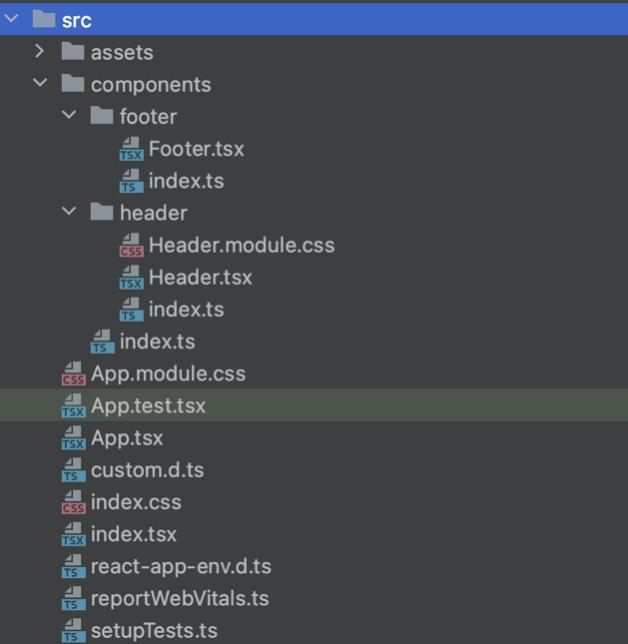
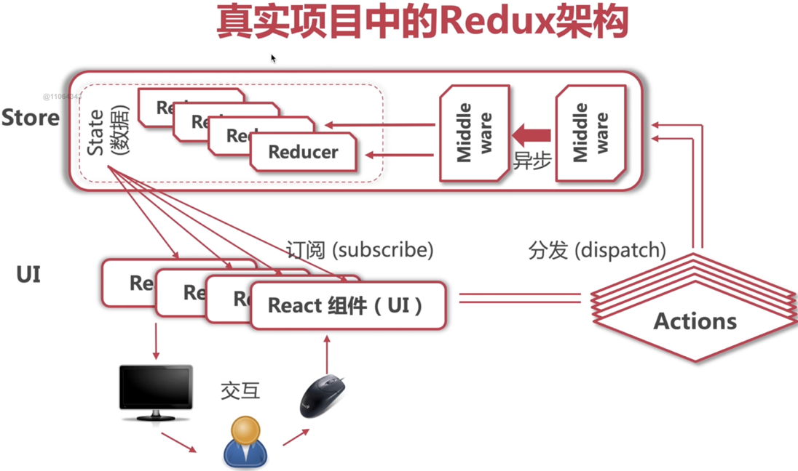

## Create React App with TypeScript Template

To create a React app with the TypeScript template, use the following command:

```
npx create-react-app react-ts --template typescript
```

To enable TypeScript to accept the `any` type, add `"noImplicitAny": false` in the `compilerOptions` section of your `tsconfig.json` file:

```json
{
    "compilerOptions": {
        "noImplicitAny": false,
         ...
    }
}
```

## Component in TypeScript

Here's an example of a component written in TypeScript:

```tsx
import React from 'react';

interface RobotProps {
    id: number;
    name: string;
    email: string;
}

const Robot: React.FC<RobotProps> = ({ id, name, email }) => {
    return (
        <li>
            
            <h2>{name}</h2>
            <p>{email}</p>
        </li>
    );
};

export default Robot;
```

Notes:
- `React.FC` is a function component type that allows TypeScript to handle input props.
- It's recommended to define the type of `React.FC` using an interface (e.g., `RobotProps`), so that we can access attributes in the `props` object using destructuring.


## Example of using component in App.tsx

```tsx
import React from 'react';
import robots from './mockData/robots.json';
import Robot from "./components/robots";

export default function App() {
  return (
    <ul>
      {robots.map(r => (
        <Robot id={r.id} email={r.email} name={r.name} />
      ))}
    </ul>
  );
}
```

Note: Use the `.map()` function to access all elements.

## CSS in TypeScript

CSS files should always be in the same directory as the `.tsx` file.
Naming: `<tsx file name>.module.css`

How to use:

Not suggested:
```tsx
import './<file name>.module.css';
```

However, we do not want the CSS styles to be global, as it breaks modules.

Recommended:
```tsx
import styles from './<file name>.module.css';
```

Now we will see TypeScript showing an error. We need to declare CSS files for TypeScript. Create a file called `custom.d.ts` and add the following code to declare:

```tsx
declare module "*.css" {
  const css: {
    [key: string]: string;
  };
  export default css;
}
```

Then go back to the `.tsx` file, and we can use stuff like `<div className={styles.app}>` to add styles. For style class names with a hyphen (`-`), we need to access them using `<div className={styles['app-style']}>`.

## Media import

Recommended project structure:
Have an "assets" directory inside the "src" directory to store media files.
In the assets directory, we prefer to classify assets by type, e.g., "images", "fonts", "icons".

Import media in JavaScript:

```tsx
import logo from './logo.svg';
```

Note that image types such as `.svg`, `.jpg`, `.jpeg`, `.png` are declared in `react-app.d.ts`, so we do not need to declare them.

Import `.ttf` fonts:

1. Find/download the font file and put it in `assets/fonts`. It should be `<fontname>.ttf`.
2. Then go to `index.css` to add global styles. Assuming the font name is "Slidefu":

```css
@font-face {
  font-family: "Slidefu";
  src: local("Slidefu"), url("./assets/fonts/Slidefu-Regular-2.ttf") format("truetype");
}
```

3. Then we can use the font in all CSS files. For example, we go to `app.module.css` and add:

```css
h1 {
  font-family: "Slidefu";
  font-size: 72px;
}
```

# Class in TypeScript

`React.Component` takes 3 parameters: `props`, `state`, and an optional self-defined data.

Example:

```tsx
import React from "react";
import styles from "./ShoppingCart.module.css";

interface Props {}

interface State {
    ishidden: boolean; // This is an attribute we defined, true when the cart is hidden
}

export default class ShoppingCart extends React.Component<Props, State> {
    constructor(props: Props) {
        super(props);
        this.state = {
            ishidden: false,
        };
    }

    render() {
        return (
            <div className={styles.cartContainer}>
                <button
                    className={styles.button}
                    onClick={() => {
                        this.setState({ ishidden: !this.state.ishidden });
                    }}
                >
                    Cart (2)
                </button>
                <div
                    className={styles.cartDropDown}
                    style={{ display: this.state.ishidden ? "none" : "block" }}
                >
                    <ul>
                        <li>robot 1</li>
                        <li>robot 2</li>
                    </ul>
                </div>
            </div>
        );
    }
}
```

Simply add `<ShoppingCart />` in `app.tsx` to use the component.

# State vs Props in Component class

- Props is an external interface, whereas state is an internal interface.
- Props is used to pass data between components, while using state is for passing data inside a component.
- State can be seen as a private attribute of the component object. It is read-only, so we need to use `setState()` to update it. When `setState()` is invoked, React will render the component again.
- The constructor function is the only way to initialize state.
- Note that `setState()` is an asynchronous operation, so using state immediately after calling `setState()` may lead to synchronization problems.
- Props provide data from the parent component to the child component, which aligns with the React concept of a single data stream.
- Props are read-only.
- Using props in `.tsx` files is the same as in `.jsx` files.

# Synchronization Problem in `setState()`

Since `setState()` is an asynchronous operation, to ensure that something happens after the operation, we can use the following syntax:

```tsx
this.setState(
    (prevState, prevProps) => {
        // <state object>
    },
    () => {
        // Callback function
        console.log(`count is ${this.state.count}`);
    }
);
```

The first parameter is a function that can have two parameters: `prevState` and `prevProps`, which represent the previous state and previous props, respectively.
The callback function will be called immediately after `setState()` is executed.

Example:

```tsx
<button
    onClick={() => {
        this.setState(
            (prevState, prevProps) => {
                return { count: prevState.count + 1 };
            },
            () => {
                console.log(`count is ${this.state.count}`);
            }
        );
    }}
>
    Click me
</button>
```

# Event Handling

## The "this" Pointing Problem

The following code inside a class will trigger an error because "this" points to the function `handleClick`, not the class instance, resulting in no `setState` method being available:

```tsx
handleClick(e: React.MouseEvent<HTMLButtonElement, MouseEvent>) {
    // do something with this, e.g.
    this.setState({ ishidden: !this.state.ishidden });
}
```

However, we can use a pointer function to avoid this issue:

```tsx
handleClick = (e: React.MouseEvent<HTMLButtonElement, MouseEvent>) => {
    this.setState({ ishidden

: !this.state.ishidden });
};
```

## `e.target` and `e.currentTarget`

- `e.target` refers to the element on which the event is occurring.
- `e.currentTarget` refers to the element that has the event handler for the event.

For example, if a button element contains a span element with words, and the button has an `onClick` attribute, when clicking on the words, `e.target` will be the span element, and `e.currentTarget` will be the button.

To distinguish the target, you can use:

```tsx
if ((e.target as HTMLElement).nodeName === "SPAN") {
    // do something, e.g. this.setState({ishidden: !this.state.ishidden})
}
```

# Request Data

`componentDidMount()` is invoked immediately after a component is mounted (inserted into the tree).

# Hooks

Hooks help to monitor processes and add state to functional components. They allow you to "hook" external code when the process requires side effects. Using hooks, you can substitute class components with functional components. Here are some frequently used hooks:

- `useState`: Manages state in a functional component.
- `useEffect`: Performs side effects in a functional component.
- `useReducer`: Manages state with complex logic.
- `useContext`: Accesses context in a functional component.

Note that all hooks are named using the `useXXX` convention.

## useState & useEffect

```jsx
import React, { useState, useEffect } from 'react';

const App: React.FC = (props) => {
  const [count, setCount] = useState<number>(0);
  const [robotGallery, setRobotGallery] = useState<any[]>([]);

  // Update document title when count changes
  useEffect(() => {
    document.title = `Clicked ${count} times`;
  }, [count]);

  // Fetch robot gallery data when component mounts
  useEffect(() => {
    fetch("https://jsonplaceholder.typicode.com/users")
      .then(result => result.json())
      .then(data => setRobotGallery(data));
  }, []);

  return (
    <div className={styles.app}>
      <button onClick={() => {
        setCount(count + 1);
      }}>
        Click me
      </button>
      <span>Count is {count}</span>
      <ShoppingCart />
      <div className={styles.robotList}>
        {robotGallery.map(r => (
          <Robot key={r.id} id={r.id} email={r.email} name={r.name} />
        ))}
      </div>
    </div>
  );
};

export default App;
```

## Use `await`/`async` in useEffect

You can define an async function inside `useEffect` and call it. Here's an example:

```jsx
useEffect(() => {
  const setData = async () => {
    const response = await fetch("https://jsonplaceholder.typicode.com/users");
    const data = await response.json();
    setRobotGallery(data);
  };

  setData();
}, []);
```

This is equivalent to the following code:

```jsx
useEffect(() => {
  fetch("https://jsonplaceholder.typicode.com/users")
    .then(result => result.json())
    .then(data => setRobotGallery(data));
}, []);
```

## Adding loading and error state

To add loading and error states, you can define the following state variables:

```jsx
const [loading, setLoading] = useState<boolean>(false);
const [error, setError] = useState<String>();
```

Before fetching data, set `loading` to `true`, and after setting the data, set `loading` back to `false`. Use a try-catch block to handle errors:

```jsx
useEffect(() => {
  const fetchData = async () => {
    try {
      setLoading(true);
      const response = await fetch("https://jsonplaceholder.typicode.com/users");
      const data = await response.json();
      setRobotGallery(data);
      setLoading(false);
    } catch (e) {
      if (e instanceof Error) {
        setError(e.message);
      }
      setLoading(false);
    }
  };

  fetchData();
}, []);
```

## Conditional rendering

You can conditionally render components based on the loading and error states:

```jsx
{(!error || error !== "") && <div>Error: {error}</div>}

{!loading ? (
  <div className={styles.robotList}>
    {robotGallery.map(r => (
      <Robot key={r.id} id={r.id} email={r.email} name={r.name} />


    ))}
  </div>
) : (
  <h2>Loading</h2>
)}
```

## Context and useContext

To pass a parameter, we may use props to pass attributes to child nodes. However, if we want to share the props with child nodes of a child node, the complexity of rendering increases.

To create a context:
```typescript
const defaultContextValue = {
    username: "Ron"
}

export const appContext = createContext(defaultContextValue)
```

Use `createContext(<defined context value>)` to create the context, and then export it so that other `.tsx` files can import it.

To use the context in child nodes, wrap the desired child nodes with `<appContext.Provider value={defaultContextValue}></appContext.Provider>`.

In the child component, import the context:
```typescript
import { appContext } from "../index";
```

Declare `const value = useContext(appContext)`, and then `value.username = "Ron"` as expected.

If the component is not a functional component (e.g., a component class), we can let it render as follows:
```typescript
<appContext.Consumer>
  {value => {
    return ( /*elements*/ )
  }}
</appContext.Consumer>
```
Where `value` is the same as before.

## Example:

index.tsx:
```typescript
const defaultContextValue = {
    username: "Ron"
}

export const appContext = createContext(defaultContextValue)

const root = ReactDOM.createRoot(
  document.getElementById('root') as HTMLElement
);

root.render(
  <React.StrictMode>
    <appContext.Provider value={defaultContextValue}>
      <App />
    </appContext.Provider>
  </React.StrictMode>
);
```

Robots.tsx (where Robot is a child component of `<App />`):
```typescript
interface RobotProps {
    id: number,
    name: string,
    email: string
}

const Robot: React.FC<RobotProps> = ({id, name, email}) => {
    const value = useContext(appContext)
    return (
        <div className={styles.cardContainer}>
            
            <h2>{name}</h2>
            <p>{email}</p>
            <p>username: {value.username}</p>
        </div>
    )
}

export default Robot;
```

## Making context a component to manage global state

**Example AppState.tsx**
```typescript
import React, { createContext, PropsWithChildren, useState } from "react";

interface AppStateValue {
  username: string;
  shoppingCart: { items: { id: number; name: string }[] };
}

const defaultContextValue: AppStateValue = {
  username: "Ron",
  shoppingCart: { items: [] },
};

export const appContext = createContext(defaultContextValue);

// we can get the type by hovering mouse on setState
export const setStateContext = createContext<
  React.Dispatch<React.SetStateAction<AppStateValue>> | undefined
>(undefined);

// PropsWithChildren: the type of props in React.FC
// currently we don't have props, therefore leave the generic {}
export const AppStateProvider: React.FC<PropsWithChildren<{}>> = (props) => {
  const [state, setState] = useState(defaultContextValue);
  return (
    <appContext.Provider value={state}>
      {/*if some children need multiple contexts, just wrap one with another*/}
      <setStateContext.Provider value={setState}>
        {props.children}
      </setStateContext.Provider>
    </appContext.Provider>
  );
};
```

In `index.tsx`, we import and wrap the app in the `AppStateProvider` component:
```tsx
<AppStateProvider>
  <App />
</AppStateProvider>
```

In `robot.tsx`, we define a function to handle adding items to the cart:
```tsx
const setState = useContext(setStateContext);
const addToCart = () => {
  if (setState) {
    setState((prevState) => {
      return {
        ...prevState,
        shoppingCart: {
          items: [...prevState.shoppingCart.items, { id, name }],
        },
      };
    });
  }
};
```

In `shoppingCart.tsx`, we use `appContext.Consumer` to wrap all elements within a function with a `value` parameter:
```tsx
<appContext.Consumer>
  {(value) => (
    <div className={styles.cartContainer}>
      <button className={styles.button} onClick={this.handleClick}>
        <FiShoppingCart />
        <span>Cart ({value.shoppingCart.items.length})</span>
      </button>
      <div
        className={styles.cartDropDown}
        // conditional render
        style={{ display: this.state.isHidden ? "none" : "block" }}
      >
        <ul>
          {value.shoppingCart.items.map((i) => (
            <li key={i.id}>{i.name}</li>
          ))}
        </ul>
      </div>
    </div>
  )}
</appContext.Consumer>
```

### HOC - Higher Order Component
- HOC is a function that returns a component.
- It can add functions to child components by wrapping them.
- It takes a component as input and outputs the component with added features.
- It helps with code/component reuse, conditional rendering, rendering logic, and catching component lifecycle.
- Naming convention: HOCs are typically defined starting with 'with', e.g., `withAddToCart`.
- Example:

```jsx
// addToCart.tsx
export const withAddToCart = (ChildComponent: React.ComponentType<RobotProps>) => {
    return props => {
        const setState = React.useContext(setStateContext);

        const addToCart = (id, name) => {
            if (setState) {
                setState(prevState => {
                    return {
                        ...prevState,
                        shoppingCart: {
                            items: [...prevState.shoppingCart.items, {id, name}]
                        }
                    };
                });
            }
        };

        // Then we pass the addToCart function to both components using props
        return <ChildComponent {...props} addToCart={addToCart}></ChildComponent>;
    };
}

// robot.tsx
export interface RobotProps {
    id: number,
    name: string,
    email: string,
    // Added addToCart in props type
    addToCart: (id, name) => void
}

const Robot: React.FC<RobotProps> = ({id, name, email, addToCart}) => {
    const value = useContext(appContext);

    return (
        <div className={styles.cardContainer}>
            
            <h2>{name}</h2>
            <p>{email}</p>
            <p>username: {value.username}</p>
            <button onClick={() => addToCart(id, name)}>Add to cart</button>
        </div>
    );
}

export default withAddToCart(Robot);

// robotDiscount.tsx
const RobotDiscount: React.FC<RobotProps> = ({id, name, email, addToCart}) => {
    const value = useContext(appContext);

    return (
        <div className={styles.cardContainer}>
            
            <h2>Discount good</h2>
            <h2>{name}</h2>
            <p>{email}</p>
            <p>username: {value.username}</p>
            <button onClick={() => addToCart(id, name)}>Add to cart</button>
        </div>
    );
}

export default withAddToCart(RobotDiscount);
```

### Customize and Define a Hook
- A hook should be named starting with 'use', e.g., `useAddToCart`.
- Example using a hook to achieve the functionality mentioned above:

```jsx
// addToCart.tsx
export const useAddToCart = () => {
    const setState = React.useContext(setStateContext);

    const addToCart = (id, name) => {
        if (setState) {
            setState(prevState => {
                return {
                    ...prevState,
                    shoppingCart: {
                        items: [...prevState.shoppingCart.items, {id, name}]
                    }
                };
            });
        }
    };

    return addToCart;
}

// robot.tsx
export interface RobotProps {
    id: number,
    name: string,
    email: string,
}

const Robot: React.FC<RobotProps> = ({id, name, email}) => {
    const value = useContext(appContext);
    const addToCart = useAddToCart();

    return (
        <div className={styles.cardContainer}>
            
            <h2>{name}</h2>
            <p>{email}</p>
            <p>username: {value.username}</p>
            <button onClick={() => addToCart(id, name)}>Add to cart</button>
        </div>
    );
}

export default Robot;
```


## Simplified import using index.tsx


In the `/footer` and `/header` directories, the `index.ts` files contain the following code:
```typescript
export * from './Header';
export * from './Footer';
```

In the `/component` directory, the `index.ts` file contains:
```typescript
export * from './header';
export * from './footer';
```

To use them in `App.tsx`, we can import `Header` and `Footer` like this:
```typescript
import { Header, Footer } from './components';
```

## Ant Design
To use Ant Design, you need to install the package and the icons by running the following command:
```bash
npm install antd @ant-design/icons
```

After installation, you can visit the [Ant Design Components Overview](https://ant.design/components/overview) for examples on how to use different components such as Layout, Typography, Input, Menu, Button, Dropdown, and the GlobalOutlined icon. You can also refer to the `Header.tsx` file in the ReactTravel project for an example.


# react-router
A package that supports routing in react. Routing refers to managing UI by tracking the URL, for example, showing search results when the URL is localhost:3000/search.

To install react-router, use the following command:
```
npm install react-router-dom@latest
```

- `<Link>` can render an `<a>` element.
- `<BrowserRouter>` implements router switch using the HTML5 API.
- `<HashRouter>` implements router switch using `window.location.hash`.

## Route by URL
Example: Display the `HomePage` component when the URL path is '/', `LoginPage` when it is 'login', and so on. Show a "page not found" message if the URL does not match any defined routes.

```jsx
import { BrowserRouter, Routes, Route } from "react-router-dom";

function App() {
    return (
        <div className={styles['App']}>
            <BrowserRouter>
                <Routes>
                    <Route path={'/'} element={<HomePage/>}></Route>
                    <Route path={'/login'} element={<LoginPage/>}></Route>
                    <Route path={'/register'} element={<RegisterPage/>}></Route>
                    <Route path={'/detail/:touristRouteId/:other'} element={<DetailPage/>}></Route>
                    <Route path={'*'} element={<h1>404 page not found, catch all</h1>}></Route>
                </Routes>
            </BrowserRouter>
        </div>
    );
}
```

## Passing parameter/s from URL
Example: Passing an ID as a parameter to the detail page.

In `app.tsx`:
```jsx
<Route path={'/detail/:touristRouteId'} element={<DetailPage/>}></Route>
```

In `details.tsx`:
```jsx
export const DetailPage: React.FC = () => {
    const params = useParams<"touristRouteId">();
    return (
        <h1>detail page, id: {params.touristRouteId}</h1>
    )
}
```

Example: Passing multiple parameters.

In `app.tsx`:
```jsx
<Route path={'/detail/:touristRouteId/:other'} element={<DetailPage/>}></Route>
```

In `details.tsx`:
```jsx
type MatchParams = {
    touristRouteId: string,
    other: string
}

export const DetailPage: React.FC = () => {
    const params = useParams<MatchParams>();
    return (
        <h1>detail page, id: {params.touristRouteId}, other: {params.other}</h1>
    )
}
```

Tip: `type` vs `interface`
In most cases, we can use both interchangeably. However, we can define a type like `type str = "str"`, but we cannot do the same with an interface.

## Navigation
Router navigation: `useNavigate()`

Example:
```jsx
import { useParams, useLocation, useNavigate } from "react-router-dom";

// Inside the functional component, use the hooks
const params = useParams();
const location = useLocation();
const navigate = useNavigate();

// This function is invoked by an onclick event, it can be shortened to () => navigate('/register')
function handleRegister() {
    // This will navigate from http://localhost:3000 to http://localhost:3000/register
    navigate('/register');
}
```

An alternative way is to use `<Link>` from `'react-router-dom'`:
```jsx
import { Link } from 'react-router-dom';

<Link to="/register">
    ...
</Link>
```

Both ways work, but `<Link>` is preferred as it is easier and shorter, and avoids adding an event to handle navigation

# Redux

All the data is stored in a 'store', and components subscribe to the store to retrieve the required data. The 'store' synchronously pushes data updates, similar to a publisher-subscriber system.

## Goal

The goal of Redux is to separate component data (state).

## When to use Redux?

Redux is used when:

- Components need to share data (state).
- There is a state that may be accessed from anywhere.
- Examples include language switch, dark mode switch, and globally shared user login data.



## Action

Actions are used to update data in the store.

## Reducers

Reducers are functions that initialize, modify, and remove data in the store. They take the previous state and an action as input and return the updated state to the store. 

When data is updated in reducers, the reducer publishes the updated data to components. 

## Actions

Actions are payloads of information that send data from your application to your store. They are the only source of information for the store. If a component wants to modify data in the store, it needs to use actions. 

These actions are sent to the store's middleware and then passed to the reducer. The reducer takes the previous state and the action to update the data. This operation of sending actions is known as 'dispatch'.

## Store

The store is the object that brings actions and reducers together. The store has the following responsibilities:

- Holds application state
- Allows access to state via `getState()`
- Allows state to be updated via `dispatch(action)`
- Registers listeners via `subscribe(listener)`
- Handles unregistering of listeners via the function returned by `subscribe(listener)`

React components subscribe to the store and get updated whenever the state changes.

## Installing Redux

To install Redux, use the following command:

```bash
npm install redux
```

It's common to create a `/redux` folder in the `src` directory to manage all Redux files.

## Creating a Reducer

As your project grows, actions can become very complicated. Therefore, it's always better to create separate action files to manage actions. 

For example, in `redux/language/languageActions.ts`, you can define an action type:

```typescript
export const CHANGE_LANGUAGE = "change_language";
```

Then, in `redux/language/languageReducer.ts`, you can create a reducer that handles this action:

```typescript
import { CHANGE_LANGUAGE } from "./languageActions"

interface LanguageState {
    language: 'en' | 'zh';
    languageList: { name: string; code: string }[];
}

const defaultState: LanguageState = {
    language: 'zh',
    languageList: [
        { name: "中文", code: 'zh' },
        { name: "English", code: 'en' }
    ]
};

// This is the reducer function, which takes the current state and an action to output the new state
export default (state = defaultState, action) => {
    if (action.type === CHANGE_LANGUAGE) {
        const newState = { ...state, language: action.payload };
        return newState;
    }
};
```

## Creating a Store
install reduxJS packages
```
npm install @reduxjs/toolkit
```
The store is created by passing in the reducer to the `configureStore` function:

```typescript
// store.ts
import {configureStore} from '@reduxjs/toolkit';
import languageReducer from './language/languageReducer';

const store = configureStore({
  reducer: languageReducer,
});


export default store;
```

## Using the Store in a Class Component

You can use the store in a class component by calling `store.getState()` to set the component's state:

```typescript
// In header.class.tsx
import store from '../../redux/store'
...
// Use store.getState() to set component state
constructor(props) {
    super(props);
    const storeState = store.getState();
    this.state = {
        language: storeState.language,
        languageList: storeState.languageList
    };
}
```

## Dispatching an Action

Actions are dispatched using the

`store.dispatch()` method. The action is an object that must have a `type` property, which is often set as an instruction name, such as "change_color" or "set_username". The `payload` property is the data that you want to send to the store. 

For more information on designing actions, refer to the [Redux documentation](https://redux.js.org/tutorials/fundamentals/part-3-state-actions-reducers#designing-actions).

Here is an example of how to dispatch an action:

```typescript
// header.class.tsx
import store from '../../redux/store'
...
// note here the e is menu list click event, e.key is defined to be language en or zh
menuClickHandler = (e) => {
    const action = { type: "change_language", payload: e.key };
    store.dispatch(action);
};
```

In this example, when the `menuClickHandler` function is called, it dispatches an action to change the language. The `e.key` is the new language code, which is sent as the payload of the action.

By organizing your Redux code in this way, you can manage your application's state in a predictable manner, making it easier to debug and test your application.

# i18Next: A Quick Start Guide

This guide will walk you through the process of setting up i18Next for your React application. i18Next is a powerful internationalization framework for JavaScript, and it's compatible with React.

## Installation

To install i18Next and its React integration, run the following command in your terminal:

```bash
npm install react-i18next i18next --save
```

## Configuration

1. Create a `configs.ts` file in your project directory.

2. Import the necessary modules:

```typescript
import i18n from "i18next";
import { initReactI18next } from "react-i18next";
```

3. Create language JSON files (e.g., `en.json` for English, `zh.json` for Chinese) in your project directory. These files will contain your translations.

4. Import the language JSON files into `configs.ts`:

```typescript
import translation_en from './en.json';
import translation_zh from './zh.json';
```

5. Set up your i18Next configuration:

```typescript
const resources = {
    en: {
        translation: translation_en
    },
    zh: {
        translation: translation_zh
    }
};

i18n
    .use(initReactI18next) // passes i18n down to react-i18next
    .init({
        resources,
        lng: "en", // language to use
        interpolation: {
            escapeValue: false // react already safes from xss
        }
    });

export default i18n;
```

## Usage in Class Components

1. Import the `withTranslation` higher-order component (HOC) and `WithTranslation` type from `react-i18next`:

```typescript
import {withTranslation, WithTranslation} from "react-i18next";
```

2. Add `WithTranslation` to your component's props type:

```typescript
class HeaderComponent extends React.Component<RouteComponentProps & WithTranslation, State> {
  ...
}
```

3. In your component's render function, extract the `t` function from the props. This function is used to translate your text:

```typescript
render() {
  const {t} = this.props;
  ...
  return (
      <div>{/* top-header */}
          <Typography.Text>{t("header.slogan")}</Typography.Text>
          <Dropdown.Button
            ...
          >
              {this.state.language==="en" ? "English" : "中文"}
          </Dropdown.Button>
                  
      </div>
  )
}
```

4. Wrap your component with the `withTranslation` HOC when exporting:

```typescript
export const Header = withTranslation()(withRouter(HeaderComponent))
```

## Usage in Functional Components

In functional components, you can use the `useTranslation` hook instead of the `withTranslation` HOC:

```typescript
import {useTranslation, withTranslation} from "react-i18next";

export const Footer: React.FC = () => {
    const {t} = useTranslation();
    return (
        <Layout.Footer>
            <Typography.Title level={3} style={{textAlign: "center"}}>
                {t("footer.detail")}
            </Typography.Title>
        </Layout.Footer>
    )
}
```

## Updating Code with Factory Mode

To ensure strong typing for your Redux actions, you can use action creators. Here's an example of how to do this for language-related actions:

```typescript
export const CHANGE_LANGUAGE = "change_language";

interface ChangeLanguageAction {
    type: typeof CHANGE_LANGUAGE,
    payload: "zh" | "en"
}

export type LanguageActionTypes = ChangeLanguageAction;

export const changeLanguageActionCreator = (languageCode:

"zh" | "en") : ChangeLanguageAction => {
    return {
        type: CHANGE_LANGUAGE,
        payload: languageCode
    };
}
```

Then, in your reducer, you can handle different actions by setting the action type to `LanguageActionTypes`:

```typescript
import i18n from "i18next"
import { CHANGE_LANGUAGE, LanguageActionTypes } from "./languageActions"

export interface LanguageState {
    language: 'en' | 'zh'
    languageList: {name: string, code: string}[]
}

const defaultState: LanguageState = {
    language: 'en',
    languageList: [{name: "中文", code: 'zh'}, {name: "English", code: 'en'}]
}

export default (state = defaultState, action: LanguageActionTypes) => {
    if (action.type === CHANGE_LANGUAGE) {
        i18n.changeLanguage(action.payload)
        const newState = {...state, language: action.payload}
        return newState
    }
    return state
}
```

Finally, in your components, you can use `changeLanguageActionCreator` to create a strongly-typed action:

```typescript
menuClickHandler = (e) => {
    const action = {type: "change_language", payload: e.key}
    store.dispatch(changeLanguageActionCreator(e.key))
}
```

This approach ensures that your Redux actions are strongly typed, which can help prevent bugs and improve code readability.

# React-Redux Integration: Class and Function Components

This guide will walk you through the process of integrating React-Redux with both class and function components. 

## Prerequisites

Before you start, make sure you have the React-Redux library installed. If not, you can install it using npm:

```bash
npm install react-redux
```

React-Redux does not natively support TypeScript. Therefore, you need to install TypeScript support files:

```bash
npm install @types/react-redux --save-dev
```

## React-Redux with Class Component

### Setting up the Provider

React-Redux includes a `<Provider />` component, which makes the Redux store available to the rest of your app:

```typescript
import React from 'react';
import ReactDOM from 'react-dom/client';
import { Provider } from 'react-redux';
import store  from './redux/store';

const root = ReactDOM.createRoot(
  document.getElementById('root') as HTMLElement
);
root.render(
  <React.StrictMode>
    <Provider store={store}>
      <App />
    </Provider>
  </React.StrictMode>
);
```

### Connecting the Component

Next, go to the component where you wish to use React-Redux and import `connect`:

```typescript
import { connect } from 'react-redux';
import { Dispatch } from 'redux';

// Define two functions for React-Redux connect HOC
const mapStateToProps = (state: RootState) => {
    return {
        language: state.language,
        languageList: state.languageList
    }
}

const mapDispatchToProps = (dispatch: Dispatch) => {
    return {
        changeLanguage: (code: 'zh' | 'en') => {
            const action = changeLanguageActionCreator(code)
            dispatch(action)
        }
    }
}

// Now there is no need to use subscriber stuff to manage redux, we can use props to replace state, i.e. 
// this.state.languageList -> this.props.languageList
// this.state.changeLanguage -> this.props.changeLanguage
```

### Modifying the Component

Since we used HOC to inject props, we need to modify the props type:

```typescript
class HeaderComponent extends React.Component<RouteComponentProps & // react-router type
    WithTranslation & // i18n type
    ReturnType<typeof mapStateToProps> & // redux store type
    ReturnType<typeof mapDispatchToProps> // redux dispatch type
    > {
    
    menuClickHandler = (e) => {
        this.props.changeLanguage(e.key)
    }

    render() {
        // Render logic here
    }
}

// At last, use HOC to contain the entire component, pass in the argument
export const Header = connect(mapStateToProps, mapDispatchToProps)(withTranslation()(withRouter(HeaderComponent)))
```

### Modifying the Store Type

In order to bind the type of state defined in mapStateToProps, we need to modify the type of store:

```typescript
import {createStore} from "redux";
import languageReducer from "./language/languageReducer";

const store = createStore(languageReducer)

export type RootState = ReturnType<typeof store.getState>

export default store
```

## React-Redux with Function Component

### Creating a hooks.ts File

First, in order to use hooks from redux, we need to create a `hooks.ts` file in the redux folder. This is purely for low coupling between component and store:

```typescript
import { 
    useSelector as useReduxSelector, 
    TypedUseSelectorHook } 
    from "react-redux";
import { RootState } from "./store";

export const useSelector: TypedUseSelectorHook<RootState> = useReduxSelector;
```

### Using useSelector and action factory to dispatch

Then, import `useSelector` and action factory to dispatch:

```typescript
import { useSelector } from '../../redux/hooks';
import { useDispatch } from 'react-redux';
import { LanguageActionTypes, changeLanguageActionCreator } from '../../redux/language/languageActions';

export const Header: React.FC = () => {
  const language = useSelector((state) => state.language)
  const languageList = useSelector((state) => state.languageList)
  const dispatch = useDispatch()

  const menuClickHandler = (e) => {
    dispatch(changeLanguageActionCreator(e.key))
  }
  
  // Then modify the rest of the code, delete all "this.props."
  // Rest of the component code
}
```

In this setup, we use `useSelector` to access the state from the Redux store and `useDispatch` to dispatch actions to the store. The `menuClickHandler` function dispatches an action to change the language when a menu item is clicked.

For more information and advanced usage, you can refer to the official React-Redux documentation [here](https://react-redux.js.org/introduction/getting-started).


# Fetching Data with Axios

Compared to the Fetch function in vanilla JavaScript, Axios is compatible with IE7. If we use Fetch, we need to handle compatibility issues ourselves. 

## Installation

To install Axios, use the following command:

```bash
npm install axios
```

## Example Usage

Here is an example of how to use Axios in a React component:

```typescript
import axios from 'axios';

interface State {
    loading: boolean;
    error: any;
    productList: any[];
}

class HomePageComponent extends React.Component<any, any> {
    constructor(props) {
        super(props);
        this.state = {
            loading: true,
            error: null,
            productList: []
        }
    }

    async componentDidMount() {
        try {
            const {data} = await axios
            .get('http://123.56.149.216:8080/api/productCollections', {})
            this.setState({
                loading: false,
                error: null,
                productList: data
            })
        } catch (error) {
            if (error instanceof Error) {
                this.setState({
                    loading: false,
                    error: error.message
                })
            }
        }
    }

    render(): React.ReactNode {
        const {t} = this.props;
        const {productList, loading, error} = this.state;
        if (loading) {
            return <Spin size={"large"} style={{
                marginTop: 200,
                marginBottom: 200,
                marginLeft: "auto",
                marginRight: "auto",
                width: "100%"
            }}/>
        }
        if (error) {
            return <div>Error: {error}</div>
        }
        return (
          <>
            {// Here we can use productList, e.g.}
            </Row>
                <ProductCollection
                    title={<Typography.Title level={3} type={"warning"}>
                        {t("home_page.hot_recommended")}
                    </Typography.Title>}
                    sideImage={sideImage1}
                    products={productList[0].touristRoutes}
                />
                <ProductCollection
                    title={<Typography.Title level={3} type={"danger"}>
                        {t("home_page.new_arrival")}
                    </Typography.Title>}
                    sideImage={sideImage2}
                    products={productList[1].touristRoutes}
                />
                <ProductCollection
                    title={<Typography.Title level={3} type={"success"}>
                        {t("home_page.domestic_travel")}
                    </Typography.Title>}
                    sideImage={sideImage3}
                    products={productList[2].touristRoutes}
                />
          </>
        )
    }
}

export const HomePage = withTranslation()(HomePageComponent);
```

For headers that should always exist, add the following in `index.ts` at the outermost level:

```typescript
import axios from 'axios';
axios.defaults.headers['x-icode'] = 'BF10F5C62A274A1C';
```

---

# Redux vs MVC

In MVC, managing state and render logic can be complex and difficult. Therefore, we suggest using Redux more often.

## Redux Store with Multiple Reducers

Here is an example of a Redux store with multiple reducers:

```typescript
import {configureStore, combineReducers} from '@reduxjs/toolkit';
import languageReducer from './language/languageReducer';
import recommendProducgsReducer from './recommendProducts/recommendProducgsReducer';

const rootReducer = combineReducers({
  language: languageReducer,
  recommendProducts: recommendProducgsReducer,
});

// Configure the store with the combined reducer
const store = configureStore({
  reducer: rootReducer,
});

export type RootState = ReturnType<typeof store.getState>

export default store;
```

Then, in `Header.tsx`, we can use the language and languageList by:

```typescript
const language = useSelector((state) => state.language.language)
const languageList = useSelector((state) => state.language.languageList)
```

# Redux-Thunk

Redux-Thunk is a middleware that allows Redux actions to handle asynchronous operations and side-effects. It extends the functionality of Redux's `dispatch` function to support function types.

## Redux-Thunk and Redux Toolkit

As of Redux Toolkit 1.0.0, the `configureStore` function sets up the store with a Redux middleware pipeline, which includes redux-thunk by default. 

```javascript
import { configureStore } from '@reduxjs/toolkit'
```

However, if you're working in an environment older than Redux Toolkit 1.0.0, you'll need to manually import and apply the thunk middleware when creating the store:

```javascript
import { createStore, applyMiddleware } from 'redux';
import thunk from 'redux-thunk';

const store = createStore(
  rootReducer, 
  applyMiddleware(thunk)
);
```

## Installation

To use ThunkAction, you first need to install redux-thunk:

```bash
npm install redux-thunk
```

## Usage

In your actions file, import the `ThunkAction` type from redux-thunk and the `RootState` from your store:

```typescript
import { ThunkAction } from "redux-thunk";
import { RootState } from "../store";
```

`ThunkAction` takes four generic parameters: 

1. Function return type
2. RootState
3. Function argument type
4. Action type

It also takes two parameters: `dispatch` and `getState`.

Here's an example of a ThunkAction:

```typescript
export const giveMeDataActionCreator = (): ThunkAction<void, 
    RootState, 
    undefined, 
    RecommendProductsAction> => async (dispatch, getState) => {
    dispatch(fetchRecommendProductsStartActionCreator())
    try {
        const {data} = await axios
        .get('http://123.56.149.216:8080/api/productCollections')
        dispatch(fetchRecommendProductsSuccessActionCreator(data))
    } catch (error) {
        dispatch(fetchRecommendProductsFailActionCreator(error))
    }
}
```

After setting up the `giveMeDataActionCreator`, you can go back to your component, remove the side-effect code section, and replace it with the following:

```typescript
const mapDispatchToProps = (dispatch) => {
    return {
        giveMeDataActionCreator: () => {
            dispatch(giveMeDataActionCreator())
        }   
    }
}
...
// and inside class component
async componentDidMount() {
    this.props.giveMeDataActionCreator();
}
```

This will dispatch the `giveMeDataActionCreator` when the component mounts, triggering the asynchronous action and handling any side-effects.


# Redux Middleware

In Redux, middleware is a higher-order function that composes a dispatch function to return a new dispatch function. It often turns async actions into actions.

## Formula of Defining Middleware for Redux

Middleware in Redux can be defined using the following formula:

```typescript
const middleware = (store) => (next) => (action) => {}
```

In this formula:

- `store` is the Redux store instance.
- `next` is the next middleware in the chain or the Redux dispatch function if the current middleware is the last one in the chain.
- `action` is the current action being dispatched.

## Middleware Invocation

In Redux, the middleware will be invoked like this:

```typescript
middleware(store)(next)(action)
```

## Example

Here's an example of a Redux middleware that logs the current state, the action being dispatched, and the state after the action has been dispatched:

```typescript
import { Middleware } from "redux"

export const actionLog: Middleware = (store) => (next) => (action) => {
    console.log("state current", store.getState())
    console.log("fire action", action)
    next(action)
    console.log("state next", store.getState())
}
```

## Using the Middleware

The middleware can be used in the Redux store like this:

```typescript
import { configureStore } from '@reduxjs/toolkit';

const store = configureStore({
  reducer: rootReducer,
  middleware: (getDefaultMiddleware) => getDefaultMiddleware().concat(actionLog),
});
```

In this code, `getDefaultMiddleware` is a function provided by Redux Toolkit that returns the default list of middleware included in the store. The `concat` method is used to add the `actionLog` middleware to this list.

---

# HATEOAS: Hypertext As The Engine Of Application State

HATEOAS is a constraint of the REST application architecture that implies that a client interacts with a network application entirely through hypermedia provided dynamically by application servers. 

For example, if a client makes a POST request to buy a product, the server should return not only the status of the request but also links (URLs) to:

- Get the details of the product.
- Cancel the purchase.
- Update the purchase details.

This way, the client does not need to hard-code these URLs; they are provided dynamically by the server. This makes the client less coupled to the server, which is one of the main benefits of HATEOAS.

Redux-toolkit (RTK)
create app with RTK
```
# Redux + Plain JS template
npx create-react-app my-app --template redux
 
# Redux + TypeScript template
npx create-react-app my-app --template redux-typescript
```

