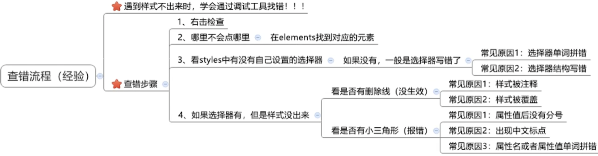

# Google debug tool

Press F12 or the right mouse button in Google Chrome -> Check

If the right CSS has a yellow triangle, there is an error

Select the number in CSS such as width and then press the keyboard up and down to adjust the size

You can also directly write CSS by pressing the tab in the CSS area

Tick: click to cancel the use of a line of CSS
