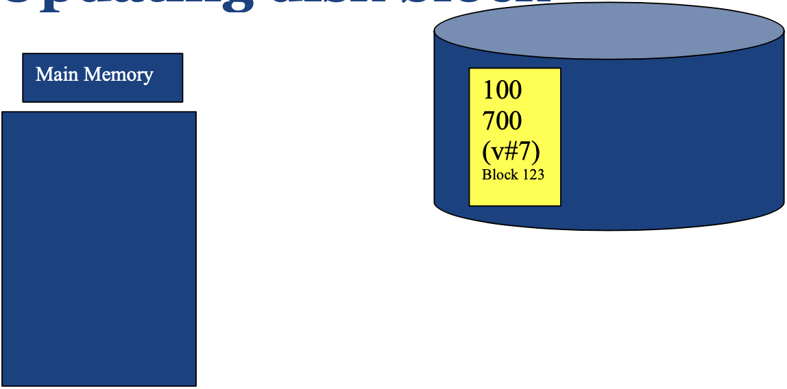
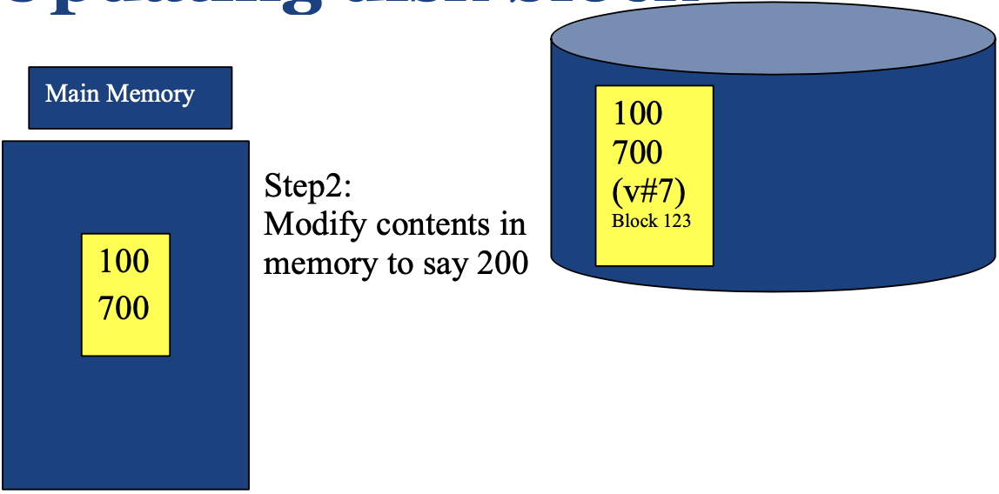
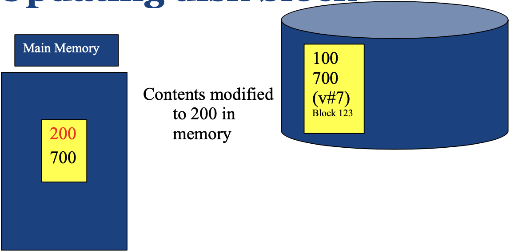
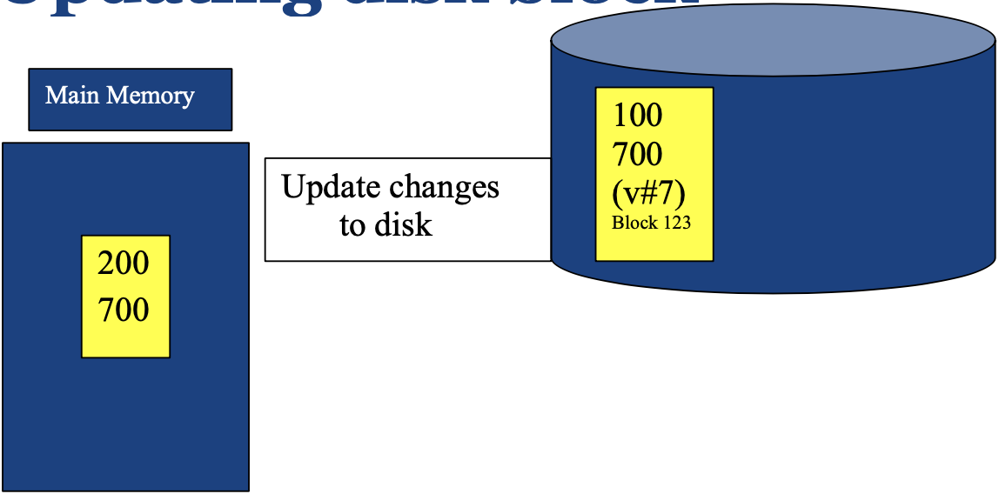

# Database Performance Metrics
The performance of a database system is evaluated based on:
1. **Efficiency (Speed)**
2. **Effectiveness**
3. **Security & Reliability**

## Efficiency
Efficiency of a database system is influenced by both hardware and software aspects:
- **Hardware**
  - Disks and I/O bandwidth
  - Main memory
  - Number of processors
  - Communication network
  - Type of architecture
- **Software/DB Tuning**
  - Types of DB
  - Indexing
  - Query optimisation
## Effectiveness
Effectiveness of a database system is determined by:
- Concurrent users: Users reading and writing over the same data
- Transactions: Required tasks are all done together
## Reliability
Reliability of a database system is ensured by:
- Crash recovery
  - Hardware:
    - Arrangement of multiple disks
    - Voting among multiple disks/modules
    - Disk block write
- Fault tolerance
- Data duplication

# Hard Disk Drive

A **hard disk drive (HDD)** is a crucial component of computing systems that provides data storage. Its structure comprises of several key elements:

- **Platter**: The entire circular disk.
- **Disk Sector**: The blue shaded area in the image above is one such example. Sectors are the smallest accessible units on a disk.
- **Track**: These are the circular rings on the platter. The red highlighted area in the image above is an example of a track.
- **Cluster**: This refers to a group of tracks and sectors, as demonstrated by the green shaded area in the image.
- **Actuator Arm**: The component that moves the head to the required position.
- **Head**: This component is responsible for reading and writing data on the disk.

Note that the disk rotates at high speed, allowing the head to read and write data at different locations.

## Disk Access Time in HDD
The formula to calculate the disk access time is as follows:

$$
\text{Disk Access Time} = \text{Seek Time} + \text{Rotational Delay} + \frac{\text{Transfer Length}}{\text{Bandwidth}}
$$

Where:
- **Seek Time**: This is the time taken by the head to move from its current position to the desired track. Also known as seek latency.
- **Rotational Delay**: The time the disk takes to rotate and bring the desired sector under the head. This is also referred to as rotational latency.
- **Transfer Length**: This refers to the amount of data to be transferred. The units for this measure can vary, such as KB, MB, GB, etc.
- **Bandwidth**: This measures the amount of data that can be transferred within a given timeframe. Its unit is Storage/Time (e.g., 4MB/S).

### Exercise
What is the Disk access time for a transfer size of 4KB, when average seek time is 12 ms, rotation delay 4 ms, transfer rate 4MB/sec?
$12ms + 4ms + \frac{4KB}{4MB/S \times 1000KB/MB}\times1000ms/S = 17ms$.

# Solid-State Drives (SSD)
Solid-State Drives (SSDs) are a type of storage device that do not have any moving parts
- **No seek/rotational latency**
- No start-up times
- Silent operation
- Faster random access times

However, SSDs also have their drawbacks. They are relatively more expensive and have certain read/write limitations. For instance, SSDs tend to be slower when overwriting data.

## Disk Access Time in SSDs
The formula to calculate the disk access time is as follows:
$$
\text{Disk Access Time} = \frac{\text{Transfer Length}}{\text{Bandwidth}}
$$

# Memory Hierarchy

- Reg: Register
- The cache, both on-chip and off-chip, facilitates faster access by reducing the frequency of hard disk accesses. The unit of measurement for cache is typically in MB. 
- Main Memory: If the system is shut down, data stored in the main memory (but not in the hard disk) will be lost. The unit of measurement for Main Memory is typically in GB.
- Hard Disk: The unit of measurement is usually in TB.
- Speed: Cache > Main Memory > Hard Disk
- Storage Capacity: Cache (in MB) < Main Memory (in GB) < Hard Disk (in TB)
- Access Sequence: Data is first requested from the cache, if not found, then from the main memory, and if still not found, finally from the hard disk.

## Effective Memory Access Time
The effective memory access time (EA) can be calculated using the following formula:

$$
EA = H \times C + (1 - H) \times M
$$

where:
- $H$ is the hit ratio (the percentage probability of finding data in the cache)
- $C$ is the cache access time
- $M$ is the memory access time
Please note that here we are referring to the L1 and L2 caches as shown in the image. This is different from the cache embedded in the hard disk, which we will discuss later.

Why don't we have larger caches? 
1. They are expensive.
2. If the processor and the cache are not on the same chip, the access time increases.

## Effective Disk Buffer Access Time
The disk cache is embedded in the disk and is different from the cache in the memory hierarchy. In other words, it's NOT the L1 or L2 cache shown in the image. It is part of the hard disk!
The effective disk buffer access time can be calculated using a similar formula:

$$
EA = HB \times BC + (1 - HB) \times D
$$

where:
- $HB$ is the hit ratio of the disk buffer
- $BC$ is the buffer access time
- $D$ is the disk access time

### Example
e.g., Assume disk access time is S, buffer access time is C, hit ratio is H, and S = 1000C. What is the effective access time, EA, expressed as a multiple of C when H = 30%?

$EA = 30\% \times C + (1 - 30\%) \times S = 0.3C + 0.7 \times 1000C = 700.3C$

# Database Types

## Simple File
- **Definition**: A data storage system where data is stored as a plain text file. Each line represents one record, with fields separated by delimiters (e.g., commas or tabs).
- **Strengths**: Fast for simple applications.
- **Weaknesses**: 
  - Less reliable 
  - Slow for complex applications. 
  - Requires additional code development for features that exist in relational databases. 
  - Concurrency problems for maintainging.
- **Use Cases**: Suitable for simple applications where speed is a priority.

## Relational Database Systems (RDBS)
- **Definition**: 
  - A data storage system where data is stored as a collection of tables (relations) consisting of rows and columns. 
  - Tables in a database are related using primary/foreign key relationships. Primary key could be combination of items. 
- **Strengths**: 
  - Very reliable, 
  - application independent optimisation, 
  - well suited to many applications, 
  - very fast due to large main memory machines and SSDs.
- **Weaknesses**: Can be slow for some simple applications.
- **Use Cases**: Suitable for applications requiring high reliability and speed, and those that can benefit from application independent optimisation.

## Object Oriented Database Systems (OODB)
- **Definition**: A data storage system where data is stored in the form of 'objects' directly, similar to Object Oriented Programming (OOP).
- **Strengths**: Reliable, well suited for applications requiring complex data.
- **Weaknesses**: Can be slow on some applications, limited application independent optimisation.
- **Use Cases**: Suitable for applications requiring complex data structures and methods.

## NoSQL Databases - Key-value Storage
- **Definition**: Stores data as a collection of key–value pairs, where each key is unique. Atomic updates at Key-value pair level (row update) only
- **Use Cases**: building very fast, highly parallel processing of
large data - MapReduce and Hadoop are examples

## Deductive Database Systems (DDBS)
- **Definition**: A database system that can make deductions based on rules and facts stored in the database.
- **Strengths**: Most of the application can be developed entirely using DDBS.
- **Weaknesses**: Many applications do not require the expressive power of these systems.
- **Use Cases**: Applications that require rule-based deductions.

# Database Architectures
## Centralized (Client-Server) Database Architecture
- **Description**: 
  - The central server is with database in one location. 
  - The client and server can be in different locations.
- **Advantages**: 
  - Suitable for simple applications, 
  - easy to manage, 
  - simple system administration, 
  - effective optimization process.
- **Disadvantages**: May not scale well, limited to one location.
- **Use Cases**: Suitable for applications that can be managed centrally, such as PC/Cluster Computing/data centres.

## Distributed Database Architecture
- **Description**: 
  - Data is distributed across several nodes in different locations.
  - Communicate with each other using network. 
- **Advantages**: 
  - Scalable, can handle large data sets, databases can be in different locations
  - provides concurrency, recovery, and transaction processing.
- **Disadvantages**: 
  - System administration and crash recovery are difficult, 
  - potential **inconsistency** due to data replication.
- **Use Cases**: Suitable for large-scale applications that require data distribution and concurrency.

## World Wide Web (WWW) Database Architecture
- **Description**: In the WWW database architecture, data is stored in many locations with several owners of data.
- **Advantages**: Very convenient to access and share data, wide data availability.
- **Disadvantages**: 
  - Has security issues, extreme levels of administration issues.
  - no guarantee on availability or consistency, 
  - ineffective optimization process, 
- **Use Cases**: Suitable for applications that require wide data availability and can tolerate inconsistency.

## Grid Database Architecture
- **Description**: In a grid database architecture, data and processing are shared among a group of computer systems which may be geographically separated.
- **Advantages**: 
  - High processing capability, 
  - access at different locations, 
  - shared data and processing.
- **Disadvantages**: Similar issues to distributed databases
  - less used nowadays, 
  - administration done locally by each owner, 
  - reliability and security not well developed or studied.
- **Use Cases**: Scientific applications.

## Peer-to-Peer (P2P) Database Architecture
- **Description**: Data and processing are shared among a group of computer systems which may be **geographically separated**. **Nodes can join and leave the network at will**. Administration is done by owner.
- **Advantages**: Suitable when the nodes of the network cannot be planned in advance, or some may leave and join frequently, shared data and processing, flexible network membership.
- **Disadvantages**: Difficult to design transaction models due to flexible network membership, applications are usually limited to simple file sharing.
- **Use Cases**: Specific applications, such as scientific applications, where nodes need the flexibility to join and leave the network.

## Cloud-Based Database Architecture
- **Description**: Cloud-based database architecture offers online computing, storage, and a range of new services for data and devices that are accessible through the Internet. 
- **Advantages**: 
  - Pay as you go, On-demand resources, cost-effective, 
  - maintenance done externally by the cloud provider, 
  - user pays for the services just like phone services, electricity, etc., huge potential for developing applications with minimal infrastructure costs.
- **Disadvantages**: Has some privacy and confidentiality issues – but most trusted providers can address any issues emerging on this type relatively easily, e.g., Amazon etc., dependence on internet connectivity.
- **Use Cases**: Suitable for applications that require on-demand resources and services, and can benefit from the pay-as-you-go model.

# Basic Probability and Mean Time to Event

The probability of an event and the mean time to an event are fundamental concepts in understanding system reliability. Here are some key formulas:

- Probability of an event A happening in a certain period: $P(A)$
- Probability of both events A and B happening in that period (assuming A and B are independent events): $P(A \text{ and } B) = P(A) \times P(B)$
- Probability of either event A or B happening in that period: $P(A \text{ or } B) = P(A) + P(B) - P(A \times B)$ (assuming $P(A)$ and $P(B)$ are very small)
- Mean time to event A: $MT(A) = \frac{1}{P(A)}$
- If events A and B have mean times $MT(A)$ and $MT(B)$, then the mean time to the first event $MT(A \text{ or } B) = \frac{1}{P(A \text{ or } B)}$

If there are $n$ events, each with the same probability $p$, then:

- Probability that one of the events occur: $n \times p$ (assuming $p$ is small)
- Mean time to one of the events (i.e., mean time to the first event): $\frac{1}{n \times p} = \frac{1}{p} \times \frac{1}{n} = m \times \frac{1}{n} = \frac{m}{n}$(where $m = \frac{1}{p}$ is the mean time to an event)

# Module Availability
Module availability is the ratio of service accomplishment to elapsed time.

It can be calculated as:
$$\text{Module Availability} = \frac{MTTF}{MTTF + MTTR}$$
where:
- $MTTF$ is the Mean Time To Failure, which is **up time** before a failure happens
- $MTTR$ is the Mean Time To Repair, which is **down time** after a failure happens

# Redundant Array of Independent Disks (RAID)

RAID is a method of combining multiple disks as a unit for fault tolerance or performance improvement, or both, of a database system.

For graphs below, we use the following conventions:
- We use b for Bit; B for byte; 8 continuous bits = 1 byte
- A for block, 4000/8000 continuous bytes = 1 block 
- p for parity, Parity (or check bits) are used for error detection
  - P0 is parity for bytes B0 and B1, $P_i = B_{2i} \oplus B_{2i+1}$, here $\oplus$ is the exclusive-or operator

Please note that the RAID levels are not exhaustive and there are other RAID levels such as RAID 10, RAID 50, etc. that combine the features of the basic RAID levels for additional redundancy or performance.

Baseline: One Disk
- MTTF (Mean Time To Failure): 1/p
- p: Probability of failure of a disk, MTTF(disk) = 1/p

## RAID 0 (Block Level Striping)
<image alt="RAID0" src="raid0.png" width=300/>

- Data is split into blocks and spread across multiple disks.
- Note the data is stored in a zig-zag way (A0, A2, A4, A6 in Disk 1, A1, A3, A5, A7 in Disk 2)
- Advantages: Balanced I/O of disk drives, throughput approximately doubles. It has double throughput compared to one disk.
- Drawbacks: Any disk failure is catastrophic, and MTTF reduces by a factor of 2. The probability of failure is $P(failure) = P(A) + P(B) = 2p$. Thus, MTTF(Raid0) = 1/(2p) = 1/2 x MTTF(disk).

## RAID 1 (Mirroring)
<image alt="RAID1" src="raid1.png" width=300/>

- Data is duplicated across two or more disks.
- Advantages: Higher read throughput, continues to operate as long as one disk is functional, MTTF increases substantially. It has better fault tolerance, as it fails only if both disks fail.
- Drawbacks: Lower write throughput, half storage utilization, requires double storage. The probability of failure is $P(failure) = P(A and B) = P(A) * P(B) = p^2$. Hence, $MTTF(RAID1) = (1/p)^2 = MTTF(disk)^2$.

## RAID 2 (Bit Level Striping)
<image alt="RAID2" src="raid2.png" width=300/>

- Data is split into bits and spread across multiple disks.
- Advantages: Higher transfer rate. Similar to RAID 0, but stores data at the bit level.
- Drawbacks: MTTF reduced by half as in RAID 0, rarely used. MTTF for RAID 2 is the same as that for RAID 0.

## RAID 3 (Byte Level Striping)
<image alt="RAID3" src="raid3.png" width=300/>

- Data is split into bytes and spread across multiple disks, with a parity byte for error detection. 
- Advantages: Higher transfer rate than RAID 0, MTTF increases substantially as **one disk failure can be recovered from the data of the other disks**. The system fails if any two of the three disks fail.
- Drawbacks: Rarely used. The probability of failure is $P(failure) = {3 \choose 2}p^2 = 3p^2$. Hence, $MTTF(RAID3) = 1/3 \times (1/p)^2 = 1/3 \times MTTF(disk)^2$. Compared to RAID1, $MTTF(RAID3) = MTTF(RAID1)/3$, which indicates RAID1 is better.

## RAID 4 (Block Level Striping)
<image alt="RAID4" src="raid4.png" width=300/>

- Data is split into blocks and spread across multiple disks, with a dedicated disk for parity blocks.
- Advantages: Higher throughput, MTTF increases substantially. The throughput is higher as the data is stored at the block level.
- Drawbacks: Very slow writes, the dedicated parity disk has more writes as parity needs to be updated for every data write.

## RAID 5 (Block Level Striping with Parity Striping)
<image alt="RAID5" src="raid5.png" width=300/>

- Data and parity blocks are both split and spread across multiple disks. Similar to RAID 4, but Parity is distributed among all disks.
- Advantages: Higher throughput, slower writes but better than RAID 4 as parity bits are distributed among all disks and the number of write operations on average equal among all disks, MTTF increases substantially. The write speed is better compared to RAID 4.
- Drawbacks: Complex to implement and manage.

## RAID 6 (Block Level Striping with Double Parity)
<image alt="RAID6" src="raid6.png" width=500/>

- Similar to RAID 5 except two parity blocks are used. This is an extension of RAID 5 with two more disks.
- Advantages: Any two disk failures can be safe to recover the data, reliability is of the order of $MTTF^3/10$. Parities are stored in a way to insure recovery in the case of two failures, providing higher throughput.
- P0 and P1 are parity blocks for blocks A0, A1 and A2. These are computed in such way that any two disk failures can be safe to recover the data.
- Drawbacks: More complex parity calculation, slower writes due to double parity. The probability of failure is $P(Failure) = {5 \choose 3}p^3 = 10p^3$, leading to a longer MTTF: $MTTF = 1/10 x (1/p)^3 = 1/10 x MTTF(disk)^3$.

## Choosing RAID Level
Tradeoff here: 
**Higher throughput at the cost of increased vulnerability to failures.**
When choosing the suitable RAID level, the following factors should be considered:

- **Reliability**: The ability of the system to handle and recover from hardware failure.
- **Performance**: The speed at which data can be read from or written to the disk.
- **Storage Utilization**: The amount of storage space that is effectively used.
- **Price/Number of Disks**: The cost and the number of disks required.

# Fault Tolerance by Voting
### Definition of majority here
if n nodes, then:
- if n is odd, majority means $\frac{(n + 1)}{2}$
- if n is even, majority means $\frac{n}{2} + 1$

## Failvote
The system works as long as majority of them are working, stops if there are no majority agreement.

e.g. 3 node. 
- Majority = (3 + 1) / 2 = 2, 
- 1 is down, 2 is up, then system works
- 2 is down, 1 is up, then system stops

e.g. 4 node
- Majority = 4 / 2 + 1 = 3
- 1 is down, 3 is up, then system works
- 2 is down, 2 is up, then system stops

## Failfast
The system stop if there are no majority of available modules/nodes. Here available means not down.

e.g. 3 node. 
- 1 is down, 2 is up, Majority = 2 / 2 + 1 = 2, then system works
- 2 is down, 1 is up, Majority = (1 + 1) / 2 = 1, then system stops as **nothing to compare**

e.g. 4 node
- 1 is down, 3 is up, Majority = (3 + 1) / 2 = 2, then system works
- 2 is down, 2 is up, Majority = 2 / 2 + 1 = 2, then system works
- 3 is down, 1 is up, Majority = 1, then system stops as **nothing to compare**

## Supermodule
The system stops if all nodes are down, a Supermodule can still function even when only one disk is available. This adaptability allows for significant fault tolerance.

### Fault Tolerance with Repair

In systems with repair of modules, the faulty equipment is repaired with an average time of MTTR (mean time to repair) as soon as a fault is detected. Sometimes, MTTR is just the time needed to replace the faulty module. Typical values for recent disks are:

- MTTR = Few hours (assuming we stock spare disks) to 1 Day 
- MTTF = 750000 hours (~ 86 years) [hard fault]

The probability of a particular module not being available is given by $\frac{MTTR}{MTTF+MTTR}$, which approximates to $\frac{MTTR}{MTTF}$ if MTTF >> MTTR.

### Fault Tolerance of a Supermodule with Repair

The probability that $n-1$ modules are unavailable, denoted as $P_{n-1}$, is given by $\left(\frac{MTTR}{MTTF}\right)^{n-1}$.

The probability that a particular $i^{th}$ module fails, denoted as $P_f$, is $\frac{1}{MTTF}$.

The probability that the system fails with a particular $i^{th}$ module failing last equals $P_f \times P_{n-1} = \frac{1}{MTTF} \times \left(\frac{MTTR}{MTTF}\right)^{n-1}$.

The probability that a supermodule fails due to any one of the $n$ modules failing last, when other $(n-1)$ modules are unavailable, is $\frac{n}{MTTF} \times \left(\frac{MTTR}{MTTF}\right)^{n-1}$.

The values for this probability differ for failvote and failfast systems.

# Communication Reliability

In a reliable message passing system, the communication between two nodes can be represented as a series of states. The key components of this system include:

- **Out**: Number of messages sent
- **In**: Number of messages received
- **Ack**: Number of acknowledgements

For example, the communication between Node A and Node B can be represented as follows:
<image alt="State 0: Node A (In:6, Ack:3, Out:3), Node B (Out:6, Ack:6, In:3)" src="com_01.png" width=600/>
<image alt="State 1: Node B sends message 7, Node A (In:6, Ack:3, Out:3), Node B (Out:7, Ack:6, In:3)" src="com_02.png" width=600/>
<image alt="State 2: Node A sends acknowledge 7, Node A (In:7, Ack:3, Out:3), Node B (Out:7, Ack:6, In:3)" src="com_03.png" width=600/>
<image alt="State 3: Node B receives acknowledge 7, Node A (In:7, Ack:3, Out:3), Node B (Out:7, Ack:7, In:3)" src="com_04.png" width=600/>
In above example, if B did not receive 7: ack, B will wait for some time, then send 7:msg again. Keep doing this until receive 7: ack. 

If two nodes want to communicate with each other, how to make sure the data sent is correctly?
- Stable storage – data in stable storage is durable and not be lost easily 
- Acknowledgement info

# Atomicity
All changes to data are performed as if they are a single operation. That is, all the changes are performed, or none of them are. 

e.g., A transfer $100 to B.
- A -100
- B +100
- log A transfer $100 to B.

# Atomic Disk Write – Duplex Write

- Each block of data is written in two places sequentially
- If one of the writes fail, system can issue another write
- Each block is associated with a version number. The block with the latest version number contains the most recent data.
- While reading - we can determine error of a disk block by its **CRC**.
- It always guarantees at least one block has consistent data.

## Example
State 0: Main Memory (empty), Hard Disk (100 700 (v#7) Block 123)

State 1: Operation: read, Main Memory (100 700), Hard Disk (100 700 (v#7) Block 123)

State 2: Operation: Modify contents in memory to say 200, contents modified to 200 in memory, update changes to disk, Main Memory (200 700), Hard Disk (100 700 (v#7) Block 123)

State 3: Operation: Write to disk in a different block, Written to a different block, Next update will take place to Block 123 and the version number V#7 will be changed to v#9. (Two different physical disks can be used for duplex writes as well), Main Memory (200 700), Hard Disk (100 700 (v#7) Block 123; 200 700 (v#8) Block 475)

# Logged write
- similar to duplex write, except one of the writes goes to a log. 
- Log – durable & can be read quickly
- This method is very efficient if the changes to a block are small. 

# CRC Calculation
To compute an n-bit binary CRC, follow these steps:

1. **Padding**: Add n zero bits as 'padding' to the right of the input bits. For example, a 3-bit CRC with a polynomial $x^3 + x + 1$ should add 000 to the right ofthe input bits.
2. **Compute Polynomial**: Compute the (n + 1)-bit pattern representing the CRC's divisor (called a "polynomial"). For example, a 3-bit CRC with a polynomial $x^3 + x + 1$ would have the coefficients 1, 0, 1, and 1. i.e. $1 \times x^3 + 0 \times x^2 + 1 \times x^1 + 1 \times x^0$

3. **Position Polynomial**: Position the (n + 1)-bit pattern representing the CRC's divisor underneath the left-hand end of the input bits.

4. **Perform XOR Operations**: The algorithm acts on the bits directly above the divisor in each step. The result for each iteration is the bitwise XOR of the polynomial divisor with the bits above it. The bits not above the divisor are copied directly below for that step. The divisor is then shifted one bit to the right, and the process is repeated until the bits of the input message become zero. The remainder will be the value of the CRC function.

Example:

