# Database Engine (Database management system)

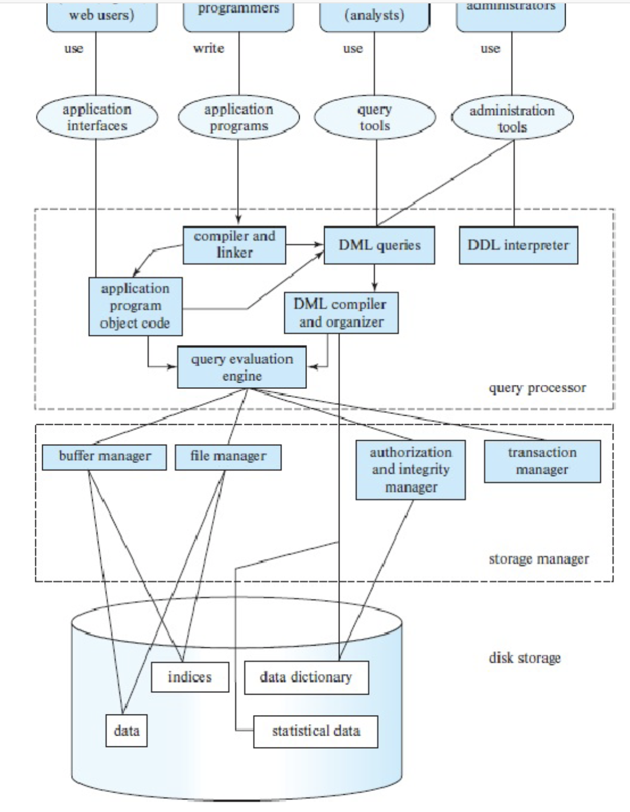
In the image shown, only the: query evaluation engine, file manager, buffer manager, indices and data will affect performance.

# Relational Algebra & Join

Table – “Employee”
|ID|Name|Age|
|---|---|---|
|1001|A|25|
|1002|B|32|
|1003|C|19|
|1004|D|27|
|1005|E|40|
|1006|F|36|

Table - "Manager"

| ID   | Department |
| ---- | ---------- |
| 1001 | a          |
| 1003 | b          |
| 1004 | c          |
| 1006 | d          |

Table - "Location"

| ID   | Country   | City      |
| ---- | --------- | --------- |
| 1001 | China     | Beijing   |
| 1002 | Australia | Melbourne |
| 1004 | China     | Shanghai  |
| 1006 | Australia | Sydney    |

- Attribute (column)
- Record (row)
- Query
  - Please tell me the name of all managers located in Australia => B, D, E, F
  - please tell me the name of all employees who is over 25 => join, => A, C, D, F
    ```
    Select Name
    from (Employee inner join Manager) On Employee.ID = Manager.ID;
    ```
  - please tell me the name of all managers Join => join => F
    ```
    SELECT A.Name
    FROM Employee A
    INNER JOIN Location L ON A.ID = L.ID
    WHERE L.Country = 'Australia';
    ```

## Join

Join is a very common and very expensive operation

Different types of join: inner join, outer join... (we focus on inner join)
Natural join: a join operation that can be performed of a column that is common in two tables.

$r \bowtie_θ s$

- r: **outer** relation
- s: **inner** relation
- r and s are two tables
- Theta θ is the common column.

## Relational Algebra Expressions

### Overview

```sql
Select A1, A2, ..., An
An From r1, r2, ..., rm
Where P
```

.... Is same as the following in relational algebra expression:

$$
\Pi_{A_1, A_2, ..., A_n}(\sigma_P(r_1 \times r_2 \times ... \times r_m))
$$

### Example

```sql
Select *
From r1
Inner Join r2 on T1.a = T2.b
```

```sql
SELECT salary
FROM Employees
INNER JOIN Managers
ON Employees.EmpID = Managers.EmpID;
```

.... Is same as the following in relational algebra expression:

$$
\Pi_{\text{salary}}(\sigma_{\text{Employees.EMPID}=\text{Managers.EMPID}}(\text{Employees} \times \text{Managers}))
$$

### Example

```sql
Select salary
From Employees Where salary < 60000
```

Is same as the following in relational algebra expression:

$$
\Pi_{salary}(\sigma_{salary<60000}(Employees))
$$

Can also be written as:

$$
\sigma_{salary < 60000} (\Pi_{salary} (Employees))
$$

# Two types of Join Algorithm

## How data is stored in disk?

- Files – A database is mapped into different files. A file is a sequence of records.
- Data blocks – Each file is mapped into fixed length storage units, called data blocks (also called logical blocks, or pages)

e.g., size of each record: 55 byte; fixed size of 1 data block: 4096 byte

$4096 \div 55 = 74.47$, note that one record cannot be splitted into 2 blocks, so each block can only store 74 records

## Nested Loop Join

```sql
for each tuple tr in r do begin
    for each tuple ts in s do begin
        test pair (tr,ts) to see if they satisfy the join condition theta (θ)
        if they do, add tr • ts to the result.
    end
end
```

- Requires no indices because it checks everything in r against everything in s
- Expensive since it **examines every pair of tuples** in the two relations.
- Could be cheap if you do it on two small tables where they fit to main memory (disk brings the whole tables with first block access).
- In the worst case, if there is enough memory only to hold one block of each table, the estimated cost is
  - $n_r \times b_s + b_r$ page access, and
  - Here $n_r$ is: for each record in r, we need to find $b_s$. Once we find the starting point of $b_s$ we can sequentially read.

## Page-Oriented Nested-Loop Join

```sql
for each page Br of r do begin
    for each page Bs of s do begin
        for each tuple tr in Br do begin
            for each tuple ts in Bs do begin
                Check if (tr,ts) satisfy the join condition
                if they do, add tr • ts to the result.
            end
        end
    end
end
```

- Variant of nested-loop join in which every page of inner relation is paired with every page of outer relation.
- In the worst case, if there is enough memory only to hold one page/block of each table, the estimated cost is
  - $b_r + (b_r \times b_s)$ Page access

## Example of simple and page-oriented calculation

Let’s see an example with the following bank database:

- Number of records of customer: 10,000 depositor: 5000
- Number of Pages of customer: 400 depositor: 100

### Simple Nested-Loop Join

- With depositor as the outer relation: 100 + (5000 ∗ 400) = 2,000,100 page access,
- With customer as the outer relation: 400 + (10000 ∗ 100) = 1,000,400 page access

### Page-oriented Nested-Loop Join

- With depositor as the outer relation: 100 + (100 ∗ 400) = 40100 page access,
- With customer as the outer relation: 400 + (400 ∗ 100) = 40400 page access

# Query Cost & Query Optimization

1. Parse query to relational algebra expression
2. Use optimizer and get execution plan
3. execute and get output

## Transaction Processing at core of RDBS

Definition: A transaction is a collection of operations that need to be performed as a complete unit. (e.g., A transfers $100 to B)

Structure of a transaction

```
begin_transaction()
    <sequence of operations to be performed>
    if (successful)
        commit_trans()
    else
        rollback()
end_transaction()
```

## Transaction Models - ACID Properties

- Atomicity: all the changes are performed, or none of them are performed. Achieved by Duplex Write
- Consistency: any data written to the database must be valid according to all defined rules
  - e.g., student ID is the **primary key**, then no duplicate student ID
  - What is ‘consistent’, depends on the application and context constraints.
  - primary key is the only attribute that distinguishes records, i.e. no same primary keys among records.
- Isolation: transaction are executed as if it is the only one in the system
  - e.g., in an application that transfers funds from one account to another, the isolation ensures that another transaction sees the transferred funds in one account or the other, but not in both, nor in neither.
- Durability: the system should tolerate system failures and any committed updates should not be lost.

ACID properties might sometimes conflict with each other, yet, the system must still ensure:

- fast access to large amounts of data,
- provide a secure and stable repository when things fail,
- offer standard interfaces for data definition and manipulation,
- manage multi-user access in an orderly manner,
- allow convenient ways for report production and browsing,
- and ease data loading, archiving, and performance tuning.

## Query Optimisation Example - 2021Win Question 10

In the following figure we see two equal expressions a query optimizer is looking at to decide which one to run eventually:
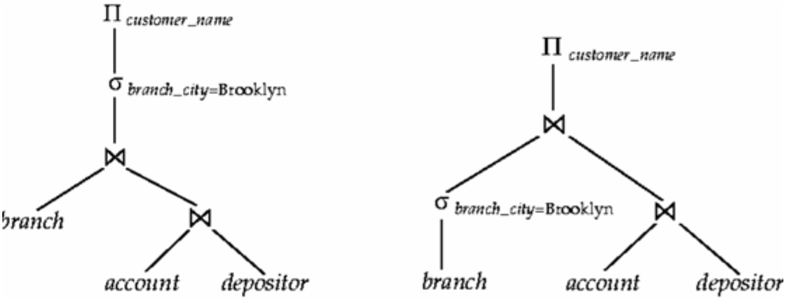

$$
\Pi_{customer\_name}\sigma_{branch_city=Brooklyn}\bowtie(branch, \bowtie(account, depositor))
$$

$$
\Pi\bowtie(\sigma_{branch\_city=Brooklyn}, \bowtie(account, depositor))
$$

Please describe which one of these plans the optimizer should choose and why. Is this choice true in general? If so, where in query optimization such an observation can be used? Briefly explain.

**Answer**: In this case, it would be advantageous for the optimizer to choose the second plan. By applying the selection operation (σ) to the branch table first, it can significantly reduce the size of this table before executing the join operation (⨝). This would likely result in less computational resources required for the join operation, thereby making the overall query execution more efficient.

## How do query optimizer make the choices?

Steps in cost-based query optimization

1. Generate logically equivalent expressions of the SQL statement
2. Annotate resultant expressions to get alternative query plans
3. Choose the cheapest plan based on the estimated cost

## Estimation of plan cost based on:

- Statistical information about tables. Example: number of distinct values for an attribute
- Statistics estimation for intermediate results to compute cost of complex expressions
- Cost formulae for algorithms, computed using statistics again

## How to generate alternatives?

- Query optimizers use equivalence rules to systematically generate expressions equivalent to the given expression
- Note: SQL does not give this power and hence relational algebra is use which is procedural
- One can generate all equivalent expressions exhaustively
- The above approach is very expensive in space and time though (In query optimizer some expressions are not generated if they are for sure very complex)

## How to choose?

- Must consider the interaction of evaluation techniques when choosing evaluation plans
- Choosing the cheapest algorithm for each operation independently may
  not yield best overall algorithm
- E.g., merge-join may be costlier than hash-join, but may provide a sorted output which could be useful later (the sorted result may be benefit to the later operation)

## In Real Life

- Practical query optimizers incorporate elements of the following two broad approaches:
  1. Search all the plans and choose the best plan in a cost-based fashion.
  2. Uses heuristics to choose a plan.
- Systems may use heuristics to reduce the number of choices that must be made in a cost-based fashion (because cost-based optimization is expensive)
- Heuristic optimization transforms the query-tree by using a set of rules that typically (but not in all cases) improve execution performance:
  1. Perform selections early (reduces the number of tuples)
  2. Perform projections early (reduces the number of attributes)
  3. Perform most restrictive selection and join operations (i.e. with smallest result size) before other similar operations
- Some systems use only heuristics, others combine heuristics with cost-based optimization
- Optimizers often use simple heuristics for very cheap queries, and perform exhaustive enumeration for more expensive queries

# Manage Query Cost in Practice

Troubleshooting to manage costs (e.g., Query Store in Microsoft)

(Query store: SQL server management studio for monitoring)

- Identify ‘regressed queries’ - Pinpoint the queries for which execution metrics have recently regressed (for example, changed to worse).
- Track specific queries - Track the execution of the most important queries in real time. (e.g., most frequently asked queries)

When you identify a query with suboptimal performance

- Force a query plan instead of the plan chosen by the optimizer
- Do we need an index? --- quickly find the data in the query
- Enforce statistic recompilation
- Rewrite query? (with parameters)

## Parameter in query

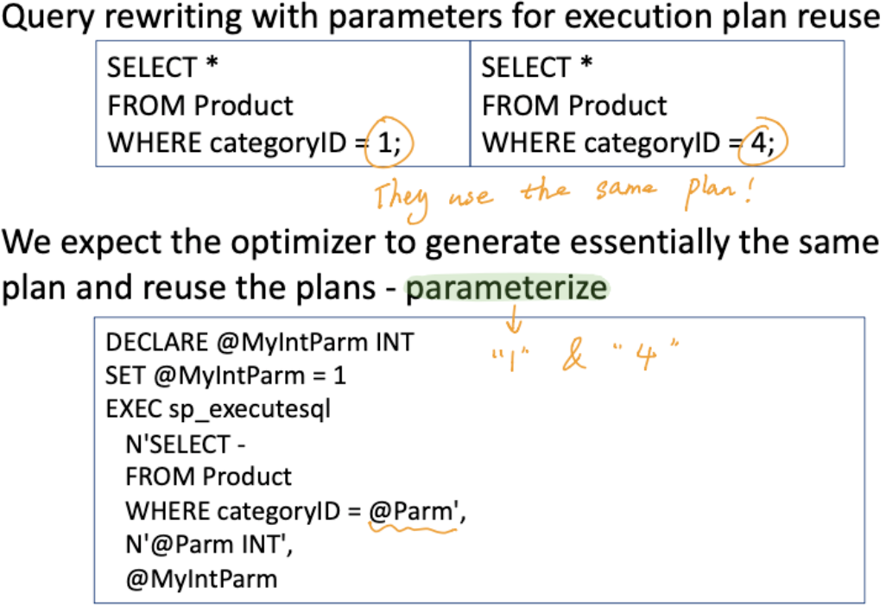

## To further lower query cost

- Store derived data
  - When you frequently need derived values
  - Original data do not change frequently
- Use pre-joined tables
  - When tables need to be joined frequently
  - Regularly check and update pre-joined table for updates in the original table May still return some ‘outdated’ result (pre-joined tables are not updated)

# Indexing

- DBMS admin generally creates indices to allow almost direct access to individual items (index = indice)
- DBMS must support
  - insert/delete/modify record
  - read a particular record (specified using record id)
  - scan all records (possibly with some conditions on the records to be retrieved), or scan a range of records

## Indexing overview

- Indexing mechanisms used to speed up access to desired data in a similar way to look up a phone book or dictionary
- **Search Key** - **attribute** or **set of attributes** used to look up records/rows in a system like an ID of a person (The ID will take us to get the entire record)
- An index file consists of records (called index entries) of the form search- key, pointer to where data is
- Index files are typically much smaller than the original data files and many parts of it are already in main memory (main memory is faster than disk)

## Indexing makes Disk Access Time become faster through

- records with a **specified value** in the attribute accessed with minimal disk accesses (e.g., Student ID = 101, the index file tells us which data block in disk to go)
- records with an attribute value falling in a specified range of values can be retrieved with a single seek and then consecutive sequential reads (e.g., ID:100-200, find where is the first record (single seek of starting block), then read sequentially)
- Note: not all DB stores sequential data sequentially, so this method may not useful for some DB

## Criteria to choose index – always tradeoff

- Insertion time to index is also important
- Deletion time is important as well
- No big index rearrangement after insertion and deletion
- Space overhead needs to be considered for the index itself
- No single indexing technique is the best. Rather, each technique is best suited to particular applications.

## Types of indices based on search keys

Ordered indices – Search keys are stored in some order

- Clustering index / primary index
- Non-clustering index / secondary index
- Hash indices – Search keys are distributed
- **B+ tree**
- Bitmap index
- Trees for maps
  - Quadtree (k-d tree)
  - R-tree

## Clustering Index / Primary Index

- in a sequentially **ordered file**, the index whose **search key** specifies the sequential order of the file
- The search key of a primary index is usually but not necessarily the **primary key**
  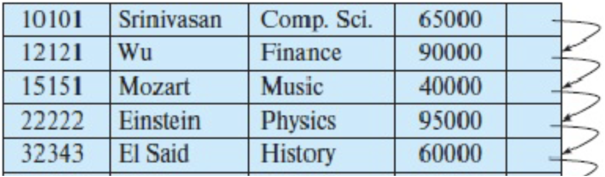
  As shown in graph, the order is sorted

## Non-clustering Index / Secondary Index

- An index whose **search key specifies an order** different from the sequential order of the file
- Secondary indices improve the performance of queries that use keys other than the search key of the clustering index.
  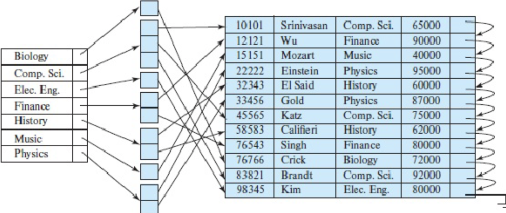
  As shown in graph, the search key here is the major

## Hash indices

- search keys are distributed hopefully uniformly across “buckets” using a “function”
- A hash index organizes the search keys, with their associated record pointers, into a hash file structure. Order is not important.
- Given a key the aim is to find the related record on file in one shot which is important.
- An ideal hash function is **uniform**, i.e., each bucket is assigned the same number of search-key values from the set of all possible values.
- Ideal hash function is **random**, so each bucket will have the same number of records assigned to it irrespective of the actual distribution of search-key values in the file.
- Typical hash functions perform computation on the internal binary representation of the search-key.
  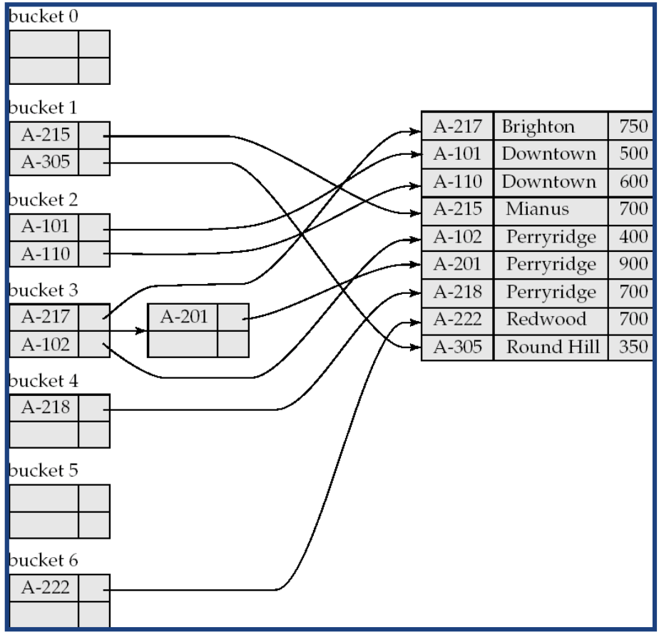
- The expected hash function should return 0-6 evenly since there are 7 buckets.
- Goes to which bucket here determined by Hash function return value, e.g. Hash(A-215) = 1

## Bitmap index

- Records in a relation are assumed to be numbered sequentially from, say, 0
- Applicable on attributes that take on a relatively small number of distinct Values
  - E.g. gender, country, state, ...
  - E.g. income-level (income broken up into a small number of levels such as 0-9999, 10000-19999, 20000-50000, 50000- infinity)
- A bitmap is simply an array of bits
- In its simplest form a bitmap index on an attribute has a bitmap for each value of the attribute
  - Bitmap has as many bits as records
  - In a bitmap for value v, the bit for a record is 1 if the record has the value v for the attribute, and is 0 otherwise
  - Used for business analysis, where rather than individual records say how much of one type exists is the query/important

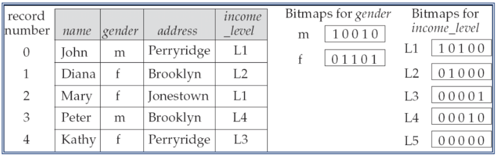
In this graph,

- gender is distinct value which is m or f
- income-level is distinct value, which is L1, L2, ..., L5

## B+ tree

Why?

- Keeping files in order for fast search ultimately degrades as file grows, since many overflow blocks get created. Hence, binary search on ordered files cannot be done.
- Periodic reorganization of entire file is required to achieve this.
- It is similar to a binary tree in concept but with a fan out that is **defined through a number n** e.g. n = 3
- All paths from root to leaf are of the same length (depth)
- Each node that is not a root or a leaf has between ⎡n/ 2⎤ and n children. Note ⎡⎤ means upper limit, ⎡3 / 2⎤ = 2, if n = 3, then the range is 2 - 3.
- A leaf node has between ⎡(n–1)/2⎤ and n–1 values
- Special cases:
  - If the root is not a leaf, it has at least 2 children.
  - If the root is a leaf (that is, there are no other nodes in the tree), it can have between 0 and (n–1) values.

### B+ tree Typical Node

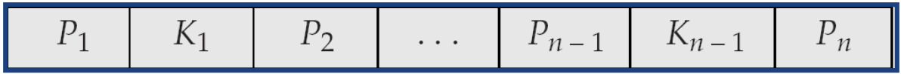

- Ki are the search-key values
- Pi are pointers to children (for non-leaf nodes) or pointers to records or buckets of records (for leaf nodes, which are records)
- The search-keys in a node are ordered K1 < K2 < K3 < . . . < Kn–1
  NOTE: Most of the higher level nodes of a B+ tree would be in main memory already! (leaf node will be in disk)

### Example B+ tree

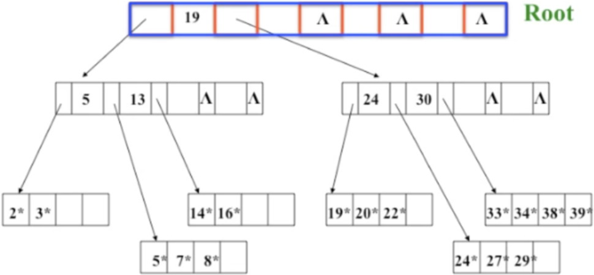
In this graph, the nodes with _ are records, that's why all leaf nodes have _

### Finding all records with a search-key value of k.

1. N=root initially
2. Repeat
   1. Examine N for the smallest search-key value > k.
   2. If such a value exists, assume it is Ki. Then set N = Pi
   3. Otherwise k ≥ Kn–1. Set N = Pn . Follow pointer.
      Until N is a leaf node
3. If for some i, key Ki = k follow pointer Pi to the desired record or bucket.
4. Else no record with search-key value k exists.
   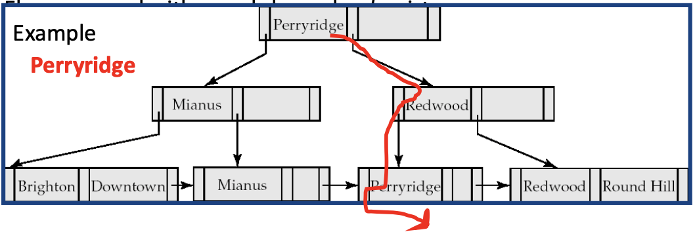
   Note don't get confused by the Perryridge on the root, it is just the search key by chance.

### Run range queries in B+ tree

Range queries find all records with search key values in a given range e.g., from Brandt to Singh
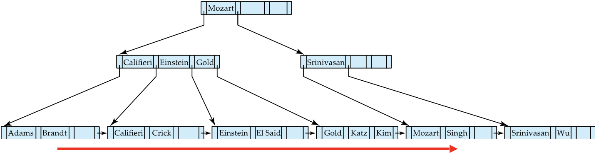

### B+ tree - Insertion (2 types)

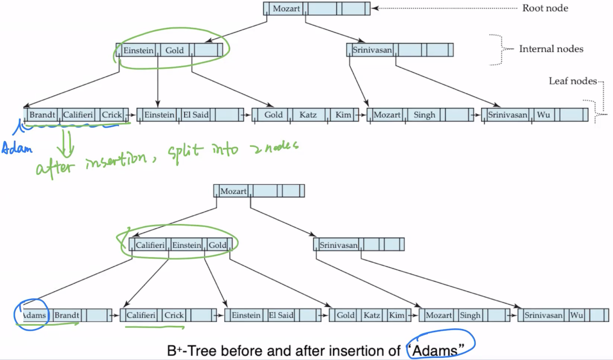
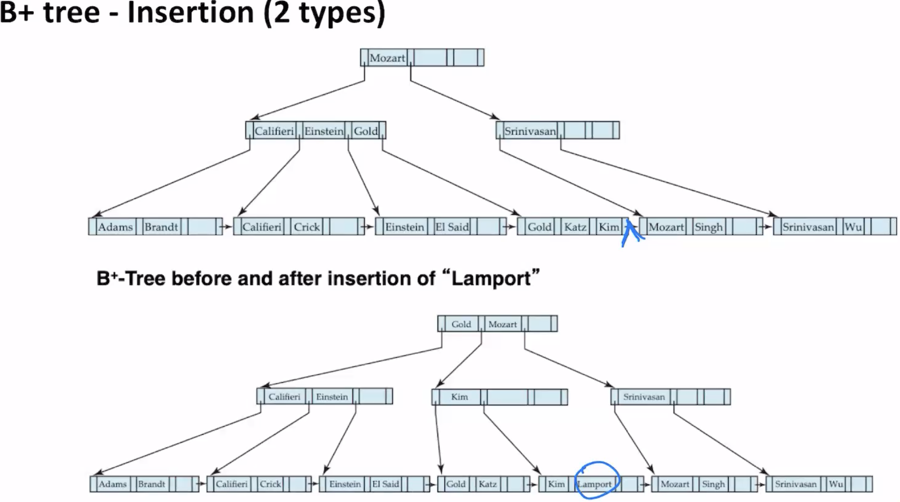
It will split nodes to avoid having leaf node > n–1

### B+ tree - Deletion (2 types)

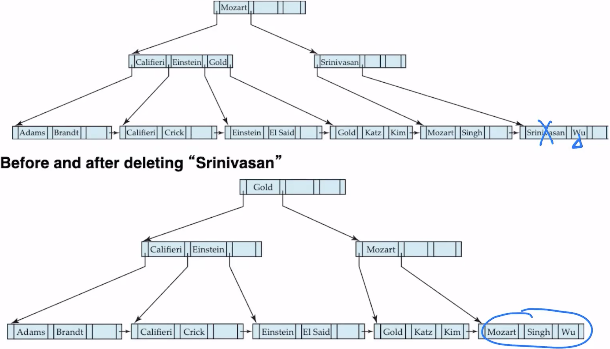
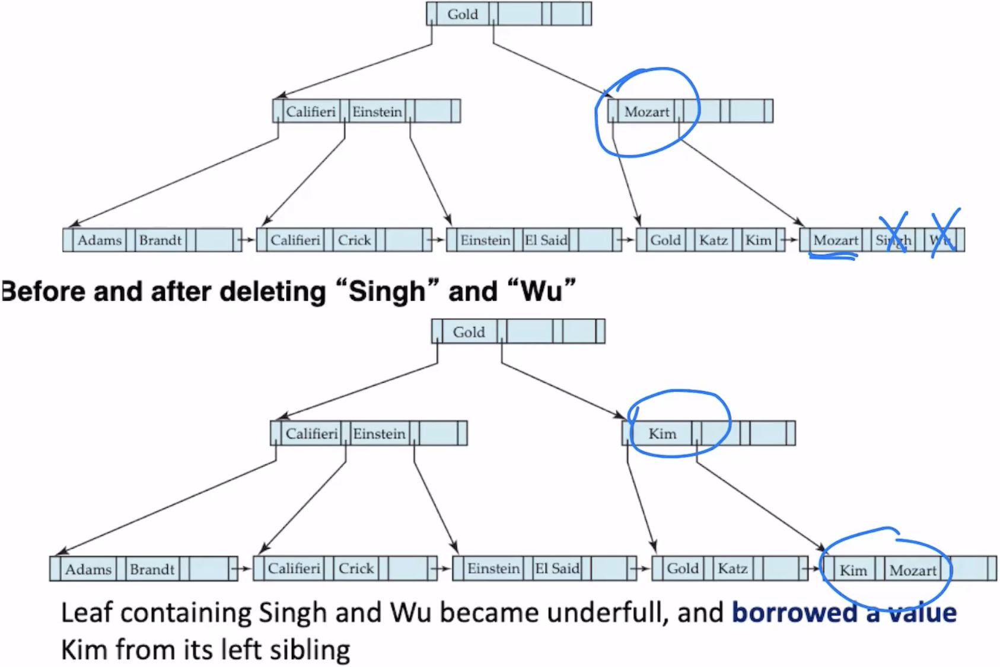
It will merge to avoid having leaf node < ⎡(n–1)/2⎤

### B+ tree – File organization

- Leaf nodes in a B+-tree file organization store records, instead of pointers to children
- Helps keep data records clustered (ordered) even when there are insertions/deletions/updates
- Insertion and deletion or records are handled in the same way as insertion and deletion of entries in a B+-tree index.

### B+ tree Advantages

- Automatically reorganizes itself with small, local changes in the face of insertions and deletions.
- Reorganization of entire file is not required to maintain performance
- Similar to Binary tree in many aspects but the **fan out** is much higher (height of B+ tree is smaller than binary tree)

### B+ tree Disdvantages

- Extra insertion and deletion over head and space over head (reorganisation)

Advantages of B+-trees outweigh disadvantages for DBMSs (B+ trees are used extensively)

## Considering location data (spatial data)

- Unlike things we can access by names, ids, there is a lot of data that exists, and increasingly that requires special indexing
- For example, spatial data requires more complex computations for accessing data,
  - e.g., intersections of objects in space
- There is no trivial way to sort items which is a key issue,
  - e.g., range query on a simple set of items, e.g. all restaurants within 5 KM
  - e.g., a Nearest Neighbour query, e.g. find the nearest restaurant of my location

## Quadtree (for location data - points)

- Each node of a quadtree is associated with a rectangular region of space; the top node is associated with the entire target space.
- Each division happens with respect to a rule based on data type. Each non-leaf nodes divides its region into four equal sized quadrants
- Thus each such node has four child nodes corresponding to the four quadrants and division continues recursively until a stopping condition

### Quadtree – e.g.,

Example: **Leaf nodes** have between zero and **some fixed maximum number** of points (set to 1 in example below)
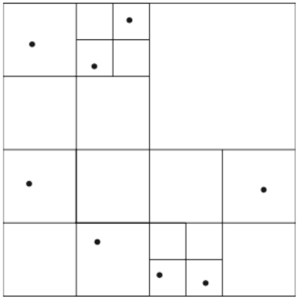
It is keep spliting into squares until no more than n (1 in this example) leaf nodes are inside same square

### Quadtree Tree structure

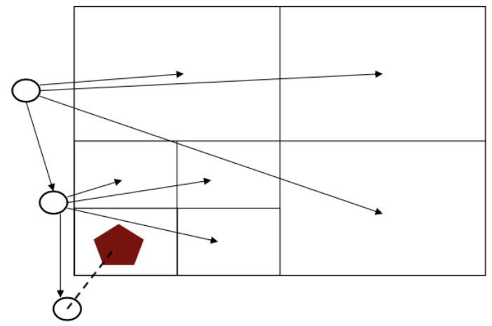

### Quadtree – e.g., run NN (nearest neighbor) query

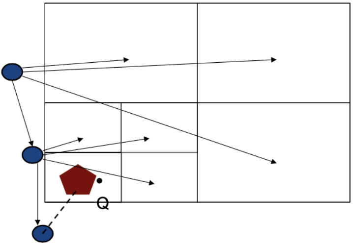

### 2022S1 Exam Question 5 Example

Given the k-d tree below with point data, where black labeled dots represent spatial coordinate data, and the rectangular area is divided into regions with the division order given with numbers: draw the associated k-d tree as a tree structure with leaves labeled as the data labels given below. Assume **left subarea** of a division goes to a **left subtree**, and **lower subarea** of a division also goes to a **left subtree**. The figure for the k-tree follows:
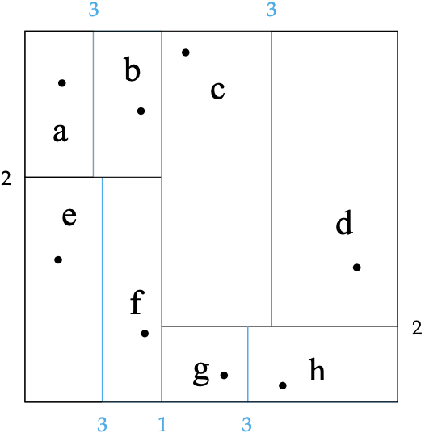
The key idea is, for each division, split the current node (root) to 2 nodes. Put the left-down on left, right-up on right nodes.
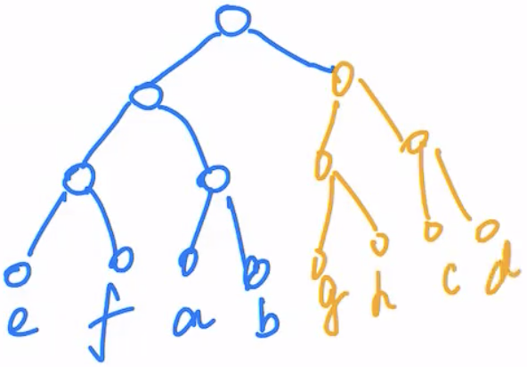

## R-Trees

- R-trees are an N-dimensional extension of B+-trees, useful for indexing sets of rectangles and other polygons.
- Supported in many modern database systems, along with variants like R+ -trees and R\*-trees.
- Basic idea: generalize the notion of a one-dimensional interval associated with each B+ -tree node to an N-dimensional interval, that is, an N- dimensional rectangle.
- Will consider only the two-dimensional case (N = 2)
  - generalization for N > 2 is straightforward, although R-trees work well
    only for relatively small N
- **Bounding boxes of children of a node are allowed to overlap**
- Note: A **bounding box** of a node is a minimum sized rectangle that contains all the rectangles/polygons associated with the node

### R-Tree example

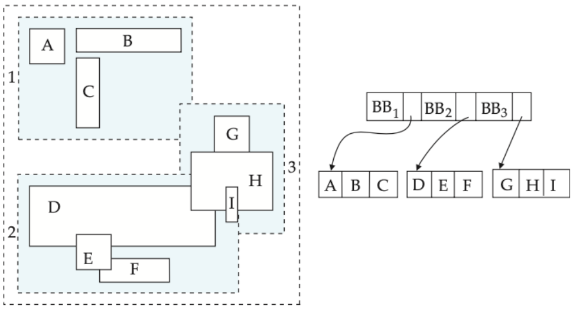
When a query comes, it checks each bounding box and see if there is a overlapping. Since bounding boxes can overlap, a query may fall into multiple child bounds.

# Using Indexes in SQL

## Index Definition in SQL

- Some indexes are automatically created by the DBMS
  - For UNIQUE constraint, DBMS creates a non-clustered index.
  - For PRIMARY KEY, DBMS creates a clustered index
- You can create indexes on any relation (or view) – view: e.g., join result of 2 tables

## Create an index

create index \<index-name> on \<relation-name> (\<attribute-list>)

1. Create a clustered index on a table
   CREATE CLUSTERED INDEX index1 ON table1 (column1);
2. Create a non-clustered index with a unique constraints
   CREATE UNIQUE INDEX index1 ON table1 (column1 DESC, column2 ASC, column3 DESC);

(A unique index is one in which no two rows are permitted to have the same index key value)

## drop an index

drop index \<index-name>

Most database systems allow specification of type of index, and clustering

## Specialized indexes - Filtered index

CREATE INDEX index1 ON table1 (column1) WHERE Year > ‘2010’;

(A filtered index is an optimized nonclustered index, suited for queries that select a small percentage of rows from a table. It uses a filter predicate to index a portion of the data in the table)

## Spatial index

CREATE SPATIAL INDEX index_name ON table_name(Geometry_type_col_name) WITH ( BOUNDING_BOX = ( 0, 0, 500, 200 ) );

# Summary

- There is no point going through all index types for all data types
  - There is hundreds of them
  - Even each type would have many subtypes
    - E.g., MX-CIF quadtree is one quadtree type among many
  - Same with R-trees, etc
  - Same with many other index types
- Given a data set, when uploading to the DBMS
  - Find the potential query types
  - Research what indices that particular DBMS would have for that data type
  - Research for what queries you would better do on what index
  - Create index if you have large data
  - Monitor performance
  - Tune or create other indices
  - Your DMBS will have a version of the “create index” SQL statement
