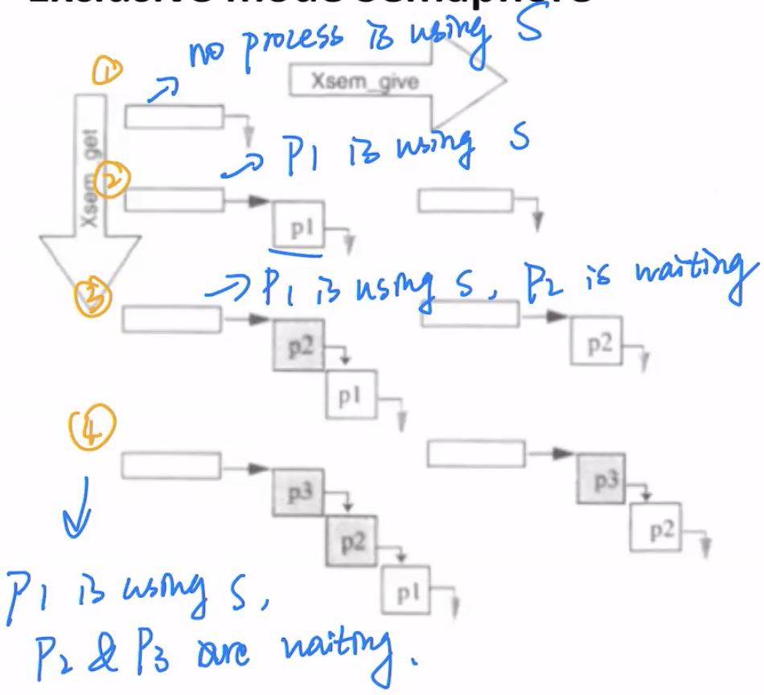
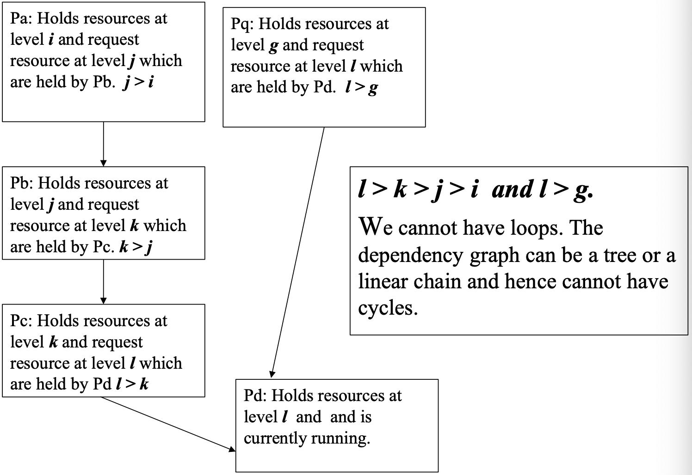
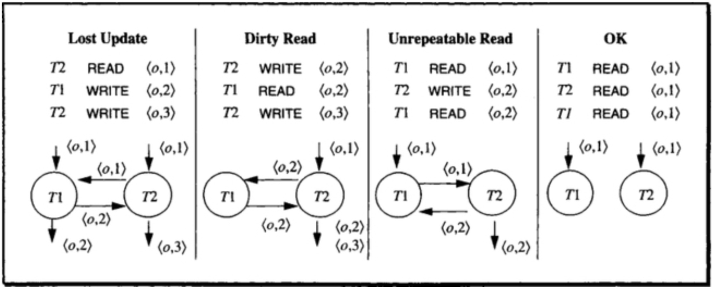
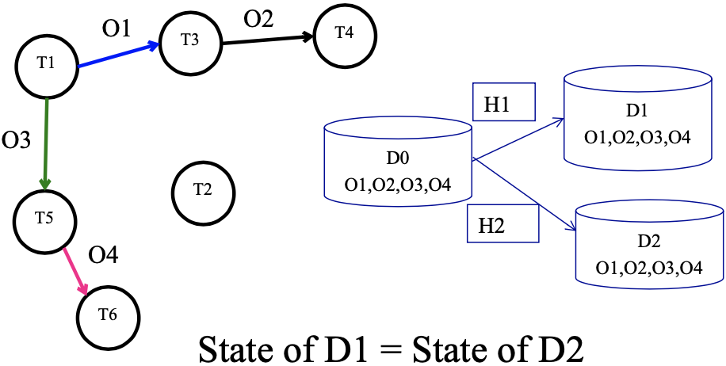
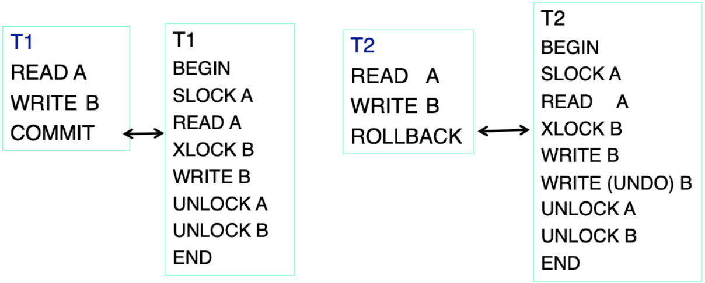
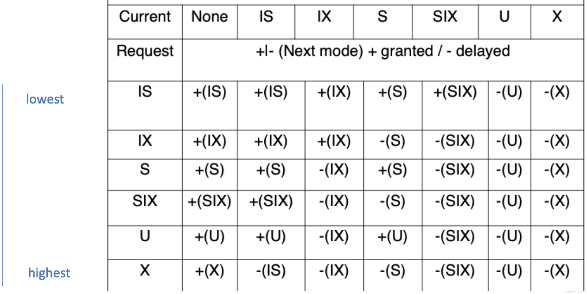
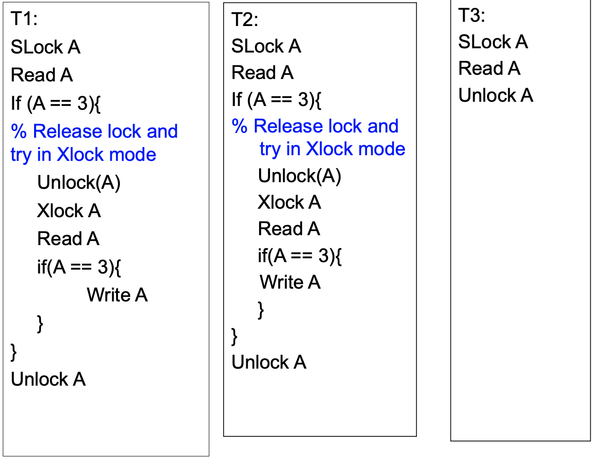

# Transactions
## Transaction - A unit of work in a database
- A transaction can have any number and type of operations in it
- Either happens as a whole or not
- Transactions ideally have four properties, commonly known as ACID properties

## ACID (Atomicity, Consistency, Isolation, Durability) properties: 
- Atomicity - All changes to data are performed as if they are a single operation. That is, all the changes are performed, or none of them are.
Example – A transaction that (i) subtracts $100 if balance >100 (ii) deposits $100 to another account
(both actions with either happen together or none will happen)
- Consistency - Data is in a ‘consistent’ state when a transaction starts and when it ends – in other words, any data written to the database must be valid according to all defined rules (e.g., no duplicate student ID, no negative fund transfer, etc.)
  - What is ‘consistent’ - depends on the application and context constraints
  - It is not easily computable in general
  - Only restricted type of consistency can be guaranteed, e.g. serializable transactions
- Isolation- transaction are executed as if it is the only one in the system.
• For example, in an application that transfers funds from one account to another, the isolation ensures that another transaction sees the transferred funds in one account or the other, but not in both, nor in neither.
- Durability- the system should tolerate system failures and any committed updates should not be lost.

## Types of Actions
- Unprotected actions - no ACID property
- Protected actions - these actions are not externalised before they are completely done. These actions are controlled and can be rolled back if required. These have ACID property.
- Real actions - these are real physical actions once performed cannot be undone. In many situations, atomicity is not possible with real actions (e.g., firing two rockets as a single atomic action)

## Embedded SQL example in C
(Open Database Connectivity)
```C
int main(){ 
    exec sql INCLUDE SQLCA; /*SQL Communication Area*/
    exec sql BEGIN DECLARE SECTION;
    /* The following host variables are used for communicating between SQL and C */
    int OrderID; /* Employee ID (from user) */
    int CustID; /* Retrieved customer ID */
    char SalesPerson[10] /* Retrieved salesperson name */ 
    char Status[6] /* Retrieved order status */
    exec sql END DECLARE SECTION;
    /* Set up error processing */
    exec sql WHENEVER SQLERROR GOTO query_error; 
    exec sql WHENEVER NOT FOUND GOTO bad_number;
    /* Prompt the user for order number */ 
    printf ("Enter order number: "); 
    scanf_s("%d", &OrderID);
    /* Execute the SQL query */
    exec sql SELECT CustID, SalesPerson, Status FROM Orders
    WHERE OrderID = :OrderID // ”:” indicates to refer to C variable
    INTO :CustID, :SalesPerson, :Status;
    /* Display the results */
    printf ("Customer number: %d\n", CustID); 
    printf ("Salesperson: %s\n", SalesPerson); 
    printf ("Status: %s\n", Status);
    exit(); 
    query_error:
        printf ("SQL error: %ld\n", sqlca->sqlcode); exit(); 
    bad_number:
        printf ("Invalid order number.\n"); exit(); }
```

- **Host Variables** - Declared in a section enclosed by the **BEGIN** DECLARE SECTION and **END** DECLARE SECTION. While accessing these variables, they are prefixed by a colon “:”. The colon is essential to distinguish between host variables and database objects (for example tables and columns).
- **Data Types** - The data types supported by a DBMS and a host language can be quite different. e.g. if we have int type id in DB, we can't use string id in C
- **Error Handling** - The DBMS reports run-time errors to the applications program through an SQL Communications Area (SQLCA) by INCLUDE SQLCA. The WHENEVER...GOTO statement tells the pre-processor to generate error- handling code to process errors returned by the DBMS.
- **Singleton SELECT** - The statement used to return the data is a singleton SELECT statement; that is, it returns only a single row of data. Therefore, the code
example does not declare or use cursors.

## Flat Transaction
Everything inside the BEGIN WORK and COMMIT WORK is at the same level. The transaction will either survive together with everything else (commit) Or it will be rolled back with everything else (abort) – if some errors happen

```sql
exec sql BEGIN WORK;
AccBalance = BuySomething(AccId, AccBalance, Amount);
exec sql COMMIT WORK;

Long BuySomething(long AccId, long AccBalance, long Amount){
    Exec sql INSERT INTO history(AccId, Amount, time) 
    VALUES( :AccId, :Amount, CURRENT);
    exec sql UPDATE accounts
    SET AccBalance = AccBalance - :Amount
    WHERE AccId = :AccId;
    return(AccBalance); 
}
exec sql BEGIN WORK;
AccBalance = BuySomething(AccId, AccBalance, Amount); 
if (AccBalance < 0){
    exec sql ROLLBACK WORK; }
else { exec sql COMMIT WORK; }
```

### Flat Transaction - Limitation
Flat transactions do not model many real applications.
```
BEGIN WORK
S1 : book flight from Melbourne to Singapore S2: book flight from Singapore to London
S3: book flight from London to Dublin
END WORK
```
From Dublin if we cannot reach our final destination instead we wish to fly to Paris from Singapore and then reach our final destination.

If we roll back we need to redo the booking from Melbourne to Singapore which is a waste.

### Flat Transaction – Solution: Save Points

- The only reason why an application program needs an identifier for a savepoint is that it may later want to re-establish (return to) that savepoint.
- To do that, the application invokes the ROLLBACK WORK function, but rather than requesting the entire transaction to be aborted, it passes the number of the savepoint it wants to be restored.

## Nested Transaction

It is a tree of executions, T1 can have more T11 and T12.... The left hand side is called parent transaction.

### Rules to follow in Nested Transaction
#### Commit rule
- A subtransaction can either commit or abort, however, commit cannot take place unless the parent itself commits. If parent is a child, then its parent should commit. 
- Subtransactions have Atomicity, Consistency, and Isolation properties but not have Durability property unless all its ancestors commit.
- Commit of a sub transaction makes its results available only to its parents
#### Roll back rules
- If a subtransaction rolls back all its children are forced to roll back
#### Visibility rules
- Changes made by a subtransaction are visible to the parent only when the subtransaction commits.
- All objects of parent are visible to its children.

Implication of this is that the parent should not modify objects while children are accessing them. This is not a problem as parent is not run in parallel with its children.

Parent and Child should **never** run in parallel. Children can run in parallel. 

## Transaction Processing Monitor (TP Monitor)
The main function of a TP monitor is to integrate other system components and manage resources.
- TP monitors manage the transfer of data between clients and servers 
- breaks down applications or code into transactions and ensures that all databases are updated properly
- It also takes appropriate actions if any error occurs

## TP Monitor Services
- **Heterogeneity**: If the application needs access to **different DB systems**, local ACID properties of individual DB systems is not sufficient. Local TP monitor needs to interact with other TP monitors to ensure the **overall ACID property**.
- **Control communication**: If the application communicates with other **remote processes**, the local TP monitor should maintain the communication status among the processes to be able to recover from a crash.
- **Terminal management**: Since many terminals run client software, the TP monitor should provide appropriate ACID property between the client and the server processes.
- **Presentation service**: this is similar to terminal management in the sense it has to deal with different presentation ( user interface) software -- e.g. X-windows
- **Context management**: E.g. maintaining the sessions etc.
Start/Restart: There is no difference between start and restart in TP based system.

# Concurrency Control
For correct execution, we need to impose exclusive access to the shared variable counter by Tasks.
- To resolve conflicts
- To preserve database consistency

## Different ways for concurrency control
- **Dekker's algorithm (using code)** - needs almost no hardware support, but the code is very complicated to implement for more than two transactions/processes
- **OS supported primitives** (through interruption call) - expensive, independent of number of processes, machine independent
- **Spin locks** (using atomic lock/unlock instructions) – most commonly used

## Dekker's algorithm
int c1, c2, turn = 1; /* global variable*/

T1
{ some code T1}
```c
/* T1 wants exclusive access to the resource and we assume initially c1 = = 0*/
c1 = 1; turn = 2;
repeat until { c2 == 0 or turn == 1}
/* Start of exclusive access to the shared resource (successfully changed variables) */
use the resource 
counter = counter+1;
/* release the resource */ 
c1 = 0;
{some other code of T1}
```
T2
{ some code T2}
```c
/* T2 wants exclusive access to the resource and we assume initially c2 = = 0 */
c2 = 1; turn = 1;
repeat until { c1 == 0 or turn == 2}
/* Start of exclusive access to the shared resource */
use the resource 
counter = counter+1;
/* release the resource */ 
c2 = 0 ;
{some other code of T2}
```
- needs almost no hardware support although it needs atomic reads and writes to main memory
- the code is very complicated to implement if more than two transactions/ process are involved
- harder to understand the algorithm for more than two process
takes lot of storage space
- uses busy waiting
- efficient if the lock contention (that is frequency of access to the locks) is low

## OS supported primitives
- through an **interrupt call**, the lock request is passed to the OS. When interrupt call happens, the transaction stops and save the data, then handle the call 
- need no special **hardware**
- are very **expensive** (several hundreds to thousands of instructions need to be executed to save context of the requesting process, so it's **slow**.)
- **do not use busy waiting** and therefore **more effective**

## Spin Lock
- All modern processors do support some form of spin locks
- Executed using atomic machine instructions such as test and set or compare and swap
- need hardware support
- use busy waiting
- algorithm does **not** depend on number of processes
- are very efficient for low lock contentions – all DB systems use them

### Spin lock – Test and Set
```c
testAndSet(int *lock)
{ /* the following is executed atomically, memory bus can be locked for up to two cycles (one for read and for writing*/
if (*lock == 1){ * lock = 0; return (true)}
else return (false);
}
```

Using test and set in spin lock for exclusive access 
```c
int lock = 1; % initial value
```

T1 
```c
/*acquire lock*/
while (!testAndSet( &lock ); /*Xlock granted*/
//exclusive access for T1; counter = counter+1;
/* release lock*/
lock = 1;
```
T2 
```c
/*acquire lock*/
while (!testAndSet( &lock ); /*Xlock granted*/
//exclusive access for T2; counter = counter+1;
/* release lock*/
lock = 1;
```

### Spin lock – Compare and Swap
```c
boolean cs(int *cell, int *old, int *new)
{/* the following is executed atomically*/
if (*cell == *old) { *cell = *new; return TRUE;} 
else { *old = *cell; return FALSE;} //put it into old and will be used later
}
```

### Short summary
Test and set will lock read operations
compare and swap will only lock write operations

# Semaphore
Derived from train and track
- Try to Get track, wait if track not clear
- If Get track was successful, use it (no other train will be able to use it at the same time)
- Once the train passes, the semaphore is set until the train exits that section of track
Computer semaphores have a **get()** routine that acquires the semaphore (perhaps waiting until it is free) and a **give()** routine that returns the semaphore to the free state, perhaps **signalling** (waking up) a waiting process.

## Exclusive mode Semaphore

- Pointer to a **queue** of processes (FIFO)
- If the semaphore is busy but there are **no waiters**, the pointer is the address of the process that **owns the semaphore**. 
- If some processes are waiting, the semaphore points to a **linked list** of **waiting processes**. The process owning the semaphore is **at the end of this list**. 
- After usage, the owner process wakes up the oldest process in the queue (first in, first out scheduler)

## Convoy avoiding semaphore
- The previous implementation may result a **long list of waiting** processes – called **convoy**
- To avoid convoys, a process may simply **free the semaphore** (set the queue to null) and then **wake up every process** in the list after usage.
- In that case, each of those processes will have to **re-execute the routine for acquiring semaphore**. i.e. reshuffle the order, give other processes oppotunity to ask for this shared resources

# Deadlock
- Deadlocks are rare, however, they do occur and the database has to deal with them when they occur
- In a deadlock, each process in the deadlock is waiting for another member to release the resources it wants.

## Deadlock - Solutions
- Have enough resources so that no waiting occurs – not practical since we cannot have infinite resources
- Do not allow a process to wait, simply rollback after a certain time. This can create live locks which are worse than deadlocks.
- Linearly order the resources and request of resources should follow this order,
- i.e., a transaction after requesting ith resource can request jth resource if j > i. This type of allocation guarantees no cyclic dependencies among the transactions.

## Linear Order

- Pa: Holds resources at level i and request resource at level j which are held by Pb. j > i
- Pb: Holds resources at level j and request resource at level k which are held by Pc. k > j
- Pc: Holds resources at level k and request resource at level l which are held by Pd l > k
- Pd: Holds resources at level l and and is currently running.
- Pq: Holds resources at level g and request resource at level l which are held by Pd. l > g
- l > k > j > i and l > g.
We cannot have loops. The dependency graph can be a tree or a linear chain and hence cannot have cycles.

## Deadlock – Avoidance / Mitigation
- Pre-declare all necessary resources and allocate in a single request, not practical as not possible to know about all requests.
- Periodically check the resource dependency graph for cycles. If a **cycle** exists - rollback (i.e., terminate) one or more transaction to eliminate cycles (deadlocks). The chosen transactions should be cheap (e.g., they have not consumed too many resources).
- Allow waiting for a maximum time **on a lock** then **force Rollback**. Many successful systems (IBM, Tandem) have chosen this approach.
- (Many distributed database systems maintain only local dependency graphs and use time outs for global deadlocks.)

# Isolation & Dependency
## Isolation Concept
- Isolation ensures that concurrent transactions leaves the database in the same state as if the transactions were executed separately.
- Isolation guarantees consistency, provided each transaction itself is consistent.
- We can achieve isolation by sequentially processing each transaction - generally not efficient and provides poor response times.
- We need to run transactions concurrently with the following goals
  - Concurrent execution should not cause application programs (transactions) to malfunction (fail).
  - Concurrent execution should not have lower throughput or bad response times than serial execution.

## Possible dependencies

- Lost Update, Write-Write, T1 Write is covered by T2
- Dirty Read, Write-Read, T1 read in middle of write
- Unrepeatable Read, Read-Write, T1 reading while others writing
- OK, no dependency

## Dependency model
- $I_i$ : set of inputs (objects that are read) of a transaction $T_i$
- $O_i$ : set of outputs (objects that are modified) of a transaction $T_i$ Note $O_j$ and $I_j$ are not necessarily disjoint that is $O_j \cap I_j ≠ ∅$
- Given a set of transactions , Transaction $T_j$ has no dependency on any transaction $T_i$ in if - 
$$
O_i\cap(I_j\cup O_j) = empty\ for\ all\ i ≠ j
$$
- This approach cannot be planed ahead as in many situation inputs and outputs may be state dependant/not known in prior.

## Dependency Formal Definition
- Let **H** is a **history sequence** of tuples of the form (T, action, object). Here, T is transaction, action can be read/write, object is what the action operates on. e.g. (T1, Read, O1)
- Let T1 and T2 are transactions in H. If T1 performs an action on an object O, then T2 performs an action on the same O, and **there is no write action in between by another transaction on O – then T2 depends on T1**.
- Formally, the dependency of T2 on T1 (T1, O, T2) exists in history H if there are indexes i and j such that i < j, H[i] involves action a1 on O by T1, and H[j] involves action a2 on O by T2, and there are no other H[k] = (T’,WRITE,O) for i < k < j
- **Dependency graph**: Transactions are nodes, and object labels the edges from the node Ti to Tj if (Ti, O, Tj) is in DEP(H).

## Dependency Relations Example
H1 = <(T1,R,O1), (T2,W,O5), (T1,W,O3), (T3,W,O1), (T5,R,O3), (T3,W,O2), (T5,R,O4), (T4,R,O2), (T6,W,O4)>  
H2 = <(T1,R,O1), (T3,W,O1), (T3,W,O2), (T4,R,O2), (T1,W,O3), (T2,W,O5), (T5,R,O3), (T5,R,O4), (T6,W,O4)>

Give  
- DEP(H1)
- DEP(H2) 
- Dependency graph

For questions like this, first we focus on the object order: O1, O2.... We can notice that O1 is in T1 and T3, so we can write <T1, O1, T3> in the DEP(H1). Then we can see T3 and T4 both operate on O2, so we can write <T3, O2, T4>...

DEP(H1) = {<T1, O1,T3>, <T3,O2,T4>, <T1,O3,T5>, <T5,O4,T6> }  
DEP(H2) = {<T1, O1,T3>, <T3,O2,T4>, <T1,O3,T5>, <T5,O4,T6> }  
Dependency graph


## Isolated History
- A serial history is history that is resulted as a consequence of running transactions sequentially one by one.
- N transactions can result in a maximum of N! serial histories.
- A history is said to be isolated if it is equivalent to a **serial history** (as if all transactions are executed serially/sequentially), i.e. serial history = isolated history
- A history is legal if does not grant conflicting grants.
- **Wormhole theorem**: A history is isolated **if and only if** it has no wormholes.

### Isolated History – e.g.,

If T1 precedes T2, it is written as T1 << T2.
```
Before(T) = {T’ | T’ << T} 
After(T) = {T’| T << T’}
```
E.g.
```
After(T1) = {T5,T6, T3, T4} 
After(T3) = {T4}
After (T5) = {T6}
```

## Wormhole Transaction
A transaction T’ is called a **wormhole transaction** if 
$$
T' \in Before(T) \cap After(T)
$$

That is T << T’ << T. This implies there is a **cycle** in the dependency graph of the history. Presence of a wormhole transaction implies it is not isolated (=> not a serial schedule).

Idea to solve wormhole problem:  
1. Known history
2. Write DEP based on history
3. Draw Dependency graph based on DEP
4. See if there is a wormhole or not

### 2022S1 Example
Given the following transaction history h we are told that k, l, m, n, o, and p are transactions, and operations are Read and Write operations which are labeled as R and W, and operations are done on the objects labeled as a, b, c, d, e:  
h = < (k,R,a),(m,W,a),(m,W,b),(n,R,b),(k,W,c),(l,W,e),(o,R,c),(o,R,d), (p,W,d) >  
Please find the DEP(h) and draw as a simple graph version as well. Then using the concept of wormholes explain whether this history is equal to a serial history or not, i.e., if this history is not equal to a serial history then give a wormhole example, and if it is then give a serial execution of these transactions that this history is equal to. Briefly explain your steps with sentences while answering this question.

Remind that the tuple is (Transaction, Action, Object), the DEP is <T1, O, T2>. The use of all characters is indeed confusing us. 

Answer


# Locks
## Slock & Xlock
- SLOCK (shared lock) that allows other transactions to **read**, but not write/modify the shared resource.
- A lock on an object should not be granted to a transaction while that object is locked by another transaction in an incompatible mode.
- In summary, Xlock (exclusive lock) to allow others to write, SLock (shared lock) to allow others to read

### Lock Compability
||Free |Shared (Slock) |Exclusive (Xlock)|
|---|---|---|---|
|Request - Slock| √ |√ |×|
Request - Xlock| √ |×| ×|

### Slock & Xlock – When to use which one?
- Actions in Transactions are: READ, WRITE, XLOCK, SLOCK, UNLOCK, BEGIN, COMMIT, ROLLBACK
- BEGIN, END , SLOCK, XLOCK can be ignored as they can be automatically inserted in terms of the corresponding operations
- If a transaction ends with a COMMIT, it is replaced with: {UNLOCK A if SLOCK A or XLOCK A appears in T for any object A}.
- ROLLBACK can be replaced by {**WRITE(UNDO)** A if WRITE A appears in T for any object A} { UNLOCK A if SLOCK A or XLOCK A appears in T for any object A}.

### Example

Note T2 need to WRITE (UNDO) B because it want to ROLLBACK

## Isolation Concept
- **Well-formed transactions**: A transaction is well formed if all READ, WRITE and UNLOCK operations are covered by appropriate LOCK operations
- **Two phase transactions**: A transaction is two phased if all LOCK operations precede all its UNLOCK operations. I.e. All locks are before unlocks

## Isolation Theorem
- **Locking theorem**: If all transactions are well formed and two-phased, then any legal (does not grant conflicting grants) history will be isolated.
- **Locking theorem (Converse)**: If a transaction is not well formed or is not two-phase, then it is possible to write another transaction such that it is a **wormhole**.
- **Rollback theorem**: An update transaction that does an UNLOCK and then does a ROLLBACK is **not** two phase. The idea is ROLLBACK is a Write action, therefore it is a unlock before lock. 

## Degree of Isolation
### Degree 3:   
  
A Three degree isolated Transaction has no lost updates, and has repeatable reads.  
Lock protocol is **two phase and well formed**.  
It is sensitive to the following conflicts: write->write; write ->read; read->write  

### Degree 2
  
Degree 2: A Two degree isolated transaction has no lost updates and no dirty reads.  
Lock protocol is two phase with **respect to exclusive locks** and well formed with respect to **Reads and writes**. (May have Non repeatable reads.)  
It is sensitive to the following conflicts: write- >write; write ->read;  

### Degree 1
  
Degree 1: A One degree isolation has no lost updates.  
Lock protocol is two phase with **respect to exclusive locks** and well formed with respect to **writes**.  
It is sensitive the following conflicts: write- >write;  

### Degree 0
  
Degree 0 : A Zero degree transaction does not overwrite another transactions dirty data if the other transaction is at least One degree.  
Lock protocol is well-formed with respect to writes. It ignores all conflicts.  

# Granular Lock
- **Definition** - we need to build some **hierarchy**, then locks can be taken at any level, which will automatically grant the locks on its descendants.
- **Intention** - allow concurrent runs as much as possible for a better performance, while avoiding conflicts as much as possible
- **Steps**
  - Pick a set of column values (predicates). 
  - They form a graph/tree structure.
  - Lock the nodes in this graph/tree 
- Example  
  

## Granularity of locks (coarse & fine)
Lock the whole DB – less conflicts, but poor performance
Lock at individual records level – more locks, better performance
## Express intention
Intention mode locks on coarse granules.

## Types of granular locks
|Type|Name|
|--|--|
|X|exclusive lock|
|S|shared lock|
U|update lock – intention to update in the future|
IS|intent to set shared locks at finer granularity|
|IX| Intent to set shared or exclusive locks at finer granularity|
|SIX| a coarse granularity shared lock with an Intent to set finer granularity exclusive locks|

## Compatibility Mode of Granular Locks (symmetric)


## Isolation Concept
- Acquire locks from root to leaf. 
- Release locks from leaf to root.
- To acquire an S mode or IS mode lock on a non-root node, **one** parent must be held in IS mode or higher (one of {IS,IX,S,SIX,U,X}).
- To acquire an X, U, SIX, or IX mode lock on a non-root node, **all** parents must be held in IX mode or higher (one of {IX,SIX,U,X}).

### e.g., - deadlock

T1:
```
SLock A
Read A
If (A== 3) {
    % Upgrading Slock to Xlock
    Xlock A
    Write A 
}
Unlock A
```
T2:
```
SLock A
Read A
If (A==3) {
    % Upgrading Slock to Xlock
    Xlock A
    Write A 
}
Unlock A
```
T3: 
```
SLock A 
Read A 
Unlock A
```
Both T1 and T2 have shared lock  
T1 require sharedlock will not be granted, based on compability diagram above, because T2 have shared lock  
T2 require sharedlock will note be granted, based on compability diagram above, because T1 have shared lock

### solution

T1:
```
SLock A
Read A
If (A == 3){
    % Release lock and try in Xlock mode
    Unlock(A) 
    Xlock A 
    Read A 
    if(A == 3){
        Write A 
    }
}
Unlock A
```
T2:
```
SLock A
Read A
If (A == 3){
    % Release lock and try in Xlock mode
    Unlock(A) 
    Xlock A 
    Read A 
    if(A == 3){
        Write A 
    }
}
Unlock A
```
T3
```
SLock A 
Read A 
Unlock A
```

## Optimistic Locking
- When conflicts are rare, transactions can execute operations without managing locks and without waiting for locks - higher throughput
- Use data without locks
- Before committing, each transaction verifies that no other transaction has modified the data (by taking appropriate locks) – **duration of locks are very short**
- If any conflict found, the transaction repeats the attempt
- If no conflict, make changes and commit


### Example
```sql
% Read without lock
Read A into A1 
Read B into B1 
Read C into C1
Loop: Compute new values based on A1 and B1 
    % Start taking locks
    % Read again
    Slock A; Read A into A2
    Slock B; Read B into B2
    Xlock C; Read C into C2
    if (A1 == A2 & B1 == B2 & C1 == C2)
        Write new value into C 
        commit
        Unlock A, B and C
    else % read data is changed 
        A1 = A2
        B1 = B2
        C1 = C2
        unlock A ,B and C 
        goto Loop
end
```
Once the condition is true – it is effectively 2 phase locking but duration of locking is very short but can force many repeated attempts due to failure of the condition.  
Advantage: Very efficient, lock duration very short  
Disadvantage: Repeat in Loop for long time

## Snapshot Isolation
```sql
Read C into C1 
Read D into D1
Loop:
    Read A into A1
    Read B into B1
    Compute new values based on A1 and B1
    % Start taking locks on records that need modification.
    Let new value for C is C3 and for D is D3 
    Xlock C
    Xlock D
    Read C into C2
    Read D into D2
    if (C1 = = C2 & D1 = = D2)
        % first writer commits
        write C3 to C
        write D3 to D 
        commit 
        unlock(C and D)
    else % not first modifier
        C1 = C2 
        D1 = D2
        unlock(C and D) 
        goto Loop
end
```
Snapshot Isolation method is used in Oracle but it will not guarantee Serializability.  
However, its transaction throughput is very high compared to two phase locking scheme.

## Two phase locking Transaction - Snapshot Locking potential problem
Integrity constraint A+B >= 0; A = 100; B = 100; 
T1:
```
Lock(X,A) 
Lock(S,B) 
Read A to A1; 
Read B to B1; 
A1 = A1 -200;
if (A1+ B1 >= 0)
    Write A1 to A
    Commit
else abort
end
Unlock (all locks)
```
T2:
```
Lock(S,A) 
Lock(X,B)
Read A to A1; 
Read B to B1; 
B1 = B1 -200;
If (A1+ B1 >= 0)
    Write B1 to B
    Commit
else abort
end
Unlock (all locks)
```
Only one transaction can commit.

Snapshot Isolation Transaction - Snapshot Locking potential problem
Integrity constraint A+B >= 0; A = 100; B = 100;
T1:
```sql
Loop: 
    Read A to A1;
    Read B to B1; 
    A3 = A1 -200; 
    Lock(X, A) 
    Read A to A2 
    if (A1 != A2)
        Unlock(A) 
        goto Loop
    % potential problem: B1 is read without lock, the value of B possiblily has been changed 
    elseif (A3+ B1 >= 0) 
        Write A3 to A
        Commit 
    else abort
Unlock (all locks)
```
T2:
```sql
Loop: 
    Read A to A1;
    Read B to B1; 
    B3 = B1 -200; 
    Lock(X, B) 
    Read B to B2 
    if (B1 != B2)
        Unlock(B) 
        goto Loop
    % A1 is read without lock
    elseif (A1+ B3 >= 0) 
        Write B3 to B
        Commit 
    else abort
Unlock (all locks)
```
One or both transactions can commit but when both are committed, it is not serializable as only one should be able to commit.

## Time Stamping
At commit, time stamps are examined. **If time stamp is more recent than the transaction read time, the transaction is aborted.**

At the commit time, the system validates all the transaction’s updates and writes updates to durable storage. This model of computation unifies concurrency, recovery and time domain addressing.

**Time Domain Versioning**  
Data is never overwritten a new version is created on update.  
<o,<V1, [t1, t2)>, <V2, [t2,t3)>, <V3,[t3,*)>

e.g.
T1
select average (salary)
from employee

T2 
update employee
set salary = salary*1.1
where salary < $40000

if T1 before T2, no impact, T1 can commit  
if T2 before T1, T1 cannot commit, T1 abort  
But if we use time stamp, T2 do not need to wait until T1 commit to start