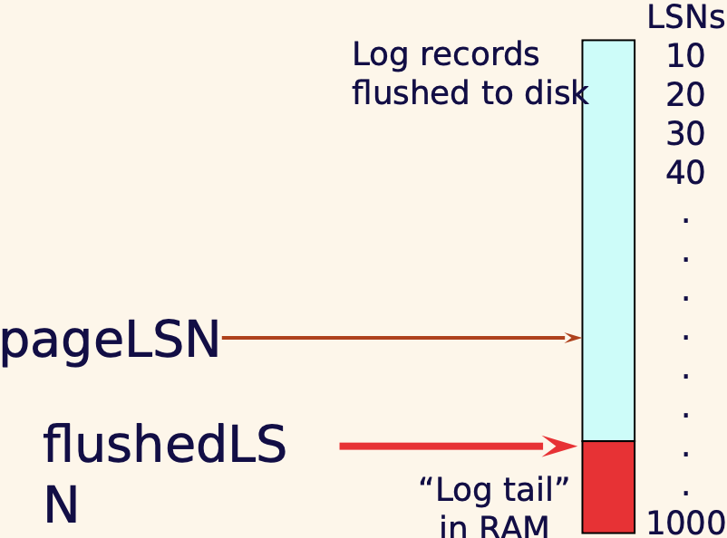

# Crash Recovery
Recover from a failure either when a single-instance database crashes or all instances crash.  
Crash recovery is the process by which the database is moved back to a consistent and usable state after a crash. This is done by **making the committed transactions durable and rolling back incomplete transactions.**

## ACID properties 
Recovery manager guarantees Atomicity and Durability. 
- Atomicity - All changes to data are performed as if they are a single operation. That is, all the changes are performed, or none of them are.
- Consistency - Data is in a ‘consistent’ state when a transaction starts and when it ends – in other words, any data written to the database must be valid according to all defined rules (e.g., no duplicate student ID, no negative fund transfer, etc.)
- Isolation - transaction are executed as if it is the only one in the system.
- Durability - the system should tolerate system failures and any committed updates should not be lost.

## Desired behaviors when crash happens

As can be seen from the graph, T1, T2, T3 has committed before the crash happens; T4 and T5 haven't commt; T6 aborted before the crash happens.
We need to ensure the committed and abortted transactions do not lost th eupdates. 
Since T4 and T5 are incomplete, need to be rollback. 

## Data Access

Two types of data blocks
- **Physical blocks** are those blocks residing on the disk.
- **Buffer blocks** are the blocks residing temporarily in main memory.

Two operations between disk and main memory
- **Input(A)** transfers the physical block A to main memory.
- **Output(B)** transfers the buffer block B to the disk and replaces the data there.

## Some Concepts
- Disk: big storage, durable. 
- Page & Pageid: each partition in disk is a page, each page has a id
- Buffer caches / buffer pool / buffer block: fast, but not durable
- Eviction (evict): if buffer is full, we need to evict (remove) some data from buffer so that we can read from disk. evict when:
  - no one else is using page
  - all modified page/data should be copied to disk
- Latches: a type of lock used only for the duration of the operation (R/W), can be released immediately
- Fix, unfix: similar to lock / unlock

More Concepts: 
- Force – immediately write to disk after commit, durable but slow
- No force – keep in buffer as long as we can, not durable but fast
- Steal – when evicting a page with uncommitted info (write to disk), but the transaction decides to rollback at the end. This means we need to **remember the old value** to support the undo process.

# Log-based Crash Recovery
## Logging
- Definition - Record REDO (new value) and UNDO (old value) information, for every update, in a log.
- Log is written sequentially (Log: An ordered list of REDO/UNDO actions)
- Each log takes very little space, so multiple updates fit in a single log page.
- Log record contains: <XID, pageID, offset, length, old data, new data> and some other additional control info. offset is how far from beginning of the page 

## Write-Ahead Logging (WAL)
1. Must force the log record (has both old and new values) for an update before the corresponding data page gets to disk
2. Must write all log records to disk for a transaction before it commits

### Write-Ahead Logging (WAL) – e.g.,
- LSN (Log Sequence Nmber) – LSNs always **increase**
- pageLSN - The LSN of the most recent log record for an update to that page.
- flushedLSN - max LSN flushed so far (flush to disk)
- WAL - Before a page is written to disk make sure **pageLSN <= flushedLSN**

**Cannot** write the page to disk

**Can** write the page to disk

## Transaction Table
- One entry per active transaction  
- Contains transactionID, status (running/committed/aborted), and lastLSN.  
e.g.

|transactionID| status | lastLSN|
|--|--|--|
|T1|running|40|
|T2|committted|80|

## Dirty Page Table
- One entry per **dirty page** in buffer pool. read from disk to buffer, if the read one is different from the disk, then page is dirty, i.e. the some update to this page happened. 
- Contains **recLSN**: the LSN of the log record which **first** caused the page to be dirty since loaded into the buffer cache from the disk.  
e.g.

| Pageid | recLSN |
|--------|--------|
|   P1   |   10   |
|   P2   |   50   |
|   P3   |   80   |

## Checkpoint
Periodically, the DBMS creates a checkpoint, in order to **minimize the time taken to recover in the event of a system crash**.  
Write to log:
- Begin checkpoint record: Indicates when checkpoint began.
- End checkpoint record: Contains current Transaction table and dirty page table.

**Fuzzy Checkpoint** – the creation of checkpoint **takes a little time**
- Other transactions continue to run, so these tables are accurate only as of the time of the begin checkpoint record.
- No attempt to force dirty pages to disk, so it’s a good idea to periodically flush dirty pages to disk

## Transaction – Abort
- Get lastLSN of transaction from transaction table.
- Can follow chain of log records **backward** via the prevLSN field. - Before starting UNDO, write a Compensation Log Record (CLR)
  - Continue logging while you Undo
  - Extra field: undonextLSN (point to the next LSN to undo) 
  - CLR never undone
- At end of UNDO, write an “end” log record.

### e.g. 
T1  
1. Update A: 100 -> 200
2. Update A: 200 -> 300
3. Update A: 300 -> 400
 ----------------
              Abort 400
We will go backward, from UNDO 3, 400 -> 300, to UNDO 2..., finally get 100

### Transaction – Abort e.g.,
| LSN  | Log                    |
|------|------------------------|
| 400  | begin checkpoint       |
| 405  | end checkpoint         |
| 410  | update: T1 writes P5   |
| 420  | update: T2 writes P3   |
| 430  | update: T1 writes P4   |
| 440  | T1 abort               |
| 445  | CLR: Undo T1 LSN 430   |
| 450  | CLR: Undo T1 LSN 410   |
| 455  | T1 End                 |
| 460  | update: T3 writes P5   |

## Transaction - Commit
- Write commit record to log.
- Change transaction Status to “Commit” in Transaction table All log records up to transaction’s lastLSN are flushed.
  - Guarantees that flushedLSN >= lastLSN
  - Flushes are sequential, synchronous writes to disk (very fast writes to disk) 
  - Many log records per log page
- Write “end” record to log.

## Crash recovery
Three phases
- Phase 1 – **Analysis**: Figure out which transactions are committed since checkpoint, which are failed
- Phase 2 – **Redo** all actions
- Phase 3 – **Undo** effects of failed transactions

## Crash recovery – Steps
1. **Analysis phase**
- Transaction table
- Dirty page table
2. **Redo phase (top - bottom)**
- tart from the smallest number in Dirty page table – x
- For each **CLR or update **log record (exclude “commit”, “abort”, “end”, “checkpoint”), check **if the page is in Dirty page table && LSN >= x && pageLSN < LSN** (assume manually pageLSN if you don’t know and reset pageLSN after redo)
- Then, for these record, redo the action for LSN
3. **Undo phase (bottom - top)**
- For the transactions which are in Transaction table, need to be undone 
- Find the **largest** LSN of these transactions and put it into ToUndo
- Continuously find all transactions that need to be undone

### Example1
| Time | Transaction Info | 
|------|------------------|
| 0    | BEGIN CHECKPOINT|
| 5    | END CHECKPOINT EMPTY XACT TABLE AND DPT|
| 10   | T1: UPDATE P1 OLD: YYY NEW: ZZZ|
| 15   | T1: UPDATE P2 OLD: WWW NEW: XXX|
| 20   | T1: COMMIT|

Answer:
1. Analysis phase  
Transaction table:   
T1, commit, 20  
Dirty page table:  
P1 10  
P2 15  
1. Redo phase  
Dirty page smallest LSN: 10  
Update logs: LSN 10 and LSN 15  
LSN 10 => if pageLSN(P1) < 10, redo LSN 10, set pageLSN(P1) = 10  
LSN 15 => if pageLSN(P2) < 15, redo LSN 15, set pageLSN(P2) = 15  
1. Undo phase  
nothing

### Example2
| Time | Transaction Info                                |
|------|-------------------------------------------------|
| 0    | BEGIN CHECKPOINT                                |
| 5    | END CHECKPOINT (EMPTY XACT TABLE AND DPT)       |
| 10   | T1: UPDATE P1 (OLD: YYY NEW: ZZZ)              |
| 15   | T1: UPDATE P2 (OLD: WWW NEW: XXX)              |
| 20   | T2: UPDATE P3 (OLD: UUU NEW: VVV)              |
| 25   | T1: COMMIT                                      |
| 30   | T2: UPDATE P1 (OLD: ZZZ NEW: TTT)              |
Answer
1. Analysis phase  
Transaction table:   
T1, commit, 25  
T2, running, 30
Dirty page table:  
P1 10  
P2 15  
P3 20  
2. Redo phase  
Dirty page smallest LSN: 10  
Update logs: LSN 10 and LSN 15  
LSN 10 => if pageLSN(P1) < 10, redo LSN 10, set pageLSN(P1) = 10  
LSN 15 => if pageLSN(P2) < 15, redo LSN 15, set pageLSN(P2) = 15  
LSN 20 => if pageLSN(P3) < 20, redo LSN 20, set pageLSN(P3) = 20  
LSN 30 => pageLSN(P1) < 30, redo LSN 30, set pageLSN(P1) = 30  
3. Undo phase  
Undo T2
Largest TSN = 30  
LSN 30: UNDO LSN 30,undoLSN = 20  
LSN 20: undoNextLSN20, undoNextLSN = null  

# CAP Theorem
Any distributed database with shared data, can have at most two of the three desirable properties, C, A or P.
- Consistency: every node always sees the same data at any given instance (i.e., strict consistency)
- Availability: the system continues to operate, even if nodes crash, or some hardware or software parts are down due to upgrades
- Partition Tolerance: the system continues to operate in the presence of network partitions
- Availability + Partition 
- Tolerance Consistency + Partition Tolerance 
- Consistency + Availability (not pratical, it assumes no network problem, therefore at most times, we do tradeoff in A/C)
e.g., Google and Amazon – focus on availability, sacrifice consistency

