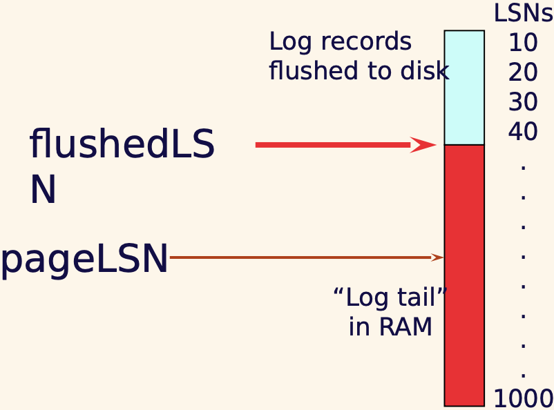
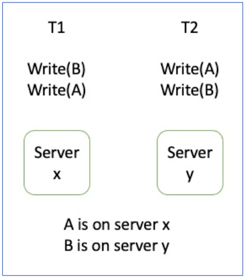

# Crash Recovery
Recover from a failure either when a single-instance database crashes or all instances crash.  
Crash recovery is the process by which the database is moved back to a consistent and usable state after a crash. This is done by **making the committed transactions durable and rolling back incomplete transactions.**

## ACID properties 
Recovery manager guarantees Atomicity and Durability. 
- Atomicity - All changes to data are performed as if they are a single operation. That is, all the changes are performed, or none of them are.
- Consistency - Data is in a ‘consistent’ state when a transaction starts and when it ends – in other words, any data written to the database must be valid according to all defined rules (e.g., no duplicate student ID, no negative fund transfer, etc.)
- Isolation - transaction are executed as if it is the only one in the system.
- Durability - the system should tolerate system failures and any committed updates should not be lost.

## Desired behaviors when crash happens

As can be seen from the graph, T1, T2, T3 has committed before the crash happens; T4 and T5 haven't commt; T6 aborted before the crash happens.
We need to ensure the committed and abortted transactions do not lost th eupdates. 
Since T4 and T5 are incomplete, need to be rollback. 

## Data Access

Two types of data blocks
- **Physical blocks** are those blocks residing on the disk.
- **Buffer blocks** are the blocks residing temporarily in main memory.

Two operations between disk and main memory
- **Input(A)** transfers the physical block A to main memory.
- **Output(B)** transfers the buffer block B to the disk and replaces the data there.

## Some Concepts
- Disk: big storage, durable. 
- Page & Pageid: each partition in disk is a page, each page has a id
- Buffer caches / buffer pool / buffer block: fast, but not durable
- Eviction (evict): if buffer is full, we need to evict (remove) some data from buffer so that we can read from disk. evict when:
  - no one else is using page
  - all modified page/data should be copied to disk
- Latches: a type of lock used only for the duration of the operation (R/W), can be released immediately
- Fix, unfix: similar to lock / unlock

More Concepts: 
- Force – immediately write to disk after commit, durable but slow
- No force – keep in buffer as long as we can, not durable but fast
- Steal – when evicting a page with uncommitted info (write to disk), but the transaction decides to rollback at the end. This means we need to **remember the old value** to support the undo process.

# Log-based Crash Recovery
## Logging
- Definition - Record REDO (new value) and UNDO (old value) information, for every update, in a log.
- Log is written sequentially (Log: An ordered list of REDO/UNDO actions)
- Each log takes very little space, so multiple updates fit in a single log page.
- Log record contains: <XID, pageID, offset, length, old data, new data> and some other additional control info. offset is how far from beginning of the page 

## Write-Ahead Logging (WAL)
1. Must force the log record (has both old and new values) for an update before the corresponding data page gets to disk
2. Must write all log records to disk for a transaction before it commits

### Write-Ahead Logging (WAL) – e.g.,
- LSN (Log Sequence Nmber) – LSNs always **increase**
- pageLSN - The LSN of the most recent log record for an update to that page.
- flushedLSN - max LSN flushed so far (flush to disk)
- WAL - Before a page is written to disk make sure **pageLSN <= flushedLSN**

**Cannot** write the page to disk

**Can** write the page to disk

## Transaction Table
- One entry per active transaction  
- Contains transactionID, status (running/committed/aborted), and lastLSN.  
e.g.

|transactionID| status | lastLSN|
|--|--|--|
|T1|running|40|
|T2|committted|80|

## Dirty Page Table
- One entry per **dirty page** in buffer pool. read from disk to buffer, if the read one is different from the disk, then page is dirty, i.e. the some update to this page happened. 
- Contains **recLSN**: the LSN of the log record which **first** caused the page to be dirty since loaded into the buffer cache from the disk.  
e.g.

| Pageid | recLSN |
|--------|--------|
|   P1   |   10   |
|   P2   |   50   |
|   P3   |   80   |

## Checkpoint
Periodically, the DBMS creates a checkpoint, in order to **minimize the time taken to recover in the event of a system crash**.  
Write to log:
- Begin checkpoint record: Indicates when checkpoint began.
- End checkpoint record: Contains current Transaction table and dirty page table.

**Fuzzy Checkpoint** – the creation of checkpoint **takes a little time**
- Other transactions continue to run, so these tables are accurate only as of the time of the begin checkpoint record.
- No attempt to force dirty pages to disk, so it’s a good idea to periodically flush dirty pages to disk

## Transaction – Abort
- Get lastLSN of transaction from transaction table.
- Can follow chain of log records **backward** via the prevLSN field. - Before starting UNDO, write a Compensation Log Record (CLR)
  - Continue logging while you Undo
  - Extra field: undonextLSN (point to the next LSN to undo) 
  - CLR never undone
- At end of UNDO, write an “end” log record.

### e.g. 
T1  
1. Update A: 100 -> 200
2. Update A: 200 -> 300
3. Update A: 300 -> 400
 ----------------
              Abort 400
We will go backward, from UNDO 3, 400 -> 300, to UNDO 2..., finally get 100

### Transaction – Abort e.g.,
| LSN  | Log                    |
|------|------------------------|
| 400  | begin checkpoint       |
| 405  | end checkpoint         |
| 410  | update: T1 writes P5   |
| 420  | update: T2 writes P3   |
| 430  | update: T1 writes P4   |
| 440  | T1 abort               |
| 445  | CLR: Undo T1 LSN 430   |
| 450  | CLR: Undo T1 LSN 410   |
| 455  | T1 End                 |
| 460  | update: T3 writes P5   |

## Transaction - Commit
- Write commit record to log.
- Change transaction Status to “Commit” in Transaction table All log records up to transaction’s lastLSN are flushed.
  - Guarantees that flushedLSN >= lastLSN
  - Flushes are sequential, synchronous writes to disk (very fast writes to disk) 
  - Many log records per log page
- Write “end” record to log.

## Crash recovery
Three phases
- Phase 1 – **Analysis**: Figure out which transactions are committed since checkpoint, which are failed
- Phase 2 – **Redo** all actions
- Phase 3 – **Undo** effects of failed transactions

## Crash recovery – Steps
1. **Analysis phase**
- Transaction table
- Dirty page table
2. **Redo phase (top - bottom)**
- tart from the smallest number in Dirty page table – x
- For each **CLR or update **log record (exclude “commit”, “abort”, “end”, “checkpoint”), check **if the page is in Dirty page table && LSN >= x && pageLSN < LSN** (assume manually pageLSN if you don’t know and reset pageLSN after redo)
- Then, for these record, redo the action for LSN
3. **Undo phase (bottom - top)**
- For the transactions which are in Transaction table, need to be undone 
- Find the **largest** LSN of these transactions and put it into ToUndo
- Continuously find all transactions that need to be undone

### Example1
| Time | Transaction Info | 
|------|------------------|
| 0    | BEGIN CHECKPOINT|
| 5    | END CHECKPOINT EMPTY XACT TABLE AND DPT|
| 10   | T1: UPDATE P1 OLD: YYY NEW: ZZZ|
| 15   | T1: UPDATE P2 OLD: WWW NEW: XXX|
| 20   | T1: COMMIT|

Answer:
1. Analysis phase  
Transaction table:   
T1, commit, 20  
Dirty page table:  
P1 10  
P2 15  
1. Redo phase  
Dirty page smallest LSN: 10  
Update logs: LSN 10 and LSN 15  
LSN 10 => if pageLSN(P1) < 10, redo LSN 10, set pageLSN(P1) = 10  
LSN 15 => if pageLSN(P2) < 15, redo LSN 15, set pageLSN(P2) = 15  
1. Undo phase  
nothing

### Example2
| Time | Transaction Info                                |
|------|-------------------------------------------------|
| 0    | BEGIN CHECKPOINT                                |
| 5    | END CHECKPOINT (EMPTY XACT TABLE AND DPT)       |
| 10   | T1: UPDATE P1 (OLD: YYY NEW: ZZZ)              |
| 15   | T1: UPDATE P2 (OLD: WWW NEW: XXX)              |
| 20   | T2: UPDATE P3 (OLD: UUU NEW: VVV)              |
| 25   | T1: COMMIT                                      |
| 30   | T2: UPDATE P1 (OLD: ZZZ NEW: TTT)              |
Answer
1. Analysis phase  
Transaction table:   
T1, commit, 25  
T2, running, 30
Dirty page table:  
P1 10  
P2 15  
P3 20  
2. Redo phase  
Dirty page smallest LSN: 10  
Update logs: LSN 10 and LSN 15  
LSN 10 => if pageLSN(P1) < 10, redo LSN 10, set pageLSN(P1) = 10  
LSN 15 => if pageLSN(P2) < 15, redo LSN 15, set pageLSN(P2) = 15  
LSN 20 => if pageLSN(P3) < 20, redo LSN 20, set pageLSN(P3) = 20  
LSN 30 => pageLSN(P1) < 30, redo LSN 30, set pageLSN(P1) = 30  
3. Undo phase  
Undo T2
Largest TSN = 30  
LSN 30: UNDO LSN 30,undoLSN = 20  
LSN 20: undoNextLSN20, undoNextLSN = null  

# Remote Backup System
Remote backup systems provide high availability by allowing transaction processing to continue even if the primary site is destroyed
- Detection of failure: **Backup site must detect when primary site has failed**
  - To distinguish primary site failure from link failure, maintain several communication links between the primary and the remote backup 
  - Use heart-beat messages (regular interval)
- Transfer of control
  - To take over control, **backup site first perform recovery using its copy of the database and all the log records it has received from primary**. Thus, completed transactions are redone and incomplete transactions are rolled back
  - When the backup site takes over processing, it becomes the new primary

## Remote Backup System
- Time to recover
  - To reduce delay in takeover, backup site periodically processes the redo log records (don't do undo)
  - In effect, it performs a **checkpoint**, and can then delete earlier parts of the log
- Hot-Spare configuration permits very fast takeover:
  - Backup continually processes redo log record as they arrive, applying the updates locally
  - When failure of the primary is detected, the backup rolls back incomplete transactions, and is ready to process new transactions

## Remote Backup System
Ensure durability of updates by delaying transaction commit until update is logged at backup. But we can avoid this delay by permitting lower degrees of durability. i.e. delay commits until the log is committed in backup
- One-safe: commit as soon as transaction’s commit log record is written at primary. **Faster, not durable**.   
(Problem: updates may not arrive at backup before it takes over.)
- Two-very-safe: commit when transaction’s commit log record is written at primary and backup. **Slow, very durable**
(Reduces availability since transactions cannot commit if either site fails.)
- Two-safe: proceed as in two-very-safe if both primary and backup are active. If only the primary is active, the transaction commits as soon as its commit log record is written at the primary  
(Better availability than two-very-safe; avoids problem of lost transactions in one-safe.)

# Shadow Paging
Shadow Paging
- Idea: maintain two page tables during the lifetime of a transaction, i.e., the current page table, and the shadow page table
- To start with, both the page tables are identical. Only current page table is used for data item accesses during execution of the transaction
- Whenever any page is about to be written
  - A copy of this page is made onto an unused page
  - The current page table is then made to point to the copy 
  - The update is performed on the copy
- To commit a transaction
  1. Flush all modified pages in main memory to disk
  2. Output current page table to disk
  3. Make the current page table the new shadow page table
- Once pointer to shadow page table has been written, transaction is committed.

Advantages of shadow-paging over **log-based schemes**
- No overhead of writing log records
- Recovery is trivial - new transactions can start right away, using the shadow page table.

Disadvantages
- Copying the entire page table is very expensive when the page table is large 
- Commit overhead is high - Need to flush every updated page, and page table 
- Data gets fragmented (related pages get separated on disk)
- Hard to extend algorithm to allow transactions to run concurrently

## In Practice
Strategy plan based on:
- Goals and requirement of your organization/task 
- The nature of your data and usage pattern 
- Constraint on resources

Design backup strategy:
- Full disk backup vs partial - Are changes likely to occur in only a small part of the database or in a large part of the database?
- How frequently data changes - If frequent: use differential backup that captures only the changes since the last full database backup
- Space requirement of the backups – depends on the resource
- Multiple past instances of backup – useful if point-in-time recovery is needed

# CAP Theorem
Any distributed database with shared data, can have at most two of the three desirable properties, C, A or P.
- Consistency: every node always sees the same data at any given instance (i.e., strict consistency)
- Availability: the system continues to operate, even if nodes crash, or some hardware or software parts are down due to upgrades
- Partition Tolerance: the system continues to operate in the presence of network partitions
- Availability + Partition 
- Tolerance Consistency + Partition Tolerance 
- Consistency + Availability (not pratical, it assumes no network problem, therefore at most times, we do tradeoff in A/C)
e.g., Google and Amazon – focus on availability, sacrifice consistency

# Different Types of Consistency
Type of Consistency
- Strong Consistency (ATM, A, B bank account, balance 100, A - balance = 0, B get denied)
- Weak Consistency (may or may not same)
- Eventual Consistency (e.g., Facebook posts, Dropbox)
  - Causal Consistency 
  - Read-your-write Consistency 
  - Session Consistency 
  - Monotonic read consistency 
  - Monotonic write consistency

Monotonic reads and read-your-writes are most desirable e.g., Facebook change photos

## Tradeoff between C and A
e.g., Airline reservation system  
- When most of the seats are available -> weak consistency, ensure availability
- When the plane is close to be filled -> strong consistency, sacrifice availability

## Segment C and A
- Segment the system into different components. Each provides different types of guarantees.
- Overall guarantees neither consistency nor availability. Each part of the service gets exactly what it needs
- Can be partitioned along different dimensions (time)
- E.g., partition according to different data
  - Product information - availability, if there is some out dated data, it's OK
  - Shopping cart – availability, eventually add to cart is fine
  - Checkout, pay the bill, shipping records - consistency, avoid sold out or outdated delivery...

## If no network partition
- No network partition, but still some failure of the node
- Tradeoff between Consistency and Latency (unavailable -> extreme high latency)
- Achieving different levels of consistency/availability takes different amount of time
- Maintaining consistency should balance between the strictness of consistency versus availability

# BASE Properties
The CAP theorem proves that it is impossible to guarantee strict Consistency and Availability while being able to tolerate network partitions

This resulted in databases with relaxed ACID guarantees

In particular, such databases apply the BASE properties:
- Basically Available: the system guarantees Availability
- Soft-State: the state of the system may change over time
- Eventual Consistency: the system will eventually become consistent
- NoSQL (or Not-Only-SQL) databases follow the BASE properties

## CAP -> PACELC
If there is a partition (P), how does the system trade off availability and consistency (A and C);

Else (E), when the system is running normally in
the absence of partitions, how does the system trade off latency (L) and consistency (C)?

- PA/EL Systems: Give up both Cs for availability and lower latency  
- PC/EC Systems: Refuse to give up consistency and pay the cost of availability and latency  
- PA/EC Systems: Give up consistency when a partition happens and keep consistency in normal operations  
- PC/EL System: Keep consistency if a partition occurs but gives up consistency for latency in normal operations  

# NoSQL
## Type of NoSQL Databases
1. Document Stores
   - Documents are stored in some standard format or encoding (e.g., XML, JSON, PDF or Office Documents)
   - Documents can be indexed
2. Graph Databases
   - Data are represented as vertices and edges
   - Graph databases are powerful for graph-like queries (e.g., find the shortest path between two elements)
3. Key-Value Stores
   - Keys are mapped to (possibly) more complex value (e.g., lists)
   - Keys can be stored in a hash table and can be distributed easily
   - Such stores typically support regular **CRUD** (create, read, update, and delete) operations (no join functions)
4. Columnar Databases
   - Columnar databases are a hybrid of RDBMSs and Key-Value stores 
   - Values are queried by matching keys

# Data Warehousing

- A data warehouse is a repository (archive) of information (historical data)gathered from multiple sources, stored under a unified schema, at a single site
- When and how to gather data
  - Source driven architecture: data sources transmit new information to warehouse, either continuously or periodically (e.g. at night) I.e. data source give out
  - Destination driven architecture: warehouse periodically requests new information from data sources. I.e. Data warehouse requesting

## Data Warehousing – Design Issues
- Keeping warehouse exactly synchronized with data sources (e.g., using two-phase commit) is too expensive
  - Usually OK to have slightly out-of-date data at warehouse
  - Data/updates are periodically downloaded form online transaction processing (OLTP) systems (most of the DBMS work we have seen so far)
- What schema to use
  - Depends on purpose
  - Schema integration 
- Data cleansing
  - e.g., Correct mistakes in addresses (misspellings, zip code errors)
  - e.g., Merge address lists from different sources and purge duplicates
- How to propagate updates - The data stored in a data warehouse is documented with an element of time, either explicitly or implicitly
- What data to summarize
  - Raw data may be too large to store
  - Aggregate values (totals/subtotals) often suffice
  - Queries on raw data can often be transformed by query optimizer to use aggregate values

# Distributed Database
## DBMS in Real life
- Almost all DBMSs of today are **networked**
- Large companies have multiple servers working together 
- Many systems has a complex distributed architecture
- e.g., bank transactions in different branches

## Two Phase Commit Protocol (Atomicity) - Different from Two phase locking
- Goal: either all of the servers commit the transaction, or all of them abort the transaction
- One of the servers becomes the coordinator who must ensures the same outcome at all of the servers

Phase 1 (voting phase)
- coordinator asks all participants if they can commit
- each participant votes
- If it votes to commit, it cannot change its mind. In case it can crash, it must save updates in permanent storage.
- If participant requests to abort, the coordinator informs all participants immediately

Phase 2 (completion phase)
- coordinator tells all participants to commit or abort
- the participants carry out the joint decision

1. `Coordinator -> Participant`: `canCommit (trans)`  
   The coordinator asks whether the participant can commit a transaction.

2. `Participant -> Coordinator`: `Yes / No`  
   The participant replies with its vote on whether it can commit the transaction.

3. Depending on the participant's response:
    - `Coordinator -> Participant`: `doCommit (trans)`  
       If the participant has voted Yes, the coordinator instructs the participant to commit the transaction.
    - `Coordinator -> Participant`: `doAbort (trans)`  
       If the participant has voted No, the coordinator instructs the participant to abort the transaction.

4. `Participant -> Coordinator`: `haveCommitted (trans, participant)`  
   The participant confirms that it has committed the transaction, notifying the coordinator.

5. If the participant voted Yes, but there's a delay and the coordinator has not received a confirmation message:
   - `Coordinator -> Participant`: `getDecision (trans)`  
     The coordinator requests the decision on a transaction from the participant.

- Coordinator or participant can abort transaction
  - If a participant abort, it must inform coordinator
  - If a participant does not respond within a timeout period, coordinator will abort
- If abort, coordinator asks all participates to rollback
- If abort, abort logs are forced to disk at coordinator and all participants

## Concurrency Control in Networked System

- Each server is responsible for applying concurrency control to its own objects
- The members of a collection of servers of distributed transactions are jointly responsible for ensuring that they are performed in a serially equivalent manner
- Servers independently acting would not work
- If transaction T is before transaction U in their conflicting access to objects at one of the servers
- Then: They must be in that order at all of the servers whose objects are accessed in a conflicting manner by both T and U
- The Coordinator should assure this

## Concurrency Control Review
Timestamp ordering concurrency control
- The coordinator accessed by a transaction issues a **globally unique timestamp** 
- The timestamp is passed **with each object access**
- The servers are jointly responsible for ensuring serial equivalence, that is if T access an object before U, then T is before U at all objects

Optimistic concurrency control  
For distributed transactions to work:
- Validation takes place in phase 1 of 2PC protocol at each server 
- Transactions use a **globally unique order** for validation

## Transactions with replicated data
One-copy Serializability  
The effect of transactions on replicated objects should be the **same as if they had been performed one at a time on a single set of objects**

If all servers are available then no issue – but what if some servers are not available?
## Available copies replication
- The available copies replication scheme is designed to allow some servers to be temporarily unavailable
- Before a transaction commits, it checks for failures and recoveries of the RMs it has contacted, the set should not change during execution

e.g., X fails before T’s deposit. T would check if X is still available. If X is unavailable, then T will abort.

