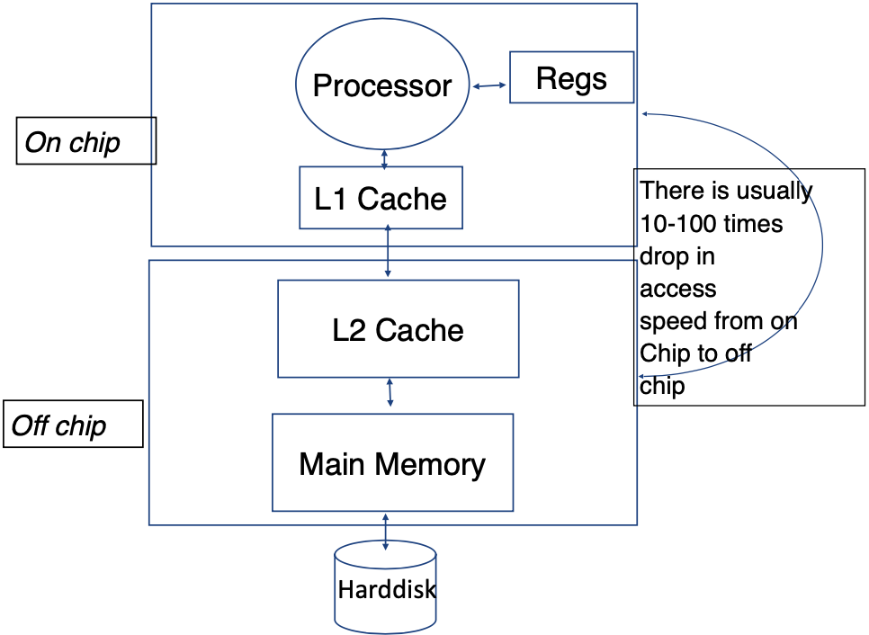

# Database Performance Metrics
The performance of a database system is evaluated based on:
1. **Efficiency (Speed)**
2. **Effectiveness**
3. **Security & Reliability**

## Efficiency
Efficiency of a database system is influenced by both hardware and software aspects:
- **Hardware**
  - Disks and I/O bandwidth
  - Main memory
  - Number of processors
  - Communication network
  - Type of architecture
- **Software/DB Tuning**
  - Types of DB
  - Indexing
  - Query optimisation
## Effectiveness
Effectiveness of a database system is determined by:
- Concurrent users: Users reading and writing over the same data
- Transactions: Required tasks are all done together
## Reliability
Reliability of a database system is ensured by:
- Crash recovery
  - Hardware:
    - Arrangement of multiple disks
    - Voting among multiple disks/modules
    - Disk block write
- Fault tolerance
- Data duplication

# Hard Disk Drive

A **hard disk drive (HDD)** is a crucial component of computing systems that provides data storage. Its structure comprises of several key elements:

- **Platter**: The entire circular disk.
- **Disk Sector**: The blue shaded area in the image above is one such example. Sectors are the smallest accessible units on a disk.
- **Track**: These are the circular rings on the platter. The red highlighted area in the image above is an example of a track.
- **Cluster**: This refers to a group of tracks and sectors, as demonstrated by the green shaded area in the image.
- **Actuator Arm**: The component that moves the head to the required position.
- **Head**: This component is responsible for reading and writing data on the disk.

Note that the disk rotates at high speed, allowing the head to read and write data at different locations.

## Disk Access Time in HDD
The formula to calculate the disk access time is as follows:

$$
\text{Disk Access Time} = \text{Seek Time} + \text{Rotational Delay} + \frac{\text{Transfer Length}}{\text{Bandwidth}}
$$

Where:
- **Seek Time**: This is the time taken by the head to move from its current position to the desired track. Also known as seek latency.
- **Rotational Delay**: The time the disk takes to rotate and bring the desired sector under the head. This is also referred to as rotational latency.
- **Transfer Length**: This refers to the amount of data to be transferred. The units for this measure can vary, such as KB, MB, GB, etc.
- **Bandwidth**: This measures the amount of data that can be transferred within a given timeframe. Its unit is Storage/Time (e.g., 4MB/S).

### Exercise
What is the Disk access time for a transfer size of 4KB, when average seek time is 12 ms, rotation delay 4 ms, transfer rate 4MB/sec?
$12ms + 4ms + \frac{4KB}{4MB/S \times 1000KB/MB}\times1000ms/S = 17ms$.

# Solid-State Drives (SSD)
Solid-State Drives (SSDs) are a type of storage device that do not have any moving parts
- **No seek/rotational latency**
- No start-up times
- Silent operation
- Faster random access times

However, SSDs also have their drawbacks. They are relatively more expensive and have certain read/write limitations. For instance, SSDs tend to be slower when overwriting data.

## Disk Access Time in SSDs
The formula to calculate the disk access time is as follows:
$$
\text{Disk Access Time} = \frac{\text{Transfer Length}}{\text{Bandwidth}}
$$

# Memory Hierarchy

- Reg: Register
- The cache, both on-chip and off-chip, facilitates faster access by reducing the frequency of hard disk accesses. The unit of measurement for cache is typically in MB. 
- Main Memory: If the system is shut down, data stored in the main memory (but not in the hard disk) will be lost. The unit of measurement for Main Memory is typically in GB.
- Hard Disk: The unit of measurement is usually in TB.
- Speed: Cache > Main Memory > Hard Disk
- Storage Capacity: Cache (in MB) < Main Memory (in GB) < Hard Disk (in TB)
- Access Sequence: Data is first requested from the cache, if not found, then from the main memory, and if still not found, finally from the hard disk.

## Effective Memory Access Time
The effective memory access time (EA) can be calculated using the following formula:

$$
EA = H \times C + (1 - H) \times M
$$

where:
- $H$ is the hit ratio (the percentage probability of finding data in the cache)
- $C$ is the cache access time
- $M$ is the memory access time
Please note that here we are referring to the L1 and L2 caches as shown in the image. This is different from the cache embedded in the hard disk, which we will discuss later.

Why don't we have larger caches? 
1. They are expensive.
2. If the processor and the cache are not on the same chip, the access time increases.

## Effective Disk Buffer Access Time
The disk cache is embedded in the disk and is different from the cache in the memory hierarchy. In other words, it's NOT the L1 or L2 cache shown in the image. It is part of the hard disk!
The effective disk buffer access time can be calculated using a similar formula:

$$
EA = HB \times BC + (1 - HB) \times D
$$

where:
- $HB$ is the hit ratio of the disk buffer
- $BC$ is the buffer access time
- $D$ is the disk access time

### Example
e.g., Assume disk access time is S, buffer access time is C, hit ratio is H, and S = 1000C. What is the effective access time, EA, expressed as a multiple of C when H = 30%?

$EA = 30\% \times C + (1 - 30\%) \times S = 0.3C + 0.7 \times 1000C = 700.3C$

