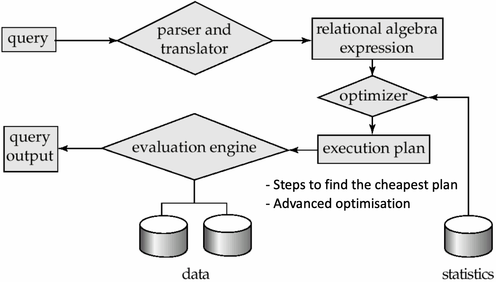

# Advanced Database Systems
## Database Management System (DBMS)

A Database Management System (DBMS) is a software system designed to store, manage, and facilitate access to databases. The complexity of managing a database system has increased due to:
- More data
- More aspects of businesses
- Data stored in various sites and accessed by many users
- More complex data types such as images, social networks, videos, etc.

## Database System Objectives

A database system should provide:

- Ability to retrieve and process the data effectively and efficiently
- Secure and reliable storage of data

## Database Performance Metrics

The performance of a database system is evaluated based on:

1. **Efficiency (Speed)**
2. **Effectiveness**
3. **Security & Reliability**

### Efficiency

Efficiency of a database system is influenced by both hardware and software aspects:

- **Hardware**
  - Disks and I/O bandwidth
  - Main memory
  - Number of processors
  - Communication network
  - Type of architecture

- **Software/DB Tuning**
  - Types of DB
  - Indexing
  - Query optimisation

### Effectiveness

Effectiveness of a database system is determined by:

- Concurrent users: Users reading and writing over the same data
- Transactions: Required tasks are all done together

### Reliability

Reliability of a database system is ensured by:

- Crash recovery
  - Hardware:
    - Arrangement of multiple disks
    - Voting among multiple disks/modules
    - Disk block write
- Fault tolerance
- Data duplication

## Basic Hardware of a Classical Disk

A classical disk operates by rapidly rotating with a magnetic head, which reads and writes data to the platter surfaces. The disk structure includes:

- Tracks: circular path on disk surface
- Tracks are subdivided into disk sectors

## Disk Access Time

Disk access time is a crucial factor in database management systems, as it determines the duration required to read data from or write data to a disk. It is computed as the sum of the seek time, rotational delay, and the time taken to transfer the data. The formula for calculating disk access time is:

$$
\text{Disk Access Time} = \text{Seek Time} + \text{Rotational Delay} + \frac{\text{Transfer Length}}{\text{Bandwidth}}
$$

The seek time delay, or seek latency, is the time taken for the head of the actuator arm to move from its current position to the required track. This delay is a physical property of a **Hard Disk Drive (HDD)** only.

The rotational delay, or rotational latency, is the waiting time for the disk's rotation to bring the required sector of a track to the head of the actuator arm. This delay is also a physical property of an **HDD** only.

## Solid-State Drives (SSD)

Solid-State Drives (SSDs) are a type of storage device that do not have any moving parts, hence the term "solid-state". They store data in grids of cells, where each grid is referred to as a block and each row in a grid is called a page. 

The lack of moving parts in SSDs leads to several advantages over HDDs:

- **No seek/rotational latency**
- No start-up times
- Silent operation
- Faster random access times

However, SSDs also have their drawbacks. They are relatively more expensive and have certain read/write limitations. For instance, SSDs tend to be slower when overwriting data.

## Disk Access Time in SSDs

Since SSDs do not have any moving parts, they do not experience seek or rotational delays. Therefore, the disk access time in SSDs is simplified to:

$$
\text{Disk Access Time} = \frac{\text{Transfer Length}}{\text{Bandwidth}}
$$

This results in SSDs being faster than HDDs for the same amount of data transfer, given that the base sequential data transfer rates are the same for the two drives. 

## Data Drives in Computers

Data drives, whether HDDs or SSDs, fit into computers as the primary storage devices. After data is read from these drives, it is passed to the processors. However, the access times for HDDs and SSDs can be high, especially when reading large amounts of data. For example, for a simple task with 1 Million bit reading from the memory, the processing time will be almost 117 minutes for HDD and almost 1 minute for SSD.

## Improving Performance

To improve the performance of data drives, we can consider several strategies. One is to improve the access time for the memory, which would require new technological design. However, SSDs are already at the limits of fast memory, and faster memories would be very expensive.

Another strategy is to change the structure of the memory. Not all the data in memory is always required, so we can design a new fast and small memory called Cache. We can then read from Cache instead of the main memory, which can significantly reduce access time. The access time for a hierarchical structure with one cache is calculated as:

$$
\text{access time} = \text{access cache} * \text{hit ratio} + \text{access mem} * (1 - \text{hit ratio})
$$

This approach balances the need for speed and cost, providing a more efficient way to access data.

### Example 

1. In a hard disk drive (HDD), the average seek time is 12 ms, rotation delay is 4 ms, and transfer rate is 4MB/sec. For simplicity we assume 1MB equals to 1000KB. 
- What will be the disk access time for a transfer size of 8MB? 
  - Disk access time for 8MB = $12 + 4 + \frac{8}{4}\times1000ms = 2016ms$
- What will be the disk access time for a transfer size of 8KB?
  - Disk access time for 8KB = $12 + 4 + \frac{8}{4 \times 1000}\times1000ms = 18ms$
- A comparison of the two cases highlights that sequentially reading large data pays off as seek time is buried under a lot of transfer time. For example, in the first case, seek time is only 0.6% of the total time while nearly all the time is spent on transferring data. In the second case, seek time is 66.7% of the total time while only a small fraction of the time is spent on data transfer.

1. In a solid state drive, what will be the disk access time for a transfer size of 8MB when transfer rate 4MB/sec? Is an SSD faster than an HDD for the same amount of data transfer (Assuming the base sequential data transfer rates are the same for the given two drives.)? Why?

- Unlike an HDD, an SSD do not have any rotating part. Hence there is no rotation delay or seek delay in an SSD. Therefore, for the same transfer rate and same amount of data transfer, an SSD is always faster than an HDD. Moreover, the data transfer rate of SSDs is usually higher than that of HDDs in general as well.
- Disk access time of SSD = $\frac{Transfer Length}{Bandwidth} = \frac{8}{4} = 2sec$

## Memory Hierarchy and Effective Memory Access Time

The memory hierarchy in a computer system describes the relationship between different types of memory, including the processor, registers, L1 and L2 cache, main memory, and hard disk. As we move from on-chip to off-chip memory, the access speed drops significantly.

The effective memory access time (EA) is a crucial metric in this context and can be calculated using the following formula:

$$
EA = H \times C + (1 - H) \times M
$$

where:
- $H$ is the hit ratio (the ratio of references satisfied by cache to total references)
- $C$ is the cache access time
- $M$ is the memory access time

This concept also applies to the disk buffer or disk cache, which is embedded in the disk and differs from the cache in the memory hierarchy. The effective disk buffer access time can be calculated using a similar formula:

$$
EA = HB \times BC + (1 - HB) \times D
$$

where:
- $HB$ is the hit ratio of the disk buffer
- $BC$ is the buffer access time
- $D$ is the disk access time

### Example

Consider two machines: Machine A has a smaller cache with a 50% cache hit ratio, and Machine B has a larger cache with a 90% cache hit ratio. However, the memory access time of Machine A is 100C, and that of Machine B is 400C, where $C$ is the cache access time. Despite Machine A having faster memory access, Machine B has a faster overall effective memory access time due to its larger cache and higher cache hit ratio.

- Effective memory access time of A: $0.5 \times C + (1 - 0.5) \times 100C = 50.5C$
- Effective memory access time of B: $0.9 \times C + (1 - 0.9) \times 400C = 40.9C$

Sure, I'd be happy to help you reorganize and format your notes. Here's a revised version of your notes:

## Database Types

1. **Simple File**
   - **Definition**: A data storage system where data is stored as a plain text file. Each line represents one record, with fields separated by delimiters (e.g., commas or tabs).
   - **Strengths**: Fast for simple applications.
   - **Weaknesses**: Less reliable and can be slow for complex applications. It requires additional code development for features that exist in relational databases and can have concurrency problems.
   - **Use Cases**: Suitable for simple applications where speed is a priority.

2. **Relational Database Systems (RDBS)**
   - **Definition**: A data storage system where data is stored as a collection of tables (relations) consisting of rows and columns. Tables in a database are related using primary/foreign key relationships.
   - **Strengths**: Very reliable, application independent optimisation, well suited to many applications, very fast due to large main memory machines and SSDs.
   - **Weaknesses**: Can be slow for some simple applications.
   - **Use Cases**: Suitable for applications requiring high reliability and speed, and those that can benefit from application independent optimisation.

3. **Object Oriented Database Systems (OODB)**
   - **Definition**: A data storage system where data is stored in the form of 'objects' directly, similar to Object Oriented Programming (OOP).
   - **Strengths**: Reliable, well suited for applications requiring complex data.
   - **Weaknesses**: Can be slow on some applications, limited application independent optimisation.
   - **Use Cases**: Suitable for applications requiring complex data structures and methods.

4. **NoSQL Databases**
   - **Key-value Storage**
     - **Definition**: A key-value database stores data as a collection of key-value pairs where a key serves as a unique identifier. All access to the database are done via the key.
     - **Strengths**: Flexible/no fixed schema, simple design, should linearly scale.
     - **Weaknesses**: Compromise consistency, allows replications, may result in stale reads.
     - **Use Cases**: Suitable if the dataset do not need complex relational table type of structure, but can be expressed with simple key-value pairs. The simple structure allows faster insertion and search, and scales quickly. For example – shopping cart in an e-commerce site.
   - **Document Storage**
     - **Definition**: Flexible for storing different kinds of documents, where they may not all have the same sections. XML, JSON, etc. are subclasses of document-oriented databases.
     - **Use Cases**: Well suited when different kinds of documents do not always have the same structure/sections. For example – news articles.
   - **Graph Storage**
     - **Definition**: Graphs capture connectivity between entities. A graph is a structure amounting to a set of objects (called vertices) where some pairs of the objects are connected/related in some sense. A connection is called an edge. The links can be material or immaterial.
     - **Use Cases**: Well suited for connection data: social network connections (e.g., who are my friends of friends) , spatial data (e.g., route planning – which ways can I go now to reach destination).

5. **Deductive Database Systems (DDBS)**
   - **Definition**: A database system that can make deductions based on rules and facts stored in the database.
   - **Strengths**: Most of the application can be developed entirely using DDBS.
   - **Weaknesses**: Many applications do not require the expressive power of these systems.
   - **Use Cases**: Applications that require rule-based deductions.

## Database Architectures

1. **Centralized (Client-Server) Database Architecture**
   - **Description**: A centralized database architecture involves a central server with a central database in one location. The client and server can be in different locations.
   - **Advantages**: Suitable for simple applications, easy to manage, simple system administration, effective optimization process.
   - **Disadvantages**: May not scale well, limited to one location.
   - **Use Cases**: Suitable for applications that can be managed centrally, such as PC/Cluster Computing/data centres.

2. **Distributed Database Architecture**
   - **Description**: In a distributed database architecture, data is distributed across several nodes in different locations.
   - **Advantages**: Scalable, can handle large data sets, provides concurrency, recovery, and transaction processing.
   - **Disadvantages**: System administration and crash recovery are difficult, potential inconsistency due to data replication.
   - **Use Cases**: Suitable for large-scale applications that require data distribution and concurrency.

3. **World Wide Web (WWW) Database Architecture**
   - **Description**: In the WWW database architecture, data is stored in many locations with several owners of data.
   - **Advantages**: Very convenient to access and share data, wide data availability.
   - **Disadvantages**: Has security issues, no guarantee on availability or consistency, ineffective optimization process, extreme levels of administration issues.
   - **Use Cases**: Suitable for applications that require wide data availability and can tolerate inconsistency.

4. **Grid Database Architecture**
   - **Description**: In a grid database architecture, data and processing are shared among a group of computer systems which may be geographically separated.
   - **Advantages**: High processing capability, access at different locations, shared data and processing.
   - **Disadvantages**: Similar issues to distributed databases, less used nowadays, administration done locally by each owner, reliability and security not well developed or studied.
   - **Use Cases**: Specific applications, such as scientific applications.

5. **Peer-to-Peer (P2P) Database Architecture**
   - **Description**: In a P2P database architecture, data and processing are shared among a group of computer systems which may be geographically separated. Nodes can join and leave the network at will.
   - **Advantages**: Suitable when the nodes of the network cannot be planned in advance, or some may leave and join frequently, shared data and processing, flexible network membership.
   - **Disadvantages**: Difficult to design transaction models due to flexible network membership, applications are usually limited to simple file sharing.
   - **Use Cases**: Specific applications, such as scientific applications, where nodes need the flexibility to join and leave the network.

6. **Cloud-Based Database Architecture**
   - **Description**: Cloud-based database architecture offers online computing, storage, and a range of new services for data and devices that are accessible through the Internet.
   - **Advantages**: On-demand resources, cost-effective, maintenance done externally by the cloud provider, user pays for the services just like phone services, electricity, etc., huge potential for developing applications with minimal infrastructure costs.
   - **Disadvantages**: Has some privacy and confidentiality issues – but most trusted providers can address any issues emerging on this type relatively easily, e.g., Amazon etc., dependence on internet connectivity.
   - **Use Cases**: Suitable for applications that require on-demand resources and services, and can benefit from the pay-as-you-go model.

## Fault Tolerance

Fault tolerance refers to the ability of a system to continue operating correctly even when some of its components fail.

## Basic Probability and Mean Time to Event

The probability of an event and the mean time to an event are fundamental concepts in understanding system reliability. Here are some key formulas:

- Probability of an event A happening in a certain period: $P(A)$
- Probability of both events A and B happening in that period (assuming A and B are independent events): $P(A \text{ and } B) = P(A) \times P(B)$
- Probability of either event A or B happening in that period: $P(A \text{ or } B) = P(A) + P(B) - P(A \times B)$ (assuming $P(A)$ and $P(B)$ are very small)
- Mean time to event A: $MT(A) = \frac{1}{P(A)}$
- If events A and B have mean times $MT(A)$ and $MT(B)$, then the mean time to the first event $MT(A \text{ or } B) = \frac{1}{P(A \text{ or } B)}$

If there are $n$ events, each with the same probability $p$, then:

- Probability that one of the events occur: $n \times p$ (assuming $p$ is small)
- Mean time to one of the events (i.e., mean time to the first event): $\frac{1}{n \times p} = \frac{1}{p} \times \frac{1}{n} = m \times \frac{1}{n} = \frac{m}{n}$(where $m = \frac{1}{p}$ is the mean time to an event)

## Module Availability

Module availability is the ratio of service accomplishment to elapsed time. It can be calculated as:

$$\text{Module Availability} = \frac{MTTF}{MTTF + MTTR}$$

where:

- $MTTF$ is the Mean Time To Failure
- $MTTR$ is the Mean Time To Repair

## Redundant Array of Independent Disks (RAID)

RAID is a method of combining multiple disks as a unit for fault tolerance or performance improvement, or both, of a database system. There are several RAID levels, each with its own advantages and disadvantages.

For graphs below, we use the following conventions:
- We use b for Bit; B for byte; 8 continuous bits = 1 byte
- A for block, 4000/8000 continuous bytes = 1 block 
- p for parity, Parity (or check bits) are used for error detection
  - P0 is parity for bytes B0 and B1, $P_i = B_{2i} \oplus B_{2i+1}$, here $\oplus$ is the exclusive-or operator

Please note that the RAID levels are not exhaustive and there are other RAID levels such as RAID 10, RAID 50, etc. that combine the features of the basic RAID levels for additional redundancy or performance.

Baseline: One Disk
- MTTF (Mean Time To Failure): 1/p
- p: Probability of failure of a disk, MTTF(disk) = 1/p

### RAID 0 (Block Level Striping)
<image alt="RAID0" src="raid0.png" width=300/>

- Data is split into blocks and spread across multiple disks.
- Advantages: Balanced I/O of disk drives, throughput approximately doubles. It has double throughput compared to one disk.
- Drawbacks: Any disk failure is catastrophic, and MTTF reduces by a factor of 2. The probability of failure is $P(failure) = P(A) + P(B) = 2p$. Thus, MTTF(Raid0) = 1/(2p) = 1/2 x MTTF(disk).

### RAID 1 (Mirroring)
<image alt="RAID1" src="raid1.png" width=300/>

- Data is duplicated across two or more disks.
- Advantages: Higher read throughput, continues to operate as long as one disk is functional, MTTF increases substantially. It has better fault tolerance, as it fails only if both disks fail.
- Drawbacks: Lower write throughput, half storage utilization, requires double storage. The probability of failure is $P(failure) = P(A and B) = P(A) * P(B) = p^2$. Hence, $MTTF(RAID1) = (1/p)^2 = MTTF(disk)^2$.

### RAID 2 (Bit Level Striping)
<image alt="RAID2" src="raid2.png" width=300/>

- Data is split into bits and spread across multiple disks.
- Advantages: Higher transfer rate. Similar to RAID 0, but stores data at the bit level.
- Drawbacks: MTTF reduced by half as in RAID 0, rarely used. MTTF for RAID 2 is the same as that for RAID 0.

### RAID 3 (Byte Level Striping)
<image alt="RAID3" src="raid3.png" width=300/>

- Data is split into bytes and spread across multiple disks, with a parity byte for error detection. 
- Advantages: Higher transfer rate than RAID 0, MTTF increases substantially as one disk failure can be recovered from the data of the other disks. The system fails if any two of the three disks fail.
- Drawbacks: Rarely used. The probability of failure is $P(failure) = {3 \choose 2}p^2 = 3p^2$. Hence, $MTTF(RAID3) = 1/3 x (1/p)^2 = 1/3 x MTTF(disk)^2$. Compared to RAID1, $MTTF(RAID3) = MTTF(RAID1)/3$, which indicates RAID1 is better.

### RAID 4 (Block Level Striping)
<image alt="RAID4" src="raid4.png" width=300/>

- Data is split into blocks and spread across multiple disks, with a dedicated disk for parity blocks.
- Advantages: Higher throughput, MTTF increases substantially. The throughput is higher as the data is stored at the block level.
- Drawbacks: Very slow writes, the dedicated parity disk has more writes as parity needs to be updated for every data write.

### RAID 5 (Block Level Striping with Parity Striping)
<image alt="RAID5" src="raid5.png" width=300/>

- Data and parity blocks are both split and spread across multiple disks. Similar to RAID 4, but Parity is distributed among all disks.
- Advantages: Higher throughput, slower writes but better than RAID 4 as parity bits are distributed among all disks and the number of write operations on average equal among all disks, MTTF increases substantially. The write speed is better compared to RAID 4.
- Drawbacks: Complex to implement and manage.

### RAID 6 (Block Level Striping with Double Parity)
<image alt="RAID6" src="raid6.png" width=500/>

- Similar to RAID 5 except two parity blocks are used. This is an extension of RAID 5 with two more disks.
- Advantages: Any two disk failures can be safe to recover the data, reliability is of the order of $MTTF^3/10$. Parities are stored in a way to insure recovery in the case of two failures, providing higher throughput.
- P0 and P1 are parity blocks for blocks A0, A1 and A2. These are computed in such way that any two disk failures can be safe to recover the data.
- Drawbacks: More complex parity calculation, slower writes due to double parity. The probability of failure is $P(Failure) = {5 \choose 3}p^3 = 10p^3$, leading to a longer MTTF: $MTTF = 1/10 x (1/p)^3 = 1/10 x MTTF(disk)^3$.

## Choosing RAID Level
Tradeoff here: 
**Higher throughput at the cost of increased vulnerability to failures.**
When choosing the suitable RAID level, the following factors should be considered:

- **Reliability**: The ability of the system to handle and recover from hardware failure.
- **Performance**: The speed at which data can be read from or written to the disk.
- **Storage Utilization**: The amount of storage space that is effectively used.
- **Price/Number of Disks**: The cost and the number of disks required.

## Storage Area Networks (SAN)

A **Storage Area Network (SAN)** is a dedicated network of storage devices. It has been the fundamental storage for data center type systems with mainframes for decades. Over time, different versions have evolved to allow for more data, but the fundamentals remain the same even today.

Key characteristics of SAN include:

- **Storage Organization**: Storage can be organized as RAID (Redundant Array of Inexpensive Disks) systems. This storage is partitioned and allocated to each system and can also be shared.
- **Usage**: SANs are used for shared-disk file systems.
- **Backup Functionality**: SANs have automated backup functionality.
- **Design Choices**: The failure probability of one disk is different than hundreds of disks, which requires design choices.

## Fault Tolerance by Voting

Fault tolerance refers to the capacity of a system to continue operation even in the event of a failure of one or more of its components. One strategy to ensure fault tolerance is through voting systems, which are particularly useful when we receive inconsistent readings or outcomes from different components. For example, imagine a system with multiple hard disks where a subset of disks read 2, while the rest read 5. In such cases, majority voting could be employed as a solution to inconsistent reads or any other actions where there is not a consensus.

Two major types of majority voting systems are:

### Failvote

In a Failvote system, a majority agreement is needed to accept an action, such as a read or write operation. For instance, if we start with 10 devices, the system works as long as 6 of them are working. An action is accepted when 6 or more devices agree on the decision. This majority is defined intuitively as half of the total number of devices plus one, or mathematically as |n/2| + 1. The system stops functioning when the 5th device fails, as there cannot be 6 devices agreeing on the decision.

### Failfast

Failfast, on the other hand, is only concerned with the majority among the working devices. It assumes that we can identify which devices are working. Hence, we can continue to operate until only 2 working devices remain. If both agree, we can proceed with the action. However, if they differ, the system stops. For example, if 0 devices are faulty, we have 10 working and we need at least 6 to agree. If 1 device is faulty, we have 9 working and we need at least 5 to agree. The system continues to operate in this manner until 8 devices are faulty, leaving 2 working devices that both need to agree. If 9 devices are faulty, we have 1 working and we have to stop as there is nothing to compare!

## Supermodule

A Supermodule is a unique system with multiple hard disk drives that is expected to function with only one working disk. It uses voting when multiple disks are working/available, but unlike the Failvote or Failfast systems, a Supermodule can still function even when only one disk is available. This adaptability allows for significant fault tolerance.

## Fault Tolerance with Repair

In systems with repair of modules, the faulty equipment is repaired with an average time of MTTR (mean time to repair) as soon as a fault is detected. Sometimes, MTTR is just the time needed to replace the faulty module. Typical values for recent disks are:

- MTTR = Few hours (assuming we stock spare disks) to 1 Day 
- MTTF = 750000 hours (~ 86 years) [hard fault]

The probability of a particular module not being available is given by $\frac{MTTR}{MTTF+MTTR}$, which approximates to $\frac{MTTR}{MTTF}$ if MTTF >> MTTR.

### Fault Tolerance of a Supermodule with Repair

The probability that $n-1$ modules are unavailable, denoted as $P_{n-1}$, is given by $\left(\frac{MTTR}{MTTF}\right)^{n-1}$.

The probability that a particular $i^{th}$ module fails, denoted as $P_f$, is $\frac{1}{MTTF}$.

The probability that the system fails with a particular $i^{th}$ module failing last equals $P_f \times P_{n-1} = \frac{1}{MTTF} \times \left(\frac{MTTR}{MTTF}\right)^{n-1}$.

The probability that a supermodule fails due to any one of the $n$ modules failing last, when other $(n-1)$ modules are unavailable, is $\frac{n}{MTTF} \times \left(\frac{MTTR}{MTTF}\right)^{n-1}$.

The values for this probability differ for failvote and failfast systems.

## Communication Reliability in Message Passing Systems

In a reliable message passing system, the communication between two nodes can be represented as a series of states. The key components of this system include:

- **Out**: Number of messages sent
- **In**: Number of messages received
- **Ack**: Number of acknowledgements

For example, the communication between Node A and Node B can be represented as follows:
<image alt="State 0: Node A (In:6, Ack:3, Out:3), Node B (Out:6, Ack:6, In:3)" src="com_01.png" width=600/>
<image alt="State 1: Node B sends message 7, Node A (In:6, Ack:3, Out:3), Node B (Out:7, Ack:6, In:3)" src="com_02.png" width=600/>
<image alt="State 2: Node A sends acknowledge 7, Node A (In:7, Ack:3, Out:3), Node B (Out:7, Ack:6, In:3)" src="com_03.png" width=600/>
<image alt="State 3: Node B receives acknowledge 7, Node A (In:7, Ack:3, Out:3), Node B (Out:7, Ack:7, In:3)" src="com_04.png" width=600/>

## Database Transaction Models

**Database Transaction Models**: Database transaction models are crucial for maintaining data consistency. The principle is that either the entire block of data is written correctly on the disk, or the block's contents remain unchanged. There are two primary methods to achieve this:

  - **Duplex Write**: Each block of data is written in two places sequentially. If one of the writes fails, another write can be issued. Each block is associated with a version number, with the block of the latest version containing the most recent data. Errors in a disk block can be determined by its CRC (Cyclic Redundancy Check). This method guarantees at least one block of consistent data.

  - **Logged Write**: Similar to duplex write, except one write goes to a log. This method is efficient if changes to a block are small.

## Disk Block Update Process

The process of updating a disk block involves several steps:

1. **Read**: The contents of the disk block are read into the main memory.
2. **Modify**: The contents in the memory are modified.
3. **Write**: The modified contents are written back to the disk in a different block. The version number of the block is updated.

For example:

<image alt="State 0: Main Memory (empty), Hard Disk (100 700 (v#7) Block 123)" src="update_disk_block_00.png" width=400/>
<image alt="State 1: Operation: read, Main Memory (100 700), Hard Disk (100 700 (v#7) Block 123)" src="update_disk_block_01.png" width=400/>
<image src="update_disk_block_02.png" width=400/>
<image alt="State 2: Operation: Modify contents in memory to say 200, contents modified to 200 in memory, update changes to disk, Main Memory (200 700), Hard Disk (100 700 (v#7) Block 123)" src="update_disk_block_03.png" width=400/>
<image src="update_disk_block_04.png" width=400/>
<image alt="State 3: Operation: Write to disk in a different block, Written to a different block, Next update will take place to Block 123 and the version number V#7 will be changed to v#9. (Two different physical disks can be used for duplex writes as well), Main Memory (200 700), Hard Disk (100 700 (v#7) Block 123; 200 700 (v#8) Block 475)" src="update_disk_block_05.png" width=400/>

## Cyclic Redundancy Check (CRC)

### Definition
The Cyclic Redundancy Check (CRC) is an error detection algorithm used in digital networks and storage devices to detect accidental changes to raw data. It is commonly used in networks and storage devices such as hard disk drives and RAM.

### How it Works
CRC involves the use of a specified polynomial and a sequence of bitwise exclusive-or (XOR) operations. The final CRC value is stored for each data block (or the data unit on which CRC is performed). The correctness of data can be checked with CRC by retrieving its corresponding CRC value and performing a sequence of bitwise XOR operations.

### CRC Generation
A CRC polynomial, such as x32 + x23 + x7 + 1, is used in the generation of the CRC. This particular polynomial can detect all burst errors with a length less than or equal to 32 bits. It can also detect 5 out of 10 billion burst errors with length 33 and 3 out of 10 billion burst errors of length 34 or more.

### CRC Calculation
To compute an n-bit binary CRC, follow these steps:

1. **Padding**: Add n zero bits as 'padding' to the right of the input bits. For example, if the input is 11010011101100, it is padded with zeros corresponding to the bit length n of the CRC: 11010011101100 000.

2. **Compute Polynomial**: Compute the (n + 1)-bit pattern representing the CRC's divisor (called a "polynomial"). For example, a 3-bit CRC with a polynomial x3 + x + 1 would have the coefficients 1, 0, 1, and 1.

3. **Position Polynomial**: Position the (n + 1)-bit pattern representing the CRC's divisor underneath the left-hand end of the input bits.

4. **Perform XOR Operations**: The algorithm acts on the bits directly above the divisor in each step. The result for each iteration is the bitwise XOR of the polynomial divisor with the bits above it. The bits not above the divisor are copied directly below for that step. The divisor is then shifted one bit to the right, and the process is repeated until the bits of the input message become zero. The remainder will be the value of the CRC function.

Example:


### Checking Validity with CRC
The validity of a received message can be verified by performing the above calculation again, this time with the check value added instead of zeroes. The remainder should equal zero if there are no detectable errors.

## Database Engine

The Database Engine is the core service for storing, processing, and securing data. It provides controlled access and rapid transaction processing to meet the requirements of the most demanding data consuming applications within your enterprise.

The process of how it works can be summarized as follows:

1. Different types of queries are received from different types of users.
2. These queries are processed by the Query Evaluation Engine.
3. The Storage Manager provides the interface between the low-level data stored in the database and the application programs and queries submitted to the system.
4. The Storage Manager implements several data structures as part of the physical system implementation: 
    - Data files (the database itself)
    - Indices (to provide fast access to data items)
    - Data dictionary (metadata)


## Query Processing

The process of query processing involves several steps:

1. The input query is received.
2. The query is parsed and translated.
3. The query is converted into a relational algebra expression.
4. An execution plan is created.
5. The plan with the least cost (fastest plan) is chosen.
6. The chosen plan is executed by the evaluation engine.
7. The output is produced.




## Relational Algebra Expressions

Relational algebra expressions are used to represent the operations involved in retrieving data from the database. For example, the SQL query:

```sql
SELECT salary
FROM Employees 
WHERE salary < 60000
```

Can be represented in relational algebra as:

$$
\pi_{salary}(\sigma_{salary<60000} (Employees))
$$

Or alternatively as:

$$
\sigma_{salary<60000} (\pi_{salary} (Employees))
$$

## Join Operations

Join operations are used to combine rows from two or more tables based on a related column between them. For example, the SQL query:

```sql
SELECT *
FROM Employees
INNER JOIN Managers
ON Employees.EmpID = Managers.EmpID;
```

Can be represented in relational algebra as:

$$
\pi_{*}(\sigma_{Employees.EmpID=Managers.EmpID} (Employees \times Managers))
$$

Join operations are very common and also very expensive in terms of computational resources. There are different types of join operations, such as inner join and outer join, but the focus here is on the inner join.

## Data Storage

Data in a database is stored in files. Each database is mapped into different files, and each file is a sequence of records. These files are then mapped into fixed-length storage units called data blocks (also known as logical blocks, or pages). The cost of a query is determined by the number of pages or disk blocks that are accessed from the disk to answer the query.

For example, if the size of each record is 55 bytes and the fixed size of one data block is 4096 bytes, the number of records that can be stored in one data block is 4096/55, which is approximately 74 records (ignoring any overheads).

## Query Processing and Optimization

Query processing and optimization involve a series of steps aimed at improving the efficiency of retrieving data from a database. This process is critical to minimizing the number of disk blocks (pages) read, thereby optimizing server resources and response times.

### Query Processing Steps
- Translation of the query to a relational algebra expression
- Creation of an execution plan

### Query Optimization
- Query optimization primarily involves making informed choices and annotations to improve the query's execution efficiency
- The ultimate goal is to minimize the estimated cost

## Steps of Cost-Based Query Optimization Process
1. **Generation of Logically Equivalent Expressions**: The first step involves generating various expressions that are logically equivalent to the given SQL statement. However, doing this exhaustively can be expensive in terms of time and space.

2. **Annotation of Resultant Expressions**: This involves annotating the resultant expressions to get alternative query plans, such as deciding between heap scan/index scan or determining the type of join algorithm.

3. **Estimation of Plan Cost**: The cost of each plan is estimated based on statistical information about tables, cost formulae for algorithms, and statistics estimation for intermediate results to compute cost of complex expressions. Factors influencing this estimation include available indices, table sizes, and other statistics.

4. **Selection of the Cheapest Plan**: The final step involves choosing the plan with the lowest estimated cost. However, it's essential to consider the interaction of evaluation techniques when choosing evaluation plans. Picking the cheapest algorithm for each operation independently may not result in the best overall algorithm. For example, although merge-join may be costlier than hash-join, it may provide a sorted output which could be useful later.

### Estimating Costs
The estimation of cost involves a two-step process:

1. **Result Size Calculation Using Reduction Factor**: For a given query, the reduction factor (RF) is calculated based on the type of predicate used.

    - For `Col = value`, RF = $\frac{1}{\text{Number of unique values (Col)}}$
    - For `Col > value`, RF = $\frac{\text{High(Col) – value}}{\text{High(Col) – Low(Col)}}$
    - For `Col < value`, RF = $\frac{\text{val – Low(Col)}}{\text{High(Col) – Low(Col)}}$
    - For `Col_A = Col_B` (for joins), RF = $\frac{1}{\text{Max number of unique values in } \mathrm{Col_A,Col_B}}$

2. **Options for Retrieving Data and Calculating Cost**: This step involves deciding how to run the query on the server. The decision is based on cost estimates influenced by table sizes, available indices, and other statistical factors.

### Real-World Scenario: Heuristic Optimization
In real-world scenarios, exhaustive cost-based optimization can be expensive. Hence, systems often use heuristic optimization, which transforms the query-tree using a set of rules that typically improve execution performance:

- Perform selections early to reduce the number of tuples
- Perform projections early to reduce the number of attributes
- Perform most restrictive selection and join operations (with smallest result size) before other similar operations

Some systems use only heuristics, while others combine heuristics with cost-based optimization. In many cases, simple heuristics are used for very cheap queries, while exhaustive enumeration is performed for more expensive queries.

### Further Optimization Techniques
- **Improved Estimation of Reduction Factors**: Better estimation of reduction factors can be achieved through sampling and histograms.

- **Adaptive Plans**: These involve waiting for some parts of a plan to execute first, then choosing the next best alternative. For instance, using hash-join if more than 100 pages are from Employees, otherwise using PNLJ.

- **Readjust Statistics**: This involves monitoring planned execution against actual and expected cardinalities, analyzing adjustments, and providing feedback to the optimizer to generate the best plan.

In summary, a good query optimizer is crucial for query efficiency, and its effectiveness depends on careful choices at each step of the optimization process. Despite some challenges, such as inaccurate result size estimations, strategic approaches such as the use of heuristics, adaptive plans, and readjusted statistics can significantly improve the optimization process.

## Joins
### Simple Nested-Loop Join
To compute a theta join, for each tuple $tr$ in $r$ and each tuple $ts$ in $s$, we test the pair $(tr,ts)$ to see if they satisfy the join condition theta (θ). If they do, we add `tr • ts` to the result. 

In this context, $r$ is called the outer relation and $s$ the inner relation of the join. This method requires no indices and can be used with any kind of join condition. However, it can be expensive since it examines every pair of tuples in the two relations. This could be cheap if performed on two small tables where they fit into main memory.

### Cost Calculation for Simple Nested-Loop Join
Consider a bank database with the following characteristics:
- Number of records of customer: 10,000, depositor: 5000
- Number of Pages of customer: 400, depositor: 100

In the worst case, if there is enough memory only to hold one page/block of each table, the estimated cost is $br + (nr ∗ bs)$ page access. Here, $br$ represents the number of blocks in relation $r$, $nr$ represents the number of records in relation $r$, and $bs$ represents the number of blocks in relation $s$.

For example, with depositor as the outer relation, the cost is $100 + (5000 ∗ 400) = 2,000,100$ page access. With customer as the outer relation, the cost is $400 + (10000 ∗ 100) = 1,000,400$ page access.

### Page-Oriented Nested-Loop Join
This is a variant of nested-loop join in which every page of the inner relation is paired with every page of the outer relation. The cost calculation is similar to the simple nested-loop join, but the estimated cost is $br + (br ∗ bs)$ page access.

For example, with depositor as the outer relation, the cost is $100 + (100 ∗ 400) = 40100$ page access. With customer as the outer relation, the cost is $400 + (400 ∗ 100) = 40400$ page access. This method is several orders of magnitude faster than the simple nested-loop join.

### Block Nested-Loop Join
This is another variant of nested-loop join in which every block of the inner relation is paired with every block of the outer relation. The cost is $br + (br ∗ bs)$ block transfers + $2 * br$ seeks. Here, $nr$ is approximated to $br$.


## Practical Approaches
- Practical query optimizers incorporate elements of the following two broad approaches:
  - Search all the plans and choose the best plan in a cost-based fashion.
  - Use heuristics to choose a plan.

## Query Costs – In Practice

- Query Store in SQL server management studio used for monitoring and managing costs.

### Troubleshooting to Manage Costs

- Identification of 'regressed queries' – pinpointing queries with worsening execution metrics.
- Real-time tracking of critical queries.

### Process 

1. Enable Query Store.
2. Let Query Store collect data.
3. Identify and fix "problematic" queries.

### Addressing Suboptimal Performance 

When a query's performance is suboptimal, possible actions include:

- Forcing a query plan instead of the one chosen by the optimizer.
- Considering the need for an index to expedite data retrieval.
- Enforcing statistic recompilation.
- Possibly rewriting the query.

#### Query Rewriting with Parameters for Execution Plan Reuse

Queries can be rewritten to utilize parameters which allows for plan reuse. Here's an example:

Original queries:

```sql
SELECT *
FROM Product
WHERE categoryID = 1;

SELECT *
FROM Product
WHERE categoryID = 4;
```

Rewritten query with parameterization:

```sql
DECLARE @MyIntParm INT SET @MyIntParm = 1
EXEC sp_executesql
N'SELECT *
FROM Product
WHERE categoryID = @Parm', N'@Parm INT',
@MyIntParm
```

In the parameterized example, we've replaced the fixed categoryID value with a variable (`@Parm`). This allows the optimizer to generate the same plan for different values of categoryID (e.g., 1, 4) and reuse it, which can improve performance.

## Lowering Query Costs Further

### Store Derived Data

- Applicable when derived values are needed frequently and data doesn't change often.

### Use Pre-Joined Tables

- Applicable when tables need to be frequently joined.
- Regularly check and update pre-joined table for updates in the original table. However, this may occasionally return some 'outdated' results.

## Efficiency in DBMS

- DBMS must efficiently support the following operations:
  - Inserting, deleting, and modifying records.
  - Reading a particular record (specified using a record ID).
  - Scanning all records (possibly with conditions on the retrieved records), or scanning a range of records.

- DBMS administrators typically create indices to facilitate almost direct access to individual items. Indices also enhance the efficiency of join operations, especially when a join condition restricts the number of items to be joined in a table.

## Data Storage on Disk

- Databases are mapped into different files, each consisting of a sequence of records.
- Each file is further divided into fixed length storage units called data blocks (also referred to as logical blocks, or pages).
- For example, if each record size is 55 bytes and the fixed size of a data block is 4096 bytes, then multiple records will be stored in one data block.

## Indexing for Efficiency

- Indexing is a key mechanism to speed up access to desired data, similar to looking up a phone book or dictionary.
- Search Key: attribute or set of attributes used to look up records/rows, such as a person's ID.
- An index file consists of records (called index entries) which contain a search-key and a pointer to the data location.
- Index files are typically smaller than the original data files, and a substantial part of them can reside in main memory, which is faster than disk storage.

## Disk Access Efficiency

- Disk access becomes faster through indexing by:
  - Retrieving records with a specified attribute value using minimal disk accesses.
  - Retrieving records with an attribute value falling within a specified range using a single seek and consecutive sequential reads.

## Criteria for Indexing

- Indexing involves a tradeoff, considering factors like:
  - Insertion time to the index.
  - Deletion time from the index.
  - Minimizing index rearrangement post insertion and deletion.
  - Considering space overhead for the index itself.

- There is no universally optimal indexing technique; each technique is best suited to particular applications.

- Two basic kinds of indices based on search keys are:
  - Ordered indices: search keys are stored in an ordered manner.
  - Hash indices: search keys are distributed uniformly across "buckets" using a hash function.

## Indices in Database Systems

- **Indices** are used to speed up the search for records in a database.
- Types: Ordered, Clustering (Primary), Non-clustering (Secondary).

Search using Indexes:
- B+ tree: Finding a particular value, finding a range of values.
- Hash index: Finding a particular value.
- Bitmap index: Finding the total number.
- Spatial indexes: Range query, nearest neighbor query.
- Quadtree.
- R-tree.

## Ordered Index

- Search keys are stored in a certain order.
- The records in the indexed file may also be sorted.
- Ordered indices help facilitate binary search, maintaining data in order.

### Clustering Index / Primary Index

- In a sequentially ordered file, the index whose search key specifies the sequential order of the file.
- The search key of a primary index is usually (but not necessarily) the primary key.

### Non-clustering Index / Secondary Index

- The index whose search key specifies an order different from the sequential order of the file.
- Secondary indices improve the performance of queries that use keys other than the search key of the clustering index.
- Hash indices and Bitmap indices are examples of secondary indices.

## B+ Trees in DBMS

- B+ trees are extensively used in DBMS for indexing, owing to their efficiency. They are among the most popular index structures in DBMS.
- B+ trees automatically reorganize themselves with small, local changes upon insertions and deletions, negating the need for periodic reorganization.

### Why B+ Trees?

- Binary search on ordered files degrades as the file grows, creating many overflow blocks.
- Keeping files in order requires periodic reorganization which is not needed with B+ trees.

### Defining a B+ Tree

- Similar to a binary tree, but with a higher fan-out defined by a number $n$.
- All root-to-leaf paths are of the same length (depth).
- Non-root or leaf nodes have between $\lceil n/2 \rceil$ and $n$ children.
- A leaf node has between $\lceil (n–1)/2 \rceil$ and $n–1$ values.
- If there are $K$ search-key values in the file, the height of the tree is at most $\lceil \log_{\lceil n/2 \rceil} K \rceil$, keeping the tree balanced.

### B+ Tree Node Structure

- Search keys in a node are ordered: $K_1 < K_2 < K_3 < ... < K_{n–1}$.
- Each node is defined as: $P_1, K_1, P_2, K_2, ..., P_{n-1}, K_{n-1}, P_n$ where $K_i$ are search-key values and $P_i$ are pointers.

### Querying a B+ Tree

- To find all records with a search-key value $k$:
  1. Start with $N =$ root.
  2. Loop until $N$ is a leaf node:
    - If there exists $K_i > k$, then set $N = P_i$.
    - If $k \geq K_{n–1}$, set $N = P_n$.
  3. If there is an $i$ such that $K_i = k$, follow pointer $P_i$ to the desired record or bucket.
  4. If no such $i$ exists, then no record with search-key value $k$ exists.

### Range Queries on B+ Trees

- B+ trees are perfect for executing range queries, enabling finding all records with search key values within a given range.

### B+ Tree File Organization

- Leaf nodes store records, rather than pointers to children.
- This organization helps maintain order during insertions/deletions/updates.

### Advantages and Disadvantages of B+ Trees

- **Advantages**: Self-reorganization, no need for entire file reorganization, higher fan-out compared to binary trees.
- **Disadvantages**: Extra overhead for insertions and deletions, space overhead.
- Despite the disadvantages, B+ trees are extensively used in DBMS due to the significant benefits they offer.

## Hash Indices

- Hash indices organize search keys and their associated record pointers into a hash file structure. The order isn't important.
- They are always secondary indices.
- The goal is to find the associated record file in one shot using the key.
- An ideal hash function should be:
  - **Uniform**: Each bucket is assigned the same number of search-key values from all possible values.
  $$\text{Probability}(\text{Bucket}_i) = \frac{1}{\text{total number of buckets}}$$
  - **Random**: Each bucket has an equal number of records regardless of the actual distribution of search-key values in the file.
- Typical hash functions perform computations on the internal binary representation of the search-key.

## Bitmap Indices

- Useful when records in a relation are numbered sequentially and the attribute has relatively few distinct values. Examples include gender, country, state, and income levels broken into ranges.
- Bitmaps are simple arrays of bits.
- Bitmap index on an attribute has a bitmap for each value of the attribute.
- Bitmap has as many bits as there are records.
- In a bitmap for a value $v$, the bit for a record is 1 if the record has value $v$ for the attribute, and 0 otherwise.
- This type of index is often used in business analysis, where aggregate data (such as the total number of a certain type) is important.

## Spatial Data and Indexing
- Spatial data is not easily accessible by simple identifiers. It often requires special indexing due to the complexity of computations, such as intersections of objects in space.
- A key issue is that there's no trivial way to sort items, especially for range queries.
- To manage this, new indices, similar to B+ trees, were developed to exponentially reduce computations by repeatedly dividing space.
- Such indices are used in Oracle Spatial and similar DBMS extensions.
- One such data structure is the Quadtree.

## Quadtrees
- Each node of a quadtree corresponds to a rectangular region of space. The top node covers the entire target space.
- Each non-leaf node divides its region into four equal-sized quadrants.
- Each such node has four child nodes corresponding to the four quadrants, and this division continues recursively until a stopping condition is met. For example, leaf nodes might contain between zero and a fixed maximum number of points.

## Transforming a k-d tree to Quadtree
- A k-d tree and quadtree both partition the space into regions. However, a k-d tree uses hyperplanes perpendicular to one of the axes at each step, while a quadtree (in 2D) always splits a region into four equal rectangles.
- Given a k-d tree, to convert it into a quadtree:
  1. For each node in the k-d tree, note the split dimension and value.
  2. In the quadtree, instead of using the k-d tree split, divide the space into four equal quadrants.
  3. Associate the points within each quadrant to the corresponding leaf nodes of the quadtree.
  4. Note that this transformation might result in quadtrees with different depth levels since k-d trees and quadtrees divide the space differently.
  
## Example of a k-d tree and describe how it can be built. 
Let's consider a set of 2D points. Here are the points: 

```
A: (2,3)
B: (5,4)
C: (9,6)
D: (4,7)
E: (8,1)
F: (7,2)
```

The construction of a 2D k-d tree involves the following steps:

1. Start at the root node, choose an axis (usually start with the x-axis), and find the median point. Let's sort the points by their x-coordinate:
    ```
    A: (2,3)
    D: (4,7)
    B: (5,4)
    F: (7,2)
    E: (8,1)
    C: (9,6)
    ```
   The median point is `B: (5,4)`. This becomes the root of the tree.

2. For the remaining points, you create two partitions - one for the points with x-values less than the root, and one for points with x-values greater than the root. 

    Points with x < 5: `A: (2,3)`, `D: (4,7)`

    Points with x > 5: `F: (7,2)`, `E: (8,1)`, `C: (9,6)`

3. Repeat the process for each partition, but switch the axis to the y-axis.

   For x < 5, sort by y: `A: (2,3)`, `D: (4,7)`. The median is `A: (2,3)`. This becomes the left child of the root.

   For x > 5, sort by y: `E: (8,1)`, `F: (7,2)`, `C: (9,6)`. The median is `F: (7,2)`. This becomes the right child of the root.

4. Repeat this process recursively for each partition, alternating the axis at each level.

Here's what the final k-d tree would look like:

```
        B (5,4)
       /      \
  A (2,3)     F (7,2)
    \           /     \
  D (4,7)  E (8,1)  C (9,6)
```

This k-d tree is efficient for various spatial queries like range searches and nearest neighbor searches because it attempts to partition the space into equal halves at each step, reducing the search space considerably at each level.

## R-Trees
- **Definition**: R-trees are an N-dimensional extension of B+-trees. They are primarily used for indexing sets of rectangles and polygons, making them incredibly useful for location data. The basic concept of an R-tree generalizes the notion of a one-dimensional interval associated with each B+-tree node to an N-dimensional interval, or an N-dimensional rectangle. 
- **Purpose**: R-trees are specifically designed for use in databases that handle geographical or spatial information.
- **Supported Variants**: There are several types of R-trees, including R+-trees and R*-trees.
- **Restrictions**: While the generalization for N > 2 is straightforward, R-trees are most effective for relatively small N.
- **Bounding Boxes**: These are the smallest possible rectangles that can contain all the rectangles/polygons associated with a given node. Overlaps between bounding boxes of the children of a node are permitted.

### Example of an R-Tree
- An R-tree represents a set of rectangles, outlined by a solid line, along with the bounding boxes (dashed line) of the nodes. The objects are grouped based on a particular rule.

### Searching in R-Trees
- **Objective**: The goal is to find data items that intersect a given query point or region, starting from the root node.
- **Process**: 
    - If the node is a leaf node, output the data items whose keys intersect the given query point or region.
    - Otherwise, for each child of the current node whose bounding box intersects the query point or region, recursively search the child.
- **Efficiency**: While this can be inefficient in the worst case (since multiple paths may need to be searched due to overlaps), it works acceptably in practice.

## Nearest Neighbor (NN) Query in R-Trees
- Running a nearest neighbor query in R-Trees is a process similar to other tree-based structures, such as Best First Search. Access is ordered with respect to the distance to the query point.
    1. Use a sorted priority queue of the R-tree nodes based on the minimum distance from the query.
    2. Traverse the node that is at the top of the priority queue and add its elements to the queue. Continue this process.
    3. Stop when the node at the top of the queue is a data object. This signifies that the first nearest neighbor has been found. 

This algorithm for finding the nearest neighbor in R-trees is known as a best-first search algorithm.

## SQL Indexing
- **Purpose**: Speeds up data retrieval operations on a database table.
- **Automatic Index Creation**: Some indexes are automatically created by the DBMS.
    - For `UNIQUE` constraint, DBMS creates a non-clustered index.
    - For `PRIMARY KEY`, DBMS creates a clustered index.
- **Index Application**: Indexes can be created on any relation or view, such as the join result of two tables.

### Index Definition in SQL
- **Create Index**: `create index <index-name> on <relation-name> (<attribute-list>)`
    - Clustered Index: `CREATE CLUSTERED INDEX index1 ON table1 (column1);`
    - Non-clustered Index with Unique Constraints: `CREATE UNIQUE INDEX index1 ON table1 (column1 DESC, column2 ASC, column3 DESC);`
- **Drop Index**: `drop index <index-name>`
- **Specialized Index**:
    - Filtered Index: `CREATE INDEX index1 ON table1 (column1) WHERE Year > ‘2010’;`
    - Spatial Index: `CREATE SPATIAL INDEX index_name ON table_name(Geometry_type_col_name) WITH ( BOUNDING_BOX = ( 0, 0, 500, 200 ) );`

## Managing Database Indexes
- There are numerous index types and many subtypes, e.g., MX-CIF quadtree and R-trees among others.
- It is not feasible to learn all index types for all data types.
- When managing a dataset:
    - Identify the potential query types.
    - Research suitable indices that the particular DBMS would support for the data type.
    - Understand which queries perform better on which index.
    - Create an index if dealing with large data.
    - Monitor the performance of the index.
    - Tune or create other indices as necessary.
- Every DBMS will have a version of the “create index” SQL statement for managing indices.

## SQL Injection

- SQL injection occurs when an application executes a database query using user-input data, and the user input or part of it is treated as an SQL statement.
- It can be prevented by using user parameterized queries or prepared statements, which allow the database to distinguish between code and data.
- User parameterized query/prepared statement example: 
  ```java
  String query = "SELECT * from login where user = " + request.getParameter("userName");
  ```

### SQL Syntax

- SQL syntax follows a specific structure and logic.
- Logical statement example: `'a'='a'` (comparison of two equal strings)
- Example: 
  ```sql
  SELECT * FROM `table` WHERE 'a'='a'
  ```
- Example of a valid SQL query:
  ```sql
  SELECT * FROM `login` WHERE `user`='farhana' AND `pass`='comp90050'
  ```
- Example of an SQL injection attack:
  ```sql
  SELECT * FROM `login` WHERE `user`='' OR 'a'='a' AND `pass`='' OR 'a'='a'
  ```

### Multi-Statements

- SQL injections can also involve multiple statements.
- Multiple statements example: `S1; S2`
- Example:
  ```sql
  SELECT * FROM `table`; DROP TABLE `table`;
  ```
- Example of a valid SQL query:
  ```sql
  SELECT * FROM `login` WHERE `user`='farhana' AND `pass`='comp90050'
  ```
- Example of an SQL injection attack:
  ```sql
  SELECT * FROM `login` WHERE `user`=''; DROP TABLE `login`; --' AND `pass`=''
  ```

### Prevention

- To prevent SQL injection attacks, it is recommended to use user parameterized queries or prepared statements.
- User parameterized query/prepared statement allows the database to differentiate between code and data.
- By using placeholders for user input, the database can ensure that the input is treated as data rather than executable code.

## Transation model - ACID properties
[Go to Database Transaction Models and ACID Properties](#database-transaction-models)

**ACID (Atomicity, Consistency, Isolation, Durability) Properties**: The ACID properties are a set of properties that guarantee reliable processing of database transactions.

  - **Atomicity**: All changes to data are performed as a single operation. Either all the changes are performed, or none of them are. E.g., transferring $100 from account A to account B either happens in its entirety (deducting from A and adding to B), or not at all.

  - **Consistency**: Any data written to the database must be valid according to all defined rules. What is considered 'consistent' depends on the application and context constraints.

  - **Isolation**: Transactions are executed as if they are the only one in the system. E.g., in an application that transfers funds, isolation ensures another transaction sees the transferred funds in one account or the other, but not in both or neither.

  - **Durability**: The system can tolerate system failures, and any committed updates should not be lost.

**Types of Actions** within these transaction models:

- **Unprotected actions**: No ACID property.

- **Protected actions**: These actions are not externalized before they are completely done. They can be rolled back if required and possess the ACID properties.

- **Real actions**: These are physical actions that once performed cannot be undone. In many situations, atomicity is not possible with real actions (e.g., firing two rockets as a single atomic action).

ACID properties might sometimes conflict with each other, yet, the system must still ensure fast access to large amounts of data, provide a secure and stable repository when things fail, offer standard interfaces for data definition and manipulation, manage multi-user access in an orderly manner, allow convenient ways for report production and browsing, and ease data loading, archiving, and performance tuning.

Certainly, here are the notes with original comments included in the code:

### Embedded SQL in C with Open Database Connectivity Example:
```C
int main() {
    exec sql INCLUDE SQLCA; // SQL Communication Area
    exec sql BEGIN DECLARE SECTION;
    // Variables for communicating between SQL and C
    int OrderID; // Employee ID (from user)
    int CustID; // Retrieved customer ID
    char SalesPerson[10]; // Retrieved salesperson name
    char Status[6]; // Retrieved order status
    exec sql END DECLARE SECTION;
    // Set up error processing, Proper error handling is important!!!
    exec sql WHENEVER SQLERROR GOTO query_error; 
    exec sql WHENEVER NOT FOUND GOTO bad_number;
    // Prompt the user for order number 
    printf ("Enter order number: "); 
    scanf_s("%d", &OrderID);
    // Execute the SQL query
    exec sql SELECT CustID, SalesPerson, Status FROM Orders
    WHERE OrderID = :OrderID // ”:” indicates to refer to C variable
    INTO :CustID, :SalesPerson, :Status;
    // Display the results
    printf ("Customer number: %d\n", CustID);
    printf ("Salesperson: %s\n", SalesPerson); 
    printf ("Status: %s\n", Status);
    exit(); 
    query_error: printf ("SQL error: %ld\n", sqlca->sqlcode); exit();
    bad_number: printf ("Invalid order number.\n"); exit(); 
}
```
**Concepts**
- **Host Variables**: Declared between `BEGIN DECLARE SECTION` and `END DECLARE SECTION`. Prefixed by a colon `:` when accessed, distinguishing them from database objects.
- **Data Types**: Host variables perform dual roles:
  - They are program variables, declared and manipulated by host language statements.
  - Used in embedded SQL to retrieve database data.
  - If no host language type matches a DBMS data type, automatic conversion is performed by the DBMS.
- **Error Handling**: Errors reported by DBMS to the applications program through an SQL Communications Area (SQLCA) using `INCLUDE SQLCA`. `WHENEVER...GOTO` statement generates error-handling code to process DBMS errors.
- **Singleton SELECT**: Returns only a single row of data. Doesn't declare or use cursors.

## Flat Transaction

- A flat transaction is a transaction model where everything inside the `BEGIN WORK` and `COMMIT WORK` is at the same level.
- It will either survive together with everything else (commit), or it will be rolled back with everything else (abort) in case of errors.
  
### Basic Example of Flat Transaction

- Creation of a table:

  ```sql
  exec sql CREATE Table accounts (
  AccId NUMERIC(9),
  BranchId NUMERIC(9), FOREIGN KEY REFERENCES branches, 
  AccBalance NUMERIC(10),
  PRIMARY KEY(AccId));
  ```

- A Debit/Credit Transaction:

  ```sql
  DCApplication()
  {
  read input msg;
  exec sql BEGIN WORK;
  AccBalance = DodebitCredit(BranchId, TellerId, AccId, delta); send output msg;
  exec sql COMMIT WORK; 
  }
  ```

- The `DodebitCredit` function:

  ```sql
  Long DoDebitCredit(long BranchId,
  long TellerId, long AccId, long AccBalance, long delta){
  exec sql UPDATE accounts
  SET AccBalance =AccBalance + :delta WHERE AccId = :AccId;
  exec sql SELECT AccBalance INTO :AccBalance FROM accounts WHERE AccId = :AccId;
  exec sql UPDATE tellers
  SET TellerBalance = TellerBalance + :delta WHERE TellerId = :TellerId;
  exec sql UPDATE branches
  SET BranchBalance = BranchBalance + :delta WHERE BranchId = :BranchId;
  Exec sql INSERT INTO history(TellerId, BranchId, AccId, delta, time)
  VALUES( :TellerId, :BranchId, :AccId, :delta, CURRENT); return(AccBalance);
  }
  ```

### Flat Transaction with Check on Account Balance

- Modification of the `DCApplication` function to prevent account overdraft:

  ```sql
  DCApplication(){
  read input msg;
  exec sql BEGIN WORK;
  AccBalance = DodebitCredit(BranchId, TellerId, AccId, delta); if (AccBalance < 0 && delta < 0){
  exec sql ROLLBACK WORK;
  } else{
  send output msg;
  exec sql COMMIT WORK;} }
  ```

### Limitations of Flat Transactions

- Flat transactions do not model many real applications (e.g. airline booking)
- Redoing the whole transaction due to failure of a single part leads to unnecessary computation.

### Solution: Save Points

- Save points can be used to address the limitations of flat transactions.
- If an error occurs, instead of rolling back the entire transaction, we can roll back to the latest save point, reducing unnecessary computations.

```sql
IncreaseSalary()
{ real percentRaise;
receive(percentRaise);
exec SQL BEGIN WORK;
exec SQL UPDATE employee
set salary = salary*(1+ :percentRaise)
send(done);
exec sql COMMIT WORK;
return }
```

This transaction could be a long running transaction. Savepoints can be used here to avoid unnecessary computation in case of a failure.

## Nested Transaction Rules

- **Commit Rule**
  - A subtransaction may commit or abort; however, the commit cannot take place unless the parent transaction itself commits.
  - A subtransaction possesses Atomicity (A), Consistency (C), and Isolation (I) properties, but not Durability (D), unless all its ancestors commit.
  - The commit of a subtransaction makes its results available only to its parent transactions.

- **Roll Back Rules**
  - When a subtransaction rolls back, it forces all its children to also roll back.

- **Visibility Rules**
  - Changes made by a subtransaction are visible to the parent only upon the subtransaction's commitment. All objects of the parent are visible to its children.
  - It's important that the parent does not modify objects while the children are accessing them to maintain consistency. This isn't a problem, as parent transactions do not run in parallel with their child transactions.

## Transaction Processing Monitor (TP Monitor)

- The primary role of a TP monitor is to coordinate other system components and manage resources.
- It oversees the transfer of data between clients and servers, decomposing applications or code into transactions and ensuring proper database updates.
- The TP monitor takes appropriate actions in the event of errors.

## TP Monitor Services

- **Heterogeneity**
  - When an application requires access to different database systems, local ACID properties of individual database systems are insufficient. 
  - The local TP monitor must interact with other TP monitors to maintain the overall ACID property. 
  - This requires employing a form of a 2-phase commit protocol.

- **Control Communication**
  - When an application communicates with remote processes, the local TP monitor should maintain the communication status among these processes to recover from a potential crash.

- **Terminal Management**
  - As many terminals run client software, the TP monitor should provide appropriate ACID properties between client and server processes.

- **Presentation Service**
  - The TP monitor must manage various presentation (user interface) software, a task similar to terminal management. 
  - Examples include X-windows and other GUI environments.

- **Context Management**
  - This involves managing sessions and similar constructs within the transactional environment.

- **Start/Restart**
  - In a TP-based system, there is no difference between start and restart operations. The TP monitor handles these in the same way.

Sure, here's the simplified and formatted notes for your content.

## Concurrency Control
- Purpose: To resolve conflicts and preserve database consistency.
- Different methods include: Dekker's Algorithm, OS supported primitives, Spin Locks.

### Dekker's Algorithm
```
int c1, c2, turn = 1; 
T1 {
  ...
  c1 = 1; turn = 2;
  repeat until { c2 == 0 or turn == 1}
  // Exclusive access to the shared resource
  counter = counter+1;
  // Release resource
  c1 = 0;
}

T2 {
  ...
  c2 = 1; turn = 1;
  repeat until { c1 == 0 or turn == 2}
  // Exclusive access to the shared resource
  counter = counter+1;
  // Release resource
  c2 = 0 ;
}
```

Dekker's algorithm
```
int turn = 0; int wants[2];
while (true) {
  wants[i] = true;
  while (wants[il) {
    if (turn == j) {
      wants[i] = false;
      while (turn == j);
      wants[i] = true;
    }
  }
  counter = counter + 1;
  turn = j;
  want[i] = false;
}
```
- Nearly no hardware support needed, but needs atomic reads and writes to main memory.
- Implementation becomes complex for more than two transactions/processes.
- Requires a lot of storage space.
- Utilizes busy waiting, efficient if lock contention is low.

### OS Supported Primitives
- Lock request is passed to the OS through an interrupt call.
- Doesn't need any special hardware but are expensive due to context save for requesting process.
- Doesn't use busy waiting, hence more effective.
- Independent of the number of processes.

### Spin Locks
- Executed using atomic machine instructions such as test and set or swap.
- Requires hardware support, should be able to lock bus for two memory cycles.
- Uses busy waiting, efficient for low lock contentions, widely used in DB systems.

### Implementation of Atomic operations
- Test and Set:
```
testAndSet(int *lock) {
  // Executed atomically
  if (*lock == 1){
    * lock = 0; 
    return (true)
  } else return (false);
}
```
- Compare and Swap:
```
cs(int *cell, int *old, int *new) {
  // Executed atomically
  if (*cell == *old) { 
    *cell = *new; 
    return TRUE;
  } else { 
    *old = *cell; 
    return FALSE;
  }
}
temp = counter;
do
new = temp+1; 
while(!cs(&counter,&temp,&new);
```

## Semaphores
- Based on train-track semaphore system
- Get() and Give() are primary operations
- Get() acquires semaphore; Give() releases semaphore

### Basic Procedure
1. Attempt Get(track); if not clear, wait
2. On successful Get(track), use it; exclusive use ensures no interference
3. After use, Release(track) for others
4. Semaphore set (blocked) when used, and cleared (unblocked) when not used

### Exclusive Mode Semaphore
- Maintains pointer to queue of processes
- Pointer points to process owning the semaphore if no waiters
- If waiters present, semaphore points to linked list of waiting processes
- Post-usage, owner process wakes up the oldest process in queue (FIFO)

### Semaphore Implementation
- struct Process { PID pid; PCB * sem_wait; } for exclusive mode
- Initialisation: void initialise(Xsemaphore *sem) {*sem = NULL; return;}
- Lock: void lock(Xsemaphore *sem)
- Unlock: void unlock(Xsemphore *sem)

### Convoy Avoiding Semaphore
- Avoids long list of waiting processes (convoy)
- Process frees the semaphore and wakes up all processes in list post-usage
- Each awakened process re-executes the routine for semaphore acquisition
- Lock: void lock(Xsemaphore *sem)
- Unlock: void unlock(Xsemphore *sem)

### Summary
Semaphores provide a mechanism for managing process access to resources. The semaphore's state, either clear or set, dictates whether a process can proceed or must wait. Specific implementations may further manage the queue of waiting processes to avoid 'convoy' situations, where many processes are waiting for resource access.

## Deadlocks

- A deadlock arises when each process is waiting for another member to release the resources it wants.
- They are rare but do occur and the database has to deal with them.

### Deadlocks Solutions

- Ensure resource abundance to prevent waiting: impractical due to resource limitations.
- Prohibit process from waiting, and implement rollback after certain time: risk of live locks which are worse than deadlocks.
- Follow linear order for resource requests: a transaction requests the ith resource first, then jth resource if j > i to avoid cyclic dependencies.

### Process Interaction and Resource Levels

- Process Pa: Holds resources at level i, requests resources at level j held by Pb. j > i
- Process Pq: Holds resources at level g, requests resources at level l held by Pd. l > g
- Process Pb: Holds resources at level j, requests resources at level k held by Pc. k > j
- Process Pc: Holds resources at level k, requests resources at level l held by Pd. l > k
- Process Pd: Holds resources at level l and is currently running.
- Given: l > k > j > i and l > g. Loops cannot exist. Dependency graph can be a tree or a linear chain, thus no cycles.

### Deadlock Avoidance/Mitigation Strategies

- Pre-declare all necessary resources and allocate in a single request.
- Check the resource dependency graph periodically for cycles. If cycles are detected, rollback (terminate) one or more transactions to remove the deadlocks. Select the transactions which have consumed fewer resources for rollback.
- Limit maximum waiting time for a lock and then enforce rollback. This approach is adopted by many successful systems (e.g., IBM, Tandem).
- Some distributed database systems only maintain local dependency graphs and use time-outs to handle global deadlocks.

### Deadlock Probability

- The probability of deadlock occurrence depends on several factors like the number of resources, number of concurrent processes, resource request and release patterns, etc. Precise computation is complex and often avoided in favor of deadlock detection and mitigation.

## Isolation in Database Systems

- Isolation, the 'I' in the ACID properties, refers to the ability of the database system to execute concurrent transactions as if they were running sequentially. This helps maintain database consistency.
- Isolation assures that each transaction runs in its own 'bubble' and is not affected by other concurrent transactions.
- This guarantees consistency, as long as each transaction itself is consistent.

### Achieving Isolation

- Sequential processing of each transaction is one way to achieve isolation. However, this is usually not efficient and results in poor response times.
- We can run transactions concurrently, which should not cause application programs to malfunction.
- The goals of concurrent execution are:
  - It should not cause application programs (transactions) to malfunction.
  - It should not result in lower throughput or longer response times than serial execution.

### Dependencies and Transaction Isolation

- In order to achieve isolation, it's important to understand the dependency of operations.
- Given a set of transactions, we can determine which transaction depends on which other transaction using a Dependency Model:
  - Ii : Set of inputs (objects that are read) of a transaction Ti
  - Oi : Set of outputs (objects that are modified) of a transaction Ti
- Dependency can be identified if the intersection of Oi and (Ij U Oj) is empty for all i ≠ j
- Note: This approach cannot always be planned ahead as in many cases inputs and outputs may be state dependent/not known beforehand.

### Formal Definition of Dependency

- A history sequence of tuples (H) of the form (T, action, object) is used to establish dependencies.
- If T1 performs an action on an object O, then T2 performs an action on the same O, and there is no write action in between by another transaction on O – then T2 depends on T1.
- Dependency Graph: In this graph, transactions are nodes, and an edge from the node Ti to Tj exists if (Ti, O, Tj) is in DEP(H), denoting Tj depends on Ti.

### Dependency Relations

- There are three scenarios for dependencies:
  - a1 = WRITE & a2 = WRITE;
  - a1 = WRITE & a2 = READ;
  - a1 = READ & a2 = WRITE (dependency as T1 may read again after a2).

### Dependency Equivalence

- DEP(H) = { (Ti, O, Tj) | Tj depends on Ti }.
- Two histories H1 and H2 contain the same tuples, H1 and H2 are equivalent if DEP(H1) = DEP(H2).
- This equivalence suggests that the final state of the database will be identical regardless of the sequence of operations in either H1 or H2.

### Isolated Histories

- A history is said to be isolated if it is equivalent to a serial history (as if all transactions are executed serially/sequentially)
- A serial history results from running transactions sequentially one by one.
- Maximum of N! serial histories can result from N transactions.
- A history is legal if it does not grant conflicting grants.
- Before(T) = {T’ | T’ << T} and After(T) = {T’| T << T’}

### Wormhole Transactions

- A transaction T’ is called a wormhole transaction if T' belongs to Before(T)∩After(T)
- That is T << T’ << T. This implies there is a cycle in the dependency graph of the history.
- Presence of a wormhole transaction implies the history is not isolated, meaning it's not a serial schedule.
- A history is serial if it runs one transaction at a time sequentially, or equivalent to a serial history.
- Wormhole theorem: A history is isolated if and only if it has no wormholes.


# Appendix

## Moore's Law and Joy's Law

Moore's Law states that the capacity of memory chips doubles approximately every 18 months since 1970. On the other hand, Joy's Law for processors states that processor performance doubles approximately every two years since 1984.

These laws have significant implications for the development of hardware and the performance of computer systems. For instance, the IBM Summit (2019) performs 200 Petaflops (200,000 trillion calculations/second), more than doubling the top speeds of the TaihuLight Supercomputer (2018) which was a year older.

## Data Storage Units

It's important to be familiar with the different units of data storage:

- Byte (B): 1
- Kilobyte (KB): $1,024^1$ or $2^{10}$ = 1,024 Bytes
- Megabyte (MB): $1,024^2$ or $2^{20}$ = 1,048,576 Bytes
- Gigabyte (GB): $1,024^3$ or $2^{30}$ = 1,073,741,824 Bytes
- Terabyte (TB): $1,024^4$ or $2^{40}$ = 1,099,511,627,776 Bytes
- Petabyte (PB): $1,024^5$ or $2^{50}$ = 1,125,899,906,842,624 Bytes
- Exabyte (EB): $1,024^6$ or $2^{60}$ = 1,152,921,504,606,846,976 Bytes
- Zettabyte (ZB): $1,024^7$ or $2^{70}$ = 1,180,591,620,717,411,303,424 Bytes
- Yottabyte (YB): $1,024^8$ or $2^{80}$ = 1,208,925,819,614,629,174,706,176 Bytes

These units are essential for understanding the capacity of different storage devices and the amount of data that can be stored in them.
