# Database Performance Metrics
The performance of a database system is evaluated based on:
1. **Efficiency (Speed)**
2. **Effectiveness**
3. **Security & Reliability**

## Efficiency
Efficiency of a database system is influenced by both hardware and software aspects:
- **Hardware**
  - Disks and I/O bandwidth
  - Main memory
  - Number of processors
  - Communication network
  - Type of architecture
- **Software/DB Tuning**
  - Types of DB
  - Indexing
  - Query optimisation
## Effectiveness
Effectiveness of a database system is determined by:
- Concurrent users: Users reading and writing over the same data
- Transactions: Required tasks are all done together
## Reliability
Reliability of a database system is ensured by:
- Crash recovery
  - Hardware:
    - Arrangement of multiple disks
    - Voting among multiple disks/modules
    - Disk block write
- Fault tolerance
- Data duplication

# Hard Disk & Memory Hierarchy
## Hard Disk Drive


A **hard disk drive (HDD)** is a crucial component of computing systems that provides data storage. Its structure comprises of several key elements:

- **Platter**: The entire circular disk.
- **Disk Sector**: The blue shaded area in the image above is one such example. Sectors are the smallest accessible units on a disk.
- **Track**: These are the circular rings on the platter. The red highlighted area in the image above is an example of a track.
- **Cluster**: This refers to a group of tracks and sectors, as demonstrated by the green shaded area in the image.
- **Actuator Arm**: The component that moves the head to the required position.
- **Head**: This component is responsible for reading and writing data on the disk.

Note that the disk rotates at high speed, allowing the head to read and write data at different locations.

### Disk Access Time in HDD
The formula to calculate the disk access time is as follows:

$$
\text{Disk Access Time} = \text{Seek Time} + \text{Rotational Delay} + \frac{\text{Transfer Length}}{\text{Bandwidth}}
$$

Where:
- **Seek Time**: This is the time taken by the head to move from its current position to the desired track. Also known as seek latency.
- **Rotational Delay**: The time the disk takes to rotate and bring the desired sector under the head. This is also referred to as rotational latency.
- **Transfer Length**: This refers to the amount of data to be transferred. The units for this measure can vary, such as KB, MB, GB, etc.
- **Bandwidth**: This measures the amount of data that can be transferred within a given timeframe. Its unit is Storage/Time (e.g., 4MB/S).

### Exercise
What is the Disk access time for a transfer size of 4KB, when average seek time is 12 ms, rotation delay 4 ms, transfer rate 4MB/sec?
$12ms + 4ms + \frac{4KB}{4MB/S \times 1000KB/MB}\times1000ms/S = 17ms$.

## Solid-State Drives (SSD)
Solid-State Drives (SSDs) are a type of storage device that do not have any moving parts
- **No seek/rotational latency**
- No start-up times
- Silent operation
- Faster random access times

However, SSDs also have their drawbacks. They are relatively more expensive and have certain read/write limitations. For instance, SSDs tend to be slower when overwriting data.

### Disk Access Time in SSDs
The formula to calculate the disk access time is as follows:
$$
\text{Disk Access Time} = \frac{\text{Transfer Length}}{\text{Bandwidth}}
$$

## Memory Hierarchy

- Reg: Register
- The cache, both on-chip and off-chip, facilitates faster access by reducing the frequency of hard disk accesses. The unit of measurement for cache is typically in MB. 
- Main Memory: If the system is shut down, data stored in the main memory (but not in the hard disk) will be lost. The unit of measurement for Main Memory is typically in GB.
- Hard Disk: The unit of measurement is usually in TB.
- Speed: Cache > Main Memory > Hard Disk
- Storage Capacity: Cache (in MB) < Main Memory (in GB) < Hard Disk (in TB)
- Access Sequence: Data is first requested from the cache, if not found, then from the main memory, and if still not found, finally from the hard disk.

### Effective Memory Access Time
The effective memory access time (EA) can be calculated using the following formula:

$$
EA = H \times C + (1 - H) \times M
$$

where:
- $H$ is the hit ratio (the percentage probability of finding data in the cache)
- $C$ is the cache access time
- $M$ is the memory access time
Please note that here we are referring to the L1 and L2 caches as shown in the image. This is different from the cache embedded in the hard disk, which we will discuss later.

Why don't we have larger caches? 
1. They are expensive.
2. If the processor and the cache are not on the same chip, the access time increases.

### Effective Disk Buffer Access Time
The disk cache is embedded in the disk and is different from the cache in the memory hierarchy. In other words, it's NOT the L1 or L2 cache shown in the image. It is part of the hard disk!
The effective disk buffer access time can be calculated using a similar formula:

$$
EA = HB \times BC + (1 - HB) \times D
$$

where:
- $HB$ is the hit ratio of the disk buffer
- $BC$ is the buffer access time
- $D$ is the disk access time

### Example
e.g., Assume disk access time is S, buffer access time is C, hit ratio is H, and S = 1000C. What is the effective access time, EA, expressed as a multiple of C when H = 30%?

$EA = 30\% \times C + (1 - 30\%) \times S = 0.3C + 0.7 \times 1000C = 700.3C$

# Type of DB systems and DB Architectures
## Database Types

### Simple File
- **Definition**: A data storage system where data is stored as a plain text file. Each line represents one record, with fields separated by delimiters (e.g., commas or tabs).
- **Strengths**: Fast for simple applications.
- **Weaknesses**: 
  - Less reliable 
  - Slow for complex applications. 
  - Requires additional code development for features that exist in relational databases. 
  - Concurrency problems for maintainging.
- **Use Cases**: Suitable for simple applications where speed is a priority.

### Relational Database Systems (RDBS)
- **Definition**: 
  - A data storage system where data is stored as a collection of tables (relations) consisting of rows and columns. 
  - Tables in a database are related using primary/foreign key relationships. Primary key could be combination of items. 
- **Strengths**: 
  - Very reliable, 
  - application independent optimisation, 
  - well suited to many applications, 
  - very fast due to large main memory machines and SSDs.
- **Weaknesses**: Can be slow for some simple applications.
- **Use Cases**: Suitable for applications requiring high reliability and speed, and those that can benefit from application independent optimisation.

### Object Oriented Database Systems (OODB)
- **Definition**: A data storage system where data is stored in the form of 'objects' directly, similar to Object Oriented Programming (OOP).
- **Strengths**: Reliable, well suited for applications requiring complex data.
- **Weaknesses**: Can be slow on some applications, limited application independent optimisation.
- **Use Cases**: Suitable for applications requiring complex data structures and methods.

### NoSQL Databases - Key-value Storage
- **Definition**: Stores data as a collection of key–value pairs, where each key is unique. Atomic updates at Key-value pair level (row update) only
- **Use Cases**: building very fast, highly parallel processing of
large data - MapReduce and Hadoop are examples

### Deductive Database Systems (DDBS)
- **Definition**: A database system that can make deductions based on rules and facts stored in the database.
- **Strengths**: Most of the application can be developed entirely using DDBS.
- **Weaknesses**: Many applications do not require the expressive power of these systems.
- **Use Cases**: Applications that require rule-based deductions.

## Database Architectures
### Centralized (Client-Server) Database Architecture
- **Description**: 
  - The central server is with database in one location. 
  - The client and server can be in different locations.
- **Advantages**: 
  - Suitable for simple applications, 
  - easy to manage, 
  - simple system administration, 
  - effective optimization process.
- **Disadvantages**: May not scale well, limited to one location.
- **Use Cases**: Suitable for applications that can be managed centrally, such as PC/Cluster Computing/data centres.

### Distributed Database Architecture
- **Description**: 
  - Data is distributed across several nodes in different locations.
  - Communicate with each other using network. 
- **Advantages**: 
  - Scalable, can handle large data sets, databases can be in different locations
  - provides concurrency, recovery, and transaction processing.
- **Disadvantages**: 
  - System administration and crash recovery are difficult, 
  - potential **inconsistency** due to data replication.
- **Use Cases**: Suitable for large-scale applications that require data distribution and concurrency.

### World Wide Web (WWW) Database Architecture
- **Description**: In the WWW database architecture, data is stored in many locations with **several owners** of data.
- **Advantages**: Very convenient to access and share data, wide data availability.
- **Disadvantages**: 
  - Has security issues, extreme levels of administration issues.
  - no guarantee on availability or consistency, 
  - ineffective optimization process, 
- **Use Cases**: Suitable for applications that require wide data availability and can tolerate inconsistency.

### Grid Database Architecture
- **Description**: In a grid database architecture, data and processing are shared among a group of computer systems which may be geographically separated.
- **Advantages**: 
  - High processing capability, 
  - access at different locations, 
  - shared data and processing.
- **Disadvantages**: Similar issues to distributed databases
  - less used nowadays, 
  - administration done locally by each owner, 
  - reliability and security not well developed or studied.
- **Use Cases**: Scientific applications.

### Peer-to-Peer (P2P) Database Architecture
- **Description**: Data and processing are shared among a group of computer systems which may be **geographically separated**. **Nodes can join and leave the network at will**. Administration is done by owner.
- **Advantages**: Suitable when the nodes of the network cannot be planned in advance, or some may leave and join frequently, shared data and processing, flexible network membership.
- **Disadvantages**: Difficult to design transaction models due to flexible network membership, applications are usually limited to simple file sharing.
- **Use Cases**: Specific applications, such as scientific applications, where nodes need the flexibility to join and leave the network.

### Cloud-Based Database Architecture
- **Description**: Cloud-based database architecture offers online computing, storage, and a range of new services for data and devices that are accessible through the Internet. 
- **Advantages**: 
  - Pay as you go, On-demand resources, cost-effective, 
  - maintenance done externally by the cloud provider, 
  - user pays for the services just like phone services, electricity, etc., huge potential for developing applications with minimal infrastructure costs.
- **Disadvantages**: Has some privacy and confidentiality issues – but most trusted providers can address any issues emerging on this type relatively easily, e.g., Amazon etc., dependence on internet connectivity.
- **Use Cases**: Suitable for applications that require on-demand resources and services, and can benefit from the pay-as-you-go model.

# Fault Tolerance Introduction
## Basic Probability and Mean Time to Event

The probability of an event and the mean time to an event are fundamental concepts in understanding system reliability. Here are some key formulas:

- Probability of an event A happening in a certain period: $P(A)$
- Probability of both events A and B happening in that period (assuming A and B are independent events): $P(A \text{ and } B) = P(A) \times P(B)$
- Probability of either event A or B happening in that period: $P(A \text{ or } B) = P(A) + P(B) - P(A \times B)$ (assuming $P(A)$ and $P(B)$ are very small)
- Mean time to event A: $MT(A) = \frac{1}{P(A)}$
- If events A and B have mean times $MT(A)$ and $MT(B)$, then the mean time to the first event $MT(A \text{ or } B) = \frac{1}{P(A \text{ or } B)}$

If there are $n$ events, each with the same probability $p$, then:

- Probability that one of the events occur: $n \times p$ (assuming $p$ is small)
- Mean time to one of the events (i.e., mean time to the first event): $\frac{1}{n \times p} = \frac{1}{p} \times \frac{1}{n} = m \times \frac{1}{n} = \frac{m}{n}$(where $m = \frac{1}{p}$ is the mean time to an event)

## Module Availability
Module availability is the ratio of service accomplishment to elapsed time.

It can be calculated as:
$$\text{Module Availability} = \frac{MTTF}{MTTF + MTTR}$$
where:
- $MTTF$ is the Mean Time To Failure, which is **up time** before a failure happens
- $MTTR$ is the Mean Time To Repair, which is **down time** after a failure happens

# Redundant Array of Independent Disks (RAID)

RAID is a method of combining multiple disks as a unit for fault tolerance or performance improvement, or both, of a database system.

For graphs below, we use the following conventions:
- We use b for Bit; B for byte; 8 continuous bits = 1 byte
- A for block, 4000/8000 continuous bytes = 1 block 
- p for parity, Parity (or check bits) are used for error detection
  - P0 is parity for bytes B0 and B1, $P_i = B_{2i} \oplus B_{2i+1}$, here $\oplus$ is the exclusive-or operator

Please note that the RAID levels are not exhaustive and there are other RAID levels such as RAID 10, RAID 50, etc. that combine the features of the basic RAID levels for additional redundancy or performance.

Baseline: One Disk
- MTTF (Mean Time To Failure): 1/p
- p: Probability of failure of a disk, MTTF(disk) = 1/p

## RAID 0 (Block Level Striping)
<image alt="RAID0" src="raid0.png" width=300/>

- Data is split into blocks and spread across multiple disks.
- Note the data is stored in a zig-zag way (A0, A2, A4, A6 in Disk 1, A1, A3, A5, A7 in Disk 2)
- Advantages: Balanced I/O of disk drives, throughput approximately doubles. It has double throughput compared to one disk.
- Drawbacks: Any disk failure is catastrophic, and MTTF reduces by a factor of 2. The probability of failure is $P(failure) = P(A) + P(B) = 2p$. Thus, MTTF(Raid0) = 1/(2p) = 1/2 x MTTF(disk).

## RAID 1 (Mirroring)
<image alt="RAID1" src="raid1.png" width=300/>

- Data is duplicated across two or more disks.
- Advantages: Higher read throughput, continues to operate as long as one disk is functional, MTTF increases substantially. It has better fault tolerance, as it fails only if both disks fail.
- Drawbacks: Lower write throughput, half storage utilization, requires double storage. The probability of failure is $P(failure) = P(A and B) = P(A) * P(B) = p^2$. Hence, $MTTF(RAID1) = (1/p)^2 = MTTF(disk)^2$.

## RAID 2 (Bit Level Striping)
<image alt="RAID2" src="raid2.png" width=300/>

- Data is split into bits and spread across multiple disks.
- Advantages: Higher transfer rate. Similar to RAID 0, but stores data at the bit level.
- Drawbacks: MTTF reduced by half as in RAID 0, rarely used. MTTF for RAID 2 is the same as that for RAID 0.

## RAID 3 (Byte Level Striping)
<image alt="RAID3" src="raid3.png" width=300/>

- Data is split into bytes and spread across multiple disks, with a parity byte for error detection. 
- Advantages: Higher transfer rate than RAID 0, MTTF increases substantially as **one disk failure can be recovered from the data of the other disks**. The system fails if any two of the three disks fail.
- Drawbacks: Rarely used. The probability of failure is $P(failure) = {3 \choose 2}p^2 = 3p^2$. Hence, $MTTF(RAID3) = 1/3 \times (1/p)^2 = 1/3 \times MTTF(disk)^2$. Compared to RAID1, $MTTF(RAID3) = MTTF(RAID1)/3$, which indicates RAID1 is better.

## RAID 4 (Block Level Striping)
<image alt="RAID4" src="raid4.png" width=300/>

- Data is split into blocks and spread across multiple disks, with a dedicated disk for parity blocks.
- Advantages: Higher throughput, MTTF increases substantially. The throughput is higher as the data is stored at the block level.
- Drawbacks: Very slow writes, the dedicated parity disk has more writes as parity needs to be updated for every data write.

## RAID 5 (Block Level Striping with Parity Striping)
<image alt="RAID5" src="raid5.png" width=300/>

- Data and parity blocks are both split and spread across multiple disks. Similar to RAID 4, but Parity is distributed among all disks.
- Advantages: Higher throughput, slower writes but better than RAID 4 as parity bits are distributed among all disks and the number of write operations on average equal among all disks, MTTF increases substantially. The write speed is better compared to RAID 4.
- Drawbacks: Complex to implement and manage.

## RAID 6 (Block Level Striping with Double Parity)
<image alt="RAID6" src="raid6.png" width=500/>

- Similar to RAID 5 except two parity blocks are used. This is an extension of RAID 5 with two more disks.
- Advantages: Any two disk failures can be safe to recover the data, reliability is of the order of $MTTF^3/10$. Parities are stored in a way to insure recovery in the case of two failures, providing higher throughput.
- P0 and P1 are parity blocks for blocks A0, A1 and A2. These are computed in such way that any two disk failures can be safe to recover the data.
- Drawbacks: More complex parity calculation, slower writes due to double parity. The probability of failure is $P(Failure) = {5 \choose 3}p^3 = 10p^3$, leading to a longer MTTF: $MTTF = 1/10 x (1/p)^3 = 1/10 x MTTF(disk)^3$.

## Choosing RAID Level
Tradeoff here: 
**Higher throughput at the cost of increased vulnerability to failures.**
When choosing the suitable RAID level, the following factors should be considered:

- **Reliability**: The ability of the system to handle and recover from hardware failure.
- **Performance**: The speed at which data can be read from or written to the disk.
- **Storage Utilization**: The amount of storage space that is effectively used.
- **Price/Number of Disks**: The cost and the number of disks required.

# Fault Tolerance by Voting
### Definition of majority here
if n nodes, then:
- if n is odd, majority means $\frac{(n + 1)}{2}$
- if n is even, majority means $\frac{n}{2} + 1$

## Failvote
The system works as long as majority of them are working, stops if there are no majority agreement.

e.g. 3 node. 
- Majority = (3 + 1) / 2 = 2, 
- 1 is down, 2 is up, then system works
- 2 is down, 1 is up, then system stops

e.g. 4 node
- Majority = 4 / 2 + 1 = 3
- 1 is down, 3 is up, then system works
- 2 is down, 2 is up, then system stops

## Failfast
The system stop if there are no majority of available modules/nodes. Here available means not down.

e.g. 3 node. 
- 1 is down, 2 is up, Majority = 2 / 2 + 1 = 2, then system works
- 2 is down, 1 is up, Majority = (1 + 1) / 2 = 1, then system stops as **nothing to compare**

e.g. 4 node
- 1 is down, 3 is up, Majority = (3 + 1) / 2 = 2, then system works
- 2 is down, 2 is up, Majority = 2 / 2 + 1 = 2, then system works
- 3 is down, 1 is up, Majority = 1, then system stops as **nothing to compare**

## Supermodule
The system stops if all nodes are down, a Supermodule can still function even when only one disk is available. This adaptability allows for significant fault tolerance.

### Fault Tolerance with Repair

In systems with repair of modules, the faulty equipment is repaired with an average time of MTTR (mean time to repair) as soon as a fault is detected. Sometimes, MTTR is just the time needed to replace the faulty module. Typical values for recent disks are:

- MTTR = Few hours (assuming we stock spare disks) to 1 Day 
- MTTF = 750000 hours (~ 86 years) [hard fault]

The probability of a particular module not being available is given by $\frac{MTTR}{MTTF+MTTR}$, which approximates to $\frac{MTTR}{MTTF}$ if MTTF >> MTTR.

### Fault Tolerance of a Supermodule with Repair

The probability that $n-1$ modules are unavailable, denoted as $P_{n-1}$, is given by $\left(\frac{MTTR}{MTTF}\right)^{n-1}$.

The probability that a particular $i^{th}$ module fails, denoted as $P_f$, is $\frac{1}{MTTF}$.

The probability that the system fails with a particular $i^{th}$ module failing last equals $P_f \times P_{n-1} = \frac{1}{MTTF} \times \left(\frac{MTTR}{MTTF}\right)^{n-1}$.

The probability that a supermodule fails due to any one of the $n$ modules failing last, when other $(n-1)$ modules are unavailable, is $\frac{n}{MTTF} \times \left(\frac{MTTR}{MTTF}\right)^{n-1}$.

The values for this probability differ for failvote and failfast systems.

# Communication Reliability

In a reliable message passing system, the communication between two nodes can be represented as a series of states. The key components of this system include:

- **Out**: Number of messages sent
- **In**: Number of messages received
- **Ack**: Number of acknowledgements

For example, the communication between Node A and Node B can be represented as follows:
<image alt="State 0: Node A (In:6, Ack:3, Out:3), Node B (Out:6, Ack:6, In:3)" src="com_01.png" width=600/>
<image alt="State 1: Node B sends message 7, Node A (In:6, Ack:3, Out:3), Node B (Out:7, Ack:6, In:3)" src="com_02.png" width=600/>
<image alt="State 2: Node A sends acknowledge 7, Node A (In:7, Ack:3, Out:3), Node B (Out:7, Ack:6, In:3)" src="com_03.png" width=600/>
<image alt="State 3: Node B receives acknowledge 7, Node A (In:7, Ack:3, Out:3), Node B (Out:7, Ack:7, In:3)" src="com_04.png" width=600/>
In above example, if B did not receive 7: ack, B will wait for some time, then send 7:msg again. Keep doing this until receive 7: ack. 

If two nodes want to communicate with each other, how to make sure the data sent is correctly?
- Stable storage – data in stable storage is durable and not be lost easily 
- Acknowledgement info

# Duplex Write & Logged Write
## Atomicity
All changes to data are performed as if they are a single operation. That is, all the changes are performed, or none of them are. 

e.g., A transfer $100 to B.
- A -100
- B +100
- log A transfer $100 to B.

## Atomic Disk Write – Duplex Write

- Each block of data is written in two places sequentially
- If one of the writes fail, system can issue another write
- Each block is associated with a version number. The block with the latest version number contains the most recent data.
- While reading - we can determine error of a disk block by its **CRC**.
- It always guarantees at least one block has consistent data.

## Example
State 0: Main Memory (empty), Hard Disk (100 700 (v#7) Block 123)

State 1: Operation: read, Main Memory (100 700), Hard Disk (100 700 (v#7) Block 123)


State 2: Operation: Modify contents in memory to say 200, contents modified to 200 in memory, update changes to disk, Main Memory (200 700), Hard Disk (100 700 (v#7) Block 123)


State 3: Operation: Write to disk in a different block, Written to a different block, Next update will take place to Block 123 and the version number V#7 will be changed to v#9. (Two different physical disks can be used for duplex writes as well), Main Memory (200 700), Hard Disk (100 700 (v#7) Block 123; 200 700 (v#8) Block 475)


## Logged write
- similar to duplex write, except one of the writes goes to a log. 
- Log – durable & can be read quickly
- This method is very efficient if the changes to a block are small. 

# CRC Calculation
To compute an n-bit binary CRC, follow these steps:

1. **Padding**: Add n zero bits as 'padding' to the right of the input bits. For example, a 3-bit CRC with a polynomial $x^3 + x + 1$ should add 000 to the right ofthe input bits.
2. **Compute Polynomial**: Compute the (n + 1)-bit pattern representing the CRC's divisor (called a "polynomial"). For example, a 3-bit CRC with a polynomial $x^3 + x + 1$ would have the coefficients 1, 0, 1, and 1. i.e. $1 \times x^3 + 0 \times x^2 + 1 \times x^1 + 1 \times x^0$

3. **Position Polynomial**: Position the (n + 1)-bit pattern representing the CRC's divisor underneath the left-hand end of the input bits.

4. **Perform XOR Operations**: The algorithm acts on the bits directly above the divisor in each step. The result for each iteration is the bitwise XOR of the polynomial divisor with the bits above it. The bits not above the divisor are copied directly below for that step. The divisor is then shifted one bit to the right, and the process is repeated until the bits of the input message become zero. The remainder will be the value of the CRC function.

Example:


# Database Engine (Database management system)
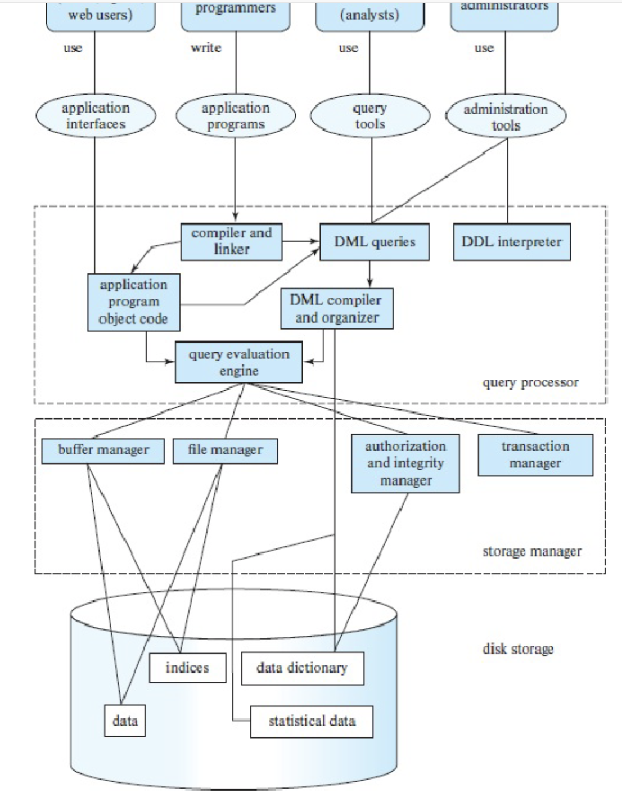
In the image shown, only the: query evaluation engine, file manager, buffer manager, indices and data will affect performance. 

# Relational Algebra & Join
Table – “Employee”
|ID|Name|Age|
|---|---|---|
|1001|A|25|
|1002|B|32|
|1003|C|19|
|1004|D|27|
|1005|E|40|
|1006|F|36|

Table - "Manager"

|   ID  | Department |
|-------|------------|
| 1001  |     a      |
| 1003  |     b      |
| 1004  |     c      |
| 1006  |     d      |

Table - "Location"

|   ID  | Country   |   City     |
|-------|-----------|------------|
| 1001  |  China    |  Beijing   |
| 1002  | Australia | Melbourne  |
| 1004  |  China    |  Shanghai  |
| 1006  | Australia |   Sydney   |

- Attribute (column) 
- Record (row) 
- Query
  - Please tell me the name of all managers located in Australia => B, D, E, F
  - please tell me the name of all employees who is over 25 => join, => A, C, D, F
    ```
    Select Name
    from (Employee inner join Manager) On Employee.ID = Manager.ID;
    ```
  - please tell me the name of all managers Join => join => F
    ```
    SELECT A.Name
    FROM Employee A
    INNER JOIN Location L ON A.ID = L.ID
    WHERE L.Country = 'Australia';
    ```

## Join
Join is a very common and very expensive operation

Different types of join: inner join, outer join... (we focus on inner join)
Natural join: a join operation that can be performed of a column that is common in two tables.

$r \bowtie_θ s$
- r: **outer** relation
- s: **inner** relation
- r and s are two tables
- Theta θ is the common column.

## Relational Algebra Expressions
### Overview
```sql
Select A1, A2, ..., An
An From r1, r2, ..., rm 
Where P
```
.... Is same as the following in relational algebra expression: 
$$
\Pi_{A_1, A_2, ..., A_n}(\sigma_P(r_1 \times r_2 \times ... \times r_m))
$$

### Example
```sql
Select *
From r1
Inner Join r2 on T1.a = T2.b
```

```sql
SELECT salary
FROM Employees
INNER JOIN Managers
ON Employees.EmpID = Managers.EmpID;
```
.... Is same as the following in relational algebra expression: 
$$
\Pi_{\text{salary}}(\sigma_{\text{Employees.EMPID}=\text{Managers.EMPID}}(\text{Employees} \times \text{Managers}))
$$

### Example
```sql
Select salary
From Employees Where salary < 60000
```
Is same as the following in relational algebra expression:

$$
\Pi_{salary}(\sigma_{salary<60000}(Employees))
$$
Can also be written as:
$$
\sigma_{salary < 60000} (\Pi_{salary} (Employees))
$$

# Two types of Join Algorithm
## How data is stored in disk?
- Files – A database is mapped into different files. A file is a sequence of records.
- Data blocks – Each file is mapped into fixed length storage units, called data blocks (also called logical blocks, or pages)

e.g., size of each record: 55 byte; fixed size of 1 data block: 4096 byte

$4096 \div 55 = 74.47$, note that one record cannot be splitted into 2 blocks, so each block can only store 74 records

## Nested Loop Join
```sql
for each tuple tr in r do begin
    for each tuple ts in s do begin
        test pair (tr,ts) to see if they satisfy the join condition theta (θ)
        if they do, add tr • ts to the result. 
    end
end
```
- Requires no indices because it checks everything in r against everything in s
- Expensive since it **examines every pair of tuples** in the two relations.
- Could be cheap if you do it on two small tables where they fit to main memory (disk brings the whole tables with first block access).
- In the worst case, if there is enough memory only to hold one block of each table, the estimated cost is
  - $n_r \times b_s + b_r$ page access, and
  - Here $n_r$ is: for each record in r, we need to find $b_s$. Once we find the starting point of $b_s$ we can sequentially read. 

## Page-Oriented Nested-Loop Join
```sql
for each page Br of r do begin
    for each page Bs of s do begin
        for each tuple tr in Br do begin 
            for each tuple ts in Bs do begin
                Check if (tr,ts) satisfy the join condition
                if they do, add tr • ts to the result.
            end 
        end
    end 
end
```
- Variant of nested-loop join in which every page of inner relation is paired with every page of outer relation.
- In the worst case, if there is enough memory only to hold one page/block of each table, the estimated cost is 
  - $b_r + (b_r \times b_s)$ Page access

## Example of simple and page-oriented calculation
Let’s see an example with the following bank database:
- Number of records of customer: 10,000 depositor: 5000
- Number of Pages of customer: 400 depositor: 100

### Simple Nested-Loop Join
- With depositor as the outer relation: 100 + (5000 ∗ 400) = 2,000,100 page access,
- With customer as the outer relation: 400 + (10000 ∗ 100) = 1,000,400 page access

### Page-oriented Nested-Loop Join
- With depositor as the outer relation: 100 + (100 ∗ 400) = 40100 page access,
- With customer as the outer relation: 400 + (400 ∗ 100) = 40400 page access

# Query Cost & Query Optimization
1. Parse query to relational algebra expression
2. Use optimizer and get execution plan
3. execute and get output

## Transaction Processing at core of RDBS
Definition: A transaction is a collection of operations that need to be performed as a complete unit. (e.g., A transfers $100 to B)

Structure of a transaction
```
begin_transaction()
    <sequence of operations to be performed>
    if (successful)
        commit_trans()
    else
        rollback()
end_transaction()
```

## Transaction Models - ACID Properties
- Atomicity: all the changes are performed, or none of them are performed. Achieved by Duplex Write
- Consistency: any data written to the database must be valid according to all defined rules 
  - e.g., student ID is the **primary key**, then no duplicate student ID 
  - What is ‘consistent’, depends on the application and context constraints. 
  - primary key is the only attribute that distinguishes records, i.e. no same primary keys among records.
- Isolation: transaction are executed as if it is the only one in the system 
  - e.g., in an application that transfers funds from one account to another, the isolation ensures that another transaction sees the transferred funds in one account or the other, but not in both, nor in neither.
- Durability: the system should tolerate system failures and any committed updates should not be lost.

ACID properties might sometimes conflict with each other, yet, the system must still ensure:
- fast access to large amounts of data, 
- provide a secure and stable repository when things fail, 
- offer standard interfaces for data definition and manipulation, 
- manage multi-user access in an orderly manner, 
- allow convenient ways for report production and browsing, 
- and ease data loading, archiving, and performance tuning.

## Query Optimisation Example - 2021Win Question 10
In the following figure we see two equal expressions a query optimizer is looking at to decide which one to run eventually:
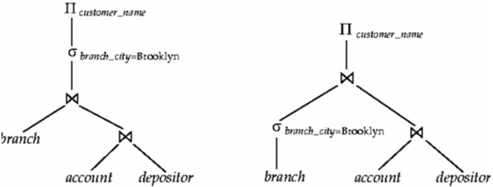
$$
\Pi_{customer\_name}\sigma_{branch_city=Brooklyn}\bowtie(branch, \bowtie(account, depositor))
$$
$$
\Pi\bowtie(\sigma_{branch\_city=Brooklyn}, \bowtie(account, depositor))
$$
Please describe which one of these plans the optimizer should choose and why. Is this choice true in general? If so, where in query optimization such an observation can be used? Briefly explain.

**Answer**: In this case, it would be advantageous for the optimizer to choose the second plan. By applying the selection operation (σ) to the branch table first, it can significantly reduce the size of this table before executing the join operation (⨝). This would likely result in less computational resources required for the join operation, thereby making the overall query execution more efficient.

## How do query optimizer make the choices?
Steps in cost-based query optimization
1. Generate logically equivalent expressions of the SQL statement 
2. Annotate resultant expressions to get alternative query plans 
3. Choose the cheapest plan based on the estimated cost

## Estimation of plan cost based on:
- Statistical information about tables. Example: number of distinct values for an attribute
- Statistics estimation for intermediate results to compute cost of complex expressions
- Cost formulae for algorithms, computed using statistics again

## How to generate alternatives?
- Query optimizers use equivalence rules to systematically generate expressions equivalent to the given expression
- Note: SQL does not give this power and hence relational algebra is use which is procedural
- One can generate all equivalent expressions exhaustively
- The above approach is very expensive in space and time though (In query optimizer some expressions are not generated if they are for sure very complex)

## How to choose?
- Must consider the interaction of evaluation techniques when choosing evaluation plans
- Choosing the cheapest algorithm for each operation independently may
not yield best overall algorithm
- E.g., merge-join may be costlier than hash-join, but may provide a sorted output which could be useful later (the sorted result may be benefit to the later operation)

## In Real Life
- Practical query optimizers incorporate elements of the following two broad approaches:
  1. Search all the plans and choose the best plan in a cost-based fashion.
  2. Uses heuristics to choose a plan.
- Systems may use heuristics to reduce the number of choices that must be made in a cost-based fashion (because cost-based optimization is expensive)
- Heuristic optimization transforms the query-tree by using a set of rules that typically (but not in all cases) improve execution performance:
  1. Perform selections early (reduces the number of tuples)
  2. Perform projections early (reduces the number of attributes) 
  3. Perform most restrictive selection and join operations (i.e. with smallest result size) before other similar operations
- Some systems use only heuristics, others combine heuristics with cost-based optimization
- Optimizers often use simple heuristics for very cheap queries, and perform exhaustive enumeration for more expensive queries

# Manage Query Cost in Practice
Troubleshooting to manage costs (e.g., Query Store in Microsoft) 

(Query store: SQL server management studio for monitoring)
- Identify ‘regressed queries’ - Pinpoint the queries for which execution metrics have recently regressed (for example, changed to worse).
- Track specific queries - Track the execution of the most important queries in real time. (e.g., most frequently asked queries)

When you identify a query with suboptimal performance
- Force a query plan instead of the plan chosen by the optimizer 
- Do we need an index? --- quickly find the data in the query
- Enforce statistic recompilation
- Rewrite query? (with parameters)

## Parameter in query
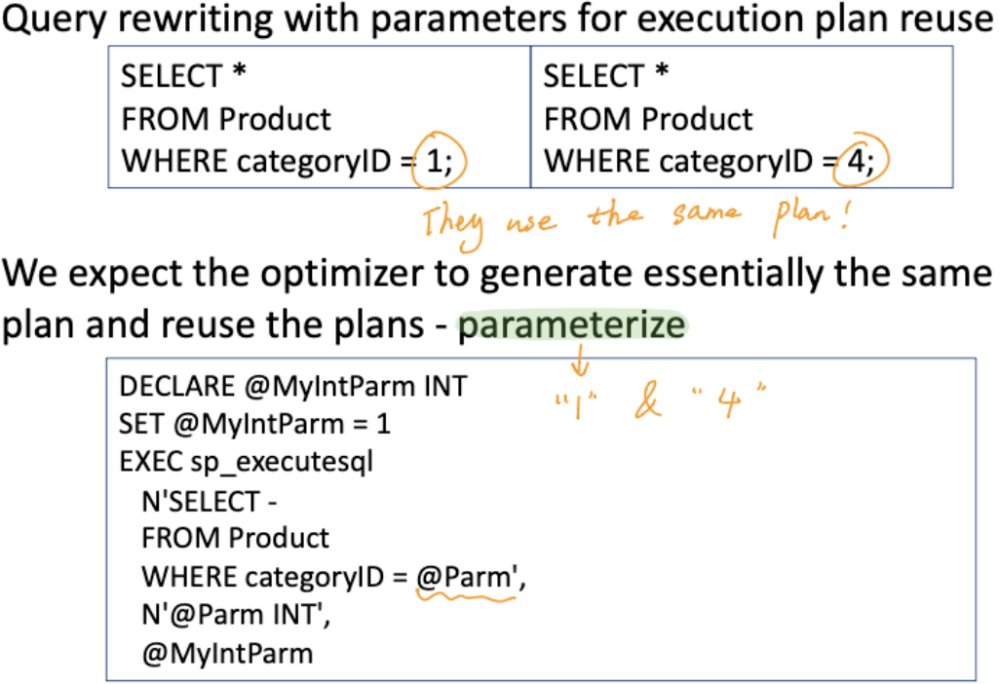
## To further lower query cost
- Store derived data
  - When you frequently need derived values 
  - Original data do not change frequently
- Use pre-joined tables
  - When tables need to be joined frequently
  - Regularly check and update pre-joined table for updates in the original table May still return some ‘outdated’ result (pre-joined tables are not updated)

# Indexing
- DBMS admin generally creates indices to allow almost direct access to individual items (index = indice)
- DBMS must support 
  - insert/delete/modify record
  - read a particular record (specified using record id) 
  - scan all records (possibly with some conditions on the records to be retrieved), or scan a range of records

## Indexing overview
- Indexing mechanisms used to speed up access to desired data in a similar way to look up a phone book or dictionary
- **Search Key** - **attribute** or **set of attributes** used to look up records/rows in a system like an ID of a person (The ID will take us to get the entire record)
- An index file consists of records (called index entries) of the form search- key, pointer to where data is
- Index files are typically much smaller than the original data files and many parts of it are already in main memory (main memory is faster than disk)

## Indexing makes Disk Access Time become faster through
- records with a **specified value** in the attribute accessed with minimal disk accesses (e.g., Student ID = 101, the index file tells us which data block in disk to go)
- records with an attribute value falling in a specified range of values can be retrieved with a single seek and then consecutive sequential reads (e.g., ID:100-200, find where is the first record (single seek of starting block), then read sequentially)
- Note: not all DB stores sequential data sequentially, so this method may not useful for some DB

## Criteria to choose index – always tradeoff
- Insertion time to index is also important
- Deletion time is important as well
- No big index rearrangement after insertion and deletion 
- Space overhead needs to be considered for the index itself
- No single indexing technique is the best. Rather, each technique is best suited to particular applications.

## Types of indices based on search keys
Ordered indices – Search keys are stored in some order
  - Clustering index / primary index
  - Non-clustering index / secondary index 
- Hash indices – Search keys are distributed 
- **B+ tree**
- Bitmap index
- Trees for maps
  - Quadtree (k-d tree)
  - R-tree

## Clustering Index / Primary Index
- in a sequentially **ordered file**, the index whose **search key** specifies the sequential order of the file
- The search key of a primary index is usually but not necessarily the **primary key**
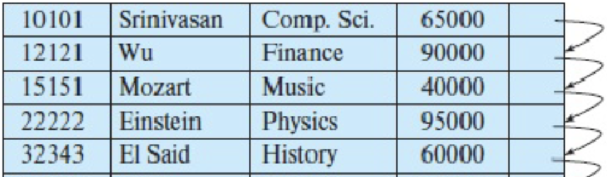
As shown in graph, the order is sorted

## Non-clustering Index / Secondary Index
- An index whose **search key specifies an order** different from the sequential order of the file
- Secondary indices improve the performance of queries that use keys other than the search key of the clustering index.
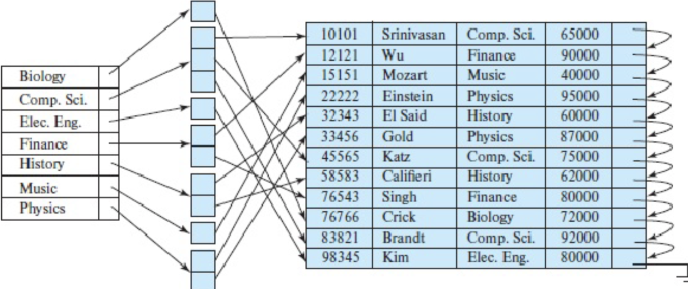
As shown in graph, the search key here is the major

## Hash indices
- search keys are distributed hopefully uniformly across “buckets” using a “function”
- A hash index organizes the search keys, with their associated record pointers, into a hash file structure. Order is not important.
- Given a key the aim is to find the related record on file in one shot which is important.
- An ideal hash function is **uniform**, i.e., each bucket is assigned the same number of search-key values from the set of all possible values.
- Ideal hash function is **random**, so each bucket will have the same number of records assigned to it irrespective of the actual distribution of search-key values in the file. 
- Typical hash functions perform computation on the internal binary representation of the search-key.
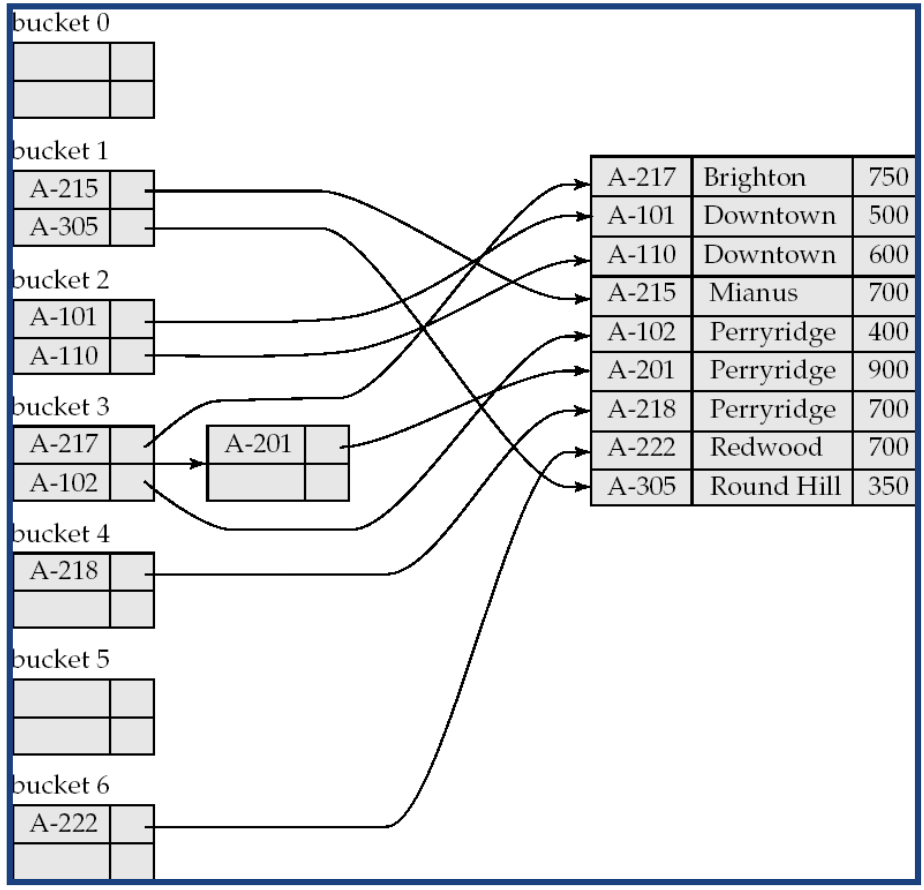
- The expected hash function should return 0-6 evenly since there are 7 buckets. 
- Goes to which bucket here determined by Hash function return value, e.g. Hash(A-215) = 1

## Bitmap index
- Records in a relation are assumed to be numbered sequentially from, say, 0 
- Applicable on attributes that take on a relatively small number of distinct Values
  - E.g. gender, country, state, ...
  - E.g. income-level (income broken up into a small number of levels such as 0-9999, 10000-19999, 20000-50000, 50000- infinity)
- A bitmap is simply an array of bits
- In its simplest form a bitmap index on an attribute has a bitmap for each value of the attribute
  - Bitmap has as many bits as records
  - In a bitmap for value v, the bit for a record is 1 if the record has the value v for the attribute, and is 0 otherwise
  - Used for business analysis, where rather than individual records say how much of one type exists is the query/important


In this graph, 
- gender is distinct value which is m or f
- income-level is distinct value, which is L1, L2, ..., L5

## B+ tree
Why?
- Keeping files in order for fast search ultimately degrades as file grows, since many overflow blocks get created. Hence, binary search on ordered files cannot be done.
- Periodic reorganization of entire file is required to achieve this.
- It is similar to a binary tree in concept but with a fan out that is **defined through a number n** e.g. n = 3
- All paths from root to leaf are of the same length (depth)
- Each node that is not a root or a leaf has between ⎡n/ 2⎤ and n children. Note ⎡⎤ means upper limit, ⎡3 / 2⎤ = 2,  if n = 3, then the range is 2 - 3.
- A leaf node has between ⎡(n–1)/2⎤ and n–1 values
- Special cases:
  - If the root is not a leaf, it has at least 2 children.
  - If the root is a leaf (that is, there are no other nodes in the tree), it can have between 0 and (n–1) values.

### B+ tree Typical Node

- Ki are the search-key values
- Pi are pointers to children (for non-leaf nodes) or pointers to records or buckets of records (for leaf nodes, which are records) 
- The search-keys in a node are ordered K1 < K2 < K3 < . . . < Kn–1
NOTE: Most of the higher level nodes of a B+ tree would be in main memory already! (leaf node will be in disk)

### Example B+ tree

In this graph, the nodes with * are records, that's why all leaf nodes have *

### Finding all records with a search-key value of k. 
1. N=root initially
2. Repeat
   1. Examine N for the smallest search-key value > k.
   2. If such a value exists, assume it is Ki. Then set N = Pi
   3. Otherwise k ≥ Kn–1. Set N = Pn . Follow pointer.
Until N is a leaf node
3. If for some i, key Ki = k follow pointer Pi to the desired record or bucket.
4. Else no record with search-key value k exists.
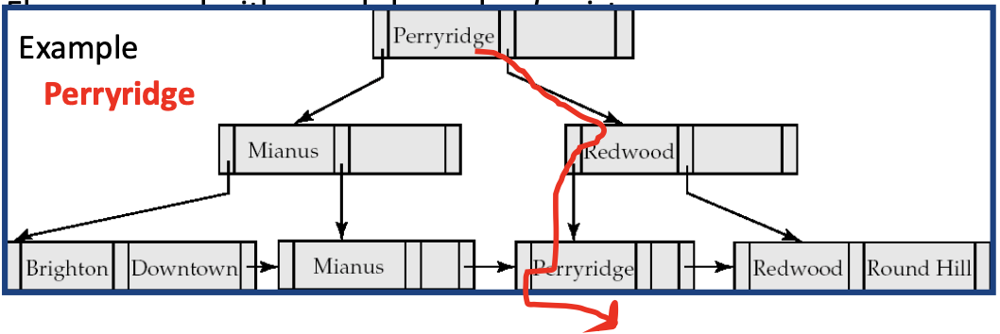
Note don't get confused by the Perryridge on the root, it is just the search key by chance. 

### Run range queries in B+ tree
Range queries find all records with search key values in a given range e.g., from Brandt to Singh


### B+ tree - Insertion (2 types)
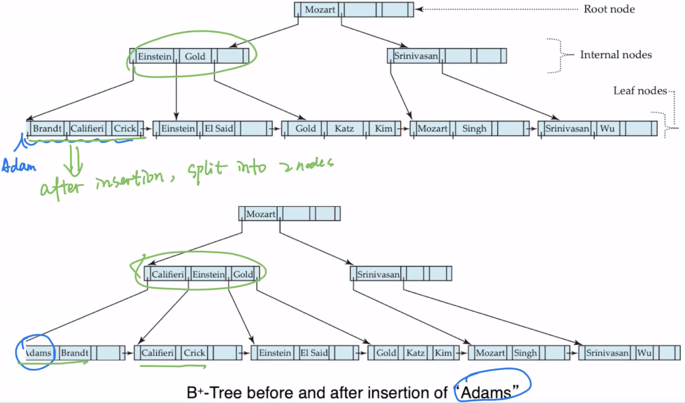
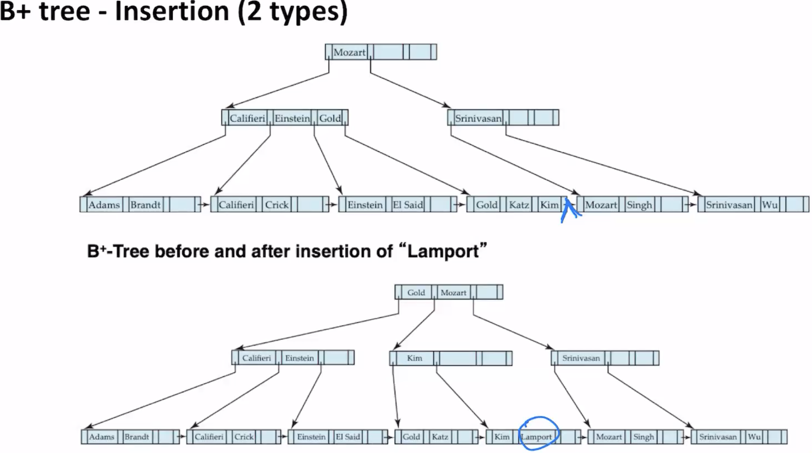
It will split nodes to avoid having leaf node > n–1

### B+ tree - Deletion (2 types)
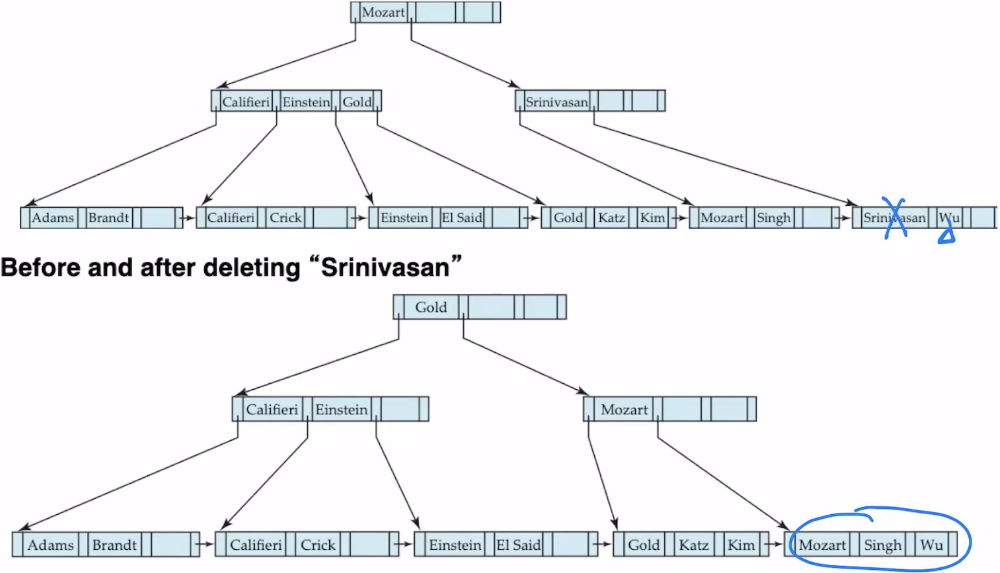

It will merge to avoid having leaf node < ⎡(n–1)/2⎤

### B+ tree – File organization
- Leaf nodes in a B+-tree file organization store records, instead of pointers to children
- Helps keep data records clustered (ordered) even when there are insertions/deletions/updates
- Insertion and deletion or records are handled in the same way as insertion and deletion of entries in a B+-tree index.

### B+ tree Advantages
- Automatically reorganizes itself with small, local changes in the face of insertions and deletions.
- Reorganization of entire file is not required to maintain performance
- Similar to Binary tree in many aspects but the **fan out** is much higher (height of B+ tree is smaller than binary tree)
### B+ tree Disdvantages
- Extra insertion and deletion over head and space over head (reorganisation)

Advantages of B+-trees outweigh disadvantages for DBMSs (B+ trees are used extensively)

## Considering location data (spatial data)
- Unlike things we can access by names, ids, there is a lot of data that exists, and increasingly that requires special indexing
- For example, spatial data requires more complex computations for accessing data, 
  - e.g., intersections of objects in space
- There is no trivial way to sort items which is a key issue, 
  - e.g., range query on a simple set of items, e.g. all restaurants within 5 KM
  - e.g., a Nearest Neighbour query, e.g. find the nearest restaurant of my location

## Quadtree (for location data - points)
- Each node of a quadtree is associated with a rectangular region of space; the top node is associated with the entire target space.
- Each division happens with respect to a rule based on data type. Each non-leaf nodes divides its region into four equal sized quadrants
- Thus each such node has four child nodes corresponding to the four quadrants and division continues recursively until a stopping condition
### Quadtree – e.g.,
Example: **Leaf nodes** have between zero and **some fixed maximum number** of points (set to 1 in example below)
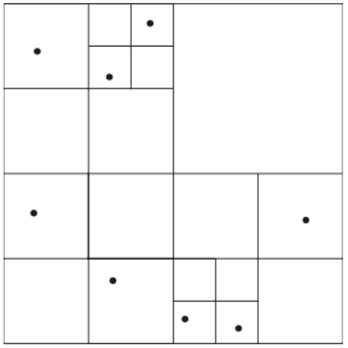
It is keep spliting into squares until no more than n (1 in this example) leaf nodes are inside same square

### Quadtree Tree structure

### Quadtree – e.g., run NN (nearest neighbor) query


### 2022S1 Exam Question 5 Example
Given the k-d tree below with point data, where black labeled dots represent spatial coordinate data, and the rectangular area is divided into regions with the division order given with numbers: draw the associated k-d tree as a tree structure with leaves labeled as the data labels given below. Assume **left subarea** of a division goes to a **left subtree**, and **lower subarea** of a division also goes to a **left subtree**. The figure for the k-tree follows:

The key idea is, for each division, split the current node (root) to 2 nodes. Put the left-down on left, right-up on right nodes.
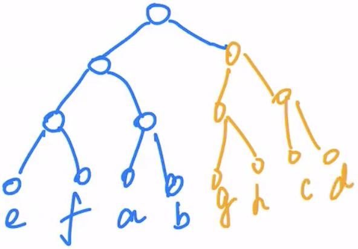

## R-Trees
- R-trees are an N-dimensional extension of B+-trees, useful for indexing sets of rectangles and other polygons.
- Supported in many modern database systems, along with variants like R+ -trees and R*-trees.
- Basic idea: generalize the notion of a one-dimensional interval associated with each B+ -tree node to an N-dimensional interval, that is, an N- dimensional rectangle.
- Will consider only the two-dimensional case (N = 2)
  - generalization for N > 2 is straightforward, although R-trees work well
only for relatively small N
- **Bounding boxes of children of a node are allowed to overlap**
- Note: A **bounding box** of a node is a minimum sized rectangle that contains all the rectangles/polygons associated with the node

### R-Tree example
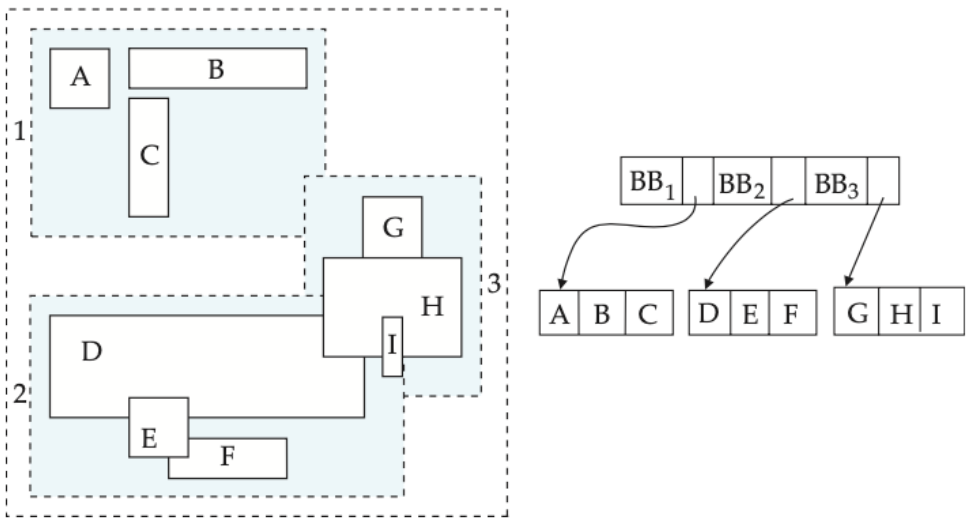
When a query comes, it checks each bounding box and see if there is a overlapping. Since bounding boxes can overlap, a query may fall into multiple child bounds.

# Using Indexes in SQL
## Index Definition in SQL
- Some indexes are automatically created by the DBMS
  - For UNIQUE constraint, DBMS creates a non-clustered index. 
  - For PRIMARY KEY, DBMS creates a clustered index
- You can create indexes on any relation (or view) – view: e.g., join result of 2 tables

## Create an index
create index \<index-name> on \<relation-name> (\<attribute-list>)
1. Create a clustered index on a table
CREATE CLUSTERED INDEX index1 ON table1 (column1);
2. Create a non-clustered index with a unique constraints
CREATE UNIQUE INDEX index1 ON table1 (column1 DESC, column2 ASC, column3 DESC);

(A unique index is one in which no two rows are permitted to have the same index key value)

## drop an index
drop index \<index-name>

Most database systems allow specification of type of index, and clustering

## Specialized indexes - Filtered index
CREATE INDEX index1 ON table1 (column1) WHERE Year > ‘2010’;

(A filtered index is an optimized nonclustered index, suited for queries that select a small percentage of rows from a table. It uses a filter predicate to index a portion of the data in the table)

## Spatial index
CREATE SPATIAL INDEX index_name ON table_name(Geometry_type_col_name) WITH ( BOUNDING_BOX = ( 0, 0, 500, 200 ) );

# Summary
- There is no point going through all index types for all data types 
  - There is hundreds of them
  - Even each type would have many subtypes
    - E.g., MX-CIF quadtree is one quadtree type among many 
  - Same with R-trees, etc
  - Same with many other index types
- Given a data set, when uploading to the DBMS
  - Find the potential query types
  - Research what indices that particular DBMS would have for that data type
  - Research for what queries you would better do on what index
  - Create index if you have large data
  - Monitor performance
  - Tune or create other indices
  - Your DMBS will have a version of the “create index” SQL statement

# Transactions
## Transaction - A unit of work in a database
- A transaction can have any number and type of operations in it
- Either happens as a whole or not
- Transactions ideally have four properties, commonly known as ACID properties

## ACID (Atomicity, Consistency, Isolation, Durability) properties: 
- Atomicity - All changes to data are performed as if they are a single operation. That is, all the changes are performed, or none of them are.
Example – A transaction that (i) subtracts $100 if balance >100 (ii) deposits $100 to another account
(both actions with either happen together or none will happen)
- Consistency - Data is in a ‘consistent’ state when a transaction starts and when it ends – in other words, any data written to the database must be valid according to all defined rules (e.g., no duplicate student ID, no negative fund transfer, etc.)
  - What is ‘consistent’ - depends on the application and context constraints
  - It is not easily computable in general
  - Only restricted type of consistency can be guaranteed, e.g. serializable transactions
- Isolation- transaction are executed as if it is the only one in the system.
• For example, in an application that transfers funds from one account to another, the isolation ensures that another transaction sees the transferred funds in one account or the other, but not in both, nor in neither.
- Durability- the system should tolerate system failures and any committed updates should not be lost.

## Types of Actions
- Unprotected actions - no ACID property
- Protected actions - these actions are not externalised before they are completely done. These actions are controlled and can be rolled back if required. These have ACID property.
- Real actions - these are real physical actions once performed cannot be undone. In many situations, atomicity is not possible with real actions (e.g., firing two rockets as a single atomic action)

## Embedded SQL example in C
(Open Database Connectivity)
```C
int main(){ 
    exec sql INCLUDE SQLCA; /*SQL Communication Area*/
    exec sql BEGIN DECLARE SECTION;
    /* The following host variables are used for communicating between SQL and C */
    int OrderID; /* Employee ID (from user) */
    int CustID; /* Retrieved customer ID */
    char SalesPerson[10] /* Retrieved salesperson name */ 
    char Status[6] /* Retrieved order status */
    exec sql END DECLARE SECTION;
    /* Set up error processing */
    exec sql WHENEVER SQLERROR GOTO query_error; 
    exec sql WHENEVER NOT FOUND GOTO bad_number;
    /* Prompt the user for order number */ 
    printf ("Enter order number: "); 
    scanf_s("%d", &OrderID);
    /* Execute the SQL query */
    exec sql SELECT CustID, SalesPerson, Status FROM Orders
    WHERE OrderID = :OrderID // ”:” indicates to refer to C variable
    INTO :CustID, :SalesPerson, :Status;
    /* Display the results */
    printf ("Customer number: %d\n", CustID); 
    printf ("Salesperson: %s\n", SalesPerson); 
    printf ("Status: %s\n", Status);
    exit(); 
    query_error:
        printf ("SQL error: %ld\n", sqlca->sqlcode); exit(); 
    bad_number:
        printf ("Invalid order number.\n"); exit(); }
```

- **Host Variables** - Declared in a section enclosed by the **BEGIN** DECLARE SECTION and **END** DECLARE SECTION. While accessing these variables, they are prefixed by a colon “:”. The colon is essential to distinguish between host variables and database objects (for example tables and columns).
- **Data Types** - The data types supported by a DBMS and a host language can be quite different. e.g. if we have int type id in DB, we can't use string id in C
- **Error Handling** - The DBMS reports run-time errors to the applications program through an SQL Communications Area (SQLCA) by INCLUDE SQLCA. The WHENEVER...GOTO statement tells the pre-processor to generate error- handling code to process errors returned by the DBMS.
- **Singleton SELECT** - The statement used to return the data is a singleton SELECT statement; that is, it returns only a single row of data. Therefore, the code
example does not declare or use cursors.

## Flat Transaction
Everything inside the BEGIN WORK and COMMIT WORK is at the same level. The transaction will either survive together with everything else (commit) Or it will be rolled back with everything else (abort) – if some errors happen

```sql
exec sql BEGIN WORK;
AccBalance = BuySomething(AccId, AccBalance, Amount);
exec sql COMMIT WORK;

Long BuySomething(long AccId, long AccBalance, long Amount){
    Exec sql INSERT INTO history(AccId, Amount, time) 
    VALUES( :AccId, :Amount, CURRENT);
    exec sql UPDATE accounts
    SET AccBalance = AccBalance - :Amount
    WHERE AccId = :AccId;
    return(AccBalance); 
}
exec sql BEGIN WORK;
AccBalance = BuySomething(AccId, AccBalance, Amount); 
if (AccBalance < 0){
    exec sql ROLLBACK WORK; }
else { exec sql COMMIT WORK; }
```

### Flat Transaction - Limitation
Flat transactions do not model many real applications.
```
BEGIN WORK
S1 : book flight from Melbourne to Singapore S2: book flight from Singapore to London
S3: book flight from London to Dublin
END WORK
```
From Dublin if we cannot reach our final destination instead we wish to fly to Paris from Singapore and then reach our final destination.

If we roll back we need to redo the booking from Melbourne to Singapore which is a waste.

### Flat Transaction – Solution: Save Points

- The only reason why an application program needs an identifier for a savepoint is that it may later want to re-establish (return to) that savepoint.
- To do that, the application invokes the ROLLBACK WORK function, but rather than requesting the entire transaction to be aborted, it passes the number of the savepoint it wants to be restored.

## Nested Transaction

It is a tree of executions, T1 can have more T11 and T12.... The left hand side is called parent transaction.

### Rules to follow in Nested Transaction
#### Commit rule
- A subtransaction can either commit or abort, however, commit cannot take place unless the parent itself commits. If parent is a child, then its parent should commit. 
- Subtransactions have Atomicity, Consistency, and Isolation properties but not have Durability property unless all its ancestors commit.
- Commit of a sub transaction makes its results available only to its parents
#### Roll back rules
- If a subtransaction rolls back all its children are forced to roll back
#### Visibility rules
- Changes made by a subtransaction are visible to the parent only when the subtransaction commits.
- All objects of parent are visible to its children.

Implication of this is that the parent should not modify objects while children are accessing them. This is not a problem as parent is not run in parallel with its children.

Parent and Child should **never** run in parallel. Children can run in parallel. 

## Transaction Processing Monitor (TP Monitor)
The main function of a TP monitor is to integrate other system components and manage resources.
- TP monitors manage the transfer of data between clients and servers 
- breaks down applications or code into transactions and ensures that all databases are updated properly
- It also takes appropriate actions if any error occurs

## TP Monitor Services
- **Heterogeneity**: If the application needs access to **different DB systems**, local ACID properties of individual DB systems is not sufficient. Local TP monitor needs to interact with other TP monitors to ensure the **overall ACID property**.
- **Control communication**: If the application communicates with other **remote processes**, the local TP monitor should maintain the communication status among the processes to be able to recover from a crash.
- **Terminal management**: Since many terminals run client software, the TP monitor should provide appropriate ACID property between the client and the server processes.
- **Presentation service**: this is similar to terminal management in the sense it has to deal with different presentation ( user interface) software -- e.g. X-windows
- **Context management**: E.g. maintaining the sessions etc.
Start/Restart: There is no difference between start and restart in TP based system.

# Concurrency Control
For correct execution, we need to impose exclusive access to the shared variable counter by Tasks.
- To resolve conflicts
- To preserve database consistency

## Different ways for concurrency control
- **Dekker's algorithm (using code)** - needs almost no hardware support, but the code is very complicated to implement for more than two transactions/processes
- **OS supported primitives** (through interruption call) - expensive, independent of number of processes, machine independent
- **Spin locks** (using atomic lock/unlock instructions) – most commonly used

## Dekker's algorithm
int c1, c2, turn = 1; /* global variable*/

T1
{ some code T1}
```c
/* T1 wants exclusive access to the resource and we assume initially c1 = = 0*/
c1 = 1; turn = 2;
repeat until { c2 == 0 or turn == 1}
/* Start of exclusive access to the shared resource (successfully changed variables) */
use the resource 
counter = counter+1;
/* release the resource */ 
c1 = 0;
{some other code of T1}
```
T2
{ some code T2}
```c
/* T2 wants exclusive access to the resource and we assume initially c2 = = 0 */
c2 = 1; turn = 1;
repeat until { c1 == 0 or turn == 2}
/* Start of exclusive access to the shared resource */
use the resource 
counter = counter+1;
/* release the resource */ 
c2 = 0 ;
{some other code of T2}
```
- needs almost no hardware support although it needs atomic reads and writes to main memory
- the code is very complicated to implement if more than two transactions/ process are involved
- harder to understand the algorithm for more than two process
takes lot of storage space
- uses busy waiting
- efficient if the lock contention (that is frequency of access to the locks) is low

## OS supported primitives
- through an **interrupt call**, the lock request is passed to the OS. When interrupt call happens, the transaction stops and save the data, then handle the call 
- need no special **hardware**
- are very **expensive** (several hundreds to thousands of instructions need to be executed to save context of the requesting process, so it's **slow**.)
- **do not use busy waiting** and therefore **more effective**

## Spin Lock
- All modern processors do support some form of spin locks
- Executed using atomic machine instructions such as test and set or compare and swap
- need hardware support
- use busy waiting
- algorithm does **not** depend on number of processes
- are very efficient for low lock contentions – all DB systems use them

### Spin lock – Test and Set
```c
testAndSet(int *lock)
{ /* the following is executed atomically, memory bus can be locked for up to two cycles (one for read and for writing*/
if (*lock == 1){ * lock = 0; return (true)}
else return (false);
}
```

Using test and set in spin lock for exclusive access 
```c
int lock = 1; % initial value
```

T1 
```c
/*acquire lock*/
while (!testAndSet( &lock ); /*Xlock granted*/
//exclusive access for T1; counter = counter+1;
/* release lock*/
lock = 1;
```
T2 
```c
/*acquire lock*/
while (!testAndSet( &lock ); /*Xlock granted*/
//exclusive access for T2; counter = counter+1;
/* release lock*/
lock = 1;
```

### Spin lock – Compare and Swap
```c
boolean cs(int *cell, int *old, int *new)
{/* the following is executed atomically*/
if (*cell == *old) { *cell = *new; return TRUE;} 
else { *old = *cell; return FALSE;} //put it into old and will be used later
}
```

### Short summary
Test and set will lock read operations
compare and swap will only lock write operations

# Semaphore
Derived from train and track
- Try to Get track, wait if track not clear
- If Get track was successful, use it (no other train will be able to use it at the same time)
- Once the train passes, the semaphore is set until the train exits that section of track
Computer semaphores have a **get()** routine that acquires the semaphore (perhaps waiting until it is free) and a **give()** routine that returns the semaphore to the free state, perhaps **signalling** (waking up) a waiting process.

## Exclusive mode Semaphore

- Pointer to a **queue** of processes (FIFO)
- If the semaphore is busy but there are **no waiters**, the pointer is the address of the process that **owns the semaphore**. 
- If some processes are waiting, the semaphore points to a **linked list** of **waiting processes**. The process owning the semaphore is **at the end of this list**. 
- After usage, the owner process wakes up the oldest process in the queue (first in, first out scheduler)

## Convoy avoiding semaphore
- The previous implementation may result a **long list of waiting** processes – called **convoy**
- To avoid convoys, a process may simply **free the semaphore** (set the queue to null) and then **wake up every process** in the list after usage.
- In that case, each of those processes will have to **re-execute the routine for acquiring semaphore**. i.e. reshuffle the order, give other processes oppotunity to ask for this shared resources

# Deadlock
- Deadlocks are rare, however, they do occur and the database has to deal with them when they occur
- In a deadlock, each process in the deadlock is waiting for another member to release the resources it wants.

## Deadlock - Solutions
- Have enough resources so that no waiting occurs – not practical since we cannot have infinite resources
- Do not allow a process to wait, simply rollback after a certain time. This can create live locks which are worse than deadlocks.
- Linearly order the resources and request of resources should follow this order,
- i.e., a transaction after requesting ith resource can request jth resource if j > i. This type of allocation guarantees no cyclic dependencies among the transactions.

## Linear Order

- Pa: Holds resources at level i and request resource at level j which are held by Pb. j > i
- Pb: Holds resources at level j and request resource at level k which are held by Pc. k > j
- Pc: Holds resources at level k and request resource at level l which are held by Pd l > k
- Pd: Holds resources at level l and and is currently running.
- Pq: Holds resources at level g and request resource at level l which are held by Pd. l > g
- l > k > j > i and l > g.
We cannot have loops. The dependency graph can be a tree or a linear chain and hence cannot have cycles.

## Deadlock – Avoidance / Mitigation
- Pre-declare all necessary resources and allocate in a single request, not practical as not possible to know about all requests.
- Periodically check the resource dependency graph for cycles. If a **cycle** exists - rollback (i.e., terminate) one or more transaction to eliminate cycles (deadlocks). The chosen transactions should be cheap (e.g., they have not consumed too many resources).
- Allow waiting for a maximum time **on a lock** then **force Rollback**. Many successful systems (IBM, Tandem) have chosen this approach.
- (Many distributed database systems maintain only local dependency graphs and use time outs for global deadlocks.)

# Isolation & Dependency
## Isolation Concept
- Isolation ensures that concurrent transactions leaves the database in the same state as if the transactions were executed separately.
- Isolation guarantees consistency, provided each transaction itself is consistent.
- We can achieve isolation by sequentially processing each transaction - generally not efficient and provides poor response times.
- We need to run transactions concurrently with the following goals
  - Concurrent execution should not cause application programs (transactions) to malfunction (fail).
  - Concurrent execution should not have lower throughput or bad response times than serial execution.

## Possible dependencies

- Lost Update, Write-Write, T1 Write is covered by T2
- Dirty Read, Write-Read, T1 read in middle of write
- Unrepeatable Read, Read-Write, T1 reading while others writing
- OK, no dependency

## Dependency model
- $I_i$ : set of inputs (objects that are read) of a transaction $T_i$
- $O_i$ : set of outputs (objects that are modified) of a transaction $T_i$ Note $O_j$ and $I_j$ are not necessarily disjoint that is $O_j \cap I_j ≠ ∅$
- Given a set of transactions , Transaction $T_j$ has no dependency on any transaction $T_i$ in if - 
$$
O_i\cap(I_j\cup O_j) = empty\ for\ all\ i ≠ j
$$
- This approach cannot be planed ahead as in many situation inputs and outputs may be state dependant/not known in prior.

## Dependency Formal Definition
- Let **H** is a **history sequence** of tuples of the form (T, action, object). Here, T is transaction, action can be read/write, object is what the action operates on. e.g. (T1, Read, O1)
- Let T1 and T2 are transactions in H. If T1 performs an action on an object O, then T2 performs an action on the same O, and **there is no write action in between by another transaction on O – then T2 depends on T1**.
- Formally, the dependency of T2 on T1 (T1, O, T2) exists in history H if there are indexes i and j such that i < j, H[i] involves action a1 on O by T1, and H[j] involves action a2 on O by T2, and there are no other H[k] = (T’,WRITE,O) for i < k < j
- **Dependency graph**: Transactions are nodes, and object labels the edges from the node Ti to Tj if (Ti, O, Tj) is in DEP(H).

## Dependency Relations Example
H1 = <(T1,R,O1), (T2,W,O5), (T1,W,O3), (T3,W,O1), (T5,R,O3), (T3,W,O2), (T5,R,O4), (T4,R,O2), (T6,W,O4)>  
H2 = <(T1,R,O1), (T3,W,O1), (T3,W,O2), (T4,R,O2), (T1,W,O3), (T2,W,O5), (T5,R,O3), (T5,R,O4), (T6,W,O4)>

Give  
- DEP(H1)
- DEP(H2) 
- Dependency graph

For questions like this, first we focus on the object order: O1, O2.... We can notice that O1 is in T1 and T3, so we can write <T1, O1, T3> in the DEP(H1). Then we can see T3 and T4 both operate on O2, so we can write <T3, O2, T4>...

DEP(H1) = {<T1, O1,T3>, <T3,O2,T4>, <T1,O3,T5>, <T5,O4,T6> }  
DEP(H2) = {<T1, O1,T3>, <T3,O2,T4>, <T1,O3,T5>, <T5,O4,T6> }  
Dependency graph


## Isolated History
- A serial history is history that is resulted as a consequence of running transactions sequentially one by one.
- N transactions can result in a maximum of N! serial histories.
- A history is said to be isolated if it is equivalent to a **serial history** (as if all transactions are executed serially/sequentially), i.e. serial history = isolated history
- A history is legal if does not grant conflicting grants.
- **Wormhole theorem**: A history is isolated **if and only if** it has no wormholes.

### Isolated History – e.g.,

If T1 precedes T2, it is written as T1 << T2.
```
Before(T) = {T’ | T’ << T} 
After(T) = {T’| T << T’}
```
E.g.
```
After(T1) = {T5,T6, T3, T4} 
After(T3) = {T4}
After (T5) = {T6}
```

## Wormhole Transaction
A transaction T’ is called a **wormhole transaction** if 
$$
T' \in Before(T) \cap After(T)
$$

That is T << T’ << T. This implies there is a **cycle** in the dependency graph of the history. Presence of a wormhole transaction implies it is not isolated (=> not a serial schedule).

Idea to solve wormhole problem:  
1. Known history
2. Write DEP based on history
3. Draw Dependency graph based on DEP
4. See if there is a wormhole or not

### 2022S1 Example
Given the following transaction history h we are told that k, l, m, n, o, and p are transactions, and operations are Read and Write operations which are labeled as R and W, and operations are done on the objects labeled as a, b, c, d, e:  
h = < (k,R,a),(m,W,a),(m,W,b),(n,R,b),(k,W,c),(l,W,e),(o,R,c),(o,R,d), (p,W,d) >  
Please find the DEP(h) and draw as a simple graph version as well. Then using the concept of wormholes explain whether this history is equal to a serial history or not, i.e., if this history is not equal to a serial history then give a wormhole example, and if it is then give a serial execution of these transactions that this history is equal to. Briefly explain your steps with sentences while answering this question.

Remind that the tuple is (Transaction, Action, Object), the DEP is <T1, O, T2>. The use of all characters is indeed confusing us. 

Answer


# Locks
## Slock & Xlock
- SLOCK (shared lock) that allows other transactions to **read**, but not write/modify the shared resource.
- A lock on an object should not be granted to a transaction while that object is locked by another transaction in an incompatible mode.
- In summary, Xlock (exclusive lock) to allow others to write, SLock (shared lock) to allow others to read

### Lock Compability
||Free |Shared (Slock) |Exclusive (Xlock)|
|---|---|---|---|
|Request - Slock| √ |√ |×|
Request - Xlock| √ |×| ×|

### Slock & Xlock – When to use which one?
- Actions in Transactions are: READ, WRITE, XLOCK, SLOCK, UNLOCK, BEGIN, COMMIT, ROLLBACK
- BEGIN, END , SLOCK, XLOCK can be ignored as they can be automatically inserted in terms of the corresponding operations
- If a transaction ends with a COMMIT, it is replaced with: {UNLOCK A if SLOCK A or XLOCK A appears in T for any object A}.
- ROLLBACK can be replaced by {**WRITE(UNDO)** A if WRITE A appears in T for any object A} { UNLOCK A if SLOCK A or XLOCK A appears in T for any object A}.

### Example

Note T2 need to WRITE (UNDO) B because it want to ROLLBACK

## Isolation Concept
- **Well-formed transactions**: A transaction is well formed if all READ, WRITE and UNLOCK operations are covered by appropriate LOCK operations
- **Two phase transactions**: A transaction is two phased if all LOCK operations precede all its UNLOCK operations. I.e. All locks are before unlocks

## Isolation Theorem
- **Locking theorem**: If all transactions are well formed and two-phased, then any legal (does not grant conflicting grants) history will be isolated.
- **Locking theorem (Converse)**: If a transaction is not well formed or is not two-phase, then it is possible to write another transaction such that it is a **wormhole**.
- **Rollback theorem**: An update transaction that does an UNLOCK and then does a ROLLBACK is **not** two phase. The idea is ROLLBACK is a Write action, therefore it is a unlock before lock. 

## Degree of Isolation
### Degree 3:   
  
A Three degree isolated Transaction has no lost updates, and has repeatable reads.  
Lock protocol is **two phase and well formed**.  
It is sensitive to the following conflicts: write->write; write ->read; read->write  

### Degree 2
  
Degree 2: A Two degree isolated transaction has no lost updates and no dirty reads.  
Lock protocol is two phase with **respect to exclusive locks** and well formed with respect to **Reads and writes**. (May have Non repeatable reads.)  
It is sensitive to the following conflicts: write- >write; write ->read;  

### Degree 1
  
Degree 1: A One degree isolation has no lost updates.  
Lock protocol is two phase with **respect to exclusive locks** and well formed with respect to **writes**.  
It is sensitive the following conflicts: write- >write;  

### Degree 0
  
Degree 0 : A Zero degree transaction does not overwrite another transactions dirty data if the other transaction is at least One degree.  
Lock protocol is well-formed with respect to writes. It ignores all conflicts.  

# Granular Lock
- **Definition** - we need to build some **hierarchy**, then locks can be taken at any level, which will automatically grant the locks on its descendants.
- **Intention** - allow concurrent runs as much as possible for a better performance, while avoiding conflicts as much as possible
- **Steps**
  - Pick a set of column values (predicates). 
  - They form a graph/tree structure.
  - Lock the nodes in this graph/tree 
- Example  
  

## Granularity of locks (coarse & fine)
Lock the whole DB – less conflicts, but poor performance
Lock at individual records level – more locks, better performance
## Express intention
Intention mode locks on coarse granules.

## Types of granular locks
|Type|Name|
|--|--|
|X|exclusive lock|
|S|shared lock|
U|update lock – intention to update in the future|
IS|intent to set shared locks at finer granularity|
|IX| Intent to set shared or exclusive locks at finer granularity|
|SIX| a coarse granularity shared lock with an Intent to set finer granularity exclusive locks|

## Compatibility Mode of Granular Locks (symmetric)


## Isolation Concept
- Acquire locks from root to leaf. 
- Release locks from leaf to root.
- To acquire an S mode or IS mode lock on a non-root node, **one** parent must be held in IS mode or higher (one of {IS,IX,S,SIX,U,X}).
- To acquire an X, U, SIX, or IX mode lock on a non-root node, **all** parents must be held in IX mode or higher (one of {IX,SIX,U,X}).

### e.g., - deadlock

T1:
```
SLock A
Read A
If (A== 3) {
    % Upgrading Slock to Xlock
    Xlock A
    Write A 
}
Unlock A
```
T2:
```
SLock A
Read A
If (A==3) {
    % Upgrading Slock to Xlock
    Xlock A
    Write A 
}
Unlock A
```
T3: 
```
SLock A 
Read A 
Unlock A
```
Both T1 and T2 have shared lock  
T1 require sharedlock will not be granted, based on compability diagram above, because T2 have shared lock  
T2 require sharedlock will note be granted, based on compability diagram above, because T1 have shared lock

### solution

T1:
```
SLock A
Read A
If (A == 3){
    % Release lock and try in Xlock mode
    Unlock(A) 
    Xlock A 
    Read A 
    if(A == 3){
        Write A 
    }
}
Unlock A
```
T2:
```
SLock A
Read A
If (A == 3){
    % Release lock and try in Xlock mode
    Unlock(A) 
    Xlock A 
    Read A 
    if(A == 3){
        Write A 
    }
}
Unlock A
```
T3
```
SLock A 
Read A 
Unlock A
```

## Optimistic Locking
- When conflicts are rare, transactions can execute operations without managing locks and without waiting for locks - higher throughput
- Use data without locks
- Before committing, each transaction verifies that no other transaction has modified the data (by taking appropriate locks) – **duration of locks are very short**
- If any conflict found, the transaction repeats the attempt
- If no conflict, make changes and commit


### Example
```sql
% Read without lock
Read A into A1 
Read B into B1 
Read C into C1
Loop: Compute new values based on A1 and B1 
    % Start taking locks
    % Read again
    Slock A; Read A into A2
    Slock B; Read B into B2
    Xlock C; Read C into C2
    if (A1 == A2 & B1 == B2 & C1 == C2)
        Write new value into C 
        commit
        Unlock A, B and C
    else % read data is changed 
        A1 = A2
        B1 = B2
        C1 = C2
        unlock A ,B and C 
        goto Loop
end
```
Once the condition is true – it is effectively 2 phase locking but duration of locking is very short but can force many repeated attempts due to failure of the condition.  
Advantage: Very efficient, lock duration very short  
Disadvantage: Repeat in Loop for long time

## Snapshot Isolation
```sql
Read C into C1 
Read D into D1
Loop:
    Read A into A1
    Read B into B1
    Compute new values based on A1 and B1
    % Start taking locks on records that need modification.
    Let new value for C is C3 and for D is D3 
    Xlock C
    Xlock D
    Read C into C2
    Read D into D2
    if (C1 = = C2 & D1 = = D2)
        % first writer commits
        write C3 to C
        write D3 to D 
        commit 
        unlock(C and D)
    else % not first modifier
        C1 = C2 
        D1 = D2
        unlock(C and D) 
        goto Loop
end
```
Snapshot Isolation method is used in Oracle but it will not guarantee Serializability.  
However, its transaction throughput is very high compared to two phase locking scheme.

## Two phase locking Transaction - Snapshot Locking potential problem
Integrity constraint A+B >= 0; A = 100; B = 100; 
T1:
```
Lock(X,A) 
Lock(S,B) 
Read A to A1; 
Read B to B1; 
A1 = A1 -200;
if (A1+ B1 >= 0)
    Write A1 to A
    Commit
else abort
end
Unlock (all locks)
```
T2:
```
Lock(S,A) 
Lock(X,B)
Read A to A1; 
Read B to B1; 
B1 = B1 -200;
If (A1+ B1 >= 0)
    Write B1 to B
    Commit
else abort
end
Unlock (all locks)
```
Only one transaction can commit.

Snapshot Isolation Transaction - Snapshot Locking potential problem
Integrity constraint A+B >= 0; A = 100; B = 100;
T1:
```sql
Loop: 
    Read A to A1;
    Read B to B1; 
    A3 = A1 -200; 
    Lock(X, A) 
    Read A to A2 
    if (A1 != A2)
        Unlock(A) 
        goto Loop
    % potential problem: B1 is read without lock, the value of B possiblily has been changed 
    elseif (A3+ B1 >= 0) 
        Write A3 to A
        Commit 
    else abort
Unlock (all locks)
```
T2:
```sql
Loop: 
    Read A to A1;
    Read B to B1; 
    B3 = B1 -200; 
    Lock(X, B) 
    Read B to B2 
    if (B1 != B2)
        Unlock(B) 
        goto Loop
    % A1 is read without lock
    elseif (A1+ B3 >= 0) 
        Write B3 to B
        Commit 
    else abort
Unlock (all locks)
```
One or both transactions can commit but when both are committed, it is not serializable as only one should be able to commit.

## Time Stamping
At commit, time stamps are examined. **If time stamp is more recent than the transaction read time, the transaction is aborted.**

At the commit time, the system validates all the transaction’s updates and writes updates to durable storage. This model of computation unifies concurrency, recovery and time domain addressing.

**Time Domain Versioning**  
Data is never overwritten a new version is created on update.  
<o,<V1, [t1, t2)>, <V2, [t2,t3)>, <V3,[t3,*)>

e.g.
T1
select average (salary)
from employee

T2 
update employee
set salary = salary*1.1
where salary < $40000

if T1 before T2, no impact, T1 can commit  
if T2 before T1, T1 cannot commit, T1 abort  
But if we use time stamp, T2 do not need to wait until T1 commit to start

# Crash Recovery
Recover from a failure either when a single-instance database crashes or all instances crash.  
Crash recovery is the process by which the database is moved back to a consistent and usable state after a crash. This is done by **making the committed transactions durable and rolling back incomplete transactions.**

## ACID properties 
Recovery manager guarantees Atomicity and Durability. 
- Atomicity - All changes to data are performed as if they are a single operation. That is, all the changes are performed, or none of them are.
- Consistency - Data is in a ‘consistent’ state when a transaction starts and when it ends – in other words, any data written to the database must be valid according to all defined rules (e.g., no duplicate student ID, no negative fund transfer, etc.)
- Isolation - transaction are executed as if it is the only one in the system.
- Durability - the system should tolerate system failures and any committed updates should not be lost.

## Desired behaviors when crash happens

As can be seen from the graph, T1, T2, T3 has committed before the crash happens; T4 and T5 haven't commt; T6 aborted before the crash happens.
We need to ensure the committed and abortted transactions do not lost th eupdates. 
Since T4 and T5 are incomplete, need to be rollback. 

## Data Access

Two types of data blocks
- **Physical blocks** are those blocks residing on the disk.
- **Buffer blocks** are the blocks residing temporarily in main memory.

Two operations between disk and main memory
- **Input(A)** transfers the physical block A to main memory.
- **Output(B)** transfers the buffer block B to the disk and replaces the data there.

## Some Concepts
- Disk: big storage, durable. 
- Page & Pageid: each partition in disk is a page, each page has a id
- Buffer caches / buffer pool / buffer block: fast, but not durable
- Eviction (evict): if buffer is full, we need to evict (remove) some data from buffer so that we can read from disk. evict when:
  - no one else is using page
  - all modified page/data should be copied to disk
- Latches: a type of lock used only for the duration of the operation (R/W), can be released immediately
- Fix, unfix: similar to lock / unlock

More Concepts: 
- Force – immediately write to disk after commit, durable but slow
- No force – keep in buffer as long as we can, not durable but fast
- Steal – when evicting a page with uncommitted info (write to disk), but the transaction decides to rollback at the end. This means we need to **remember the old value** to support the undo process.

# Log-based Crash Recovery
## Logging
- Definition - Record REDO (new value) and UNDO (old value) information, for every update, in a log.
- Log is written sequentially (Log: An ordered list of REDO/UNDO actions)
- Each log takes very little space, so multiple updates fit in a single log page.
- Log record contains: <XID, pageID, offset, length, old data, new data> and some other additional control info. offset is how far from beginning of the page 

## Write-Ahead Logging (WAL)
1. Must force the log record (has both old and new values) for an update before the corresponding data page gets to disk
2. Must write all log records to disk for a transaction before it commits

### Write-Ahead Logging (WAL) – e.g.,
- LSN (Log Sequence Nmber) – LSNs always **increase**
- pageLSN - The LSN of the most recent log record for an update to that page.
- flushedLSN - max LSN flushed so far (flush to disk)
- WAL - Before a page is written to disk make sure **pageLSN <= flushedLSN**

**Cannot** write the page to disk

**Can** write the page to disk


## Transaction Table
- One entry per active transaction  
- Contains transactionID, status (running/committed/aborted), and lastLSN.  
e.g.

|transactionID| status | lastLSN|
|--|--|--|
|T1|running|40|
|T2|committted|80|

## Dirty Page Table
- One entry per **dirty page** in buffer pool. read from disk to buffer, if the read one is different from the disk, then page is dirty, i.e. the some update to this page happened. 
- Contains **recLSN**: the LSN of the log record which **first** caused the page to be dirty since loaded into the buffer cache from the disk.  
e.g.

| Pageid | recLSN |
|--------|--------|
|   P1   |   10   |
|   P2   |   50   |
|   P3   |   80   |


## Checkpoint
Periodically, the DBMS creates a checkpoint, in order to **minimize the time taken to recover in the event of a system crash**.  
Write to log:
- Begin checkpoint record: Indicates when checkpoint began.
- End checkpoint record: Contains current Transaction table and dirty page table.

**Fuzzy Checkpoint** – the creation of checkpoint **takes a little time**
- Other transactions continue to run, so these tables are accurate only as of the time of the begin checkpoint record.
- No attempt to force dirty pages to disk, so it’s a good idea to periodically flush dirty pages to disk

## Transaction – Abort
- Get lastLSN of transaction from transaction table.
- Can follow chain of log records **backward** via the prevLSN field. - Before starting UNDO, write a Compensation Log Record (CLR)
  - Continue logging while you Undo
  - Extra field: undonextLSN (point to the next LSN to undo) 
  - CLR never undone
- At end of UNDO, write an “end” log record.

### e.g. 
T1  
1. Update A: 100 -> 200
2. Update A: 200 -> 300
3. Update A: 300 -> 400
 ----------------
              Abort 400
We will go backward, from UNDO 3, 400 -> 300, to UNDO 2..., finally get 100

### Transaction – Abort e.g.,
| LSN  | Log                    |
|------|------------------------|
| 400  | begin checkpoint       |
| 405  | end checkpoint         |
| 410  | update: T1 writes P5   |
| 420  | update: T2 writes P3   |
| 430  | update: T1 writes P4   |
| 440  | T1 abort               |
| 445  | CLR: Undo T1 LSN 430   |
| 450  | CLR: Undo T1 LSN 410   |
| 455  | T1 End                 |
| 460  | update: T3 writes P5   |

## Transaction - Commit
- Write commit record to log.
- Change transaction Status to “Commit” in Transaction table All log records up to transaction’s lastLSN are flushed.
  - Guarantees that flushedLSN >= lastLSN
  - Flushes are sequential, synchronous writes to disk (very fast writes to disk) 
  - Many log records per log page
- Write “end” record to log.

## Crash recovery
Three phases
- Phase 1 – **Analysis**: Figure out which transactions are committed since checkpoint, which are failed
- Phase 2 – **Redo** all actions
- Phase 3 – **Undo** effects of failed transactions

## Crash recovery – Steps
1. **Analysis phase**
- Transaction table
- Dirty page table
2. **Redo phase (top - bottom)**
- tart from the smallest number in Dirty page table – x
- For each **CLR or update **log record (exclude “commit”, “abort”, “end”, “checkpoint”), check **if the page is in Dirty page table && LSN >= x && pageLSN < LSN** (assume manually pageLSN if you don’t know and reset pageLSN after redo)
- Then, for these record, redo the action for LSN
3. **Undo phase (bottom - top)**
- For the transactions which are in Transaction table, need to be undone 
- Find the **largest** LSN of these transactions and put it into ToUndo
- Continuously find all transactions that need to be undone

### Example1
| Time | Transaction Info | 
|------|------------------|
| 0    | BEGIN CHECKPOINT|
| 5    | END CHECKPOINT EMPTY XACT TABLE AND DPT|
| 10   | T1: UPDATE P1 OLD: YYY NEW: ZZZ|
| 15   | T1: UPDATE P2 OLD: WWW NEW: XXX|
| 20   | T1: COMMIT|

Answer:
1. Analysis phase  
Transaction table:   
T1, commit, 20  
Dirty page table:  
P1 10  
P2 15  
1. Redo phase  
Dirty page smallest LSN: 10  
Update logs: LSN 10 and LSN 15  
LSN 10 => if pageLSN(P1) < 10, redo LSN 10, set pageLSN(P1) = 10  
LSN 15 => if pageLSN(P2) < 15, redo LSN 15, set pageLSN(P2) = 15  
1. Undo phase  
nothing

### Example2
| Time | Transaction Info                                |
|------|-------------------------------------------------|
| 0    | BEGIN CHECKPOINT                                |
| 5    | END CHECKPOINT (EMPTY XACT TABLE AND DPT)       |
| 10   | T1: UPDATE P1 (OLD: YYY NEW: ZZZ)              |
| 15   | T1: UPDATE P2 (OLD: WWW NEW: XXX)              |
| 20   | T2: UPDATE P3 (OLD: UUU NEW: VVV)              |
| 25   | T1: COMMIT                                      |
| 30   | T2: UPDATE P1 (OLD: ZZZ NEW: TTT)              |
Answer
1. Analysis phase  
Transaction table:   
T1, commit, 25  
T2, running, 30
Dirty page table:  
P1 10  
P2 15  
P3 20  
2. Redo phase  
Dirty page smallest LSN: 10  
Update logs: LSN 10 and LSN 15  
LSN 10 => if pageLSN(P1) < 10, redo LSN 10, set pageLSN(P1) = 10  
LSN 15 => if pageLSN(P2) < 15, redo LSN 15, set pageLSN(P2) = 15  
LSN 20 => if pageLSN(P3) < 20, redo LSN 20, set pageLSN(P3) = 20  
LSN 30 => pageLSN(P1) < 30, redo LSN 30, set pageLSN(P1) = 30  
3. Undo phase  
Undo T2
Largest TSN = 30  
LSN 30: UNDO LSN 30,undoLSN = 20  
LSN 20: undoNextLSN20, undoNextLSN = null  

# Remote Backup System
Remote backup systems provide high availability by allowing transaction processing to continue even if the primary site is destroyed
- Detection of failure: **Backup site must detect when primary site has failed**
  - To distinguish primary site failure from link failure, maintain several communication links between the primary and the remote backup 
  - Use heart-beat messages (regular interval)
- Transfer of control
  - To take over control, **backup site first perform recovery using its copy of the database and all the log records it has received from primary**. Thus, completed transactions are redone and incomplete transactions are rolled back
  - When the backup site takes over processing, it becomes the new primary

## Remote Backup System
- Time to recover
  - To reduce delay in takeover, backup site periodically processes the redo log records (don't do undo)
  - In effect, it performs a **checkpoint**, and can then delete earlier parts of the log
- Hot-Spare configuration permits very fast takeover:
  - Backup continually processes redo log record as they arrive, applying the updates locally
  - When failure of the primary is detected, the backup rolls back incomplete transactions, and is ready to process new transactions

## Remote Backup System
Ensure durability of updates by delaying transaction commit until update is logged at backup. But we can avoid this delay by permitting lower degrees of durability. i.e. delay commits until the log is committed in backup
- One-safe: commit as soon as transaction’s commit log record is written at primary. **Faster, not durable**.   
(Problem: updates may not arrive at backup before it takes over.)
- Two-very-safe: commit when transaction’s commit log record is written at primary and backup. **Slow, very durable**
(Reduces availability since transactions cannot commit if either site fails.)
- Two-safe: proceed as in two-very-safe if both primary and backup are active. If only the primary is active, the transaction commits as soon as its commit log record is written at the primary  
(Better availability than two-very-safe; avoids problem of lost transactions in one-safe.)

# Shadow Paging
Shadow Paging
- Idea: maintain two page tables during the lifetime of a transaction, i.e., the current page table, and the shadow page table
- To start with, both the page tables are identical. Only current page table is used for data item accesses during execution of the transaction
- Whenever any page is about to be written
  - A copy of this page is made onto an unused page
  - The current page table is then made to point to the copy 
  - The update is performed on the copy
- To commit a transaction
  1. Flush all modified pages in main memory to disk
  2. Output current page table to disk
  3. Make the current page table the new shadow page table
- Once pointer to shadow page table has been written, transaction is committed.

Advantages of shadow-paging over **log-based schemes**
- No overhead of writing log records
- Recovery is trivial - new transactions can start right away, using the shadow page table.

Disadvantages
- Copying the entire page table is very expensive when the page table is large 
- Commit overhead is high - Need to flush every updated page, and page table 
- Data gets fragmented (related pages get separated on disk)
- Hard to extend algorithm to allow transactions to run concurrently

## In Practice
Strategy plan based on:
- Goals and requirement of your organization/task 
- The nature of your data and usage pattern 
- Constraint on resources

Design backup strategy:
- Full disk backup vs partial - Are changes likely to occur in only a small part of the database or in a large part of the database?
- How frequently data changes - If frequent: use differential backup that captures only the changes since the last full database backup
- Space requirement of the backups – depends on the resource
- Multiple past instances of backup – useful if point-in-time recovery is needed

# CAP Theorem
Any distributed database with shared data, can have at most two of the three desirable properties, C, A or P.
- Consistency: every node always sees the same data at any given instance (i.e., strict consistency)
- Availability: the system continues to operate, even if nodes crash, or some hardware or software parts are down due to upgrades
- Partition Tolerance: the system continues to operate in the presence of network partitions
- Availability + Partition 
- Tolerance Consistency + Partition Tolerance 
- Consistency + Availability (not pratical, it assumes no network problem, therefore at most times, we do tradeoff in A/C)
e.g., Google and Amazon – focus on availability, sacrifice consistency

# Different Types of Consistency
Type of Consistency
- Strong Consistency (ATM, A, B bank account, balance 100, A - balance = 0, B get denied)
- Weak Consistency (may or may not same)
- Eventual Consistency (e.g., Facebook posts, Dropbox)
  - Causal Consistency 
  - Read-your-write Consistency 
  - Session Consistency 
  - Monotonic read consistency 
  - Monotonic write consistency

Monotonic reads and read-your-writes are most desirable e.g., Facebook change photos

## Tradeoff between C and A
e.g., Airline reservation system  
- When most of the seats are available -> weak consistency, ensure availability
- When the plane is close to be filled -> strong consistency, sacrifice availability

## Segment C and A
- Segment the system into different components. Each provides different types of guarantees.
- Overall guarantees neither consistency nor availability. Each part of the service gets exactly what it needs
- Can be partitioned along different dimensions (time)
- E.g., partition according to different data
  - Product information - availability, if there is some out dated data, it's OK
  - Shopping cart – availability, eventually add to cart is fine
  - Checkout, pay the bill, shipping records - consistency, avoid sold out or outdated delivery...

## If no network partition
- No network partition, but still some failure of the node
- Tradeoff between Consistency and Latency (unavailable -> extreme high latency)
- Achieving different levels of consistency/availability takes different amount of time
- Maintaining consistency should balance between the strictness of consistency versus availability

# BASE Properties
The CAP theorem proves that it is impossible to guarantee strict Consistency and Availability while being able to tolerate network partitions

This resulted in databases with relaxed ACID guarantees

In particular, such databases apply the BASE properties:
- Basically Available: the system guarantees Availability
- Soft-State: the state of the system may change over time
- Eventual Consistency: the system will eventually become consistent
- NoSQL (or Not-Only-SQL) databases follow the BASE properties

## CAP -> PACELC
If there is a partition (P), how does the system trade off availability and consistency (A and C);

Else (E), when the system is running normally in
the absence of partitions, how does the system trade off latency (L) and consistency (C)?

- PA/EL Systems: Give up both Cs for availability and lower latency  
- PC/EC Systems: Refuse to give up consistency and pay the cost of availability and latency  
- PA/EC Systems: Give up consistency when a partition happens and keep consistency in normal operations  
- PC/EL System: Keep consistency if a partition occurs but gives up consistency for latency in normal operations  

# NoSQL
## Type of NoSQL Databases
1. Document Stores
   - Documents are stored in some standard format or encoding (e.g., XML, JSON, PDF or Office Documents)
   - Documents can be indexed
2. Graph Databases
   - Data are represented as vertices and edges
   - Graph databases are powerful for graph-like queries (e.g., find the shortest path between two elements)
3. Key-Value Stores
   - Keys are mapped to (possibly) more complex value (e.g., lists)
   - Keys can be stored in a hash table and can be distributed easily
   - Such stores typically support regular **CRUD** (create, read, update, and delete) operations (no join functions)
4. Columnar Databases
   - Columnar databases are a hybrid of RDBMSs and Key-Value stores 
   - Values are queried by matching keys

# Data Warehousing

- A data warehouse is a repository (archive) of information (historical data)gathered from multiple sources, stored under a unified schema, at a single site
- When and how to gather data
  - Source driven architecture: data sources transmit new information to warehouse, either continuously or periodically (e.g. at night) I.e. data source give out
  - Destination driven architecture: warehouse periodically requests new information from data sources. I.e. Data warehouse requesting

## Data Warehousing – Design Issues
- Keeping warehouse exactly synchronized with data sources (e.g., using two-phase commit) is too expensive
  - Usually OK to have slightly out-of-date data at warehouse
  - Data/updates are periodically downloaded form online transaction processing (OLTP) systems (most of the DBMS work we have seen so far)
- What schema to use
  - Depends on purpose
  - Schema integration 
- Data cleansing
  - e.g., Correct mistakes in addresses (misspellings, zip code errors)
  - e.g., Merge address lists from different sources and purge duplicates
- How to propagate updates - The data stored in a data warehouse is documented with an element of time, either explicitly or implicitly
- What data to summarize
  - Raw data may be too large to store
  - Aggregate values (totals/subtotals) often suffice
  - Queries on raw data can often be transformed by query optimizer to use aggregate values

# Distributed Database
## DBMS in Real life
- Almost all DBMSs of today are **networked**
- Large companies have multiple servers working together 
- Many systems has a complex distributed architecture
- e.g., bank transactions in different branches

## Two Phase Commit Protocol (Atomicity) - Different from Two phase locking
- Goal: either all of the servers commit the transaction, or all of them abort the transaction
- One of the servers becomes the coordinator who must ensures the same outcome at all of the servers

Phase 1 (voting phase)
- coordinator asks all participants if they can commit
- each participant votes
- If it votes to commit, it cannot change its mind. In case it can crash, it must save updates in permanent storage.
- If participant requests to abort, the coordinator informs all participants immediately

Phase 2 (completion phase)
- coordinator tells all participants to commit or abort
- the participants carry out the joint decision

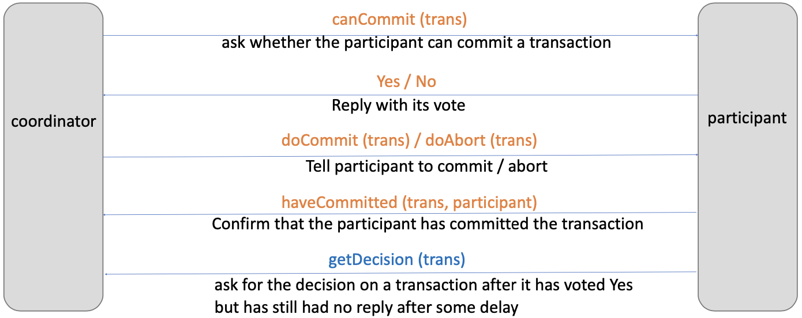
1. `Coordinator -> Participant`: `canCommit (trans)`  
   The coordinator asks whether the participant can commit a transaction.

2. `Participant -> Coordinator`: `Yes / No`  
   The participant replies with its vote on whether it can commit the transaction.

3. Depending on the participant's response:
    - `Coordinator -> Participant`: `doCommit (trans)`  
       If the participant has voted Yes, the coordinator instructs the participant to commit the transaction.
    - `Coordinator -> Participant`: `doAbort (trans)`  
       If the participant has voted No, the coordinator instructs the participant to abort the transaction.

4. `Participant -> Coordinator`: `haveCommitted (trans, participant)`  
   The participant confirms that it has committed the transaction, notifying the coordinator.

5. If the participant voted Yes, but there's a delay and the coordinator has not received a confirmation message:
   - `Coordinator -> Participant`: `getDecision (trans)`  
     The coordinator requests the decision on a transaction from the participant.

- Coordinator or participant can abort transaction
  - If a participant abort, it must inform coordinator
  - If a participant does not respond within a timeout period, coordinator will abort
- If abort, coordinator asks all participates to rollback
- If abort, abort logs are forced to disk at coordinator and all participants

## Concurrency Control in Networked System

- Each server is responsible for applying concurrency control to its own objects
- The members of a collection of servers of distributed transactions are jointly responsible for ensuring that they are performed in a serially equivalent manner
- Servers independently acting would not work
- If transaction T is before transaction U in their conflicting access to objects at one of the servers
- Then: They must be in that order at all of the servers whose objects are accessed in a conflicting manner by both T and U
- The Coordinator should assure this

## Concurrency Control Review
Timestamp ordering concurrency control
- The coordinator accessed by a transaction issues a **globally unique timestamp** 
- The timestamp is passed **with each object access**
- The servers are jointly responsible for ensuring serial equivalence, that is if T access an object before U, then T is before U at all objects

Optimistic concurrency control  
For distributed transactions to work:
- Validation takes place in phase 1 of 2PC protocol at each server 
- Transactions use a **globally unique order** for validation

## Transactions with replicated data
One-copy Serializability  
The effect of transactions on replicated objects should be the **same as if they had been performed one at a time on a single set of objects**

If all servers are available then no issue – but what if some servers are not available?
## Available copies replication
- The available copies replication scheme is designed to allow some servers to be temporarily unavailable
- Before a transaction commits, it checks for failures and recoveries of the RMs it has contacted, the set should not change during execution

e.g., X fails before T’s deposit. T would check if X is still available. If X is unavailable, then T will abort.

